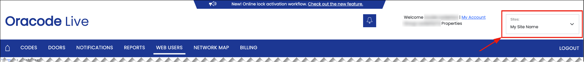

# Dormakaba Oracode Setup Guide

To control Dormakaba Oracode devices using Seam, you must prompt the owners or managers of these devices to perform the following steps:

1. **Identify your Oracode Live sites**\
   For each site:
   * Log in to your [Oracode Live account](https://www.kabaecodewireless.com).
   * Note your site name, as shown in the upper-right corner of the Oracode Live portal.
   *

       <figure><figcaption>
Note your site name in the Oracode Live portal.
</figcaption></figure>
2. **Contact** [**Dormakaba Oracode Support**](mailto:oracode@dormakaba.com)\
   Ask them to to connect your Oracode sites to Seam.
   *   Sample Email:

       > _Please connect the following sites to the Seam Access Token:_
       >
       > * _{Insert Site Name}_
       > * _{Insert Site Name}_
3.  **Connect your devices via Seam**\
    In the Connect Webview, enter your dormakaba Oracode username and a comma-separated list of your site names. For each site, select the correct local time zone.

    > **Important:** Site names and time zones must be entered exactly. An incorrect site name will cause the connection to fail. An incorrect timezone will cause access codes to start and end at the wrong times.
4. **Request activation from Seam**\
   Contact [support@getseam.com](mailto:support@getseam.com) to request approval and activation of your Dormakaba Oracode integration.

