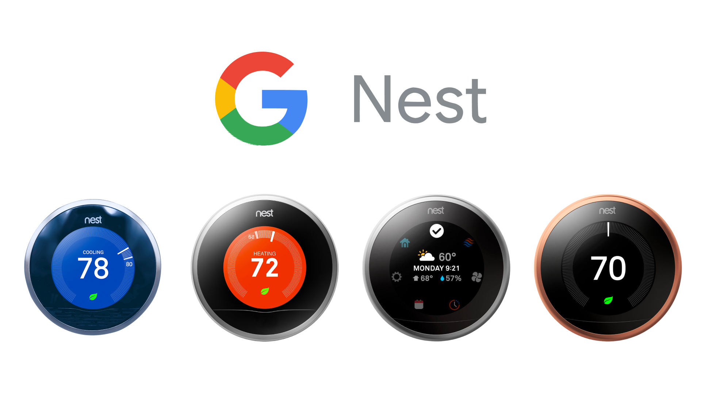
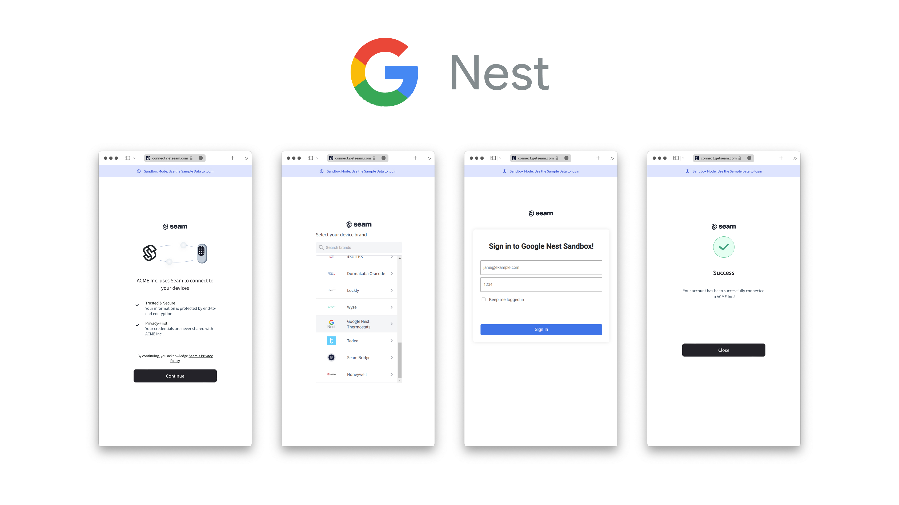

# Get Started with Nest Thermostats

<figure><figcaption><p>Google Nest Thermostats</p></figcaption></figure>

## Overview

Seam provides a universal API to connect and control many brands of devices such as smart locks, thermostats, and sensors. This guide provides a rapid introduction to connecting and controlling your [Google Nest](https://www.seam.co/manufacturers/nest) thermostats using the Seam API. To learn more about other brands of devices supported by Seam, head over to our [integration page](https://www.seam.co/supported-devices-and-systems).

## 1. Install Seam SDK

Seam provides client libraries for many languages, such as JavaScript, Python, Ruby, PHP, and others, as well as a Postman collection and [OpenAPI](https://connect.getseam.com/openapi.json) spec.

* JavaScript / TypeScript ([npm](https://www.npmjs.com/package/seam), [GitHub](https://github.com/seamapi/javascript))
* Python ([pip](https://pypi.org/project/seam/), [GitHub](https://github.com/seamapi/python))
* Ruby Gem ([rubygem](https://rubygems.org/gems/seamapi), [GitHub](https://github.com/seamapi/ruby))
* PHP ([packagist](https://packagist.org/packages/seamapi/seam), [GitHub](https://github.com/seamapi/php))
* Java ([GitHub](https://github.com/seamapi/java))
* C# ([nuget](https://www.nuget.org/packages/Seam), [GitHub](https://github.com/seamapi/csharp))
* Go ([GitHub](https://github.com/seamapi/go))



```bash
npm i seam
```



```bash
pip install seam
# For some development environments, use pip3 in this command instead of pip.
```



```bash
bundle add seamapi
```



```bash
composer require seamapi/seam
```



**Gradle:**

```gradle
// build.gradle
dependencies {
    implementation 'io.github.seamapi:java:0.x.x'
}
```

**Maven:**

```xml
<!-- pom.xml -->
<dependency>
    <groupId>io.github.seamapi</groupId>
    <artifactId>java</artifactId>
    <version>0.x.x</version>
</dependency>
```



Install using [nuget](https://www.nuget.org/packages/Seam).



```bash
go get github.com/seamapi/go
```



Once installed, [sign-up for Seam](https://console.seam.co/) to get your API key and export it as an environment variable:

```
$ export SEAM_API_KEY=seam_test2ZTo_0mEYQW2TvNDCxG5Atpj85Ffw
```


This guide uses a sandbox workspace. You can only connect virtual thermostats to a sandbox workspace. If you need to connect a real Google Nest device, use a non-sandbox workspace and API key.


## 2. Link Google Nest Account with Seam

To control your Google Nest device using the Seam API, you must first authorize your Seam workspace against your Google Nest account. To do so, Seam provides[ Connect Webviews](../../core-concepts/connect-webviews/): pre-built UX flows that walk you through authorizing your application to control your Google Nest device.

### Create a Connect Webview



```python
from seam import Seam
seam = Seam()

webview = seam.connect_webviews.create(accepted_providers=["google_nest"])

assert webview.login_successful is False

# Send the Connect Webview URL to your user.
print(webview.url)
```



```javascript
import { Seam } from 'seam'

const seam = new Seam()

const connectWebview = await seam.connectWebviews.create({
  accepted_providers: ["google_nest"],
})

console.log(connectWebview.login_successful) // false

// Send the Connect Webview URL to your user.
console.log(connectWebview.url)
```



```php
use Seam\SeamClient;

$seam = new SeamClient("YOUR_API_KEY");

$webview = $seam->connect_webviews->create(
  accepted_providers: ["google_nest"]
);

# Send this Connect Webview URL to your user.
echo json_encode($webview)
```



```java
ConnectWebview createdConnectWebview = seam.connectWebviews().create(ConnectWebviewsCreateRequest.builder()
                .acceptedProviders(List.of(
                  AcceptedProvider.NEST))
                .build());
System.out.println(createdConnectWebview.getLoginSuccessful()); // false

// Send the Connect Webview URL to your user.
System.out.println(createdConnectWebview.getUrl());
```



```go
connectWebview, err := client.ConnectWebviews.Create(
  context.Background(),
  &api.ConnectWebviewsCreateRequest{
        AcceptedProviders: []api.AcceptedProvider{
  	      api.AcceptedProviderNest,
        },
  },
)
if err != nil {
  return err
}
fmt.Println(connectWebview.LoginSuccessful) // false

# Send the Connect Webview URL to your user.
fmt.Println(connectWebview.Url)

return nil
```



### Authorize Your Workspace

Navigate to the URL that the Connect Webview object returns. Because you are using a sandbox workspace, complete the login flow by entering the following Google Nest [sandbox test account ](../../device-guides/sandbox-and-sample-data/google-nest-thermostats-sample-data.md)credentials:

* **email**: jane@example.com
* **password**: 1234

<figure><figcaption><p>Seam Connect Webview flow to connect Google Nest account with Seam</p></figcaption></figure>

### Get the New Connect Webview

After you complete the authorization login, you receive an event for [`connected_account.created`](../../api-clients/events/) if you set up a [webhook handler](../../core-concepts/webhooks.md). Otherwise, you can poll for the Connect Webview until the status of this Connect Webview changes, as follows:



```python
updated_webview = seam.connect_webviews.get(
    webview.connect_webview_id
)

assert updated_webview.login_successful # true
```



```javascript
const updatedWebview = await seam.connectWebviews.get(
  connectWebview.connect_webview_id,
)

console.log(updatedWebview.login_successful) // true
```



```php
$webview = $seam->connect_webviews->get($webview->id);
echo json_encode($webview);
```



```java
ConnectWebview updatedConnectWebview = seam.connectWebviews().get(ConnectWebviewsGetRequest.builder()
                .connectWebviewId(createdConnectWebview.getConnectWebviewId())
                .build());
System.out.println(updatedConnectWebview.getLoginSuccessful()); // true
```



```go
updatedConnectWebview, err := client.ConnectWebviews.Get(
  context.Background(),
  &api.ConnectWebviewsGetRequest{
      ConnectWebviewId: connectWebview.ConnectWebviewId,
  },
)
if err != nil {
  return err
}
fmt.Println(updatedConnectWebview.LoginSuccessful) // true
return nil
```



## 3. Retrieve your Google Nest Thermostat

Google Nest thermostats appear with the `device_type` `"nest_thermostat"`.



```python
devices = seam.devices.list(device_type="nest_thermostat")

pprint(devices[0])
# Device(device_id='054765c8-a2fc-4599-b486-14c19f462c45',
#       device_type='nest_thermostat',
#       location=None,
#       properties={'available_hvac_mode_settings': ['heat',
#                                                    'cool',
#                                                    'heat_cool',
#                                                    'off'],
#                   'can_enable_automatic_cooling': True,
#                   'can_enable_automatic_heating': True,
#                   'current_climate_setting': {'automatic_cooling_enabled': True,
#                                               'automatic_heating_enabled': True,
#                                               'cooling_set_point_celsius': 21.5,
#                                               'cooling_set_point_fahrenheit': 70.7,
#                                               'heating_set_point_celsius': 20,
#                                               'heating_set_point_fahrenheit': 68,
#                                               'hvac_mode_setting': 'heat_cool',
#                                               'manual_override_allowed': True},
#                   'has_direct_power': True,
#                   'image_alt_text': 'Placeholder Lock Image',
#                   'image_url': 'https://connect.getseam.com/assets/images/devices/unknown-lock.png',
#                   'is_climate_setting_schedule_active': False,
#                   'is_cooling': False,
#                   'is_fan_running': False,
#                   'is_heating': False,
#                   'is_temporary_manual_override_active': False,
#                   'manufacturer': 'nest',
#                   'model': {'accessory_keypad_supported': False,
#                             'display_name': 'Thermostat',
#                             'manufacturer_display_name': 'Nest'},
#                   'name': '',
#                   'nest_metadata': {'custom_name': '',
#                                     'device_name': 'enterprises/nest_project_id/devices/AVPHwEvjFcX-wRmGdXApyxON24SAI0S9oU13a2GSVFLPVehUKH1ATqlASyKi2N2dbJCVW-B6-VxgbhdjUyyjA-K3Vo5C9g',
#                                     'nest_device_id': 'bcca8c5f-1854-4906-9911-c877d513e00a'},
#                   'online': True,
#                   'relative_humidity': 0.46,
#                   'temperature_celsius': 24.64,
#                   'temperature_fahrenheit': 76.352},
#       capabilities_supported=['thermostat'],
#       errors=[],
#       warnings=[],
#       connected_account_id='44284499-a50b-4947-86c1-58264f014be5',
#       workspace_id='398d80b7-3f96-47c2-b85a-6f8ba21d07be',
#       created_at='2024-02-29T21:57:33.397Z',
#       is_managed=True)
```



```javascript
const devices = await seam.devices.list({
  device_type: 'nest_thermostat',
})

console.log(devices[0])
/*
{
  device_id: '054765c8-a2fc-4599-b486-14c19f462c45',
  device_type: 'nest_thermostat',
  capabilities_supported: [ 'thermostat' ],
  properties: {
    online: true,
    is_cooling: false,
    is_heating: false,
    manufacturer: 'nest',
    nest_metadata: {
      custom_name: '',
      device_name: 'enterprises/nest_project_id/devices/AVPHwEvjFcX-wRmGdXApyxON24SAI0S9oU13a2GSVFLPVehUKH1ATqlASyKi2N2dbJCVW-B6-VxgbhdjUyyjA-K3Vo5C9g',
      nest_device_id: 'bcca8c5f-1854-4906-9911-c877d513e00a'
    },
    is_fan_running: false,
    has_direct_power: true,
    relative_humidity: 0.46,
    temperature_celsius: 24.64,
    temperature_fahrenheit: 76.352,
    current_climate_setting: {
      automatic_heating_enabled: true,
      automatic_cooling_enabled: true,
      hvac_mode_setting: 'heat_cool',
      manual_override_allowed: true,
      cooling_set_point_celsius: 21.5,
      heating_set_point_celsius: 20,
      cooling_set_point_fahrenheit: 70.7,
      heating_set_point_fahrenheit: 68
    },
    available_hvac_mode_settings: [ 'heat', 'cool', 'heat_cool', 'off' ],
    can_enable_automatic_cooling: true,
    can_enable_automatic_heating: true,
    is_temporary_manual_override_active: false,
    name: '',
    model: {
      display_name: 'Thermostat',
      manufacturer_display_name: 'Nest',
      accessory_keypad_supported: false
    },
    image_url: 'https://connect.getseam.com/assets/images/devices/unknown-lock.png',
    image_alt_text: 'Placeholder Lock Image',
    is_climate_setting_schedule_active: false
  },
  location: null,
  connected_account_id: '44284499-a50b-4947-86c1-58264f014be5',
  workspace_id: '398d80b7-3f96-47c2-b85a-6f8ba21d07be',
  created_at: '2024-02-29T21:57:33.397Z',
  errors: [],
  warnings: [],
  is_managed: true,
  custom_metadata: {}
}
*/
```



```php
$devices = $seam->devices->list(
  device_type: "nest_thermostat"
);
echo json_encode($devices[0]), "\n";

// {"device_id":"054765c8-a2fc-4599-b486-14c19f462c45","device_type":"nest_thermostat","capabilities_supported":["thermostat"],"properties":{"online":true,"name":"","model":{"display_name":"Thermostat","manufacturer_display_name":"Nest",...}
```



```java
var devices = seam.devices().list(DevicesListRequest.builder()
                .deviceType(DeviceType.NEST_THERMOSTAT)
                .build());

System.out.println(devices);
// [{
//   "device_id" : "054765c8-a2fc-4599-b486-14c19f462c45",
//   "device_type" : "nest_thermostat",
//   "capabilities_supported" : [ "thermostat" ],
//   "properties" : {
//     "online" : true,
//     "model" : {
//       "display_name" : "Thermostat",
//       "accessory_keypad_supported" : false,
//       "manufacturer_display_name" : "Nest"
//     },
//     "current_climate_setting" : {
//       "automatic_heating_enabled" : true,
//       "automatic_cooling_enabled" : true,
//       "hvac_mode_setting" : "heat_cool",
//       "cooling_set_point_celsius" : 21.5,
//       "heating_set_point_celsius" : 20.0,
//       "cooling_set_point_fahrenheit" : 70.7,
//       "heating_set_point_fahrenheit" : 68.0,
//       "manual_override_allowed" : true
//     },
//     "temperature_celsius" : 24.64,
//     "can_enable_automatic_heating" : true,
//     "is_heating" : false,
//     "image_url" : "https://connect.getseam.com/assets/images/devices/unknown-lock.png",
//     "is_fan_running" : false,
//     "is_cooling" : false,
//     "image_alt_text" : "Placeholder Lock Image",
//     "manufacturer" : "nest",
//     "nest_metadata" : {
//       "custom_name" : "",
//       "device_name" : "enterprises/nest_project_id/devices/AVPHwEvjFcX-wRmGdXApyxON24SAI0S9oU13a2GSVFLPVehUKH1ATqlASyKi2N2dbJCVW-B6-VxgbhdjUyyjA-K3Vo5C9g",
//       "nest_device_id" : "bcca8c5f-1854-4906-9911-c877d513e00a"
//     },
//     "is_temporary_manual_override_active" : false,
//     "available_hvac_mode_settings" : [ "heat", "cool", "heat_cool", "off" ],
//     "has_direct_power" : true,
//     "is_climate_setting_schedule_active" : false,
//     "relative_humidity" : 0.46,
//     "temperature_fahrenheit" : 76.352,
//     "can_enable_automatic_cooling" : true
//   },
//   "connected_account_id" : "44284499-a50b-4947-86c1-58264f014be5",
//   "workspace_id" : "398d80b7-3f96-47c2-b85a-6f8ba21d07be",
//   "created_at" : "2024-02-29T21:57:33.397Z",
//   "is_managed" : true,
//   "custom_metadata" : { }
// }]
```



```go
devices, err := client.Devices.List(
	context.Background(), &api.DevicesListRequest{
    DeviceType: api.DeviceTypeNestThermostat.Ptr(),
  },
)
if err != nil {
	return err
}
fmt.Println(devices)
return nil

// [{
//   "device_id": "054765c8-a2fc-4599-b486-14c19f462c45",
//   "device_type": "nest_thermostat",
//   "capabilities_supported": [
//     "thermostat"
//   ],
//   "properties": {
//     "online": true,
//     "is_cooling": false,
//     "is_heating": false,
//     "manufacturer": "nest",
//     "nest_metadata": {
//       "custom_name": "",
//       "device_name": "enterprises/nest_project_id/devices/AVPHwEvjFcX-wRmGdXApyxON24SAI0S9oU13a2GSVFLPVehUKH1ATqlASyKi2N2dbJCVW-B6-VxgbhdjUyyjA-K3Vo5C9g",
//       "nest_device_id": "bcca8c5f-1854-4906-9911-c877d513e00a"
//     },
//     "is_fan_running": false,
//     "has_direct_power": true,
//     "relative_humidity": 0.46,
//     "temperature_celsius": 24.64,
//     "temperature_fahrenheit": 76.352,
//     "current_climate_setting": {
//       "automatic_heating_enabled": true,
//       "automatic_cooling_enabled": true,
//       "hvac_mode_setting": "heat_cool",
//       "manual_override_allowed": true,
//       "cooling_set_point_celsius": 21.5,
//       "heating_set_point_celsius": 20,
//       "cooling_set_point_fahrenheit": 70.7,
//       "heating_set_point_fahrenheit": 68
//     },
//     "available_hvac_mode_settings": [
//       "heat",
//       "cool",
//       "heat_cool",
//       "off"
//     ],
//     "can_enable_automatic_cooling": true,
//     "can_enable_automatic_heating": true,
//     "is_temporary_manual_override_active": false,
//     "name": "",
//     "model": {
//       "display_name": "Thermostat",
//       "manufacturer_display_name": "Nest",
//       "accessory_keypad_supported": false
//     },
//     "image_url": "https://connect.getseam.com/assets/images/devices/unknown-lock.png",
//     "image_alt_text": "Placeholder Lock Image",
//     "is_climate_setting_schedule_active": false
//   },
//   "location": null,
//   "connected_account_id": "44284499-a50b-4947-86c1-58264f014be5",
//   "workspace_id": "398d80b7-3f96-47c2-b85a-6f8ba21d07be",
//   "created_at": "2024-02-29T21:57:33.397Z",
//   "errors": [],
//   "warnings": [],
//   "is_managed": true,
//   "custom_metadata": {}
// }]
```



## 4. Set the Current HVAC and Fan Mode Settings

Seam enables you to adjust the [current heating and cooling settings](../../products/thermostats/configure-current-climate-settings.md) on a smart thermostat, including the [HVAC mode](../../products/thermostats/hvac-mode.md) and the corresponding [set points](../../products/thermostats/set-points.md). It also enables you to configure the [fan mode](../../products/thermostats/configure-current-climate-settings.md#set-the-fan-mode). These two operations return [action attempts](../../core-concepts/action-attempts.md).

For example, use the following code samples to set your thermostat to heat mode and the fan mode to on:



```python
heat_request = seam.thermostats.heat(
  device = "054765c8-a2fc-4599-b486-14c19f462c45",
  heating_set_point_celsius = 20
)
pprint(heat_request)

# ActionAttempt(action_attempt_id='97125745-15d9-4970-b5be-c34ec3ce1c81',
#              action_type='SET_HEAT',
#              status='success',
#              result={},
#              error=None)

fan_on_request = seam.thermostats.set_fan_mode(
  device = "054765c8-a2fc-4599-b486-14c19f462c45",
  fan_mode = "on"
)
pprint(fan_on_request)

# ActionAttempt(action_attempt_id='9c9b584b-c645-4ce0-a9c2-79b6f1db2396',
#              action_type='SET_FAN_MODE',
#              status='success',
#              result={},
#              error=None)
```



```javascript
const heat_request = await seam.thermostats.heat({
      device_id: "054765c8-a2fc-4599-b486-14c19f462c45",
      heating_set_point_celsius: 20
})

console.log(heat_request)

// {
//   actionAttempt: {
//     status: 'success',
//     action_attempt_id: '38c06dba-99b1-4c10-b542-f98e2963cb52',
//     action_type: 'SET_HEAT',
//     result: {},
//     error: null
//   }
// }

const fan_on_request = await seam.thermostats.setFanMode({
  device_id: "054765c8-a2fc-4599-b486-14c19f462c45",
  fan_mode_setting: "on"
})

console.log(fan_on_request)

// {
//   actionAttempt: {
//     status: 'success',
//     action_attempt_id: 'fca8cb4f-6e0c-4c37-878b-ebe17df46456',
//     action_type: 'SET_FAN_MODE',
//     result: {},
//     error: null
//   }
// }
```



```php
$heat_request = $seam->thermostats->heat(
  device_id: "054765c8-a2fc-4599-b486-14c19f462c45",
  heating_set_point_celsius: 20
);

$fan_on_request = $seam->thermostats->set_fan_mode(
  device_id: "054765c8-a2fc-4599-b486-14c19f462c45",
  fan_mode_setting: "on"
);
```



```java
var deviceId = "054765c8-a2fc-4599-b486-14c19f462c45";
seam.thermostats().heat(ThermostatsHeatRequest.builder()
                .deviceId(deviceId)
                .heatingSetPointCelsius(20.0)
                .build());
Device thermostat = seam.thermostats()
        .get(ThermostatsGetRequest.builder()
                .deviceId(deviceId)
                .build());
System.out.println("Thermostat ID: " + thermostat.getDeviceId());
System.out.println("Mode: " + thermostat.getProperties().getCurrentClimateSetting().get().getHvacModeSetting());
System.out.println("Heating set point (Celsius): " +
  thermostat.getProperties().getCurrentClimateSetting().get().getHeatingSetPointCelsius());

// Thermostat ID: 054765c8-a2fc-4599-b486-14c19f462c45
// Mode: Optional[heat]
// Heating set point (Celsius): Optional[20.0]
```



```go
heat_request, uErr := client.Thermostats.Heat(context.Background(), &api.ThermostatsHeatRequest{
  DeviceId: "054765c8-a2fc-4599-b486-14c19f462c45",
  HeatingSetPointCelsius: api.Float64(20),
})

if uErr != nil {
return uErr
}

fmt.Println(heat_request)

// {
//   "action_attempt": {
//     "status": "pending",
//     "action_type": "SET_HEAT",
//     "action_attempt_id": "241e79cd-4bda-499f-8e2e-d7ae01d273cf",
//     "result": null,
//     "error": null
//   },
//   "ok": true
// }

fan_on_request, uErr := client.Thermostats.SetFanMode(context.Background(), &api.ThermostatsSetFanModeRequest{
  DeviceId: "054765c8-a2fc-4599-b486-14c19f462c45",
  FanMode: api.FanModeOn.Ptr(),
})

if uErr != nil {
return uErr
}

fmt.Println(fan_on_request)
return nil

// {
//   "action_attempt": {
//     "status": "pending",
//     "action_type": "SET_FAN_MODE",
//     "action_attempt_id": "1a6993af-4b00-4ca5-bacf-074164959878",
//     "result": null,
//     "error": null
//   },
//   "ok": true
// }
```



## Next Steps

Now that you have completed this guide, you can try to connect a real Google Nest device. To do so, make sure to switch to a non-sandbox workspace and API key because you cannot connect real devices to sandbox workspaces.

If you have any questions or want to report an issue, email us at [support@seam.co](mailto:support@seam.co).
