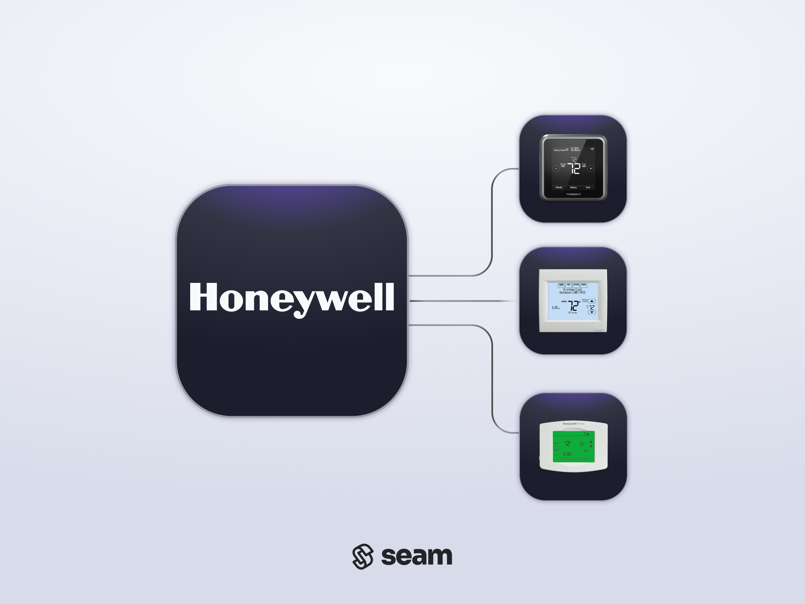
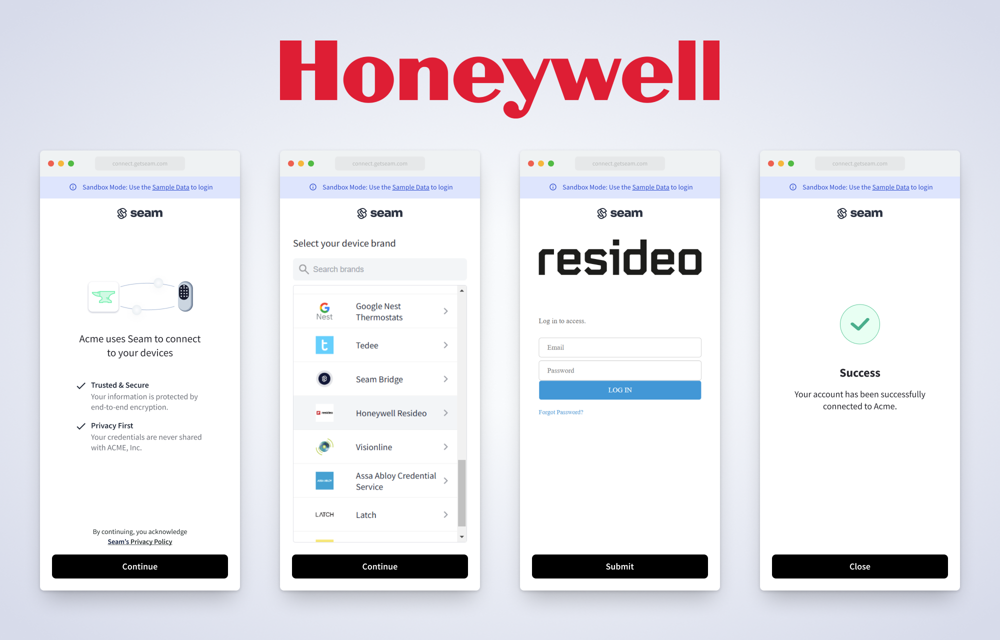

# Get Started with Honeywell Resideo Thermostats

<figure><picture><source srcset="../../.gitbook/assets/honeywell-manufacturer-page-cover-dark.png" media="(prefers-color-scheme: dark)"></picture><figcaption><p>Honeywell Resideo Thermostats</p></figcaption></figure>

## Overview

Seam provides a universal API to connect and control many brands of IoT devices and systems, including thermostats, smart locks, access control systems (ACSs), and noise sensors.

This guide gives you a rapid introduction to connecting and controlling your [Honeywell Resideo](https://www.seam.co/manufacturers/honeywell) thermostats using the Seam API. For application developers, you can use the Seam API in your app, and your users can authorize your app to control their devices using Seam.

For detailed information about the Honeywell Resideo devices that Seam supports, see the following table and our [Honeywell Resideo Supported Devices page](https://www.seam.co/manufacturers/honeywell):



To learn more about other IoT device and system brands that Seam supports—such as ecobee, Google Nest, Yale, Schlage, and many more—visit our [integration page](https://www.seam.co/supported-devices-and-systems).


This guide shows you how to install a Seam SDK and then control your Honeywell Resideo thermostat using the Seam API.

Another easy way to learn about what you can do with the Seam API is to explore the [interactive Seam CLI](../../core-concepts/seam-console/seam-online-cli.md), which you can access from directly within the [Seam Console](../../core-concepts/seam-console/).

:arrow\_forward: [Go to the Seam Console!](https://console.seam.co/)


***

## Step 1: Install a Seam SDK

Seam provides client libraries for many languages, including JavaScript, Python, Ruby, PHP, and others, as well as a Postman collection and an [OpenAPI](https://connect.getseam.com/openapi.json) spec.

* JavaScript / TypeScript ([npm](https://www.npmjs.com/package/seam), [GitHub](https://github.com/seamapi/javascript))
* Python ([pip](https://pypi.org/project/seam/), [GitHub](https://github.com/seamapi/python))
* Ruby Gem ([rubygem](https://rubygems.org/gems/seam), [GitHub](https://github.com/seamapi/ruby))
* PHP ([packagist](https://packagist.org/packages/seamapi/seam), [GitHub](https://github.com/seamapi/php))
* Java ([GitHub](https://github.com/seamapi/java))
* C# ([nuget](https://www.nuget.org/packages/Seam), [GitHub](https://github.com/seamapi/csharp))
* Go ([GitHub](https://github.com/seamapi/go))

First, install a Seam SDK, as follows:



```bash
npm i seam
```



```bash
pip install seam
# For some development environments, use pip3 in this command instead of pip.
```



```bash
bundle add seam
```



```bash
composer require seamapi/seam
```



**Gradle:**

```gradle
// build.gradle
dependencies {
    implementation 'io.github.seamapi:java:0.x.x'
}
```

**Maven:**

```xml
<!-- pom.xml -->
<dependency>
    <groupId>io.github.seamapi</groupId>
    <artifactId>java</artifactId>
    <version>0.x.x</version>
</dependency>
```



Install using [nuget](https://www.nuget.org/packages/Seam).



```bash
go get github.com/seamapi/go
```



Next, go to [https://console.seam.co/](https://console.seam.co/) and [sign up for Seam](../../core-concepts/seam-console/#create-a-seam-account) to get your [API key](../../core-concepts/authentication/api-keys.md).

Then, export your API key as an environment variable.

```bash
$ export SEAM_API_KEY=seam_test2bMS_94SrGUXuNR2JmJkjtvBQDg5c
```


This guide uses a [sandbox workspace](../../core-concepts/workspaces/#sandbox-workspaces). You can only connect virtual devices and systems in this type of workspace. If you want to connect a real Honeywell Resideo thermostat, use a [non-sandbox workspace](../../core-concepts/workspaces/#production-workspaces) and API key.


***

## Step 2: Link your Honeywell Resideo account with Seam

To control your Honeywell Resideo thermostat using the Seam API, you must first authorize your Seam workspace to connect to your Honeywell Resideo account. If your application needs to connect to your users' Honeywell Resideo accounts, Seam provides fully-embedded, [customizable](../../core-concepts/connect-webviews/customizing-connect-webviews.md) client-side [Connect Webviews](../../core-concepts/connect-webviews/) to collect their authorization securely. These user-friendly pre-built authorization flows walk your users through the process of granting your Seam workspace permission to control their Honeywell Resideo thermostats. The Connect Webview presents a flow that prompts your users to enter their credentials for their Honeywell Resideo account.

In this guide, you create a Connect Webview object. Then, you display the graphical component of the created Connect Webview and enter a set of sample credentials to connect a sandbox Honeywell Resideo account.


This guide shows you how to create a Connect Webview programmatically using the Seam API.

The [Seam Console](../../core-concepts/seam-console/) provides another easy way to connect devices to your Seam workspace.

Go to [https://console.seam.co/](https://console.seam.co/). On the **Devices** page, click **+ Add Devices**. Then, see [Authorize your workspace](get-started-with-honeywell-thermostats.md#authorize-your-workspace) in this guide to complete the Connect Webview authorization flow.




### Create a Connect Webview

Create a `connect_webview` object and then note the returned URL.



**Code:**

```python
from seam import Seam

seam = Seam()  # Seam automatically uses your exported SEAM_API_KEY.

connect_webview = seam.connect_webviews.create(accepted_providers=["honeywell_resideo"])

assert connect_webview.login_successful is False

# Use the returned Connect Webview URL to display
# the Connect Webview authorization flow to your user.
print(connect_webview.url)
```

**Output:**

```
https://connect.getseam.com/connect_webviews/view?connect_webview_id=12345678-1234-1234-1234-123456789012&auth_token=XXXXXXXXXXXXXXXXXXXXXXXXXXXXXXXXX
```



**Code:**

```bash
curl -X 'POST' \
  'https://connect.getseam.com/connect_webviews/create' \
  -H 'accept: application/json' \
  -H "Authorization: Bearer ${SEAM_API_KEY}" \
  -H 'Content-Type: application/json' \
  -d '{
  "accepted_providers": ["honeywell_resideo"]
}' | jq -r '"Login Successful (false): " + (.connect_webview.login_successful | tostring),
  "URL: " + .connect_webview.url'
  # Use the returned Connect Webview URL to display
  # the Connect Webview authorization flow to your user.
```

**Output:**

```
Login Successful (false): false
https://connect.getseam.com/connect_webviews/view?connect_webview_id=12345678-1234-1234-1234-123456789012&auth_token=XXXXXXXXXXXXXXXXXXXXXXXXXXXXXXXXX
```



**Code:**

```javascript
import { Seam } from "seam";

const seam = new Seam(); // Seam automatically uses your exported SEAM_API_KEY.

const connectWebview = await seam.connectWebviews.create({
  accepted_providers: ['honeywell_resideo']
});

console.log(connectWebview.login_successful); // false

// Use the returned Connect Webview URL to display
// the Connect Webview authorization flow to your user.
console.log(connectWebview.url);
```

**Output:**

```
false
https://connect.getseam.com/connect_webviews/view?connect_webview_id=12345678-1234-1234-1234-123456789012&auth_token=XXXXXXXXXXXXXXXXXXXXXXXXXXXXXXXXX
```



**Code:**

```ruby
require "seam"

seam = Seam.new() # Seam automatically uses your exported SEAM_API_KEY.

connect_webview = seam.connect_webviews.create(
  accepted_providers: ["honeywell_resideo"]
)

puts connect_webview.login_successful # false

# Use the returned Connect Webview URL to display
# the Connect Webview authorization flow to your user.
puts connect_webview.url
```

**Output:**

```
false
https://connect.getseam.com/connect_webviews/view?connect_webview_id=12345678-1234-1234-1234-123456789012&auth_token=XXXXXXXXXXXXXXXXXXXXXXXXXXXXXXXXX
```



**Code:**

```php
<?php
require 'vendor/autoload.php';

$seam = new Seam\SeamClient(); // Seam automatically uses your exported SEAM_API_KEY.

$connect_webview = $seam->connect_webviews->create(
  accepted_providers: ["honeywell_resideo"]
);

echo $connect_webview->login_successful ? 'true' : 'false', "\n"; // false

// Use the returned Connect Webview URL to display
// the Connect Webview authorization flow to your user.
echo $connect_webview->url;
```

**Output:**

```
false
https://connect.getseam.com/connect_webviews/view?connect_webview_id=12345678-1234-1234-1234-123456789012&auth_token=XXXXXXXXXXXXXXXXXXXXXXXXXXXXXXXXX
```



**Code:**

```csharp
using Seam.Client;

var seam = new SeamClient(apiToken: SEAM_API_KEY);

var connectWebview = seam.ConnectWebviews.Create(
  acceptedProviders: new() {Seam.Api.ConnectWebviews.CreateRequest.AcceptedProvidersEnum.Ecobee}
);

Console.WriteLine(connectWebview.LoginSuccessful); // False

// Use the returned Connect Webview URL to display
// the Connect Webview authorization flow to your user.
Console.WriteLine(connectWebview.Url);
```

**Output:**

```
False
https://connect.getseam.com/connect_webviews/view?connect_webview_id=12345678-1234-1234-1234-123456789012&auth_token=XXXXXXXXXXXXXXXXXXXXXXXXXXXXXXXXX
```



**Code:**

```java
import java.io.Console;
import java.util.*;
import com.fasterxml.jackson.annotation.*;
import com.fasterxml.jackson.databind.annotation.JsonDeserialize;
import com.seam.api.Seam;
import com.seam.api.core.ObjectMappers;
import com.seam.api.types.ConnectWebview;
import com.seam.api.types.Device;
import com.seam.api.types.Manufacturer;
import com.seam.api.types.ActionAttempt;
import com.seam.api.types.AccessCode;
import com.seam.api.resources.connectwebviews.requests.ConnectWebviewsCreateRequest;
import com.seam.api.resources.connectwebviews.requests.ConnectWebviewsGetRequest;
import com.seam.api.resources.devices.requests.DevicesListRequest;
import com.seam.api.resources.devices.requests.DevicesGetRequest;
import com.seam.api.resources.locks.requests.LocksUnlockDoorRequest;
import com.seam.api.resources.accesscodes.requests.AccessCodesCreateRequest;
import com.seam.api.resources.accesscodes.requests.AccessCodesListRequest;

public class Main {

  public static void main(String[] args) {

    Seam seam = Seam.builder()
      .apiKey(SEAM_API_KEY)
      .build();

    ConnectWebview connectWebview = seam.connectWebviews().create(ConnectWebviewsCreateRequest.builder()
      .acceptedProviders(List.of(AcceptedProvider.ECOBEE))
      .build());

    System.out.println(connectWebview.getLoginSuccessful()); // false

    // Use the returned Connect Webview URL to display
    // the Connect Webview authorization flow to your user.
    System.out.println(connectWebview.getUrl());

  }
}
```

**Output:**

```
false
https://connect.getseam.com/connect_webviews/view?connect_webview_id=12345678-1234-1234-1234-123456789012&auth_token=XXXXXXXXXXXXXXXXXXXXXXXXXXXXXXXXX
```



**Code:**

```go
package main

import (
  "context"
  "fmt"
  "os"

  api "github.com/seamapi/go"
  seam "github.com/seamapi/go/client"
)

func main() {
  if err := run(); err != nil {
    _, _ = fmt.Fprintln(os.Stderr, err.Error())
    os.Exit(1)
  }
}

func run() error {
  client := seam.NewClient(
    seam.WithApiKey(SEAM_API_KEY),
  )

  connectWebview, err := client.ConnectWebviews.Create(
    context.Background(),
    &api.ConnectWebviewsCreateRequest{
      AcceptedProviders: []api.AcceptedProvider{
        api.AcceptedProviderEcobee,
      },
    },
  )

  if err != nil {
    return err
  }

  fmt.Println(connectWebview.LoginSuccessful) // false

  // Use the returned Connect Webview URL to display
  // the Connect Webview authorization flow to your user.
  fmt.Println(connectWebview.Url)

  return nil
}
```

**Output:**

```
false
https://connect.getseam.com/connect_webviews/view?connect_webview_id=12345678-1234-1234-1234-123456789012&auth_token=XXXXXXXXXXXXXXXXXXXXXXXXXXXXXXXXX
```



***

### Authorize Your Workspace

In a web browser, go to the URL that the Connect Webview object returned.

For application developers, you can redirect your user to this Connect Webview URL so that they can authorize your app to control their devices using Seam. We even provide a prebuilt [Connect Account Button](../../seam-components/react-components/connect-account-button.md) within our suite of [Seam Components](../../seam-components/overview/) that help you build your device management flow.


Because you're using a sandbox workspace, you can connect Seam's test Honeywell Resideo account. We provide [virtual devices](../../device-guides/sandbox-and-sample-data/) for each of the brands that we support. These sandbox devices and systems enable you to test your app with devices from multiple brands without the need to own all the corresponding physical devices.


Complete the Connect Webview authorization flow by entering the following [Honeywell Resideo sandbox account](../../developer-tools/sandbox-and-sample-data/sandbox-honeywell-thermostats.md) credentials:

* **Email:** jane@example.com
* **Password:** 1234

<figure><picture><source srcset="../../.gitbook/assets/honeywell_connect-flow-screens_dark.png" media="(prefers-color-scheme: dark)"></picture><figcaption><p>Use the Seam Connect Webview authorization flow to connect a Honeywell Resideo account with Seam. This flow varies slightly based on the device manufacturer.</p></figcaption></figure>

Confirm that authorization through the Connect Webview was successful by querying its status.



**Code:**

```python
updated_connect_webview = seam.connect_webviews.get(connect_webview.connect_webview_id)

assert updated_connect_webview.login_successful is True # True
```

**Output:**

```
True
```



**Code:**

```bash
curl -X 'GET' \
  'https://connect.getseam.com/connect_webviews/get' \
  -H 'accept: application/json' \
  -H "Authorization: Bearer ${SEAM_API_KEY}" \
  -H 'Content-Type: application/json' \
  -d "{
  \"connect_webview_id\": \"${connect_webview_id}\"
}" | jq -r '"Login Successful (true): " + (.connect_webview.login_successful | tostring)'
```

**Output:**

```
Login Successful (true): true
```



**Code:**

```javascript
const updatedConnectWebview = await seam.connectWebviews.get({
  connect_webview_id: connectWebview.connect_webview_id
});

console.log(updatedConnectWebview.login_successful); // true
```

**Output:**

```
true
```



**Code:**

```ruby
updated_connect_webview = seam.connect_webviews.get(
  connect_webview_id: connect_webview.connect_webview_id
)

puts updated_connect_webview.login_successful # true
```

**Output:**

```
true
```



**Code:**

```php
$updated_connect_webview = $seam->connect_webviews->get(
  connect_webview_id: $connect_webview->connect_webview_id
);

echo $updated_connect_webview->login_successful ? 'true' : 'false', "\n"; // true
```

**Output:**

```
true
```



**Code:**

```csharp
var updatedConnectWebview = seam.ConnectWebviews.Get(
  connectWebviewId: connectWebview.connectWebviewId
);

Console.WriteLine(updatedConnectWebview.LoginSuccessful); // True
```

**Output:**

```
True
```



**Code:**

```java
ConnectWebview updatedConnectWebview = seam.connectWebviews().get(ConnectWebviewsGetRequest.builder()
  .connectWebviewId(connectWebview.getConnectWebviewId())
  .build());

System.out.println(updatedConnectWebview.getLoginSuccessful()); // true
```

**Output:**

```
true
```



**Code:**

```go
updatedConnectWebview, err := client.ConnectWebviews.Get(
  context.Background(),
  &api.ConnectWebviewsGetRequest{
    ConnectWebviewId: connectWebview.connectWebviewId,
  },
)

if err != nil {
  return err
}

fmt.Println(updatedConnectWebview.LoginSuccessful) // true

return nil
```

**Output:**

```
true
```



***

## Step 3: Retrieve Honeywell Resideo thermostat devices

When you link a Honeywell Resideo account with Seam, we create a `device` object to represent each Honeywell Resideo thermostat in your account. You can then retrieve these Honeywell Resideo devices using the [List Devices](../../api-clients/devices/list.md) and [Get Device](../../api-clients/devices/get.md) endpoints.

The Seam API exposes each device's properties, such as the current temperature reading in Fahrenheit and Celsius, current HVAC and fan modes, available climate presets, thermostat-specific constraints, and much more.



**Code:**

```python
# Retrieve all devices, filtered by manufacturer,
# which is one of several filters that list() supports.
all_honeywell_resideo_thermostats = seam.devices.list(manufacturer="honeywell_resideo")

# Select the first device as an example.
living_room_thermostat = all_honeywell_resideo_thermostats[0]

# Inspect specific properties.
pprint("Current temperature: " + str(living_room_thermostat.properties["temperature_fahrenheit"]))
pprint("Fan running: " + str(living_room_thermostat.properties["is_fan_running"]))

# View the entire returned device object.
pprint(living_room_thermostat)
```

**Output:**

```
'Current temperature: 70'
'Fan running: False'
Device(
  device_id='11111111-1111-1111-2222-444444444444',
  workspace_id='00000000-0000-0000-0000-000000000000',
  connected_account_id='11111111-1111-1111-1111-222222222222',
  created_at='2024-10-03T22:12:15.666Z',
  properties={
    'manufacturer': 'honeywell_resideo',
    'online': True,
    'temperature_celsius': 21.11111111111111,
    'temperature_fahrenheit': 70,
    'relative_humidity': 0.36,
    'is_cooling': False,
    'is_heating': False,
    'is_fan_running': False,
    'current_climate_setting': {
      'display_name': 'Manual Setting',
      'fan_mode_setting': 'auto',
      'heating_set_point_celsius': 21.11111111111111,   
      'heating_set_point_fahrenheit': 70,
      'hvac_mode_setting': 'heat',
      'manual_override_allowed': True
    },
    ...
  },
  can_hvac_cool=True,
  can_hvac_heat=True,
  can_hvac_heat_cool=True,
  can_turn_off_hvac=True,
  ...
)
```



**Code:**

```bash
# Retrieve all devices, filtered by manufacturer, which is
# one of several filters that the list endpoint supports.
all_honeywell_resideo_thermostats=$(
  # Use GET or POST.
  curl -X 'GET' \
    'https://connect.getseam.com/devices/list' \
    -H 'accept: application/json' \
    -H "Authorization: Bearer ${SEAM_API_KEY}" \
    -H 'Content-Type: application/json' \
    -d '{
    "manufacturer": "honeywell_resideo"
  }')

# Select the first device as an example.
living_room_thermostat=$(jq -r '.devices[0]' <<< ${all_honeywell_resideo_thermostats})

# Inspect specific properties.
echo $(jq -r '"Current temperature: " + (.properties.temperature_fahrenheit | tostring)' <<< ${living_room_thermostat})
echo $(jq -r '"Fan running: " + (.properties.is_fan_running | tostring)' <<< ${living_room_thermostat})

# View the entire returned device object.
echo ${living_room_thermostat}
```

**Output:**

```json
Current temperature: 70
Fan running: false
{
  "device_id": "11111111-1111-1111-2222-444444444444",
  "workspace_id": "00000000-0000-0000-0000-000000000000",
  "connected_account_id": "11111111-1111-1111-1111-222222222222",
  "created_at": "2024-10-03T22:12:15.666Z",
  "properties": {
    "manufacturer": "honeywell_resideo",
    "online": true,
    "temperature_celsius": 21.11111111111111,
    "temperature_fahrenheit": 70,
    "relative_humidity": 0.36,
    "is_cooling": false,
    "is_heating": false,
    "is_fan_running": false,
    "current_climate_setting": {
      "display_name": "Manual Setting",
      "fan_mode_setting": "auto",
      "hvac_mode_setting": "heat",
      "manual_override_allowed": true,
      "heating_set_point_celsius": 21.11111111111111,
      "heating_set_point_fahrenheit": 70
    },
    ...
  },
  "can_hvac_cool": true,
  "can_hvac_heat": true,
  "can_hvac_heat_cool": true,
  "can_turn_off_hvac": true,
  ...
}
```



**Code:**

```javascript
// Retrieve all devices, filtered by manufacturer,
// which is one of several filters that list() supports.
const allHoneywellResideoThermostats = await seam.devices.list({manufacturer: "honeywell_resideo"});

// Select the first device as an example.
const livingRoomThermostat = allHoneywellResideoThermostats[0];

// Inspect specific properties.
console.log("Current temperature: " + livingRoomThermostat.properties.temperature_fahrenheit);
console.log("Fan running: " + livingRoomThermostat.properties.is_fan_running);

// View the entire returned device object.
console.log(livingRoomThermostat);
```

**Output:**

```json
Current temperature: 70
Fan running: false
{
  device_id: '11111111-1111-1111-2222-444444444444',
  workspace_id: '00000000-0000-0000-0000-000000000000',
  connected_account_id: '11111111-1111-1111-1111-222222222222',
  created_at: '2024-10-03T22:12:15.666Z',
  properties: {
    manufacturer: 'honeywell_resideo',
    online: true,
    temperature_celsius: 21.11111111111111,
    temperature_fahrenheit: 70,
    relative_humidity: 0.36,
    is_cooling: false,
    is_heating: false,
    is_fan_running: false,
    current_climate_setting: {
      display_name: 'Manual Setting',
      fan_mode_setting: 'auto',
      hvac_mode_setting: 'heat',
      manual_override_allowed: true,
      heating_set_point_celsius: 21.11111111111111,
      heating_set_point_fahrenheit: 70
    },
    ...
  },
  can_hvac_cool: true,
  can_hvac_heat: true,
  can_hvac_heat_cool: true,
  can_turn_off_hvac: true,
  ...
}
```



**Code:**

```ruby
# Retrieve all devices, filtered by manufacturer,
# which is one of several filters that list() supports.
all_honeywell_resideo_thermostats = seam.devices.list(manufacturer: "honeywell_resideo")

# Select the first device as an example.
living_room_thermostat = all_honeywell_resideo_thermostats[0]

# Inspect specific properties.
puts "Current temperature: " + living_room_thermostat.properties.temperature_fahrenheit.to_s
puts "Fan running: " + living_room_thermostat.properties.is_fan_running.to_s

# View the entire returned device object.
puts living_room_thermostat.inspect
```

**Output:**

```
Current temperature: 70
Fan running: false
<Seam::Resources::Device:0x005f0
  device_id="11111111-1111-1111-2222-444444444444"
  workspace_id="00000000-0000-0000-0000-000000000000"
  connected_account_id="11111111-1111-1111-1111-222222222222"
  created_at=2024-10-03 22:12:15.666 UTC
  properties=#<Seam::DeepHashAccessor:0x0000016b1791f068 @data={
    "manufacturer"=>"honeywell_resideo",
    "online"=>true,
    "temperature_celsius"=>21.11111111111111,
    "temperature_fahrenheit"=>70,
    "relative_humidity"=>0.36,
    "is_cooling"=>false,
    "is_heating"=>false,
    "is_fan_running"=>false,
    "current_climate_setting"=>{
      "display_name"=>"Manual Setting",
      "fan_mode_setting"=>"auto",
      "hvac_mode_setting"=>"heat",
      "manual_override_allowed"=>true,
      "heating_set_point_celsius"=>21.11111111111111,
      "heating_set_point_fahrenheit"=>70
    },
    ...
  }>
  can_hvac_cool=true
  can_hvac_heat=true
  can_hvac_heat_cool=true
  can_turn_off_hvac=true
  ...
>
```



**Code:**

```php
// Retrieve all devices, filtered by manufacturer,
// which is one of several filters that list() supports.
$all_honeywell_resideo_thermostats = $seam->devices->list(manufacturer: "honeywell_resideo");

// Select the first device as an example.
$living_room_thermostat = $all_honeywell_resideo_thermostats[0];

// Inspect specific properties.
echo "Current temperature: ", $living_room_thermostat->properties->temperature_fahrenheit, "\n";
echo "Fan running: ", $living_room_thermostat->properties->is_fan_running ? 'true' : 'false', "\n";

// View the entire returned device object.
echo json_encode($living_room_thermostat, JSON_PRETTY_PRINT);
```

**Output:**

```json
Current temperature: 70
Fan running: false
{
  "device_id": "11111111-1111-1111-2222-444444444444",
  "workspace_id": "00000000-0000-0000-0000-000000000000",
  "connected_account_id": "11111111-1111-1111-1111-222222222222",
  "created_at": "2024-10-03T22:12:15.666Z",
  "properties": {
    "manufacturer": "honeywell_resideo",
    "online": true,
    "temperature_celsius": 21.11111111111111,
    "temperature_fahrenheit": 70,
    "relative_humidity": 0.36,
    "is_cooling": false,
    "is_heating": false,
    "is_fan_running": false,
    "current_climate_setting": {
      "display_name": "Manual Setting",
      "fan_mode_setting": "auto",
      "heating_set_point_celsius": 21.11111111111111,
      "heating_set_point_fahrenheit": 70,
      "hvac_mode_setting": "heat",
      "manual_override_allowed": true,
      ...
    },
    ...
  },
  "can_hvac_cool": true,
  "can_hvac_heat": true,
  "can_hvac_heat_cool": true,
  "can_turn_off_hvac": true,
  ...
}
```



**Code:**

```csharp
// Coming soon!
```

**Output:**

```json
// Coming soon!
```



**Code:**

```java
// Coming soon!
```

**Output:**

```json
// Coming soon!
```



**Code:**

```go
// Coming soon!
```

**Output:**

```json
// Coming soon!
```



***

## Step 4: Control your Honeywell Resideo thermostat

Next, you can use the Seam API to control your Honeywell Resideo thermostat.

Each device that you connect to Seam has a specific set of capabilities. These capabilities define the Seam API actions that you can use. For thermostats, device-specific capabilities include whether you can [set the HVAC mode](../../products/thermostats/configure-current-climate-settings.md) to `heat`, `cool`, or `heat_cool`. Seam's intuitive and granular [capability flags](../../capability-guides/device-and-system-capabilities.md#capability-flags) inform your application about what features and behaviors each device supports. Notice the capability flags within the code samples in this guide.

Seam provides additional actions for thermostats, such as setting the fan mode, creating and scheduling climate presets, and setting temperature thresholds. You can also monitor for Seam thermostat-related events, such as reported temperatures outside your set thresholds.

Try out the following actions on your Honeywell Resideo thermostat:

* [ ] [Set the HVAC mode](get-started-with-honeywell-thermostats.md#set-the-hvac-mode)
* [ ] [Create and schedule climate presets](get-started-with-honeywell-thermostats.md#create-and-schedule-climate-presets)

### Set the HVAC mode

To set the HVAC mode, use any of the following endpoints or their equivalents in the Seam SDKs:

* `/thermostats/heat`
* `/thermostats/cool`
* `/thermostats/heat_cool`
* `/thermostats/off`
*   `/thermostats/set_hvac_mode`

    This endpoint is a consolidated version of the other four endpoints.

Specify the thermostat that you want to control by including the `device_id` in the request body. Also, include the desired temperature [set point](../../capability-guides/thermostats/understanding-thermostat-concepts/set-points.md).

In this example, set the HVAC mode to `heat` and the desired heating set point to 68 °F.

Each of these HVAC mode endpoints returns an [action attempt](../../core-concepts/action-attempts.md) to track the progress of the operation.



**Code:**

```python
# Confirm that the device supports heat mode.
# You're using a capability flag here!
if living_room_thermostat.can_hvac_heat:
  # Set the HVAC mode
  # and return an action attempt.
  action_attempt = seam.thermostats.heat(
    device_id = living_room_thermostat.device_id,
    heating_set_point_fahrenheit = 68
  )
```

**Output:**

```
ActionAttempt(
  action_attempt_id='11111111-2222-3333-4444-555555555555',
  action_type='SET_HVAC_MODE',
  status='success',
  result={},
  error=None
)
```



**Code:**

```bash
# Confirm that the device supports heat mode.
# You're using a capability flag here!
if  $(jq -r '.can_hvac_heat' <<< ${living_room_thermostat}); then \
  # Set the HVAC mode
  # and return an action attempt.
  curl -X 'POST' \
    'https://connect.getseam.com/thermostats/heat' \
    -H 'accept: application/json' \
    -H "Authorization: Bearer ${SEAM_API_KEY}" \
    -H 'Content-Type: application/json' \
    -d "{
      \"device_id\": \"$(jq -r '.device_id' <<< ${living_room_thermostat})\",
      \"heating_set_point_fahrenheit\": 68
  }";
fi
```

**Output:**

```json
{
  "action_attempt": {
    "status": "pending",
    "action_type": "SET_HVAC_MODE",
    "action_attempt_id": "11111111-2222-3333-4444-555555555555",
    "result": null,
    "error": null
  },
  "ok": true
}
```



**Code:**

```javascript
// Confirm that the device supports heat mode.
// You're using a capability flag here!
if (livingRoomThermostat.can_hvac_heat) {
  // Set the HVAC mode
  // and return an action attempt.
  const actionAttempt = await seam.thermostats.heat({
    device_id: livingRoomThermostat.device_id,
    heating_set_point_fahrenheit: 68
  });
};
```

**Output:**

```json
{
  actionAttempt: {
    status: 'success',
    action_attempt_id: '11111111-2222-3333-4444-555555555555',
    action_type: 'SET_HVAC_MODE',
    result: {},
    error: null
  }
}
```



**Code:**

```ruby
# Confirm that the device supports heat mode.
# You're using a capability flag here!
if (living_room_thermostat.can_hvac_heat)
  # Set the HVAC mode
  # and return an action attempt.
  action_attempt = seam.thermostats.heat(
    device_id: living_room_thermostat.device_id,
    heating_set_point_fahrenheit: 68
  )
end
```

**Output:**

```
<Seam::Resources::ActionAttempt:0x005f0
  status="success"
  action_type="SET_HVAC_MODE"
  action_attempt_id="11111111-2222-3333-4444-555555555555"
  result={}
  error=nil>
```



**Code:**

```php
// Confirm that the device supports heat mode.
// You're using a capability flag here!
if ($living_room_thermostat->can_hvac_heat) {
  // Set the HVAC mode
  // and return an action attempt.
  $action_attempt = $seam->thermostats->heat(
    device_id: $living_room_thermostat->device_id,
    heating_set_point_fahrenheit: 68
  );
}
```

**Output:**

```json
{
  "action_attempt_id":"11111111-2222-3333-4444-555555555555",
  "action_type":"SET_HVAC_MODE",
  "error":null,
  "result":{},
  "status":"success"
}
```



**Code:**

```csharp
// Coming soon!
```

**Output:**

```json
// Coming soon!
```



**Code:**

```java
// Coming soon!
```

**Output:**

```json
// Coming soon!
```



**Code:**

```go
// Coming soon!
```

**Output:**

```json
// Coming soon!
```



You can track the status of the operation to confirm that the device was set to heat mode successfully. Query `properties.current_climate_setting.hvac_mode_setting` for the device, [retrieve the action attempt](../../api-clients/action_attempts/get.md) by ID, or look for a [`thermostat.manually_adjusted` event](../../api-clients/events/#event-types). Further, if you wanted to find out whether the HVAC system was currently heating, you could inspect `properties.is_heating` for the device.

To query `properties.current_climate_setting.hvac_mode_setting` for the device:



**Code:**

```python
# Get the device by ID.
updated_living_room_thermostat = seam.devices.get(
  device_id = living_room_thermostat.device_id
)

# Inspect properties.current_climate_setting.hvac_mode_setting 
# to confirm that setting the HVAC mode to heat was successful.
pprint(
  updated_living_room_thermostat.
  properties["current_climate_setting"]["hvac_mode_setting"]
)
```

**Output:**

```
'heat'
```



**Code:**

```bash
# Get the device by ID.
updated_living_room_thermostat=$(
  # Use GET or POST.
  curl -X 'GET' \
    'https://connect.getseam.com/devices/get' \
    -H 'accept: application/json' \
    -H "Authorization: Bearer ${SEAM_API_KEY}" \
    -H 'Content-Type: application/json' \
    -d "{
      \"device_id\": \"$(jq -r '.device_id' <<< ${living_room_thermostat})\"
  }")

# Inspect properties.current_climate_setting.hvac_mode_setting 
# to confirm that setting the HVAC mode to heat was successful.
echo $(jq -r '(.device.properties.current_climate_setting.hvac_mode_setting)' <<< ${updated_living_room_thermostat})
```

**Output:**

```
heat
```



**Code:**

```javascript
// Get the device by ID.
const updatedLivingRoomThermostat = await seam.devices.get({
  device_id: livingRoomThermostat.device_id
});

// Inspect properties.current_climate_setting.hvac_mode_setting 
// to confirm that setting the HVAC mode to heat was successful.
console.log(
  updatedLivingRoomThermostat.properties.
  current_climate_setting.hvac_mode_setting
);
```

**Output:**

```
heat
```



**Code:**

```ruby
# Get the device by ID.
updated_living_room_thermostat = seam.devices.get(
  device_id: living_room_thermostat.device_id
)

# Inspect properties.current_climate_setting.hvac_mode_setting 
# to confirm that setting the HVAC mode to heat was successful.
puts updated_living_room_thermostat.
  properties.current_climate_setting.hvac_mode_setting
```

**Output:**

```
heat
```



**Code:**

```php
// Get the device by ID.
$updated_living_room_thermostat = $seam->devices->get(
  device_id: $living_room_thermostat->device_id
);

// Inspect properties.current_climate_setting.hvac_mode_setting 
// to confirm that setting the HVAC mode to heat was successful.
echo $updated_living_room_thermostat->properties->
  current_climate_setting->hvac_mode_setting;
```

**Output:**

```
heat
```



**Code:**

```csharp
// Coming soon!
```

**Output:**

```
// Coming soon!
```



**Code:**

```java
// Coming soon!
```

**Output:**

```
// Coming soon!
```



**Code:**

```go
// Coming soon!
```

**Output:**

```
// Coming soon!
```



***

### Create and schedule climate presets

You can use the Seam API to create climate presets for Honeywell Resideo thermostats. Each climate preset is a saved group of settings, such as HVAC mode, fan mode, and temperature set points. Climate presets make it quick and easy to apply consistent climate settings for different scenarios. For example, you could create two climate presets: a comfort preset for when a vacation rental is occupied and an eco preset for when the vacation rental is empty.

You can schedule climate presets to start and stop whenever you'd like. You can even set a fallback climate preset, such as eco.

In this example, create comfort and eco climate presets, set eco as the fallback, and schedule the comfort climate preset to coincide with two vacation rental reservations.



**Code:**

```python
# Confirm that the thermostat supports heat_cool mode
# so that the climate presets can use this mode.
if updated_living_room_thermostat.can_hvac_heat_cool:
  # Create the climate presets.
  seam.thermostats.create_climate_preset(
    device_id = updated_living_room_thermostat.device_id,
    climate_preset_key = "comfort",
    name = "Comfort",
    fan_mode_setting = "auto",
    hvac_mode_setting = "heat_cool",
    cooling_set_point_celsius = 25,
    heating_set_point_celsius = 20
  )
  
  seam.thermostats.create_climate_preset(
    device_id: updated_living_room_thermostat.device_id,
    climate_preset_key = "eco",
    name = "Eco",
    fan_mode_setting = "auto",
    hvac_mode_setting = "heat_cool",
    cooling_set_point_celsius = 30,
    heating_set_point_celsius = 15
  )

  # Then, set eco as the fallback climate setting.
  seam.thermostats.set_fallback_climate_preset(
    device_id = updated_living_room_thermostat.device_id,
    climate_preset_key = "eco"
  )
  
  # Now, schedule the comfort preset to coincide with two reservations.
  seam.thermostats.schedules.create(
    device_id = updated_living_room_thermostat.device_id,
    name = "Jim's stay",
    climate_preset_key = "comfort",
    starts_at = "2025-03-10T15:00:00Z",
    ends_at = "2025-03-15T12:00:00Z",
    is_override_allowed = True,
    max_override_period_minutes = 90
  )
  
  seam.thermostats.schedules.create(
    device_id = updated_living_room_thermostat.device_id,
    name = "Jane's stay",
    climate_preset_key = "comfort",
    starts_at = "2025-03-17T15:00:00Z",
    ends_at = "2025-03-20T12:00:00Z",
    is_override_allowed = True,
    max_override_period_minutes = 90
  )
```

**Output:**

```
ThermostatSchedule(
  thermostat_schedule_id='88888888-1111-1111-1111-111111111111',
  name="Jim's stay",
  device_id='11111111-1111-1111-2222-444444444444',
  climate_preset_key='comfort',
  starts_at='2025-03-10T15:00:00.000Z',
  ends_at='2025-03-15T12:00:00.000Z',
  is_override_allowed=True,
  max_override_period_minutes=90,
  ...
)
ThermostatSchedule(
  thermostat_schedule_id='88888888-1111-1111-1111-222222222222',
  name="Jane's stay",
  device_id='11111111-1111-1111-2222-444444444444',
  climate_preset_key='comfort',
  starts_at='2025-03-17T15:00:00.000Z',
  ends_at='2025-03-20T12:00:00.000Z',
  is_override_allowed=True,
  max_override_period_minutes=90,
  ...
)
```



**Code:**

```bash
# Confirm that the thermostat supports heat_cool mode
# so that the climate presets can use this mode.
if  $(jq -r '.device.can_hvac_heat_cool' <<< ${updated_living_room_thermostat}); then \
  # Create the climate presets.
  curl -X 'POST' \
    'https://connect.getseam.com/thermostats/create_climate_preset' \
    -H 'accept: application/json' \
    -H "Authorization: Bearer ${SEAM_API_KEY}" \
    -H 'Content-Type: application/json' \
    -d "{
      \"device_id\": \"$(jq -r '.device.device_id' <<< ${updated_living_room_thermostat})\",
      \"climate_preset_key\": \"comfort\",
      \"name\": \"Comfort\",
      \"fan_mode_setting\": \"auto\",
      \"hvac_mode_setting\": \"heat_cool\",
      \"cooling_set_point_celsius\": 25,
      \"heating_set_point_celsius\": 20
  }";

  curl -X 'POST' \
    'https://connect.getseam.com/thermostats/create_climate_preset' \
    -H 'accept: application/json' \
    -H "Authorization: Bearer ${SEAM_API_KEY}" \
    -H 'Content-Type: application/json' \
    -d "{
      \"device_id\": \"$(jq -r '.device.device_id' <<< ${updated_living_room_thermostat})\",
      \"climate_preset_key\": \"eco\",
      \"name\": \"Eco\",
      \"fan_mode_setting\": \"auto\",
      \"hvac_mode_setting\": \"heat_cool\",
      \"cooling_set_point_celsius\": 30,
      \"heating_set_point_celsius\": 15
  }";

  # Then, set eco as the fallback climate setting.
  curl -X 'POST' \
    'https://connect.getseam.com/thermostats/set_fallback_climate_preset' \
    -H 'accept: application/json' \
    -H "Authorization: Bearer ${SEAM_API_KEY}" \
    -H 'Content-Type: application/json' \
    -d "{
      \"device_id\": \"$(jq -r '.device.device_id' <<< ${updated_living_room_thermostat})\",
      \"climate_preset_key\": \"eco\"
  }";

  # Now, schedule the comfort preset to coincide with two reservations.
  curl -X 'POST' \
  'https://connect.getseam.com/thermostats/schedules/create' \
  -H 'accept: application/json' \
  -H "Authorization: Bearer ${SEAM_API_KEY}" \
  -H 'Content-Type: application/json' \
  -d "{
    \"device_id\": \"$(jq -r '.device.device_id' <<< ${updated_living_room_thermostat})\",
    \"name\":  \"Jim's stay\",
    \"climate_preset_key\": \"comfort\",
    \"starts_at\": \"2025-03-10T15:00:00Z\",
    \"ends_at\": \"2025-03-15T12:00:00Z\",
    \"is_override_allowed\": true,
    \"max_override_period_minutes\": 90
  }";

  curl -X 'POST' \
  'https://connect.getseam.com/thermostats/schedules/create' \
  -H 'accept: application/json' \
  -H "Authorization: Bearer ${SEAM_API_KEY}" \
  -H 'Content-Type: application/json' \
  -d "{
    \"device_id\": \"$(jq -r '.device.device_id' <<< ${updated_living_room_thermostat})\",
    \"name\":  \"Jane's stay\",
    \"climate_preset_key\": \"comfort\",
    \"starts_at\": \"2025-03-17T15:00:00Z\",
    \"ends_at\": \"2025-03-20T12:00:00Z\",
    \"is_override_allowed\": true,
    \"max_override_period_minutes\": 90
  }";
fi
```

**Output:**

```json
{
  "thermostat_schedule":{
    "thermostat_schedule_id":"88888888-1111-1111-1111-111111111111",
    "name":"Jim's stay",
    "device_id":"11111111-1111-1111-2222-444444444444",
    "climate_preset_key":"comfort",
    "starts_at":"2025-03-10T15:00:00.000Z",
    "ends_at":"2025-03-15T12:00:00.000Z",
    "is_override_allowed":true,
    "max_override_period_minutes":90,
    ...
  },
  "ok":true
}
{
  "thermostat_schedule":{
    "thermostat_schedule_id":"88888888-1111-1111-1111-222222222222",
    "name":"Jane's stay",
    "device_id":"11111111-1111-1111-2222-444444444444",
    "climate_preset_key":"comfort",
    "starts_at":"2025-03-17T15:00:00.000Z",
    "ends_at":"2025-03-20T12:00:00.000Z",
    "is_override_allowed":true,
    "max_override_period_minutes":90,
    ...
  },
  "ok":true
}
```



**Code:**

```javascript
// Confirm that the thermostat supports heat_cool mode
// so that the climate presets can use this mode.
if (updatedLivingRoomThermostat.can_hvac_heat_cool) {
  // Create the climate presets.
  await seam.thermostats.createClimatePreset({
    device_id: updatedLivingRoomThermostat.device_id,
    climate_preset_key: "comfort",
    name: "Comfort",
    fan_mode_setting: "auto",
    hvac_mode_setting: "heat_cool",
    cooling_set_point_celsius: 25,
    heating_set_point_celsius: 20
  });
  
  await seam.thermostats.createClimatePreset({
    device_id: updatedLivingRoomThermostat.device_id,
    climate_preset_key: "eco",
    name: "Eco",
    fan_mode_setting: "auto",
    hvac_mode_setting: "heat_cool",
    cooling_set_point_celsius: 30,
    heating_set_point_celsius: 15
  });

  // Then, set eco as the fallback climate setting.
  await seam.thermostats.setFallbackClimatePreset({
    device_id: updatedLivingRoomThermostat.device_id,
    climate_preset_key: "eco"
  });
  
  // Now, schedule the comfort preset to coincide with two reservations.
  await seam.thermostats.schedules.create({
    device_id: updatedLivingRoomThermostat.device_id,
    name: "Jim's stay",
    climate_preset_key: "comfort",
    starts_at: "2025-03-10T15:00:00Z",
    ends_at: "2025-03-15T12:00:00Z",
    is_override_allowed: true,
    max_override_period_minutes: 90
  });

  await seam.thermostats.schedules.create({
    device_id: updatedLivingRoomThermostat.device_id,
    name: "Jane's stay",
    climate_preset_key: "comfort",
    starts_at: "2025-03-17T15:00:00Z",
    ends_at: "2025-03-20T12:00:00Z",
    is_override_allowed: true,
    max_override_period_minutes: 90
  });
}
```

**Output:**

```json
{
  thermostat_schedule_id: '88888888-1111-1111-1111-111111111111',
  name: "Jim's stay",
  device_id: '11111111-1111-1111-2222-444444444444',
  climate_preset_key: 'comfort',
  starts_at: '2025-03-10T15:00:00.000Z',
  ends_at: '2025-03-15T12:00:00.000Z',
  is_override_allowed: true,
  max_override_period_minutes: 90,
  ...
}
{
  thermostat_schedule_id: '88888888-1111-1111-1111-222222222222',
  name: "Jane's stay",
  device_id: '11111111-1111-1111-2222-444444444444',
  climate_preset_key: 'comfort',
  starts_at: '2025-03-17T15:00:00.000Z',
  ends_at: '2025-03-20T12:00:00.000Z',
  is_override_allowed: true,
  max_override_period_minutes: 90,
  ...
}
```



**Code:**

```ruby
# Confirm that the thermostat supports heat_cool mode
# so that the climate presets can use this mode.
if (updated_living_room_thermostat.can_hvac_heat_cool)
  # Create the climate presets.
  seam.thermostats.create_climate_preset(
    device_id: updated_living_room_thermostat.device_id,
    climate_preset_key: "comfort",
    name: "Comfort",
    fan_mode_setting: "auto",
    hvac_mode_setting: "heat_cool",
    cooling_set_point_celsius: 25,
    heating_set_point_celsius: 20
  )

  seam.thermostats.create_climate_preset(
    device_id: updated_living_room_thermostat.device_id,
    climate_preset_key: "eco",
    name: "Eco",
    fan_mode_setting: "auto",
    hvac_mode_setting: "heat_cool",
    cooling_set_point_celsius: 30,
    heating_set_point_celsius: 15
  )
  
  # Then, set eco as the fallback climate setting.
  seam.thermostats.set_fallback_climate_preset(
    device_id: updated_living_room_thermostat.device_id,
    climate_preset_key: "eco"
  )
  
  # Now, schedule the comfort preset to coincide with two reservations.
  seam.thermostats.schedules.create(
    device_id: updated_living_room_thermostat.device_id,
    name: "Jim's stay",
    climate_preset_key: "comfort",
    starts_at: "2025-03-10T15:00:00Z",
    ends_at: "2025-03-15T12:00:00Z",
    is_override_allowed: true,
    max_override_period_minutes: 90
  )

  await seam.thermostats.schedules.create(
    device_id: updated_living_room_thermostat.device_id,
    name: "Jane's stay",
    climate_preset_key: "comfort",
    starts_at: "2025-03-17T15:00:00Z",
    ends_at: "2025-03-20T12:00:00Z",
    is_override_allowed: true,
    max_override_period_minutes: 90
  )
end
```

**Output:**

```
<Seam::Resources::ThermostatSchedule:0x005f0
  thermostat_schedule_id="88888888-1111-1111-1111-111111111111"
  name="Jim's stay"
  device_id="11111111-1111-1111-2222-444444444444"
  climate_preset_key="comfort"
  starts_at=2025-03-10 15:00:00 UTC
  ends_at=2025-03-15 12:00:00 UTC
  is_override_allowed=true
  max_override_period_minutes=90
  ...
>
<Seam::Resources::ThermostatSchedule:0x005f0
  thermostat_schedule_id="88888888-1111-1111-1111-222222222222"
  name="Jane's stay"
  device_id="11111111-1111-1111-2222-444444444444"
  climate_preset_key="comfort"
  starts_at=2025-03-17 15:00:00 UTC
  ends_at=2025-03-20 12:00:00 UTC
  is_override_allowed=true
  max_override_period_minutes=90
  ...
>
```



**Code:**

```php
// Confirm that the thermostat supports heat_cool mode
// so that the climate presets can use this mode.
if ($updated_living_room_thermostat->can_hvac_heat_cool) {
  // Create the climate presets.
  $seam->thermostats->create_climate_preset(
    device_id: $updated_living_room_thermostat->device_id,
    climate_preset_key: "comfort",
    name: "Comfort",
    fan_mode_setting: "auto",
    hvac_mode_setting: "heat_cool",
    cooling_set_point_celsius: 25,
    heating_set_point_celsius: 20
  );
  
  $seam->thermostats->create_climate_preset(
    device_id: $updated_living_room_thermostat->device_id,
    climate_preset_key: "eco",
    name: "Eco",
    fan_mode_setting: "auto",
    hvac_mode_setting: "heat_cool",
    cooling_set_point_celsius: 30,
    heating_set_point_celsius: 15
  );
    
  // Then, set eco as the fallback climate setting.
  $seam->thermostats->set_fallback_climate_preset(
    device_id: $updated_living_room_thermostat->device_id,
    climate_preset_key: "eco"
  );

  // Now, schedule the comfort preset to coincide with two reservations.
  $seam->thermostats->schedules->create(
    device_id: $updated_living_room_thermostat->device_id,
    name: "Jim's stay",
    climate_preset_key: "comfort",
    starts_at: "2025-03-10T15:00:00Z",
    ends_at: "2025-03-15T12:00:00Z",
    is_override_allowed: true,
    max_override_period_minutes: 90
  );

  $seam->thermostats->schedules->create(
    device_id: updated_living_room_thermostat.device_id,
    name: "Jane's stay",
    climate_preset_key: "comfort",
    starts_at: "2025-03-17T15:00:00Z",
    ends_at: "2025-03-20T12:00:00Z",
    is_override_allowed: true,
    max_override_period_minutes: 90
  );
}
```

**Output:**

```json
{
  "thermostat_schedule_id":"88888888-1111-1111-1111-111111111111",
  "name":"Jim's stay",
  "device_id":"11111111-1111-1111-2222-444444444444",
  "climate_preset_key":"comfort",
  "starts_at":"2025-03-10T15:00:00.000Z",
  "ends_at":"2025-03-15T12:00:00.000Z",
  "is_override_allowed":true,
  "max_override_period_minutes":90,
  ...
}
{
  "thermostat_schedule_id":"88888888-1111-1111-1111-222222222222",
  "name":"Jane's stay",
  "device_id":"11111111-1111-1111-2222-444444444444",
  "climate_preset_key":"comfort",
  "starts_at":"2025-03-17T15:00:00.000Z",
  "ends_at":"2025-03-20T12:00:00.000Z",
  "is_override_allowed":true,
  "max_override_period_minutes":90,
  ...
}
```



**Code:**

```csharp
// Coming soon!
```

**Output:**

```json
// Coming soon!
```



**Code:**

```java
// Coming soon!
```

**Output:**

```json
// Coming soon!
```



**Code:**

```go
// Coming soon!
```

**Output:**

```json
// Coming soon!
```



***

## Step 5: Connect a real Honeywell Resideo thermostat

Now that you have learned the basics of using the Seam API, you can connect and control a real Honeywell Resideo device. To do so, make sure to switch to a [non-sandbox workspace](../../core-concepts/workspaces/#production-workspaces) and [API key](../../core-concepts/authentication/api-keys.md).

For more details about setting up your real Honeywell Resideo thermostat, see the [Honeywell Resideo thermostats integration guide](./).

***

## Step 6: Build your application!

Seam makes it easy to develop your application. The robust Seam API and Seam SDKs in a wide variety of programming languages provide robust, up-to-date information about your thermostats. We also provide helpful thermostat-related events that enable you to monitor the status of your thermostats and the connected HVAC systems. Further, our simulation endpoints make it easy for you to test your thermostat app against events that can be difficult to orchestrate in your quality assurance (QA) environment using real devices.

***

## Next steps

Now that you've completed this getting started guide for Honeywell Resideo devices, you can learn more about what you can do with the Seam API.

* [ ] **Explore**\
  See the [other devices and system integrations](../overview.md) that Seam supports.
* [ ] **Learn**\
  Read about Seam [concepts](../../device-guides/broken-reference/) and the [device and system capabilities ](../../capability-guides/device-and-system-capabilities.md)that Seam supports.
* [ ] **Expand your abilities**\
  Find out what other [thermostat actions](../../products/thermostats/) you can perform using the Seam API.
* [ ] **Use webhooks**\
  Learn how to use [webhooks](../../core-concepts/webhooks.md) as an efficient way to receive device events.
* [ ] **Find out more**\
  Explore the other types of devices and systems that you can control with Seam, including [smart locks](../../products/smart-locks/), [access control systems](../../products/access-systems/), and [noise sensors](../../products/noise-sensors/).
* [ ] **Develop for mobile access**\
  Learn about Seam's [mobile access solution](../../capability-guides/mobile-access/).


If you have any questions or want to report an issue, email us at [support@seam.co](mailto:support@seam.co).


***

## Quick links

<table data-card-size="large" data-view="cards"><thead><tr><th></th><th></th><th data-hidden></th><th data-hidden data-card-cover data-type="files"></th><th data-hidden data-card-target data-type="content-ref"></th></tr></thead><tbody><tr><td><strong>Get an API Key</strong> (free)</td><td>Sign up for the Seam Console and get your API keys. →</td><td></td><td><a href="../../.gitbook/assets/seam-api-key.png">seam-api-key.png</a></td><td><a href="https://console.seam.co/">https://console.seam.co/</a></td></tr><tr><td><strong>Contact Sales</strong></td><td>Got a project or a specific question? Contact our team to get answers. →</td><td></td><td><a href="../../.gitbook/assets/seam-contact-us-light.png">seam-contact-us-light.png</a></td><td><a href="https://www.seam.co/contact-us">https://www.seam.co/contact-us</a></td></tr></tbody></table>
