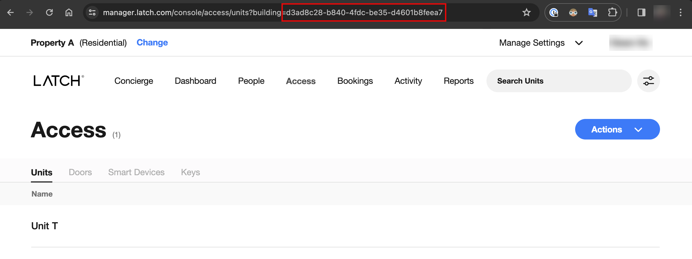
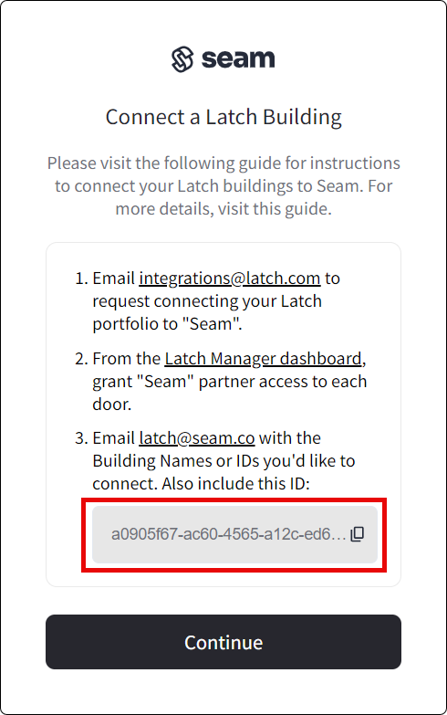

# Latch ACS Setup Instructions

To connect the Latch ACS to Seam, the property manager must perform a set of setup steps in the Latch Mission Control dashboard. Then, the application developer or property manager must establish the connection in Seam. Finally, the property manager must email connection details to Seam.

## Set Up Latch ACS

The property manager performs most of this procedure. The following instructions identify the steps that the application developer can also perform:

1.  Send an email to [integrations@latch.com](mailto:integrations@latch.com) with the following message:

    > I would like to connect the following buildings to the partner "Seam":
    >
    > * {Name of building}
2. Log in to Latch Mission Control at [manager.latch.com](http://manager.latch.com).
3. In the Latch Mission Control dashboard, for each building that you’ve connected:
   * In the top menu, click **Access**.
   * On the **Access** page, click **Doors**.
   * On the **Doors** tab, for each door to which you want to grant access:
     1. Click the door to which you want to grant access.
     2. On the right, click **Edit**.
     3. Under **Partner access**, select **Seam**.
     4. At the top right, click **Save**.
   *   Note the building ID within the URL for this page. You must send the ID of each building you want to connect to Seam. Save the building ID for a later step with further instructions.\\

       <figure><figcaption>
In the Latch Mission Control dashboard, note the ID for each building that you want to connect to Seam.
</figcaption></figure>

## Establish Seam Connection

The property manager or application developer must perform the following steps:

1. Create a [Connect Webview](../../core-concepts/connect-webviews/), including `latch` in the set of `accepted_providers`.
2. Display the Connect Webview and perform the following steps:
   * If the Connect Webview displays multiple brand options, select **Latch**.
   *   In the **Connect a Latch Building** dialog, copy and note your Seam Connect ID. You must send this Connect ID to Seam. Save the Connect ID for a later step with further instructions.

       <figure><figcaption>
Copy and note your Seam workspace ID.
</figcaption></figure>
   * Click **Continue**.

## Email Connection Details to Seam

The property manager must send [latch@getseam.com](mailto:latch@getseam.com) an email with the following information:

> I would like to connect the following Latch buildings to my workspace:
>
> * {Your Seam workspace ID}
> * Latch building IDs:
>   * {Latch building ID for each building that you want to connect to Seam}
