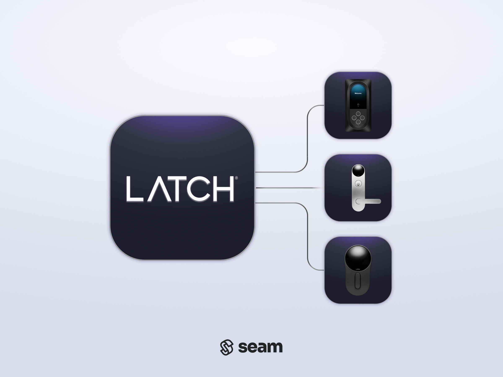
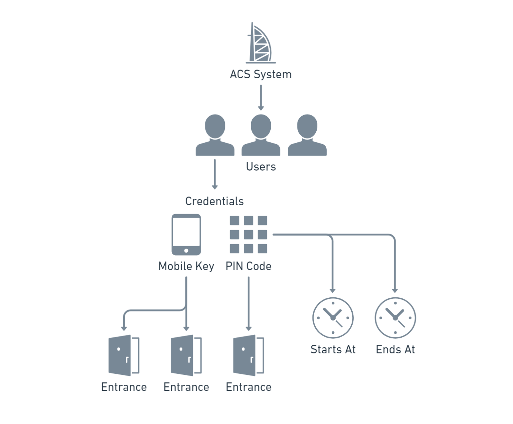

# Latch Access Control System

<figure><picture><source srcset="../../.gitbook/assets/latch-manufacturer-page-cover-dark.png" media="(prefers-color-scheme: dark)"></picture><figcaption>
Connect and control your Latch ACS using the Seam API.
</figcaption></figure>

## Overview

Seam integrates seamlessly with the [Latch](https://www.latch.com/) management platform. Property managers and owners use the Latch [access control system](../../products/access-systems/) (ACS) to control access across their properties. Latch enables them to manage who has access to which spaces and when, view access history, and set up and manage multiple users and guests.

The Seam integration for Latch enables you to automate the creation of residents and the issuing of credentials to these residents. Within these credentials, you specify the entrances to which the residents have access and the access schedules.

Latch enables you to install wireless door locks and intercom systems in your building. This low-cost solution does not require the hard-wired [Latch hub](https://marketing.latch.com/latch-hub) to provision and use mobile keys. However, if you want to provision PIN codes remotely, you do need to install the Latch hub.

***

## Latch ACS Resources

The Seam ACS schema consists of a series of resources that interact intuitively, enabling you to use the Seam API to manage your Latch ACS in a logical, efficient manner. Latch is a [credential-based ACS](../../capability-guides/access-systems/connect-an-acs-to-seam/understanding-access-control-system-differences.md#credential-based-access-control-systems), so you [create ACS users](../../products/access-systems/user-management.md#create-an-acs-user) and then grant them access permissions using credentials. When you create a credential, you specify the ACS user to which to assign the credential, as well as the allowed entrances and the start and end times for the access schedule.

The following diagram shows the Seam resources for a Latch ACS and the relationships between these resources:

<figure><figcaption>
Seam resources enable you to manage your Latch ACS intuitively.
</figcaption></figure>

The following table provides a brief description of each of the Seam resources for the Latch ACS:

<table><thead><tr><th width="233">Seam Resource</th><th>Description</th></tr></thead><tbody><tr><td>
<picture><source srcset="../../.gitbook/assets/acs-user_dark.png" media="(prefers-color-scheme: dark)"></picture>

 <a href="../../api/acs/users/"><code>acs_user</code></a>
</td><td>Individual who has been granted access to specific entrances within a building. A user could be a resident or temporary guest.</td></tr><tr><td>
<picture><source srcset="../../.gitbook/assets/acs-entrance_dark.png" media="(prefers-color-scheme: dark)"></picture>

 <a href="../../api/acs/entrances/"><code>acs_entrance</code></a>
</td><td>Physical points of entry within a property that are secured with Latch's smart access devices.</td></tr><tr><td>
<picture><source srcset="../../.gitbook/assets/acs-credential_dark.png" media="(prefers-color-scheme: dark)"></picture>

 <a href="../../api/acs/credentials/"><code>acs_credential</code></a>
</td><td>PIN codes or mobile keys. You can only assign one entrance to a key code-based credential. You can assign multiple entrances to mobile keys.</td></tr></tbody></table>

For more information about managing your Latch ACS through Seam, see the following topics:

* [Programming Code-Based Latch Credentials](programming-code-based-latch-credentials.md)
* [Programming Latch ACS Mobile Credentials](programming-latch-acs-mobile-credentials.md)
* [Credential-based ACS](../../capability-guides/access-systems/connect-an-acs-to-seam/understanding-access-control-system-differences.md#credential-based-acs)
* [Access Control Systems](../../products/access-systems/)
* [Mobile Access](../../capability-guides/mobile-access/)

***

## Supported Devices

This integration supports all wireless locks and readers connected to the Latch ACS.

***

## Supported Features

We support the following features:

* [Managing access systems](../../products/access-systems/)
* [Issuing mobile access credentials](../../capability-guides/mobile-access/)

***

### Device Provider Key

To create a [Connect Webview](../../core-concepts/connect-webviews/) that enables you to connect your Latch ACS to Seam, include the `latch` device provider key in the `accepted_providers` list. For more information, see [Customize the Brands to Display in Your Connect Webviews](../../core-concepts/connect-webviews/customizing-connect-webviews.md#customize-the-brands-to-display-in-your-connect-webviews).

***

## Brand-Specific Restrictions

Note the following restrictions on using Seam to manage your Latch ACS:

* The Latch ACS does not support remote unlock functionality. Unlock operations must occur through a mobile app.
* You cannot sync in existing users and access permissions from a Latch ACS. You can only use Seam to manage the ACS users and credentials that you create through Seam.

***

## Troubleshooting

For information about Latch ACS-related errors, including issues related to the connection between your ACS and Seam, see [Troubleshooting Your ACS](../../capability-guides/access-systems/troubleshooting-your-access-control-system.md).

***

## Where to Order

To purchase the Latch ACS and devices, contact Latch Sales.

<table data-card-size="large" data-view="cards"><thead><tr><th></th><th></th><th></th><th data-hidden data-card-target data-type="content-ref"></th><th data-hidden data-card-cover data-type="files"></th></tr></thead><tbody><tr><td></td><td><strong>Latch Sales Contact Page</strong></td><td></td><td><a href="https://www.latch.com/pages/contact">https://www.latch.com/pages/contact</a></td><td><a href="../../.gitbook/assets/latch-logo.png">latch-logo.png</a></td></tr></tbody></table>
