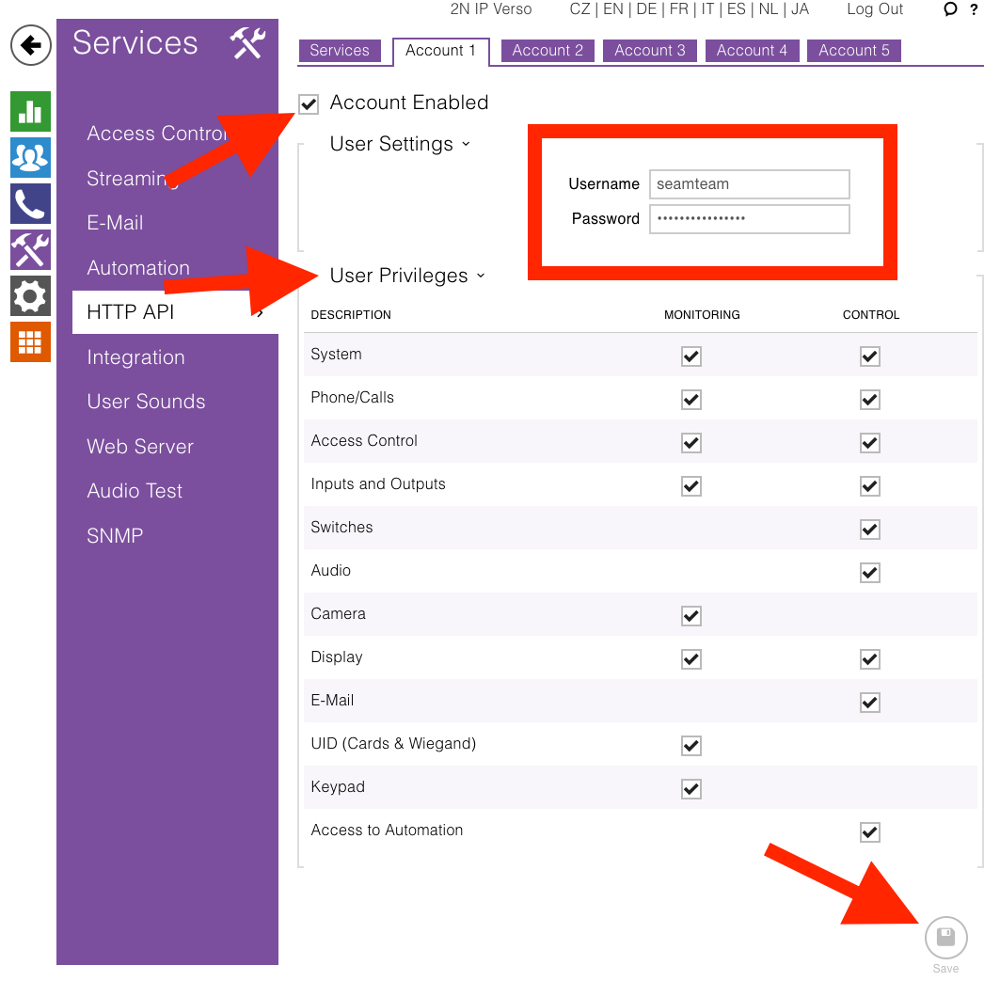

# System Setup Instructions

To connect a Dormakaba Community system to Seam, the system administrator must perform a set of setup steps on the computer where the Community server is running.

The setup process has three parts:

1. [**Prepare Community**](latch-acs-setup-instructions.md#prepare-community-for-seam-integration) – Install the Seam Bridge, enable the Community API, turn on API authentication, and create a dedicated Operator Administrator account.
2. [**Enable Mobile Keys**](latch-acs-setup-instructions.md#enable-mobile-keys-in-community) – Work with Dormakaba Technical Support to license mobile keys and link your property to Seam’s LEGIC Parent account.
3. [**Connect Community to Seam**](latch-acs-setup-instructions.md#connect-community-to-seam) – Use the Seam Connect Webview to pair the Seam Bridge, enter Operator Administrator login credentials, and establish the API connection.

***

## Prepare Community for Seam Integration

1. Install Seam Bridge
   1. Install the [Seam Bridge](../../capability-guides/seam-bridge.md) on the computer hosting the Community System.
2. Enable Community API
   1. Go to **System Settings** > **Community API**.\
      
   2. **Enable Community REST API**.
   3. Create a **Client ID** (max 32 characters) and **Secret Key** (max 512 characters).
   4. Enter these values in the Community API settings, and save these settings.
   5. These values are required later to connect Community to Seam via the Connect Webview.
3. **Enable API Authentication**
   1. Go to **System Settings** > **Security** > **API Integration**.
   2. **Enable API Authentication**.\
      .png>)
4. **Set up a New Operator Administrator User for Seam Integration**
   1. Under the top dropdown next to the dormakaba logo, select **Staff/Vendor Management**.
   2. Click **New Staff Member**.
   3. Fill out the required profile details (first name, last name, role, etc.).
   4. Assign this staff member the role of **Operator Administrator** so they have admin-level control of the Community system.
   5. In the new staff profile, go to the **Operator Info** tab.
   6. Under **Local Login**, create a **Username** and **Password** for this Operator Administrator.
      * These values are used later to connect Community to Seam via the Connect Webview.
   7. Still in the **Operator Info** tab, scroll to the **API Login** section.
   8. Click **Add/Update Username & Password**.
   9. Create a unique API username and password.
      * These values are required later to connect Community to Seam via the Connect Webview.
   10. Click the **Save** icon in the top-right corner to confirm changes.

***

## Enable Mobile Keys in Community

1. Contact Dormakaba Technical Support at **+1 (800) 999-6213** to begin the Mobile Key License procurement and setup process.
   1. After selecting your language, follow the menu prompts: **Technical Support** → **Product Support** → **Multihousing** → **Community**.
2. Inform them you are utilizing **Seam’s integration for Dormakaba Community Mobile Keys**.
3. Dormakaba will connect your Community property to Seam’s LEGIC  account and provide you with a **Project ID** and **API Key**.
4. In Community, go to **System Settings** > **Advanced** > **Mobile Keys** > **LEGIC Configuration Settings** and enter the **Project ID** and **API Key**.
5.  Enter **"https://integration.legicconnect.com"** as the **Endpoint address**.

    <figure><figcaption></figcaption></figure>
6. Click **Test LEGIC connection settings** to confirm that the settings were set correctly.
7. Click the **Save** icon in the top-right corner to save the changes.

***

## Connect Community to Seam

1. **Pair Seam Bridge**
   * Make sure **Seam Bridge** is running.
   * In the Connect Webview, enter the **pairing code** from the top-right corner of the Seam Bridge app.
2. **Enter Operator Administrator login**
   * Use the same **username** and **password** you use to log in locally to Community.
   * For the system URL, run `ipconfig` in Command Prompt and use your computer’s IPv4 Address.
3. **Enter API credentials**
   * In the Connect Webview, enter the **Client ID** and **Secret Key** you created in the Community API settings.
   * Enter the **API Username and Password** you created for the Operator Administrator.
4. Click **Submit** to finish connecting Community to Seam.

***
