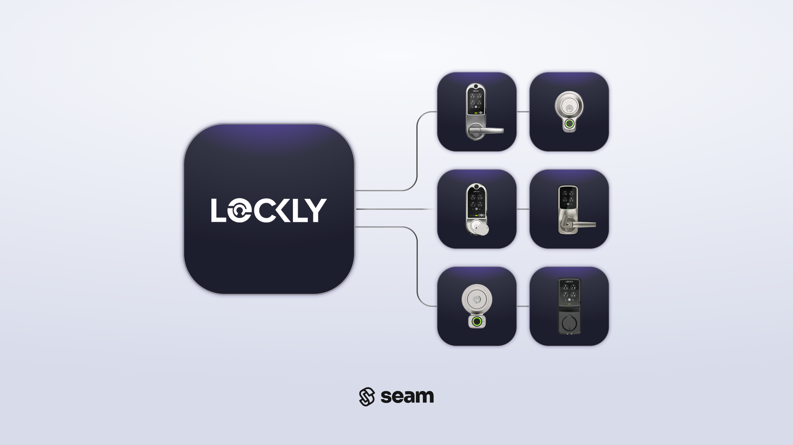

# Lockly Locks

<figure><figcaption></figcaption></figure>

## Overview

Seam integrates with Lockly smart locks. With a focus on security, Lockly smart locks work with a vast array of door types, such as traditional deadbolts, latch bolts, and patio doors. In addition, Lockly smart locks support time-bound and one-time-use [offline access codes](creating-lockly-offline-access-codes.md) that you can issue when you are not connected to your Lockly lock.


**Before you begin**

Follow the [Lockly Setup Guide](lockly-setup-guide.md) to configure your Lockly account, and connect it to Seam.


***

## Supported Devices

All Lockly smart locks are supported.

For models without built-in Wi-Fi, a [Secure Link Wi-Fi Hub](https://lockly.com/products/secure-link-wifi-hub) is required.

For detailed information about the Lockly devices that Seam supports, see our [Lockly Supported Devices page](https://www.seam.co/manufacturers/lockly).

***

## Supported Features

We support the following features:

#### Device control

* Lock and unlock actions (online)

#### Access code management

* Online access codes (for Wi-Fi–connected locks)
* Offline, time-bound, and one-time-use PIN codes (for keypad models)
* Custom code lengths between 6 and 8 digits (Lockly requirement)

#### Device monitoring

* Lock status
* Online/offline state
* Battery level (where supported)

***

## Connecting Lockly to Seam

To enable your users to [connect Lockly devices through Connect Webviews](../../core-concepts/connect-webviews/customizing-connect-webviews.md#customize-the-brands-to-display-in-your-connect-webviews), include the Lockly provider:

```json
{
  "accepted_providers": ["lockly"]
}
```

After the Lockly owner completes the LAP setup steps, they can enter their programmatic credentials into the Seam Connect form to complete the connection.

[→ See: Lockly Setup Guide](lockly-setup-guide.md)

***

## Brand-specific notes

* **Access codes:** Lockly requires access codes to be 6–8 digits.
* **Hubs:** Some models require the Lockly Secure Link Wi-Fi Hub.
* **API access:** Lockly Access Portal users must request API enablement from Lockly support.

***

## Next Steps

<table data-view="cards"><thead><tr><th></th><th></th><th data-hidden data-card-target data-type="content-ref"></th><th data-hidden data-card-cover data-type="image">Cover image</th></tr></thead><tbody><tr><td><strong>Connect Lockly to Seam</strong></td><td>Follow the setup guide to prepare your Lockly account and enable API access.</td><td><a href="lockly-setup-guide.md">lockly-setup-guide.md</a></td><td><a href="../../.gitbook/assets/image.png">image.png</a></td></tr><tr><td><strong>Order Locks</strong></td><td>Purchase Lockly locks directly from their website.</td><td><a href="https://lockly.com/collections/door-lock">https://lockly.com/collections/door-lock</a></td><td><a href="../../.gitbook/assets/lockly-logo.png">lockly-logo.png</a></td></tr></tbody></table>
