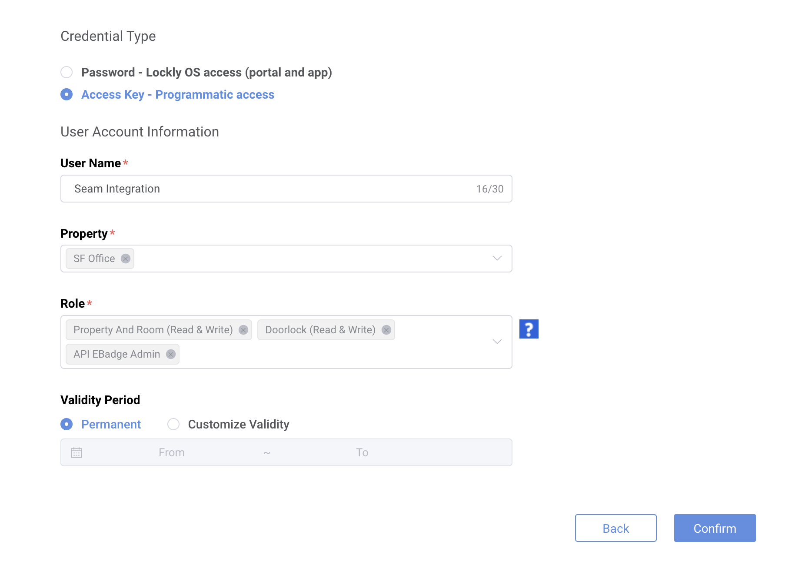
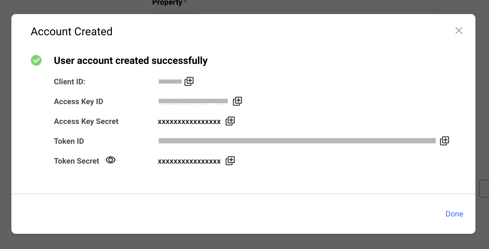

# Lockly Setup Guide

To use Seam with Lockly devices, ask the device owner to complete the steps below.

#### 1. Set up the Lockly mobile app

1. Download the [Lockly mobile app](https://lockly.com/pages/lockly-home-app) and create an account if you don’t have one.
2. For each Lockly lock:
   * Open the lock’s card.
   * Select **Settings** in the lower-right corner.
   * Select **Sync with LocklyOS** and turn it on.

#### 2. Sign in to the Lockly Access Portal

1. In a web browser, go to the [Lockly Access Portal (LAP)](https://lap.lockly.com/#/login).
2. Sign in using your Lockly mobile app credentials.
3. Purchase the Lockly plan that fits your needs.
4. Email [support@lockly.com](mailto:support@lockly.com) to request API access for your LAP account.

#### 3. Create a programmatic access user

1. In LAP, open **Account → User Management**.
2. Select **Add Account**.
3.  Configure the new user with the following values:

    * **Credential type:** Access Key – Programmatic access
    * **User name:** A descriptive label, such as _Seam Integration_
    * **Property:** Select all properties Seam should access
    * **Role:**
      * Property And Room (Read & Write)
      * Doorlock (Read & Write)
      * API EBadge Admin
    * **Validity period:** Permanent\\

    <figure><figcaption></figcaption></figure>
4. Select **Confirm**.\
   LAP creates the new account and displays its credentials.\
   Make sure to record the **Client ID**, **Access Key ID**, **Access Key Secret**, **Token ID**, and **Token Secret**.

<figure><figcaption></figcaption></figure>

#### 4. Connect Lockly to Seam

After setting up the Lockly Access Portal account and gathering the credentials, we can complete the connection in Seam.

1. Within the form to connect Lockly to Seam, enter the LAP credentials collected in the previous step:
   * Client ID
   * Access Key ID
   * Access Key Secret
   * Token ID
   * Token Secret
2. Confirm the connection.

***

## Troubleshooting

### Devices not showing up after connecting account

If you've successfully connected your Lockly account to Seam but your devices are not appearing, follow these steps:

#### **1. Verify "Sync with LocklyOS" is enabled**

For each lock that's not showing up:

1. Open the Lockly mobile app
2. Navigate to the lock's card
3. Select **Settings** in the lower-right corner
4. Ensure **Sync with LocklyOS** is turned **ON**
5. Wait 2-3 minutes for the sync to complete

#### **2. Check your subscription status**

1. Log in to the [Lockly Access Portal](https://access.lockly.com)
2. Navigate to **Account → Subscription** (or similar billing section)
3. Verify that:
   * Your subscription is active and paid
   * The subscription includes API access
   * Your payment method is valid and up to date

#### **3. Verify API access is enabled**

Ensure you've received confirmation from Lockly support that API access has been enabled for your LAP account. If you haven't heard back:

1. Check your email (including spam folder) for a response from [support@lockly.com](mailto:support@lockly.com)
2. If no response within 24-48 hours, send a follow-up email.

#### **4. Confirm user permissions**

Double-check that your programmatic access user has the correct permissions:

1. In LAP, go to **Account → User Management**
2. Find your Seam integration user
3. Verify it has all required roles:
   * `Property And Room (Read & Write)`
   * `Doorlock (Read & Write)`
   * `API EBadge Admin`
4. Ensure the correct properties are selected

### **Still not working?**

If you've completed all the steps above and devices still aren't showing up, contact Lockly support for assistance:

**Email:** [support@lockly.com](mailto:support@lockly.com)

**Include the following information:**

* Your Lockly Access Portal account email
* The Client ID you're using for the integration
* A description of the issue (devices not appearing in Seam)
* Confirmation that Sync with LocklyOS is enabled and subscription is active

Lockly support can investigate account-specific issues and ensure your API access is properly configured.

