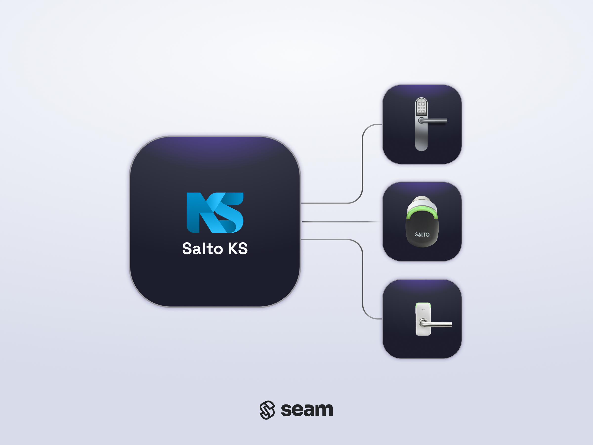
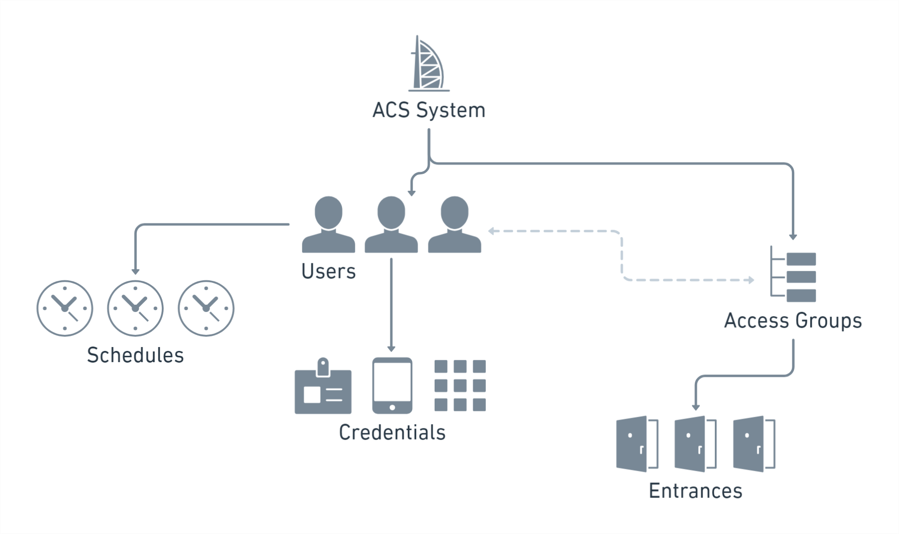

# Salto KS Access Control System

<figure><picture><source srcset="../../.gitbook/assets/salto-ks-acs-manufacturer-page-cover-dark.png" media="(prefers-color-scheme: dark)"></picture><figcaption>
Connect and control your Salto KS ACS using the Seam API.
</figcaption></figure>

## Overview

[Salto KS](https://saltoks.com/) (Keys as a Service) provides a cloud-based access control system that enables property managers and owners to control access across their properties. With Salto KS, you can manage user access, set schedules, and monitor entrances efficiently. Because Salto KS is cloud-based, it provides the benefits and ease of remote management. In addition, you can monitor real-time data and analytics.

The Seam integration for Salto KS enables you to create ACS users and assign access permissions to them. In the Salto KS model, you can choose to configure access schedules directly on the `acs_user`s themselves.

***

## Salto KS Resources

The Seam ACS schema consists of a series of resources that interact intuitively, enabling you to use the Seam API to manage your Salto KS ACS in a logical, efficient manner. Salto KS is an [access group-based ACS](../../capability-guides/access-systems/connect-an-acs-to-seam/understanding-access-control-system-differences.md#access-group-based-access-control-systems), so you [create ACS users](../../products/access-systems/user-management.md#create-an-acs-user) and then assign them to access groups to specify the entrances to which these users have access. You can also configure access schedules for ACS users.

The following diagram shows the Seam resources for a Salto KS ACS and the relationships between these resources:

<figure><figcaption>
Seam resources enable you to manage your Salto Space ACS intuitively.
</figcaption></figure>

The following table provides a brief description of each of the Seam resources for the Salto Space ACS:

<table><thead><tr><th width="233">Seam Resource</th><th>Description</th></tr></thead><tbody><tr><td><picture><source srcset="../../.gitbook/assets/acs-user_dark.png" media="(prefers-color-scheme: dark)"></picture> <a href="../../api/acs/users/"><code>acs_user</code></a></td><td>Individual who has been granted access to specific entrances within a property. ACS users could include employees, residents, and temporary guests. You can configure access schedules for users, if desired. You assign a unique credential to each user.</td></tr><tr><td><picture><source srcset="../../.gitbook/assets/acs-access-group_dark.png" media="(prefers-color-scheme: dark)"></picture> <a href="../../api/acs/access_groups/"><code>acs_access_group</code></a></td><td>Collection of users with shared access permissions. Instead of assigning permissions individually, users are grouped based on their access needs. Access groups streamline the management of access rights and ensure consistency.</td></tr><tr><td><picture><source srcset="../../.gitbook/assets/acs-schedule_dark.png" media="(prefers-color-scheme: dark)"></picture> <code>access_schedule</code></td><td>Timeframe during which access is permitted. By associating schedules with ACS users and then assigning users to access groups, property managers can control when users can enter specific areas, enhancing security and operational efficiency. If you set an access schedule for a Salto KS ACS user, the user appears as "unsubscribed" in the ACS until the <code>starts_at</code> time. Once the start time arrives, Seam switches the ACS user to "subscribed," which activates their access.</td></tr><tr><td><picture><source srcset="../../.gitbook/assets/acs-entrance_dark.png" media="(prefers-color-scheme: dark)"></picture> <a href="../../api/acs/entrances/"><code>acs_entrance</code></a></td><td>Physical points of entry within a property that are secured with Salto KS smart access devices. Access permissions are assigned to these entrances through access groups and access schedules.</td></tr><tr><td><picture><source srcset="../../.gitbook/assets/acs-credential_dark.png" media="(prefers-color-scheme: dark)"></picture> <a href="../../api/acs/credentials/"><code>acs_credential</code></a></td><td>
PINs, key cards or tags, or mobile keys.
<ul><li>PINs: Unique personal identification numbers assigned to each user. For Salto KS, you cannot specify a custom PIN code. Instead, Salto KS generates the PIN code.</li><li>Key cards or tags: Physical cards that users can swipe or tap at access points.</li><li>Mobile keys: Digital keys stored on users' mobile devices, enabling them to access entrances using their smartphones.</li></ul></td></tr></tbody></table>

For more information about managing your Salto KS ACS through Seam, see the following topics:

* [Programming Salto KS PIN Code Credentials](programming-code-based-salto-ks-credentials.md)
* [Programming Salto KS Mobile Credentials](programming-salto-ks-mobile-credentials.md)
* [Access Group-Based Access Control Systems](../../capability-guides/access-systems/connect-an-acs-to-seam/understanding-access-control-system-differences.md#access-group-based-access-control-systems)
* [Access Control Systems](../../products/access-systems/)
* [Mobile Access](../../capability-guides/mobile-access/)

***

## Supported Devices

This integration supports all Salto locks connected to the Salto KS ACS.



***

## Supported Features

We support the following features:

* [Managing access systems](../../products/access-systems/)
* [Issuing code-based credentials](programming-code-based-salto-ks-credentials.md)
* [Issuing mobile access credentials](../../capability-guides/mobile-access/)

***

### Device Provider Key

To create a [Connect Webview](../../core-concepts/connect-webviews/) that enables you to connect your Salto KS ACS to Seam, include the `salto_ks` [device provider key](../../api-clients/connect_webviews/#device-provider-keys) in the `accepted_providers` list. For more information, see [Customize the Brands to Display in Your Connect Webview](../../core-concepts/connect-webviews/customizing-connect-webviews.md#customize-the-brands-to-display-in-your-connect-webviews).

***

## Brand-Specific Restrictions

Note the following Salto KS restrictions:

### Salto KS Account Type

You must use a Salto KS production environment account to connect to Seam. You cannot use "Accept Environment" credentials.

To confirm that your Salto KS account is a production environment account, note the Salto KS dashboard URL. Make sure that the subdomain within this URL is `app`, for example, `https://app.saltoks.com`.

A subdomain of `app-accept`, for example, `https://app-accept.saltoks.com`, indicates an "Accept Environment" that you cannot connect to Seam.

### ACS Credentials

When creating a credential for Salto KS, you cannot specify a custom PIN code. Instead, Salto KS generates the PIN code.

***

## Brand-Specific Behaviors

Note the following Salto KS behaviors:

### Proximity Behavior

To use access devices successfully within a Salto KS access system, it is important to understand the following proximity behavior requirements:

#### Card Readers

Card readers within a Salto KS access system are powered. Consequently, they can read a credential from up to around 30 cm away if Near Detection Mode is enabled. If you disable this setting, this distance increases to around 15 meters.

For more details, see [this Salto KS document](https://support.saltosystems.com/ks/hardware/lock-information-and-settings/#im-having-proximity-issues-how-close-does-a-phone-need-to-be-to-a-lock-to-open-it).

#### Unit Doors

Unit door locks within a Salto KS access system must first be woken up, and then a credential can be read. To use mobile keys with these locks, you must hold (tap) the back of the phone to the lock. There is no way to disable this requirement.

***

## Brand-Specific Errors

For information about Salto KS ACS-related errors, see [Troubleshooting Your ACS](../../capability-guides/access-systems/troubleshooting-your-access-control-system.md).

***

## Where to Order

To purchase the Salto KS ACS and devices, contact Salto KS Sales.

<table data-card-size="large" data-view="cards"><thead><tr><th></th><th></th><th></th><th data-hidden data-card-target data-type="content-ref"></th><th data-hidden data-card-cover data-type="files"></th></tr></thead><tbody><tr><td></td><td><strong>Salto KS Sales Contact Page</strong></td><td></td><td><a href="https://saltosystems.com/en/contact/">https://saltosystems.com/en/contact/</a></td><td><a href="../../.gitbook/assets/salto-ks-logo.png">salto-ks-logo.png</a></td></tr></tbody></table>
