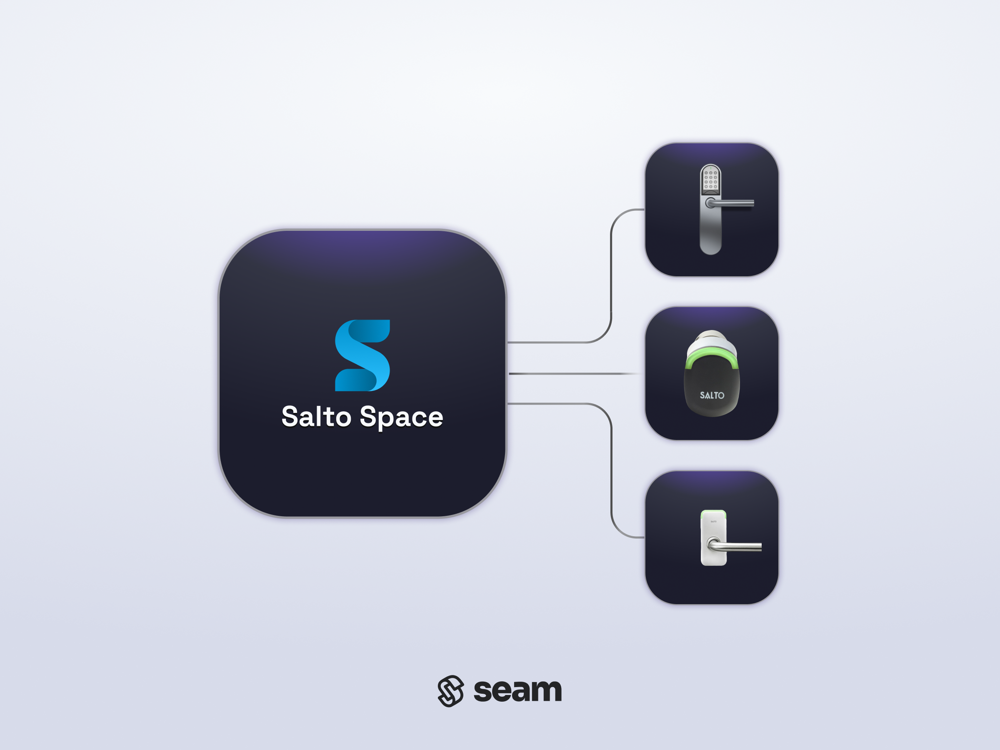
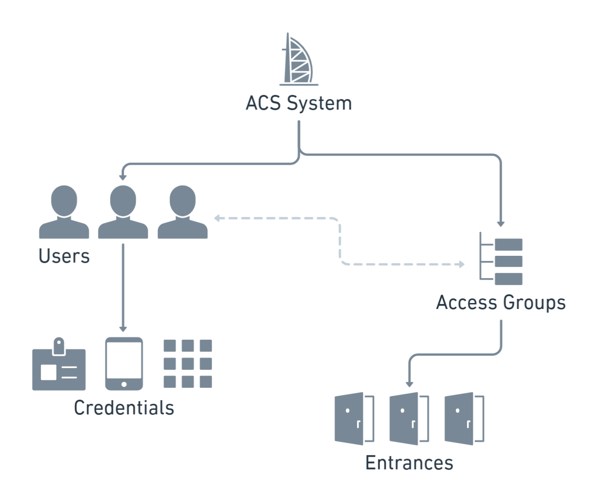

# Salto ProAccess Space Access System

<figure><picture><source srcset="../../.gitbook/assets/salto-space-manufacturer-page-cover-dark.png" media="(prefers-color-scheme: dark)"></picture><figcaption>
Connect and control your Salto Space access system using the Seam API.
</figcaption></figure>

## Overview

[Salto ProAccess Space](https://saltosystems.com/en-us/solutions/salto-space/salto-space-products/proaccess-space-management-software/) provides an on-premises access system that enables property managers and owners to control access across their properties. Because it is an on-premises solution, Salto Space provides support for both online and offline access devices. You can manage user access and monitor entrances efficiently. Salto Space is a good choice for enterprises that need full local security.

The Seam integration for Salto Space enables you to create access system users and assign access permissions to them. In the Salto Space model, you assign users to access groups that grant access to specific sets of entrances. Then, you create credentials to define the access mechanisms for the users' access grants.

This integration requires [Seam Bridge](../../capability-guides/seam-bridge.md) to connect the on-premises Salto Space access system with Seam.

***

## Salto Space Resources

The Seam access system schema consists of a series of resources that interact intuitively, enabling you to use the Seam API to manage your Salto Space access system in a logical, efficient manner. Salto Space is an [access group-based access system](../../capability-guides/access-systems/connect-an-acs-to-seam/understanding-access-control-system-differences.md#access-group-based-access-control-systems), so you [create access system users](../../products/access-systems/user-management.md#create-an-acs-user) and then assign them to access groups to specify the entrances to which these users have access.

The following diagram shows the Seam resources for a Salto Space access system and the relationships between these resources:

<figure><figcaption>
Seam resources enable you to manage your Salto Space access system intuitively.
</figcaption></figure>

The following table provides a brief description of each of the Seam resources for the Salto Space access system:

<table><thead><tr><th width="233">Seam Resource</th><th>Description</th></tr></thead><tbody><tr><td>
<picture><source srcset="../../.gitbook/assets/acs-user_dark.png" media="(prefers-color-scheme: dark)"></picture>

<a href="../../api/acs/users/"><code>acs_user</code></a>
</td><td>Individual who has been granted access to specific entrances within a property. Access system users could include employees, residents, and visitors. You assign a unique credential to each user.</td></tr><tr><td>
<picture><source srcset="../../.gitbook/assets/acs-access-group_dark.png" media="(prefers-color-scheme: dark)"></picture>

<a href="../../api/acs/access_groups/"><code>acs_access_group</code></a>
</td><td>Collection of users with shared access permissions, called "user access levels" in Salto Space. Instead of assigning permissions individually, users are grouped based on their access needs. Access groups streamline the management of access rights and ensure consistency.</td></tr><tr><td>
<picture><source srcset="../../.gitbook/assets/acs-entrance_dark.png" media="(prefers-color-scheme: dark)"></picture>

<a href="../../api/acs/entrances/"><code>acs_entrance</code></a>
</td><td>Physical points of entry within a property that are secured with Salto smart access devices, called "access points" in Salto Space. Salto Space supports both online and offline entrances. Access permissions are assigned to these entrances through access groups.</td></tr><tr><td>
<picture><source srcset="../../.gitbook/assets/acs-credential_dark.png" media="(prefers-color-scheme: dark)"></picture>

<a href="../../api/acs/credentials/"><code>acs_credential</code></a>
</td><td>
Key cards or mobile keys.
<ul><li>Key cards: Physical cards that users can swipe or tap at access points. For Salto Space, you encode credentials onto cards.</li><li>Mobile keys: Digital keys stored on users' mobile devices, enabling them to access entrances using their smartphones.</li></ul>

For each access system user, Salto Space supports a maximum of one key card credential and one mobile key credential.

</td></tr></tbody></table>

For more information about managing your Salto Space access system through Seam, see the following topics:

* [Programming Salto Space Card-based Credentials](programming-salto-space-card-based-credentials.md)
* [Programming Salto Space Mobile Credentials](programming-salto-space-mobile-credentials.md)
* [Access Group-Based Access Systems](../../capability-guides/access-systems/connect-an-acs-to-seam/understanding-access-control-system-differences.md#access-group-based-access-control-systems)
* [Access Systems](../../products/access-systems/)
* [Mobile Access](../../capability-guides/mobile-access/)

***

## Supported Devices

This integration supports all Salto locks connected to the Salto Space ACS.

***

## Supported Features

We support the following features:

* [Managing access systems](../../products/access-systems/)
* [Issuing card-based credentials](programming-salto-space-card-based-credentials.md)
* [Issuing mobile access credentials](../../capability-guides/mobile-access/)

***

### Device Provider Key

To create a [Connect Webview](../../core-concepts/connect-webviews/) that enables you to connect your Salto Space access system to Seam, include the `salto_space` device provider key in the `accepted_providers` list. For more information, see [Customize the Brands to Display in Your Connect Webviews](../../core-concepts/connect-webviews/customizing-connect-webviews.md#customize-the-brands-to-display-in-your-connect-webviews).

***

## Brand-Specific Behaviors

Note the following Salto Space behaviors:

### Proximity Behavior

To use access devices successfully within a Salto Space access system, it is important to understand the following proximity behavior requirements:

#### Card Readers

Card readers within a Salto Space access system are powered. By default, near detection mode is enabled (that is, "far opening" is disabled), which means that readers can read a BLE credential from up to around 30 cm away. If you enable far opening, the range increases to around 15 meters.

To enable or disable far opening:

1. Log in to the Salto ProAccess Space desktop app.
2. In the top navigation pane, go to **System > Salto Network**.
3. Click the triangle next to the controller that hosts the reader for which you’d like to modify the proximity settings.
4. In the **Inputs** area for the controller, click the desired reader.
5. In the configuration window for the reader, enable or disable far opening.
6. Repeat this process for all additional readers for which you want to enable or disable far opening.

***

## Troubleshooting

For information about Salto Space access system-related errors, see [Troubleshooting Your Access System](../../capability-guides/access-systems/troubleshooting-your-access-control-system.md).

***

## Where to Order

To purchase the Salto Space access system and devices, contact Salto Space Sales.

<table data-card-size="large" data-view="cards"><thead><tr><th></th><th></th><th></th><th data-hidden data-card-target data-type="content-ref"></th><th data-hidden data-card-cover data-type="files"></th></tr></thead><tbody><tr><td></td><td><strong>Salto Space Sales Contact Page</strong></td><td></td><td><a href="https://saltosystems.com/en-us/contact/">https://saltosystems.com/en-us/contact/</a></td><td><a href="../../.gitbook/assets/salto-space-logo.png">salto-space-logo.png</a></td></tr></tbody></table>
