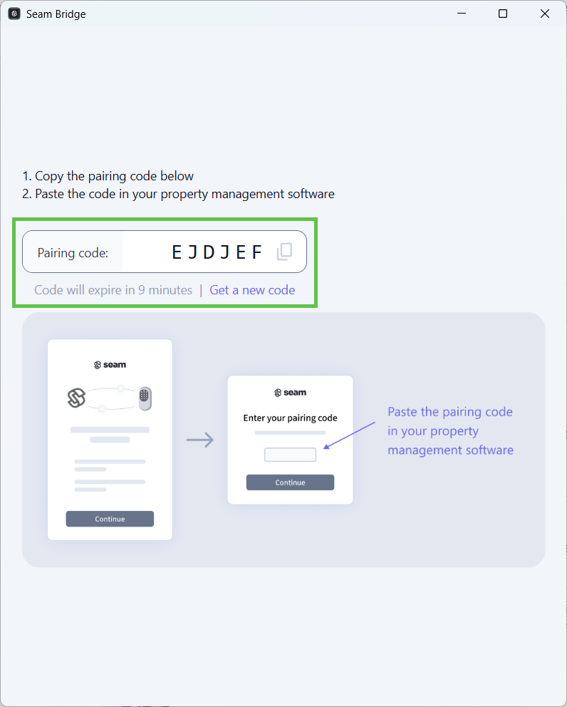

# Salto Space Setup Instructions

This topic describes how to connect your Salto Space sites to Seam.

## Prerequisites

This section describes the steps that you must take before connecting your Salto Space sites to Seam.

### Integrate with Live Salto Space Sites

These setup instructions assume that you are integrating existing, live Salto Space sites with Seam.

***

### SHIP Settings for Seam Integration

Before connecting your Salto Space access system to Seam, you must first configure the SHIP settings in the Salto ProAccess Space Management Software. In these settings, choose which transport protocol you want to use to connect your Salto Space site to Seam. The Seam integration for Salto Space supports both HTTP(S) and Salto Transport Protocol (STP).

If you want to use HTTP(S), also specify the username and password that you want to use for the connection to Seam.

Perform the following process for each Salto Space site that you want to integrate with Seam:

1. Log in to the Salto ProAccess Space desktop app.
2. In the top navigation pane, go to **System > General options**.
3. On the **General options** page, click the **SHIP** tab.
4. In the **Salto SHIP Server** pane:
   1. Select **Enable**.
   2. In the **Transport Protocol** area, select **HTTP(S)** or **STP**.
   3.  If you've selected **HTTP(S)**:

       1. In the **Authentication** field, select **Basic**.
       2. In the **Username** field, type a username for the integration with Seam, for example, `Seam_Integration`.
       3. In the **Password** field, type a password for this Seam integration user.

       <figure><figcaption>
In the Salto Space SHIP settings, specify a username and password for the integration with Seam.
</figcaption></figure>
   4. If you've selected **STP**:
      1. In the **TCP/IP port** field, select or type the number of the port that you want to use.
5. In the lower-right corner of the **General options** page, click **Save**.
6. Note the username and password or TCP/IP port that you have specified in the SHIP settings. You must use this information to connect your Salto Space site to Seam.

***

### LAN URL and Host of the Salto Space Server

During the process of connecting your Salto Space access system to Seam, you must specify the host IP address or LAN URL of your Salto Space server, depending on the transport protocol that you want to use to connect your Salto Space site to Seam.

To identify this URL:

1.  On the Windows computer that is running the Salto Space server, open a **Command Prompt** window.

    That is, click **Start**, type `cmd`, and press **Enter**.
2.  In the **Command Prompt** window, type `ipconfig` and then press **Enter**.

    This command displays the computer's Windows IP configuration.
3.  Note the IPv4 address that the computer is using to connect to the internet.

    This IP address identifies the host of the Salto Space server. It most likely starts with `192`.
4.  Prepend `http://` and append the port number `8100` to the IP address to form the LAN URL.

    For example, if the computer's IP address is `192.168.1.101`, the LAN URL is `http://192.168.1.101:8100`.
5. If you want to use HTTP(S) when connecting your Salto Space access system to Seam, note the LAN URL. If you want to use Salto Transport Protocol (STP) when connecting your Salto Space access system to Seam, note the IP address that identifies the host of the Salto Space server.

***

## Setup Process

Perform the following process for each Salto Space site that you want to integrate with Seam:

1.  In the top navigation pane of [Seam Console](https://console.seam.co/), click **ACS Systems**.

    <figure><figcaption>
Click ACS Systems to go to the Access Systems page.
</figcaption></figure>
2.  On the **Access Systems** page, click **New Access System**.

    Seam Console displays a Connect Webview that enables you to connect your access system to Seam.
3. In the Connect Webview, click **Continue**.
4. If the Connect Webview displays multiple brand options, click **Salto Space**.
5.  On the **Set up your Seam Bridge** page, click [**latest Seam Bridge**](https://www.seam.co/seam-bridge/releases/latest).

    [Seam Bridge](../../capability-guides/seam-bridge.md) is a software-only component that enables you to connect on-premises software systems to the Seam platform. Because Salto Space is an on-premises access system, Seam Bridge is required for Salto Space systems.
6.  Download the Seam Bridge executable onto the on-premises computer that is running Salto Space or onto a computer on the same network.

    For systems requirements, see [Seam Bridge](../../capability-guides/seam-bridge.md).
7. Run the downloaded Seam Bridge app.
8. In the **Welcome to Seam Bridge** window, type a name for the site that you are connecting using Seam Bridge and then click **Start pairing**.
9.  Copy the pairing code.

    <figure><figcaption>
Use the pairing code to pair Seam Bridge with your workspace.
</figcaption></figure>
10. In the Connect Webview, click **Continue**.
11. On the **Seam Bridge Connection** page:
    1. In the **Enter your pairing token** field, paste the pairing code that you copied.
    2. Click **Submit**.
12. On the **Enter your system details** page:
    1. In the **System Name** field, type a name to identify the Salto Space site within your Seam workspace.
    2. In the **Transport Type used by the Salto Space Server** field, select **HTTP** or **STP (Salto Transport Protocol)**.
    3. Click **Submit**.
13. On the **Enter your credentials** page:
    1. If you have chosen to use HTTP(S):
       1.  In the **LAN URL of the Salto Space server** field, type the [LAN URL that you identified for the Salto Space server](salto-space-setup-instructions.md#lan-url-and-host-of-the-salto-space-server) before beginning this process.

           For example: `http://192.168.1.101:8100`
       2. In the **Username** field, type the username that you configured in the [Salto Space SHIP settings](salto-space-setup-instructions.md#prerequisites).
       3. In the **Password** field, type the password that you configured in the Salto Space SHIP settings.
    2. If you have chosen to use STP:
       1.  In the **Host of the Salto Space server** field, type the [IP address that you identified for the Salto Space server](salto-space-setup-instructions.md#lan-url-and-host-of-the-salto-space-server) before beginning this process.

           For example: `192.168.1.101`
       2. In the **TCP/IP Port configured in the Salto Space server** field, type the TCP/IP port number that you configured in the [Salto Space SHIP settings](salto-space-setup-instructions.md#prerequisites).
    3. Click **Submit**.
14. Click **Close**.
