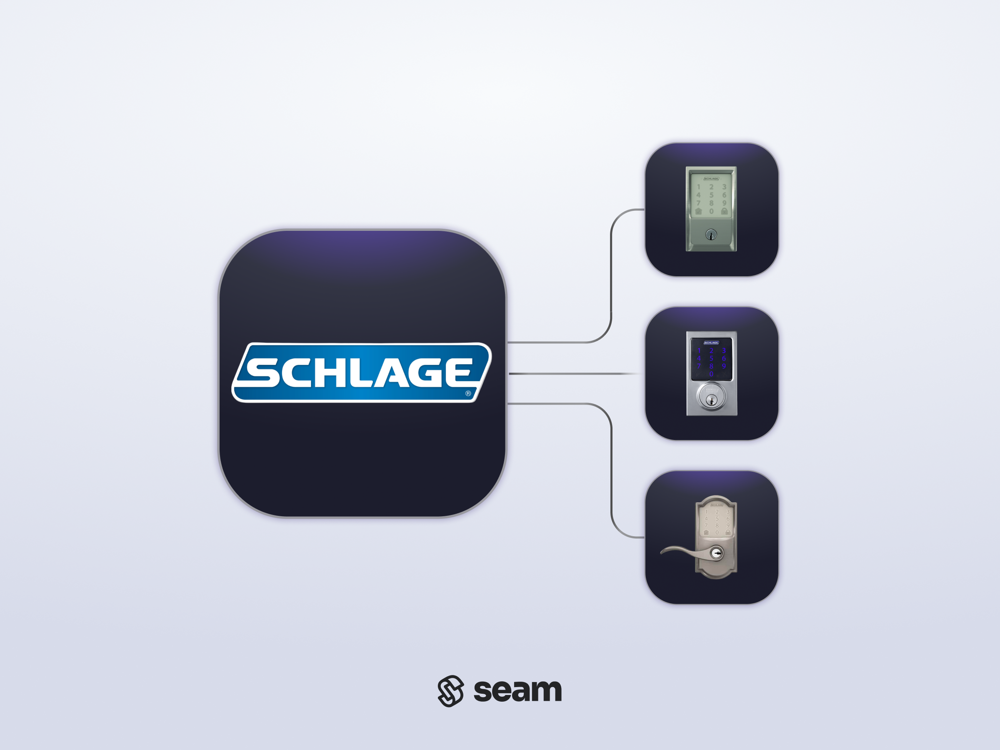

# Schlage Locks

<figure><picture><source srcset="../../.gitbook/assets/schlage-manufacturer-page-cover-dark.png" media="(prefers-color-scheme: dark)"></picture><figcaption>
Connect and control Schlage devices using the Seam API.
</figcaption></figure>

## Overview

Schlage produces [smart locks](https://www.schlage.com/en/home/products/products-smart-locks.html) for the residential market. With a focus on security, durability, and resilience, Schlage provides smart deadbolt locks in a variety of models and styles. Seam integrates with some Schlage locks through the [Schlage Home App](https://www.schlage.com/en/home/smart-locks/schlage-app.html), while other Schlage locks require a compatible Z-Wave hub for integration.

***

## Supported Devices

This integration supports Schlage Encode™ and Connect™ locks, as well as Connected Keypad locks. Seam does not support integration with Schlage Sense™ locks.

The following table details the requirements for compatibility with this Seam integration:

<table><thead><tr><th width="301.3333333333333">Product Models</th><th>Compatibility</th></tr></thead><tbody><tr><td>Schlage <a href="https://www.schlage.com/en/home/products/products-smart-locks/schlage-encode/wifi-smart-lock-listing.html">Encode</a> and <a href="https://www.schlage.com/en/home/products/products-smart-locks/schlage-encode-plus/homekit-smart-lock-listing.html">Encode Plus</a> Smart Wi-Fi Deadbolt</td><td>Compatible only with the <a href="https://www.schlage.com/en/home/smart-locks/schlage-app.html">Schlage Home App</a>.</td></tr><tr><td>Schlage <a href="https://www.schlage.com/en/home/products/products-smart-locks/schlage-connect/schlage-connect-listing.html">Connect</a> Smart Deadbolt</td><td>Compatible only with a compatible Z-Wave hub. Seam supports integration with the SmartThings hub.</td></tr><tr><td>Schlage Connected Keypad</td><td>Compatible only with a compatible Z-Wave hub. Seam supports integration with the SmartThings hub.</td></tr><tr><td>Schlage <a href="https://www.schlage.com/en/home/products/products-smart-locks/schlage-sense-smart-deadbolt/schlage-sense-smart-deadbolt-listing.html">Sense</a> lock</td><td>Not compatible.</td></tr></tbody></table>

For detailed information about the Schlage devices that Seam supports, see our [Schlage Supported Devices page](https://www.seam.co/manufacturers/schlage).

***

## Supported Features

We support the following features:

* [Triggering web lock and unlock actions](../../products/smart-locks/lock-and-unlock.md)
* [Programming online access codes](../../products/smart-locks/access-codes/) on locks that have a connected keypad

***

### Device Provider Key

To create a [Connect Webview](../../core-concepts/connect-webviews/) that enables your users to connect their Schlage devices to Seam, include the `schlage` device provider key in the `accepted_providers` list. For more information, see [Customize the Brands to Display in Your Connect Webviews](../../core-concepts/connect-webviews/customizing-connect-webviews.md#customize-the-brands-to-display-in-your-connect-webviews).

***

## Troubleshooting

If you receive an "unauthorized" error, confirm that you've verified the email address associated with the Schlage account that you've connected to Seam.

***

## Where to Order

Order Schlage locks by finding a retailer on the Schlage website or by purchasing from Amazon.

<table data-view="cards"><thead><tr><th></th><th></th><th></th><th data-hidden data-card-target data-type="content-ref"></th><th data-hidden data-card-cover data-type="files"></th></tr></thead><tbody><tr><td></td><td><strong>Schlage</strong></td><td></td><td><a href="https://www.schlage.com/en/home/products/smart-deadbolts-levers.html">https://www.schlage.com/en/home/products/smart-deadbolts-levers.html</a></td><td><a href="../../.gitbook/assets/schlage-logo.png">schlage-logo.png</a></td></tr><tr><td></td><td><strong>Schlage Products on Amazon</strong></td><td></td><td><a href="https://amzn.to/3ZlSDWS">https://amzn.to/3ZlSDWS</a></td><td><a href="../../.gitbook/assets/schlage-on-amazon.png">schlage-on-amazon.png</a></td></tr></tbody></table>

***
