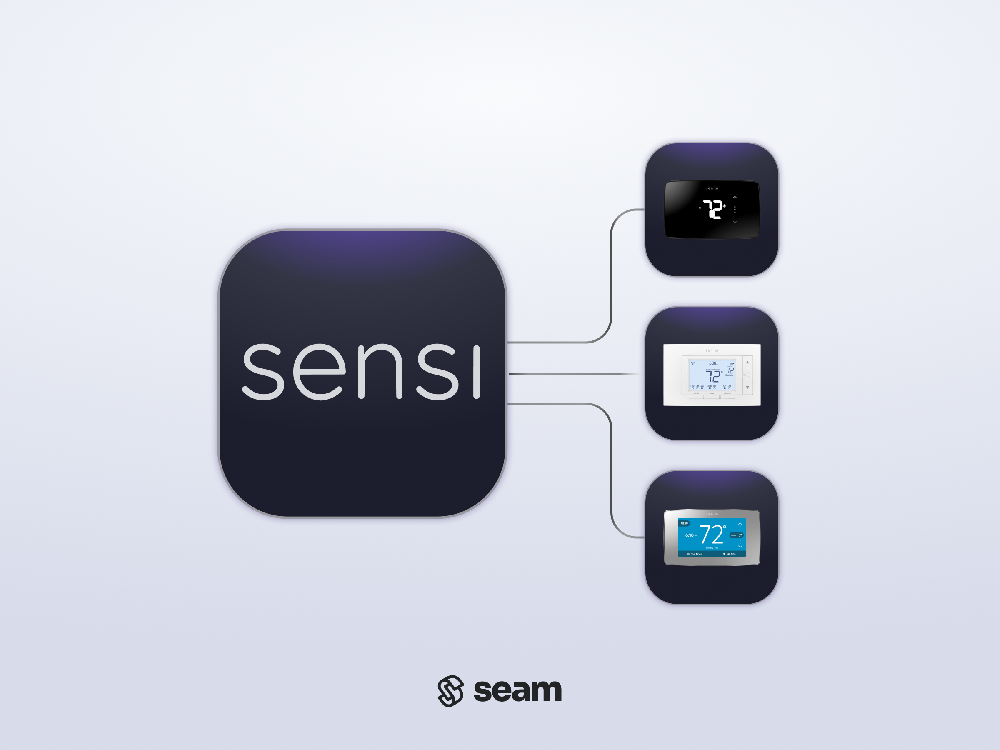

# Sensi Thermostats

<figure><picture><source srcset="../../.gitbook/assets/sensi-manufacturer-page-cover-dark.png" media="(prefers-color-scheme: dark)"></picture><figcaption>
Sensi Thermostats
</figcaption></figure>

## Overview

Sensi produces smart thermostats for home and light commercial climate control. Focusing on convenience and sustainability, Sensi thermostats provide comfort and energy efficiency features. Sensi thermostats are designed for ease of use and offer features like scheduling, energy usage reports, and geofencing to optimize home temperature management.

***

## Supported Devices

This integration supports all [Sensi thermostats](https://sensi.copeland.com/en-us/products).

For detailed information about the Sensi devices that Seam supports, see the following table and our [Sensi Supported Devices page](https://www.seam.co/manufacturers/sensi):

\{% @seam-gitbook-plugin-v2/seam-component content="" %\}

***

## Supported Features

We support the following features:

* [Configuring current thermostat settings](../../products/thermostats/configure-current-climate-settings.md)
* [Creating and managing climate presets](../../capability-guides/thermostats/creating-and-managing-climate-presets/)
* [Creating and managing thermostat schedules](../../capability-guides/thermostats/creating-and-managing-thermostat-schedules.md)
* [Setting and monitoring temperature thresholds](../../capability-guides/thermostats/setting-and-monitoring-temperature-thresholds.md)

***

### Device Provider Key

To create a [Connect Webview](../../core-concepts/connect-webviews/) that enables your users to connect their Sensi devices to Seam, include the `sensi` device provider key in the `accepted_providers` list. For more information, see [Customize the Brands to Display in Your Connect Webviews](../../core-concepts/connect-webviews/customizing-connect-webviews.md#customize-the-brands-to-display-in-your-connect-webviews).

***

## Setup Instructions

To control Sensi devices using Seam, you must prompt owners of these devices to perform the following steps:

1. Install and create an account in the Sensi [iOS](https://apps.apple.com/us/app/sensi/id792612452) or [Android](https://play.google.com/store/apps/details?id=com.asynchrony.emerson.sensi) app if you have not done so already.
2.  In the Sensi app, add your Sensi thermostats.

    The Sensi app walks you through the process of installing your Sensi thermostats and connecting them to Wi-Fi. For details, see the [Sensi installation manual](https://sensi.copeland.com/en-us/support/sensi-manuals) for your thermostat.
3. Note your login credentials for the Sensi app, and use these credentials to log in to the [Seam Connect Webview](../../core-concepts/connect-webviews/) to add your devices to Seam.


Make sure that you're authenticating with the user to whom the devices are registered. Sensi devices can only be registered to a single user.


***

## Brand-Specific Restrictions

Note the following Sensi-specific restrictions:

### Battery State

The Sensi API does not communicate the battery state of Sensi devices, so Seam cannot report the battery state for these devices. However, most Sensi thermostats are hard-wired.

### Heat-Cool Mode

Some Sensi models do not support heat-cool mode, such as the Sensi Classic and Sensi One Touch thermostats. To check whether a thermostat supports heat-cool mode, [get the device](../../products/thermostats/retrieving-thermostats.md) and look for a `device.can_hvac_heat_cool` capability flag. For more information about thermostat-related capability flags, see [Thermostat Capabilities](../../products/thermostats/#thermostat-capabilities).

***

## Where to Order

To purchase Sensi thermostats, visit the Sensi online store.

<table data-view="cards"><thead><tr><th></th><th></th><th></th><th data-hidden data-card-target data-type="content-ref"></th><th data-hidden data-card-cover data-type="files"></th></tr></thead><tbody><tr><td></td><td><strong>Sensi Online Store</strong></td><td></td><td><a href="https://sensi.copeland.com/en-us/products">https://sensi.copeland.com/en-us/products</a></td><td><a href="../../.gitbook/assets/sensi-logo.png">sensi-logo.png</a></td></tr></tbody></table>
