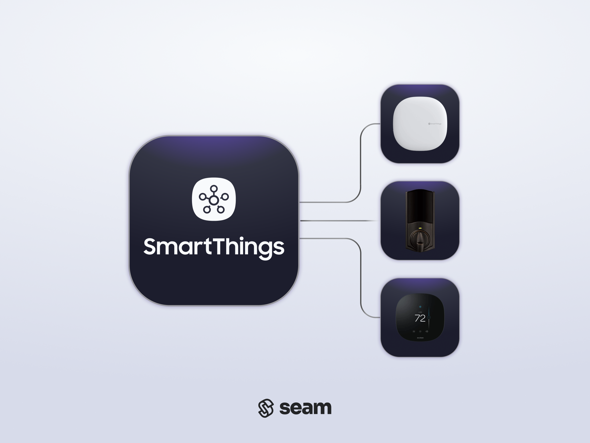

# SmartThings Hubs + Devices

<figure><picture><source srcset="../../.gitbook/assets/smartthings-manufacturer-page-cover-dark.png" media="(prefers-color-scheme: dark)"></picture><figcaption>
SmartThings-Connected Smart Locks and Thermostats
</figcaption></figure>

## Overview

Samsung SmartThings is a smart home platform that enables you to connect a variety of devices to a SmartThings Hub using Zigbee or Z-Wave. SmartThings Hubs are connected to your local network using Wi-Fi or Ethernet.

***

## Supported Devices

This integration supports smart locks and thermostats connected to a [SmartThings Hub](https://aeotec.com/where-to-buy/).

For detailed information about the SmartThings devices that Seam supports, see our [SmartThings Supported Devices page](https://www.seam.co/manufacturers/smartthings).

***

## Supported Features

We support the following features:

* [Triggering web lock and unlock actions](../../products/smart-locks/lock-and-unlock.md) on smart locks
* [Programming online access codes](../../products/smart-locks/access-codes/) on smart locks that have a connected keypad
* [Configuring current thermostat settings](../../products/thermostats/configure-current-climate-settings.md) on thermostats
* [Creating and managing climate presets](../../capability-guides/thermostats/creating-and-managing-climate-presets/) on thermostats
* [Creating and managing thermostat schedules](../../capability-guides/thermostats/creating-and-managing-thermostat-schedules.md) on thermostats
* [Setting and monitoring temperature thresholds](../../capability-guides/thermostats/setting-and-monitoring-temperature-thresholds.md) on thermostats

***

### Device Provider Key

To create a [Connect Webview](../../core-concepts/connect-webviews/) that enables your users to connect their SmartThings-connected devices to Seam, include the `smartthings` device provider key in the `accepted_providers` list. For more information, see [Customize the Brands to Display in Your Connect Webviews](../../core-concepts/connect-webviews/customizing-connect-webviews.md#customize-the-brands-to-display-in-your-connect-webviews).

***

## Setup Instructions

To control SmartThings-connected devices using Seam, you must prompt owners of these devices to perform the following steps:

1. Install and create an account in the [SmartThings app](https://www.samsung.com/us/support/owners/app/smartthings) if you have not done so already.
2. In the SmartThings app, add your devices.
3. Follow [these instructions](https://www.samsung.com/ca/support/mobile-devices/smartthings-how-to-set-up-your-hub/) to pair your devices to the SmartThings hub, .
4. Note your login credentials for the SmartThings app, and use these credentials to log in to the [Seam Connect Webview](../../core-concepts/connect-webviews/) to add your devices to Seam.

***

## Brand-Specific Restrictions

Note the following SmartThings-specific restrictions:

### Limiting Device Types to Connect

Because SmartThings supports multiple device types, you can choose which types of devices your users can connect to Seam. By default, Seam connects SmartThings locks. If you want your users to be able to connect SmartThings thermostats, use the `accepted_capabilities` parameter when creating a Connect Webview. Set this parameter to an array containing one or more of `thermostat` and `lock`. For details, see [Customize the Types of Devices to Connect](../../core-concepts/connect-webviews/customizing-connect-webviews.md#customize-the-types-of-devices-to-connect).

### Device Status Reporting

Different devices connected to SmartThings Hubs may have different levels of support for reporting their online status and other related properties.

***

## Where to Order

To purchase SmartThings Hubs, visit the Aeotek **Where to Buy?** page.

<table data-view="cards"><thead><tr><th></th><th></th><th></th><th data-hidden data-card-target data-type="content-ref"></th><th data-hidden data-card-cover data-type="files"></th></tr></thead><tbody><tr><td></td><td><strong>Aeotek Where to Buy? Page</strong></td><td></td><td><a href="https://aeotec.com/where-to-buy/">https://aeotec.com/where-to-buy/</a></td><td><a href="../../.gitbook/assets/smartthings-logo.png">smartthings-logo.png</a></td></tr></tbody></table>
