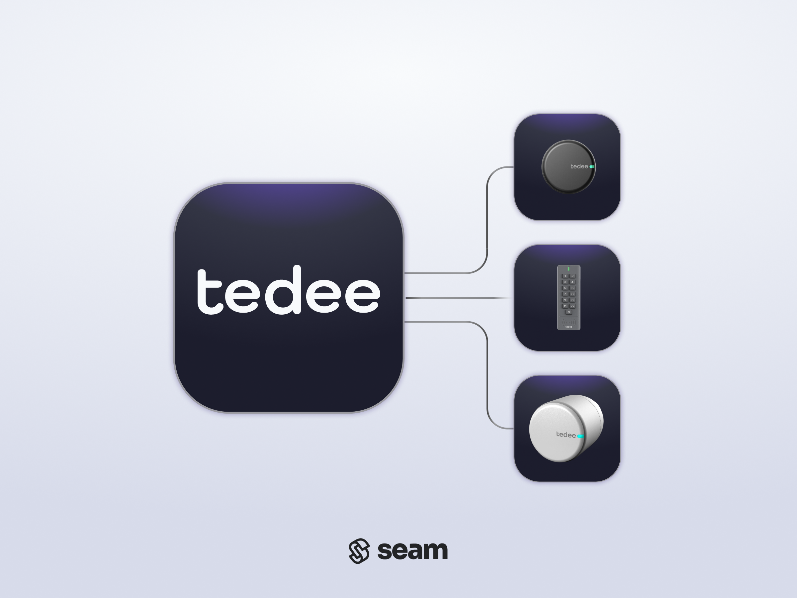

# Tedee Locks

<figure><picture><source srcset="../../.gitbook/assets/tedee-manufacturer-page-cover-dark.png" media="(prefers-color-scheme: dark)"></picture><figcaption>
Connect and control any Tedee device using the Seam API
</figcaption></figure>

## Overview

Tedee produces smart locks and accompanying products for the residential, rental, and business markets. Seam integrates with Tedee locks through the Wi-Fi-enabled Tedee smart bridge to provide app-based, remote locking and unlocking, as well as access sharing. In addition, Seam provides permanent, temporary, and scheduled access (PIN) code programming for Tedee locks with the Tedee keypad (and Tedee bridge). Tedee smart locks attach to existing locks, using either a Tedee hardware adapter or Tedee modular European cylinder.

***

## Supported Devices

This integration supports all Tedee smart lock models that are connected to Wi-Fi through the [Tedee smart bridge](https://tedee.com/product-info/bridge/#image-1). Seam also supports the addition of the optional [Tedee keypad](https://tedee.com/product-info/keypad/#image-1) to enable entering access codes to control the lock.

The following table details the requirements for compatibility with this Seam integration:

<table><thead><tr><th width="315">Capability</th><th>Required Accessories</th></tr></thead><tbody><tr><td>Remote lock/unlock</td><td><ul><li>Tedee smart bridge</li></ul></td></tr><tr><td>Access codes</td><td><ul><li>Tedee smart bridge</li><li>Tedee keypad</li></ul></td></tr></tbody></table>



We support the following features:

* [Triggering web lock and unlock actions](../../products/smart-locks/lock-and-unlock.md)
* [Programming access codes](../../products/smart-locks/access-codes/) on locks and openers that have an installed Tedee keypad

***

### Device Provider Key

To create a [Connect Webview](../../core-concepts/connect-webviews/) that enables your users to connect their Tedee devices to Seam, include the `tedee` [device provider key](../../api-clients/connect-webviews/#device-provider-keys) in the `accepted_providers` list. For more information, see [Customize the Brands to Display in Your Connect Webview](../../core-concepts/connect-webviews/customizing-connect-webviews.md#customize-the-brands-to-display-in-your-connect-webviews).

***

## Setup Instructions

To control Tedee devices using Seam, you must prompt owners of these devices to perform the following steps:

1. Create an account in the [Tedee mobile app](https://tedee.com/knowledge-base/tedee-app/) if you have not done so already.
2. In the Tedee app, add your Tedee devices.


You must add your Tedee devices through the Tedee mobile app. You cannot add devices through the Tedee web portal.


3. Note your login credentials for the Tedee app.
4. Use your credentials for the Tedee app to log in to the [Seam Connect Webview](../../core-concepts/connect-webviews/) to add your devices to Seam.

***

## Access (PIN) Code Requirements

Tedee imposes the following PIN code requirements:

* The PIN code cannot be null, empty, or whitespace.
* The PIN length must be five-eight characters.
* The PIN can contain only numeric values (0-9).
* The PIN must contain at least three different digits.
* The PIN cannot be built as an ascending or descending sequence.

***

## Where to Order

To purchase Tedee devices, visit the Tedee online store.

<table data-view="cards"><thead><tr><th></th><th></th><th></th><th data-hidden data-card-target data-type="content-ref"></th><th data-hidden data-card-cover data-type="files"></th></tr></thead><tbody><tr><td></td><td><strong>Tedee Online Store</strong></td><td></td><td><a href="https://tedee.com/shop/">https://tedee.com/shop/</a></td><td><a href="../../.gitbook/assets/tedee-logo.png">tedee-logo.png</a></td></tr></tbody></table>

***

