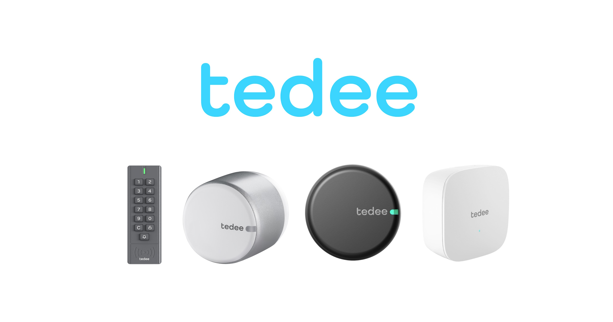
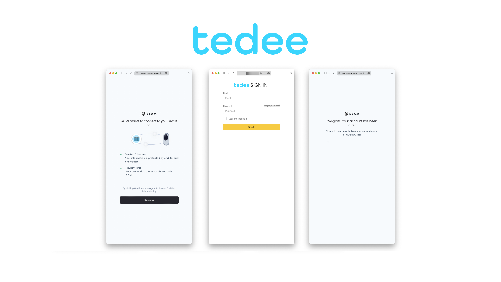

# Get Started with Tedee Locks

<figure><figcaption><p>Tedee Locks</p></figcaption></figure>

## Overview

Seam provides a universal API to connect and control many brands of locks, including Tedee. This guide provides a rapid introduction to connecting and controlling your [Tedee](https://www.seam.co/manufacturers/tedee) locks using the Seam API. To learn more about other device brands supported by the Seam API, such as Yale, Schlage, and August, head over to our [integration page](https://www.seam.co/supported-devices-and-systems).

For more details about the Seam Tedee integration, see the [Tedee locks device integration guide](./).

## 1 — Install Seam SDK

Seam provides client libraries for many languages, such as JavaScript, Python, Ruby, PHP, and others, as well as a Postman collection and [OpenAPI](https://connect.getseam.com/openapi.json) spec.

* JavaScript / TypeScript ([npm](https://www.npmjs.com/package/seam), [GitHub](https://github.com/seamapi/javascript))
* Python ([pip](https://pypi.org/project/seam/), [GitHub](https://github.com/seamapi/python))
* Ruby Gem ([rubygem](https://rubygems.org/gems/seam), [GitHub](https://github.com/seamapi/ruby))
* PHP ([packagist](https://packagist.org/packages/seamapi/seam), [GitHub](https://github.com/seamapi/php))
* C# ([nuget](https://www.nuget.org/packages/Seam), [GitHub](https://github.com/seamapi/csharp))



```bash
npm i seam
```



```bash
pip install seam
# For some development environments, use pip3 in this command instead of pip.
```



```bash
bundle add seam
```



```bash
composer require seamapi/seam
```



Install using [nuget](https://www.nuget.org/packages/Seam).



Once installed, [sign up for Seam](https://console.seam.co/) to get your [API key](../../core-concepts/authentication/api-keys.md) and export it as an environment variable.

```
$ export SEAM_API_KEY=seam_test2ZTo_0mEYQW2TvNDCxG5Atpj85Ffw
```


This guide uses a [sandbox workspace](../../core-concepts/workspaces/#sandbox-workspaces). You can only connect virtual devices in a sandbox workspace. If you need to connect a real Tedee device, use a non-sandbox workspace and API key.


## 2 — Link Your Tedee Account with Seam

To control your Tedee locks using the Seam API, you must first authorize your Seam workspace against your Tedee account. To do so, Seam provides[ Connect Webviews](../../core-concepts/connect-webviews/): pre-built UX flows that walk you through authorizing your application to control your Tedee sites.

### Request a Connect Webview



```javascript
// Use Seam SDK to create a Connect Webview with tedee as the provider
const createdConnectWebview = await seam.connectWebviews.create({
  accepted_providers: ["tedee"]
});

// Print the created webview URL
console.log(createdConnectWebview.url);
```



```python
# Create a Connect Webview with tedee as the provider
created_webview = seam.connect_webviews.create(accepted_providers=["tedee"])

# Assert that login is not yet successful
assert created_webview.login_successful is False

# Print the URL of the webview
print(created_webview.url)
```



```ruby
# Create a Connect Webview with the tedee as the provider
created_webview = seam.connect_webviews.create(accepted_providers: ["tedee"])

# The webview will not be logged in, which can be confirmed
raise 'Login should not be succesful' unless !created_webview.login_successful

# Retrieve and print out the url of the webview
puts created_webview.url
```



```php
<?php
// initiate the SDK client, you should replace this with your SDK client init portion
$seam = new SeamSeamClient("YOUR_API_KEY");

// create a Connect Webview with tedee as the provider
$connect_webview = $seam->connect_webviews->create([
  'accepted_providers' => ['tedee']
]);

// check if the login was successful
assert($connect_webview->login_successful === false);

// print the connect webview URL
print($connect_webview->url);
?>
```



### Authorize Your Workspace

Navigate to the URL returned by the Webview object. Since you are using a sandbox workspace, complete the login flow by entering the Tedee [sandbox test accounts ](../../developer-tools/sandbox-and-sample-data/sandbox-tedee-locks.md)credentials below:

* **email:** jane@example.com
* **password:** 1234

<figure><figcaption><p>Seam Connect Webview flow to connect Tedee account with Seam</p></figcaption></figure>

Confirm the Connect Webview was successful by querying its status:



```python
updated_webview = seam.connect_webviews.get(connect_webview_id: webview.connect_webview_id)

assert updated_webview.login_successful # true
```



```javascript
const updatedWebview = await seam.connectWebviews.get(
  connectWebview.connect_webview_id
)

console.log(updatedWebview.login_successful) // true
```



```ruby
updated_webview = seam.connect_webviews.get(connect_webview_id: webview.connect_webview_id)

puts updated_webview.login_successful # true
```



```php
$webview = $seam->connect_webviews->get($webview->id);
echo json_encode($webview);
```



## 3 — Retrieve Tedee Devices

After a Tedee account is linked with Seam, you can retrieve devices for this Tedee account. The Seam API exposes most of the device's properties such as battery level.



```python
all_locks = seam.locks.list()

some_lock = all_locks[0]

assert some_lock.properties["online"] is True
assert some_lock.properties["battery_level"] is True

print(some_lock)
# Device(device_id='ffc4d67f-e3a6-4ef8-ac84-f3770750422a', device_type='tedee_lock', location=None, properties={'locked': True, 'online': True, 'manufacturer': 'tedee', 'battery_level': 1, 'tedee_metadata': {'bridge_id': 1, 'device_id': 1, 'bridge_name': "Jane's Bridge", 'device_name': 'Front Door', 'device_model': 'Lock PRO', 'serial_number': '111111-11111'}, 'supported_code_lengths': [5, 6, 7, 8], 'online_access_codes_enabled': True, 'offline_access_codes_enabled': True, 'supports_offline_access_codes': True, 'name': 'Front Door', 'model': {'display_name': 'Lock PRO', 'manufacturer_display_name': 'Tedee', 'accessory_keypad_supported': False, 'offline_access_codes_supported': False, 'online_access_codes_supported': True}, 'battery': {'level': 1, 'status': 'full'}, 'image_url': 'https://connect.getseam.com/assets/images/devices/unknown-lock.png', 'image_alt_text': 'Placeholder Lock Image', 'code_constraints': [{'constraint_type': 'no_ascending_or_descending_sequence'}, {'constraint_type': 'at_least_three_unique_digits'}], 'supports_backup_access_code_pool': True}, capabilities_supported=['access_code', 'battery', 'lock'], errors=[], warnings=[], connected_account_id='f1e093d9-7a11-4d04-8c7e-619a037bd11a', workspace_id='398d80b7-3f96-47c2-b85a-6f8ba21d07be', created_at='2024-02-08T19:47:43.810Z', is_managed=True)
```



```javascript
const allLocks = await seam.locks.list()

const someLock = allLocks[0]

console.log(someLock.properties.online) // true
console.log(someLock.properties.locked) // true

console.log(someLock)
/*
{
  device_id: 'ffc4d67f-e3a6-4ef8-ac84-f3770750422a',
  device_type: 'tedee_lock',
  capabilities_supported: [ 'access_code', 'battery', 'lock' ],
  properties: {
    locked: true,
    online: true,
    manufacturer: 'tedee',
    battery_level: 1,
    tedee_metadata: {
      bridge_id: 1,
      device_id: 1,
      bridge_name: "Jane's Bridge",
      device_name: 'Front Door',
      device_model: 'Lock PRO',
      serial_number: '111111-11111'
    },
    supported_code_lengths: [ 5, 6, 7, 8 ],
    online_access_codes_enabled: true,
    offline_access_codes_enabled: true,
    supports_offline_access_codes: true,
    name: 'Front Door',
    model: {
      display_name: 'Lock PRO',
      manufacturer_display_name: 'Tedee',
      accessory_keypad_supported: false,
      offline_access_codes_supported: false,
      online_access_codes_supported: true
    },
    battery: { level: 1, status: 'full' },
    image_url: 'https://connect.getseam.com/assets/images/devices/unknown-lock.png',
    image_alt_text: 'Placeholder Lock Image',
    code_constraints: [ [Object], [Object] ],
    supports_backup_access_code_pool: true
  },
  location: null,
  connected_account_id: 'f1e093d9-7a11-4d04-8c7e-619a037bd11a',
  workspace_id: '398d80b7-3f96-47c2-b85a-6f8ba21d07be',
  created_at: '2024-02-08T19:47:43.810Z',
  errors: [],
  warnings: [],
  is_managed: true,
  custom_metadata: {}
}
*/
```



```ruby
some_lock = seam.locks.list.first

puts some_lock.properties.online # true
puts some_lock.properties.locked # true

puts some_lock

# <Seam::Device:0x00438
# device_id="ffc4d67f-e3a6-4ef8-ac84-f3770750422a"
# device_type="tedee_lock"
# capabilities_supported=["access_code", "battery", "lock"]
# properties={"locked"=>true, "online"=>true, "manufacturer"=>"tedee", "battery_level"=>1, "tedee_metadata"=>{"bridge_id"=>1, "device_id"=>1, "bridge_name"=>"Jane's Bridge", "device_name"=>"Front Door", "device_model"=>"Lock PRO", "serial_number"=>"111111-11111"}, "supported_code_lengths"=>[5, 6, 7, 8], "online_access_codes_enabled"=>true, "offline_access_codes_enabled"=>true, "supports_offline_access_codes"=>true, "name"=>"Front Door", "model"=>{"display_name"=>"Lock PRO", "manufacturer_display_name"=>"Tedee", "accessory_keypad_supported"=>false, "offline_access_codes_supported"=>false, "online_access_codes_supported"=>true}, "battery"=>{"level"=>1, "status"=>"full"}, "image_url"=>"https://connect.getseam.com/assets/images/devices/unknown-lock.png", "image_alt_text"=>"Placeholder Lock Image", "code_constraints"=>[{"constraint_type"=>"no_ascending_or_descending_sequence"}, {"constraint_type"=>"at_least_three_unique_digits"}], "supports_backup_access_code_pool"=>true}
# connected_account_id="f1e093d9-7a11-4d04-8c7e-619a037bd11a"
# workspace_id="398d80b7-3f96-47c2-b85a-6f8ba21d07be"
# created_at=2024-02-08 19:47:43.81 UTC
# errors=[]
# warnings=[]
# is_managed=true>
```




```php
use Seam\SeamClient;

$seam = new SeamClient('YOUR_API_KEY');

$locks = $seam->locks->list();

echo json_encode($locks);
/*
{"device_id":"ffc4d67f-e3a6-4ef8-ac84-f3770750422a","device_type":"tedee_lock","capabilities_supported":["access_code","battery","lock"],"properties":{"online":true,"name":"Front Door","model":{"display_name":"Lock PRO","manufacturer_display_name":"Tedee","offline_access_codes_supported":false,"online_access_codes_supported":true,"accessory_keypad_supported":false},"has_direct_power":null,"battery_level":1,"battery":{"level":1,"status":"full"},"manufacturer":"tedee","image_url":"https:\/\/connect.getseam.com\/assets\/images\/devices\/unknown-lock.png","image_alt_text":"Placeholder Lock Image","serial_number":null,"online_access_codes_enabled":true,"offline_access_codes_enabled":true,"supports_accessory_keypad":null,"supports_offline_access_codes":true,"august_metadata":null,"avigilon_alta_metadata":null,"schlage_metadata":null,"smartthings_metadata":null,"lockly_metadata":null,"nuki_metadata":null,"kwikset_metadata":null,"salto_metadata":null,"genie_metadata":null,"brivo_metadata":null,"igloo_metadata":null,"noiseaware_metadata":null,"minut_metadata":null,"four_suites_metadata":null,"two_n_metadata":null,"controlbyweb_metadata":null,"ttlock_metadata":null,"seam_bridge_metadata":null,"igloohome_metadata":null,"nest_metadata":null,"ecobee_metadata":null,"dormakaba_oracode_metadata":null,"wyze_metadata":null,"code_constraints":[{"constraint_type":"no_ascending_or_descending_sequence","min_length":null,"max_length":null},{"constraint_type":"at_least_three_unique_digits","min_length":null,"max_length":null}],"supported_code_lengths":[5,6,7,8],"max_active_codes_supported":null,"supports_backup_access_code_pool":true,"has_native_entry_events":null,"locked":true,"keypad_battery":null,"door_open":null,"temperature_fahrenheit":null,"temperature_celsius":null,"relative_humidity":null,"available_hvac_mode_settings":null,"is_heating":null,"is_cooling":null,"is_fan_running":null,"fan_mode_setting":null,"is_temporary_manual_override_active":null,"current_climate_setting":null,"is_climate_setting_schedule_active":null,"active_climate_setting_schedule":null,"min_cooling_set_point_celsius":null,"min_cooling_set_point_fahrenheit":null,"max_cooling_set_point_celsius":null,"max_cooling_set_point_fahrenheit":null,"min_heating_set_point_celsius":null,"min_heating_set_point_fahrenheit":null,"max_heating_set_point_celsius":null,"max_heating_set_point_fahrenheit":null,"min_heating_cooling_delta_celsius":null,"min_heating_cooling_delta_fahrenheit":null,"assa_abloy_credential_service_metadata":null},"location":null,"connected_account_id":"f1e093d9-7a11-4d04-8c7e-619a037bd11a","workspace_id":"398d80b7-3f96-47c2-b85a-6f8ba21d07be","errors":[],"warnings":[],"created_at":"2024-02-08T19:47:43.810Z","is_managed":true,"custom_metadata":{}}
*/
```




### 4 — Locking & Unlocking a Door

Next, you can perform the basic action of locking and unlocking a door.


[Broken link](broken-reference)


## Unlock a door

<mark style="color:green;">`POST`</mark> `https://connect.getseam.com/locks/unlock_door`

#### Request Body

| Name       | Type   | Description |
| ---------- | ------ | ----------- |
| device\_id | String |             |



```python
# lock the door
seam.locks.lock_door(device_id: some_lock.device_id)
updated_lock = seam.locks.get(device_id: some_lock.device_id)
assert updated_lock.properties["locked"] is True

# Now unlock the door
seam.locks.unlock_door(device_id: some_lock.device_id)
updated_lock = seam.locks.get(device_id: some_lock.device_id)
assert updated_lock.properties["locked"] is False
```



```javascript
// lock the door
await seam.locks.lockDoor(someLock.device_id)
const updatedLock = await seam.locks.get(someLock.device_id)
console.log(updatedLock.properties.locked) // true

// unlock the door
await seam.locks.unlockDoor(someLock.device_id)
updatedLock = await seam.locks.get(someLock.device_id)
console.log(updatedLock.properties.locked) // false
```



```ruby
# lock the door
seam.locks.lock_door(device_id: some_lock.device_id)
updated_lock = seam.locks.get(device_id: some_lock.device_id)
puts updated_lock.properties.locked # true

# unlock the door
seam.locks.unlock_door(device_id: some_lock.device_id)
updated_lock = seam.locks.get(device_id: some_lock.device_id)
puts updated_lock.properties.locked # false
```



```php
use Seam\SeamClient;

$seam = new SeamClient('YOUR_API_KEY');

$some_lock = $seam->locks->list()[0];

# unlock the door
$seam->locks->unlock_door($lock->device_id);
# lock the door
$seam->locks->lock_door($lock->device_id);
```



### 5 — Setting Access Code on Tedee Lock

Some Tedee locks also have a keypad paired to them to program access codes. These codes can then be entered to unlock a Tedee lock.

The Seam API makes it easy to program both `ongoing` codes and `timebound` codes on a Tedee lock. You can find out more about Tedee lock access code in our [core concept section on access codes.](../../products/smart-locks/access-codes/)


For Tedee-specific access code restrictions, see [Access (PIN) Code Requirements](./#access-pin-code-requirements).




```python
# create an ongoing code
seam.access_codes.create(
  device=some_lock,
  code="492332",
  name="Personal Access Code")

# create a timebound code
seam.access_codes.create(
  device=some_lock,
  code="498882",
  name="My Temp Access Code",
  starts_at="2028-08-12T19:23:42+0000",
  ends_at="2028-08-13T19:23:42+0000")

# you can use a device or a device_id as the "device" parameter
seam.access_codes.list(device=some_lock)
```



```javascript
// create an ongoing code
await seam.accessCodes.create({
  device_id: someLock.device_id,
  code: "123456",
  name: "Personal Access Code",
})

// create a timebound code
await seam.accessCodes.create({
  device_id: someLock.device_id,
  code: "888888",
  name: "My Temp Access Code",
  starts_at: "2028-11-12T19:23:42+0000",
  ends_at: "2028-11-13T19:23:42+0000",
})

// use a device_id as the "device_id" parameter
await seam.accessCodes.list({
  device_id: someLock.device_id,
})
```



```ruby
# create an ongoing code
seam.access_codes.create(
  device_id: some_lock.device_id, code: '123456', name: 'Personal Access Code'
)

# create a timebound code
seam.access_codes.create(
  device_id: some_lock.device_id,
  code: '888888',
  name: 'My Temp Access Code',
  starts_at: '2028-08-12T19:23:42+0000',
  ends_at: '2028-08-13T19:23:42+0000'
)

seam.access_codes.list(device_id: some_lock.device_id)
```



```php
use Seam\SeamClient;

$seam = new SeamClient("YOUR_API_KEY");

$some_lock = $seam->locks->list()[0];
$seam->access_codes->create(
  device_id: $some_lock->device_id, code: '123456', name: 'Personal Access Code'
);

$seam->access_codes->create(
  device_id: $some_lock->device_id,
  name: 'My Temp Access Code',
  code: '888888',
  starts_at: '2028-08-12T19:23:42+0000',
  ends_at: '2028-08-13T19:23:42+0000'
);

```



## Next Steps

Now that you've completed this guide, you can try to connect a real Tedee device. To do so, make sure to switch to a non-sandbox workspace and API key as real devices cannot be connected to sandbox workspaces.

In addition, if you'd like to explore other aspects of Seam, here is a list of helpful resources:

* [Schlage Getting Started Guide](../../device-guides/get-started-with-schlage-locks.md)
* [Yale Getting Started Guide](../../device-guides/get-started-with-yale-locks.md)
* [SmartThings Getting Started Guide](../../device-guides/get-started-with-smartthings-hubs-+-smart-locks.md)
* [Receiving webhook](../../core-concepts/webhooks.md) for [device events](../../api/events/list.md)
* [Core Concepts](../../core-concepts/overview.md)

If you have any questions or want to report an issue, email us at support@seam.co.
