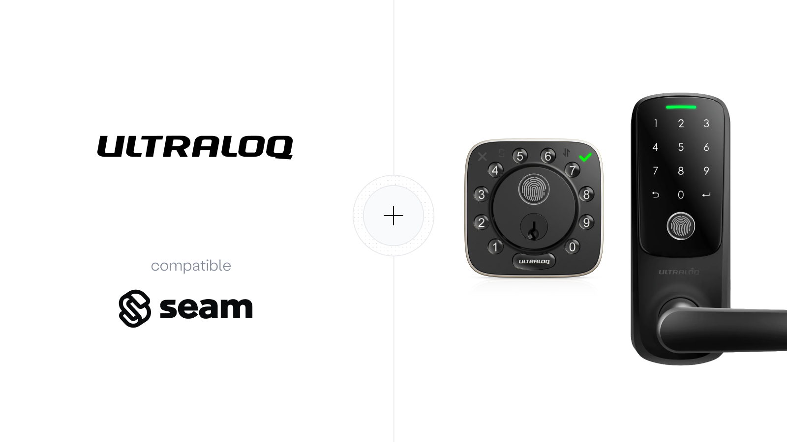

# Ultraloq Locks

<figure><figcaption><p>Connect and control Ultraloq devices using the Seam API.</p></figcaption></figure>

## Overview

Seam integrates with Ultraloq smart locks, providing Wi-Fi-enabled access control with online programming capabilities. Ultraloq locks support both permanent and time-bound access codes, remote lock and unlock operations, and device monitoring.


**Important:** Ultraloq devices require timezone configuration before you can create time-bound access codes. This is a unique requirement for Ultraloq locks. See [Configuring Ultraloq Device Timezones](configuring-ultraloq-device-timezones.md) for details.


***

## Supported Devices

All Ultraloq smart locks with Wi-Fi connectivity are supported through this integration.

For detailed information about the Ultraloq devices that Seam supports, see our [Ultraloq Supported Devices page](https://www.seam.co/manufacturers/ultraloq).

***

## Supported Features

We support the following features:

#### Device control

* Lock and unlock actions (online)

#### Access code management

* Permanent access codes (no timezone required)
* Time-bound access codes (requires timezone configuration)
* Custom code lengths between 4 and 8 digits
* Auto-generated codes

#### Device monitoring

* Lock status
* Online/offline state
* Battery level (where supported)

***

## Time Zone Requirement

Unlike most other integrations, Ultraloq devices require timezone configuration to enable time-bound access codes. This is because Ultraloq devices schedule access codes using device-local time, but the Ultraloq API does not report the device's timezone.

### What Works Without Timezone

* ✅ Permanent access codes (codes without start/end times)
* ✅ Lock and unlock operations
* ✅ Device monitoring

### What Requires Timezone

* ❌ Time-bound access codes (codes with `starts_at` and `ends_at`)

When you first connect an Ultraloq device, it will have a `ultraloq_time_zone_unknown` warning in `device.warnings`. You must configure the timezone using the `/devices/report_provider_metadata` endpoint before creating time-bound access codes.

For complete instructions, see [Configuring Ultraloq Device Timezones](configuring-ultraloq-device-timezones.md).

***

## Connecting Ultraloq to Seam

To enable your users to [connect Ultraloq devices through Connect Webviews](../../core-concepts/connect-webviews/customizing-connect-webviews.md#customize-the-brands-to-display-in-your-connect-webviews), include the Ultraloq provider:

```json
{
  "accepted_providers": ["ultraloq"]
}
```

After the user authorizes Seam through the OAuth flow, their Ultraloq devices will be automatically discovered and added to Seam.

[→ See: Ultraloq Setup Guide](ultraloq-setup-guide.md)

***

## Brand-specific notes

* **Access codes:** Ultraloq requires access codes to be 4–8 digit numeric PINs (e.g., "1234", "567890").
* **Timezone configuration:** Required before creating time-bound access codes. Permanent codes work without timezone configuration.
* **Code disabling:** Users can disable access codes through the Ultraloq mobile app. Seam detects this and adds a `ultraloq_access_code_disabled` warning to the affected access code.

***

## Next Steps

<table data-view="cards"><thead><tr><th></th><th></th><th data-hidden data-card-target data-type="content-ref"></th></tr></thead><tbody><tr><td><strong>Connect Ultraloq to Seam</strong></td><td>Follow the setup guide to connect your Ultraloq account and configure device timezones.</td><td><a href="ultraloq-setup-guide.md">ultraloq-setup-guide.md</a></td></tr><tr><td><strong>Configure Device Timezones</strong></td><td>Learn how to set device timezones to enable time-bound access codes.</td><td><a href="configuring-ultraloq-device-timezones.md">configuring-ultraloq-device-timezones.md</a></td></tr><tr><td><strong>Create Access Codes</strong></td><td>Learn how to create permanent and time-bound access codes for Ultraloq locks.</td><td><a href="creating-ultraloq-access-codes.md">creating-ultraloq-access-codes.md</a></td></tr><tr><td><strong>Order Locks</strong></td><td>Purchase Ultraloq locks from Amazon.</td><td><a href="https://www.amazon.com/stores/ULTRALOQ/page/1F5DDCF3-7F1E-4B36-8D3F-8F8C5E5A5C5F">https://www.amazon.com/stores/ULTRALOQ</a></td></tr></tbody></table>

***
