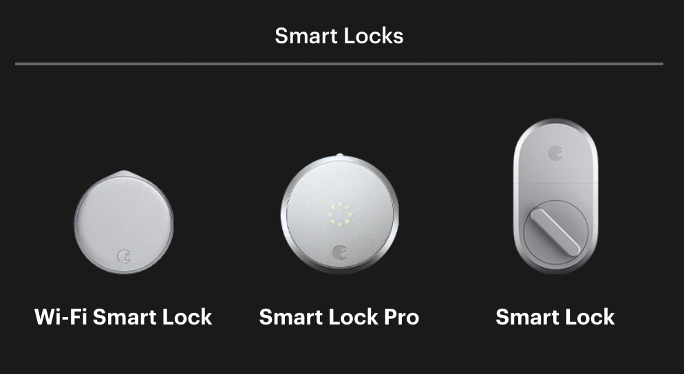
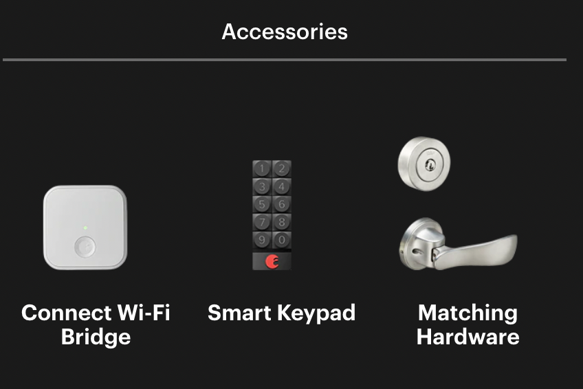

# August Locks

## Overview

August produces smart locks for the residential market. Seam integrates directly with the August Wi-Fi Smart Lock, as well as with additional August Smart Locks through the August Connect® Wi-Fi Bridge. In addition, Seam supports the August Smart Keypad accessory.

Each August lock attaches to an existing deadbolt, replacing only the lock component on the inside of a door. Consequently, August locks do not change the exterior of locks, and the existing physical keys still work with installed August locks.&#x20;

***

## Supported Devices

This integration supports all August Smart Lock models that are connected to Wi-Fi, either through built-in Wi-Fi or using the [August Connect Wi-Fi Bridge](https://august.com/products/august-connect). Seam also supports the addition of the optional [August Smart Keypad](https://august.com/products/august-smart-keypad) to enable entering access codes to control the lock.

<figure><figcaption></figcaption></figure>

<figure><figcaption></figcaption></figure>

The following table details the requirements for compatibility with this Seam integration:

<table><thead><tr><th width="187.33333333333331">Product Models</th><th>Compatibility</th><th>Accessories</th></tr></thead><tbody><tr><td><a href="https://august.com/products/august-wifi-smart-lock">Wi-Fi Smart Lock</a></td><td>Compatible</td><td><ul><li>Smart Keypad (optional)</li></ul></td></tr><tr><td><a href="https://august.com/products/august-smart-lock-pro-connect">Smart Lock Pro</a></td><td>Compatible only with Connect Wi-Fi Bridge</td><td><ul><li>Connect Wi-Fi Bridge</li><li>Smart Keypad (optional)</li></ul></td></tr><tr><td><a href="https://august.com/products/august-smart-lock-connect">Smart Lock</a></td><td>Compatible only with Connect Wi-Fi Bridge</td><td><ul><li>Connect Wi-Fi Bridge</li><li>Smart Keypad (optional)</li></ul></td></tr></tbody></table>



We support the following features:

* [Triggering web lock and unlock actions](../products/smart-locks/lock-and-unlock.md)
* [Programming access codes](../products/smart-locks/access-codes/) on locks that have an installed August Smart Keypad

***

### Device Provider Key

To create a [Connect Webview](../core-concepts/connect-webviews/) that enables your users to connect their August devices to Seam, include the `august` [device provider key](../api-clients/connect-webviews/#device-provider-keys) in the `accepted_providers` list. For more information, see [Customize the Brands to Display in Your Connect Webview](../core-concepts/connect-webviews/customizing-connect-webviews.md#customize-the-brands-to-display-in-your-connect-webviews).

***

## Setup Instructions

To control August devices using Seam, you must prompt owners of these devices to perform the following steps:

1. Create an account in the [August Home App](https://august.com/pages/app) if you have not done so already.
2. In the August Home App, add your August devices.
3. Note your login credentials for the August Home App, and use these credentials to log in to the [Seam Connect Webview](../core-concepts/connect-webviews/) to add your devices to Seam.

***

## Brand-Specific Errors

The following access code errors might appear for an August lock:

<table data-full-width="true"><thead><tr><th width="384">Error</th><th>Description</th></tr></thead><tbody><tr><td><code>august_device_programming_delay</code></td><td>August has acknowledged a request to program the code, but the access code has not yet been moved fully to the device. The device likely has an unstable internet connection. Seam continues to try to set the code on the device.</td></tr><tr><td><code>august_device_slots_full</code></td><td>All access code slots on the device are full.</td></tr><tr><td><code>august_lock_bad_access_code_format</code></td><td>The access code format is incorrect.</td></tr><tr><td><code>august_lock_missing_keypad</code></td><td>The August lock is missing a keypad.</td></tr><tr><td><code>august_lock_temporarily_offline</code></td><td>The August lock was temporarily offline while setting or removing a code. The code should be set removed when the lock comes back online.</td></tr></tbody></table>

***

## Where to Order

Order August locks and accessories directly from the August website or from Amazon.

<table data-view="cards"><thead><tr><th></th><th></th><th></th><th data-hidden data-card-target data-type="content-ref"></th><th data-hidden data-card-cover data-type="files"></th></tr></thead><tbody><tr><td></td><td><strong>August</strong></td><td></td><td><a href="https://august.com/">https://august.com/</a></td><td><a href="../.gitbook/assets/august-logo.png">august-logo.png</a></td></tr><tr><td></td><td><strong>August Products on Amazon</strong></td><td></td><td><a href="https://amzn.to/3sVFNTl">https://amzn.to/3sVFNTl</a></td><td><a href="../.gitbook/assets/august-on-amazon.png">august-on-amazon.png</a></td></tr></tbody></table>

***

