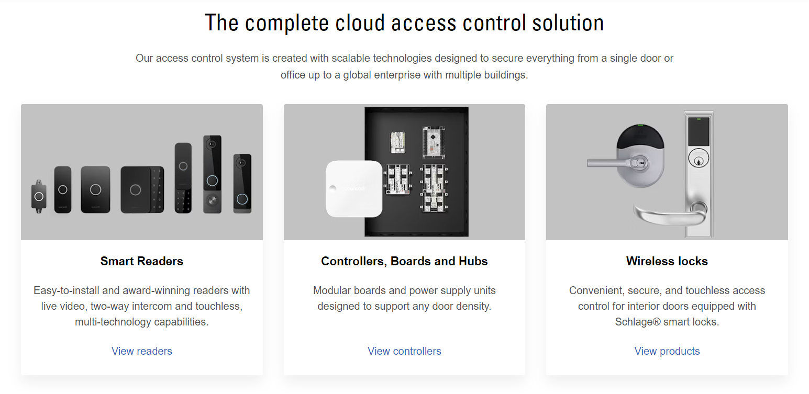

# Avigilon Alta Access System

## Overview

Seam integrates with the Avigilon Alta access system that provides cloud-based access control for a variety of industries, including corporate, commercial, hospitality, multifamily residential, and others. With support for doors, elevators, turnstiles, and gates, the Avigilon Alta access control system enables you to secure a single building or multiple buildings using the same system. Further, users need only a single credential for all doors and access points.

***

## Supported Devices

This integration supports [all readers, controllers, and wireless locks connected to the Avigilon Alta platform](https://www.avigilon.com/access-control/cloud).

<figure><figcaption></figcaption></figure>

For detailed information about the Avigilon Alta-connected devices that Seam supports, see our [Avigilon Alta Supported Devices page](https://www.seam.co/manufacturers/avigilon-alta).

***

## Supported Features

We support the following features:

* [Triggering web lock and unlock actions](../products/smart-locks/lock-and-unlock.md)

***

### Device Provider Key

To create a [Connect Webview](../core-concepts/connect-webviews/) that enables you to connect your Avigilon Alta access system and devices to Seam, include the `avigilon_alta` device provider key in the `accepted_providers` list. For more information, see [Customize the Brands to Display in Your Connect Webviews](../core-concepts/connect-webviews/customizing-connect-webviews.md#customize-the-brands-to-display-in-your-connect-webviews).

***

## Setup Instructions

To control Avigilon Alta-connected devices using Seam, you must prompt owners of these devices to perform the following steps:

1. Obtain and note the credentials for a user within the Avigilon Alta organization to which you want to connect.
2. In a web browser, navigate to and log in to your [Avigilon Alta dashboard](https://control.openpath.com/login).
3.  In the settings for the user, verify the user's permissions as follows:

    1. Make sure that **Portal access** is selected (enabled).
    2. Make sure that the **Roles** for the user include **Super Admin**.

    <figure><figcaption></figcaption></figure>
4. Use the credentials for the user to log in to the [Seam Connect Webview](../core-concepts/connect-webviews/) to add your Avigilon Alta access system and devices to Seam.

***

## Where to Order

To purchase the Avigilon Alta access system and devices, request a quote from Avigilon.

<table data-view="cards"><thead><tr><th></th><th></th><th></th><th data-hidden data-card-target data-type="content-ref"></th><th data-hidden data-card-cover data-type="files"></th></tr></thead><tbody><tr><td></td><td><strong>Avigilon Quote Request</strong></td><td></td><td><a href="https://www.avigilon.com/quote">https://www.avigilon.com/quote</a></td><td><a href="../.gitbook/assets/avigilon-alta-logo.png">avigilon-alta-logo.png</a></td></tr></tbody></table>

***
