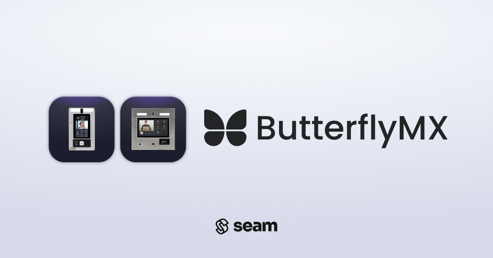

# ButterflyMX Intercoms

<figure><figcaption></figcaption></figure>

## Overview

ButterflyMX offers internet-connected video intercoms for multi-family apartment buildings, as well as additional access-related products to streamline access to apartment buildings for staff, service providers, and residents. While the Seam API can be used to control ButterflyMX intercoms, you must first obtain an API key from ButterflyMX. For details on this, please see the [Requesting API Access from ButterflyMX](butterflymx-intercoms.md#requesting-api-access-from-butterflymx) section below.&#x20;

## Supported Devices

## Requesting API Access from ButterflyMX

ButterflyMX does not participate in Seam's Instant Connection Alliance which ensures instant and secure connection of any IoT device or system to Seam.

As such, in order to control a ButterflyMX intercom system via Seam, you must first obtain an API key from ButterflyMX. This requires contacting ButterflyMX, accepting their API/SDK License Agreement, and completing their application certification process. Note that you may be required to purchase ButterflyMX's base Intercom model in order to demonstrate the functions of your application. Overall, this application and approval process takes approximately 4-8 weeks.


ButterflyMX reserves the right to deny your request for integration at any time and for any reason. Ensure ahead of time with your ButterflyMX counterpart that your application and its intended use&#x20;


#### Initiating Process

To start, you will need to contact ButterflyMX's head of business development. Your Seam contact will provide you with their contact information. You can use the template email below.

> **Subject:** Request for ButterflyMX Integration
>
> \
> Hello,
>
> My name is \[INSERT NAME], representing \[INSERT COMPANY NAME]. We specialize in developing \[INSERT SOFTWARE CATEGORY TYPE, e.g., PMS]. Some of our clients who use ButterflyMX systems have expressed a keen interest in enabling our application to \[INSERT DESIRED FUNCTIONALITY] seamlessly with ButterflyMX.
>
> We would like to initiate the integration process with ButterflyMX. We will be using Seam for the API integration itself to accelerate development but need to obtain an API key first.&#x20;
>
> Could you please share the requisite information and any initial steps we should take to kick off this integration process? We'd appreciate your guidance.
>
> Warm regards,
>
> \[YOUR NAME]
>
> \[YOUR TITLE/POSITION]
>
> \[INSERT COMPANY NAME]

**ButterflyMX Sandbox Access**

You will initially only be provided with sandbox API keys to ButterflyMX. You may also be required to purchase a ButterflyMX system and create a (paid) account to test and validate your integration.

**Loading API Keys into Seam**

Once you have obtained your API key from ButterflyMX, add it to your workspace environment. Select one of the prefilled option `BUTTERFLY_API_TOKEN` and paste it there. Your token will be securely stored inside of your workspace’s vault. If you are unsure how to complete this process, please contact a Seam representative and we can assist you in loading your ButterflyMX API key into your workspace.

#### OAuth Setup

ButterflyMX uses OAuth to securely authorize your application to control your customers' ButterflyMX systems. During the OAuth setup, you will be required to provide a redirect URL for ButterflyMX to give you an authorization token for the authorized account. You can either provide your own URL and pass this authorization token after the fact, or provide a Seam redirect URL that will directly transmit this authorization token to Seam. Please request this redirect URL from Seam. &#x20;

#### Final Certification

A member of ButterflyMX’s team will review your application end-to-end to ensure that is in compliance with their policies. Once your API key is approved for production, you will be able to connect your customers' ButterflyMX systems using Seam.&#x20;

