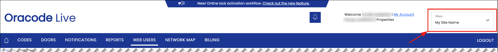

# Dormakaba Oracode Locks

## Overview

Seam integrates with the dormakaba [Oracode Live](https://www.dormakaba.com/us-en/offering/products/vacation-short-term-rental-solutions/access-control-management/oracode-live--ka_128503) access control management platform. Intended for the vacation and short-term rental industries, the Oracode Live platform supports a "no keys, no cards" concept for efficient and secure access. Further, with the Oracode Live platform, codes expire automatically at the end of the authorized period.

The Seam integration supports the generation of [offline access codes for dormakaba Oracode locks](../device-and-system-integration-guides/dormakaba-oracode-locks/creating-dormakaba-oracode-offline-access-codes.md).

You can use a variety of dormakaba Oracode smart locks with the Oracode Live platform. These strong and durable locks have commercial-grade finishes to withstand a wide range of climates.

***

## Supported Devices

This integration supports all locks connected using the [Oracode Live](https://www.dormakaba.com/us-en/offering/products/vacation-short-term-rental-solutions/access-control-management/oracode-live--ka_128503) platform. This integration supports [offline access code](../device-and-system-integration-guides/dormakaba-oracode-locks/creating-dormakaba-oracode-offline-access-codes.md) provisioning for applicable dormakaba Oracode devices.

For detailed information about the dormakaba Oracode devices that Seam supports, see our [dormakaba Supported Devices page](https://www.seam.co/manufacturers/dormakaba).

***

## Supported Features

We support the following features:

* [Programming offline access codes](../products/smart-locks/access-codes/offline-access-codes.md)

***

### Device Provider Key

To create a [Connect Webview](../core-concepts/connect-webviews/) that enables your users to connect their dormakaba Oracode devices to Seam, include the `dormakaba_oracode` device provider key in the `accepted_providers` list. For more information, see [Customize the Brands to Display in Your Connect Webviews](../core-concepts/connect-webviews/customizing-connect-webviews.md#customize-the-brands-to-display-in-your-connect-webviews).

***

## Setup Instructions

To control dormakaba Oracode devices using Seam, you must prompt **the owners or managers of these devices** to perform the following steps:

1. Identify each dormakaba Oracode site that you want to connect to Seam.\
   For each site:
   * Log in to your [Oracode Live account](https://www.kabaecodewireless.com).
   *   Note your site name, as shown in the upper-right corner of the Oracode Live portal.

       <figure><figcaption>
Note your site name in the Oracle Live portal.
</figcaption></figure>
2.  Contact [dormakaba Oracode Support](mailto:oracode@dormakaba.com) to connect all your dormakaba Live Services sites to Seam.\
    You can use the following sample email message:

    > _Please connect the following sites to the Seam Access Token:_
    >
    > * _{Insert Site Name}_
    > * _{Insert Site Name}_
    > * _..._

    Once dormakaba Oracode has connected your dormakaba Live Services sites to Seam, proceed to the next step.
3. Use a [Seam Connect Webview](../core-concepts/connect-webviews/) to add your dormakaba Oracode devices to Seam.\
   In the Connect Webview:
   * Type your dormakaba Oracode username and a comma-separated list of the dormakaba Oracode sites that you want to connect to Seam.
   * For each site that you have listed, select the time zone in which the site is located.\
     All time zone configuration and display for dormakaba Oracode locks occur in the local time zone of the lock, itself. Consequently, when you configure an access code for a dormakaba Oracode lock, you must set the starting and ending times to match the relative local time zone of the lock.\
     When connecting a dormakaba Oracode site to Seam, it is imperative to specify the correct time zone for each site to ensure that access codes for the devices in the site start and end at the correct times. For example, if you select `America/New York` as the time zone for your site, but your building is actually in `America/Los Angeles`, your access code validity periods will be off by three hours.
4. Contact [support@getseam.com](mailto:support@getseam.co) to request approval and activation of your dormakaba Oracode integration with Seam.


It is important to understand that the developer presents the Connect Webview to the device owner or manager, and the device owner or manager types the requested information in the Connect Webview to authorize Seam to control their devices.


***

## Where to Order

To purchase dormakaba Oracode devices, contact the dormakaba Sales team using the dormakaba **Contact** page or order Oracode Live locks from GoKeyless.

<table data-view="cards"><thead><tr><th></th><th></th><th></th><th data-hidden data-card-target data-type="content-ref"></th><th data-hidden data-card-cover data-type="files"></th></tr></thead><tbody><tr><td></td><td><strong>dormakaba Contact Page</strong></td><td></td><td><a href="https://www.dormakaba.com/us-en/contact">https://www.dormakaba.com/us-en/contact</a></td><td><a href="../.gitbook/assets/dormakaba-logo.png">dormakaba-logo.png</a></td></tr><tr><td></td><td><strong>GoKeyless</strong></td><td></td><td><a href="https://www.gokeyless.com/shop/advertised/oracode-i-series-locks/">https://www.gokeyless.com/shop/advertised/oracode-i-series-locks/</a></td><td><a href="../.gitbook/assets/gokeyless-logo.png">gokeyless-logo.png</a></td></tr></tbody></table>

***
