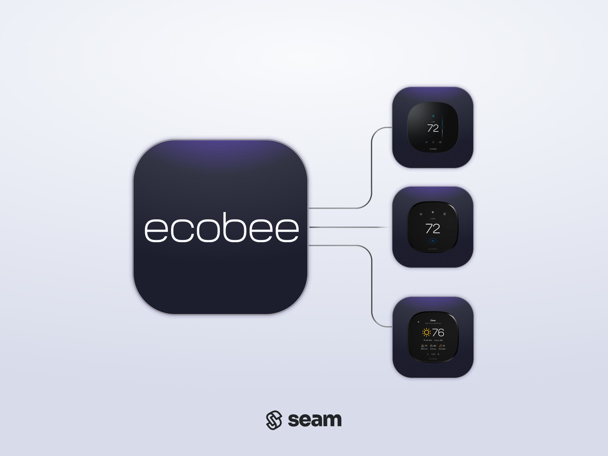

# ecobee Thermostats

<figure><picture><source srcset="../.gitbook/assets/ecobee-manufacturer-page-cover-dark.png" media="(prefers-color-scheme: dark)"></picture><figcaption>
ecobee Thermostats
</figcaption></figure>

## Overview

ecobee smart thermostats are designed to lower energy costs. In addition to energy efficiency features, such as climate setting scheduling, occupancy sensors, and automatic air conditioning pause when a window or door is left open, ecobee thermostats are hard-wired, instead of battery-powered, for reliability.

***

## Supported Devices

This integration supports all [ecobee thermostats](https://www.ecobee.com/en-us/smart-thermostats/).

For detailed information about the ecobee devices that Seam supports, see the following table and our [ecobee Supported Devices page](https://www.seam.co/manufacturers/ecobee):



***

## Supported Features

We support the following features:

* [Configuring current thermostat settings](../products/thermostats/configure-current-climate-settings.md)
* [Creating and managing climate presets](../capability-guides/thermostats/creating-and-managing-climate-presets/)
* [Creating and managing thermostat schedules](../capability-guides/thermostats/creating-and-managing-thermostat-schedules.md)
* [Setting and monitoring temperature thresholds](../capability-guides/thermostats/setting-and-monitoring-temperature-thresholds.md)

***

### Device Provider Key

To create a [Connect Webview](../core-concepts/connect-webviews/) that enables your users to connect their ecobee devices to Seam, include the `ecobee` device provider key in the `accepted_providers` list. For more information, see [Customize the Brands to Display in Your Connect Webviews](../core-concepts/connect-webviews/customizing-connect-webviews.md#customize-the-brands-to-display-in-your-connect-webviews).

***

## Setup Instructions

To control ecobee devices using Seam, you must prompt owners of these devices to perform the following steps:

1. Create an account in the [ecobee app](https://www.ecobee.com/en-us/installation/) if you have not done so already.
2. In the ecobee app, add your ecobee thermostats.
3. Note your login credentials for the ecobee app, and use these credentials to log in to the [Seam Connect Webview](../core-concepts/connect-webviews/) to add your devices to Seam.


Make sure that you're authenticating with the user to whom the devices are registered. ecobee devices can only be registered to a single user.


***

## Where to Order

To purchase ecobee thermostats, visit the ecobee online store.

<table data-view="cards"><thead><tr><th></th><th></th><th></th><th data-hidden data-card-target data-type="content-ref"></th><th data-hidden data-card-cover data-type="files"></th></tr></thead><tbody><tr><td></td><td><strong>ecobee Online Store</strong></td><td></td><td><a href="https://www.ecobee.com/en-us/smart-thermostats/">https://www.ecobee.com/en-us/smart-thermostats/</a></td><td><a href="../.gitbook/assets/ecobee-logo.png">ecobee-logo.png</a></td></tr></tbody></table>

***
