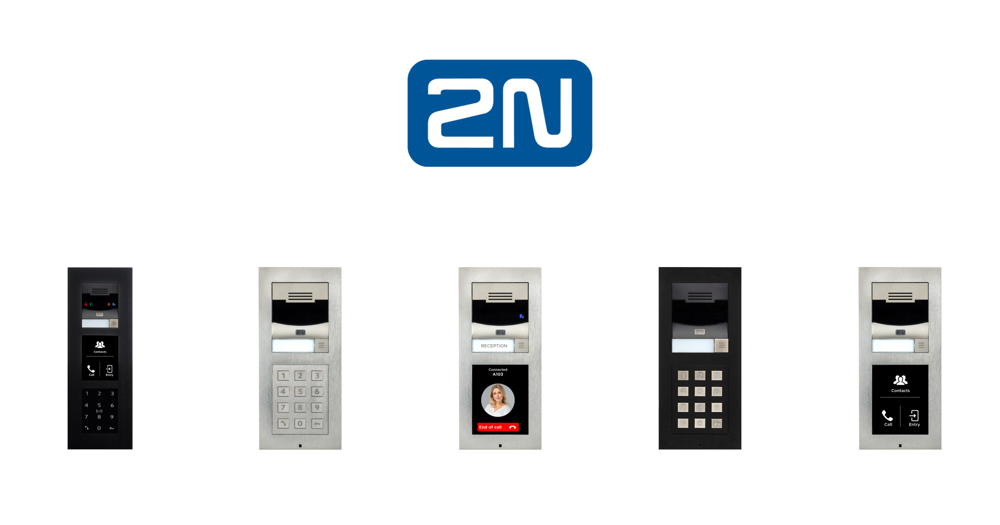
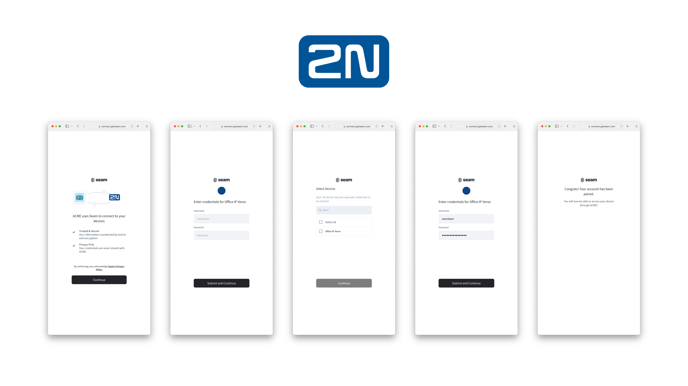

# Get started with 2N Intercoms

<figure><figcaption><p>2N Intercoms</p></figcaption></figure>

## Overview

Seam provides a universal API to connect and control many brands of smart devices. This guide provides a rapid introduction to connecting and controlling your [2N](https://www.seam.co/manufacturers/2n) intercom using the Seam API. To learn more about other smart device brands supported by Seam such as Yale, Schlage, and August, head over to our [integration page](https://www.seam.co/supported-devices-and-systems).


2N devices are currently required to be connected to the My2N cloud service to be controlled via Seam. If you are unable or do not wish to connect your 2N device to My2N, please [contact us](https://www.seam.co/contact-us) to discuss alternative options.


## 1 — Install Seam SDK

Seam provides client libraries for many languages, such as JavaScript, Python, Ruby, PHP, and others, as well as a Postman collection and [OpenAPI](https://connect.getseam.com/openapi.json) spec.

* JavaScript / TypeScript ([npm](https://www.npmjs.com/package/seam), [GitHub](https://github.com/seamapi/javascript))
* Python ([pip](https://pypi.org/project/seam/), [GitHub](https://github.com/seamapi/python))
* Ruby Gem ([rubygem](https://rubygems.org/gems/seamapi), [GitHub](https://github.com/seamapi/ruby))
* PHP ([packagist](https://packagist.org/packages/seamapi/seam), [GitHub](https://github.com/seamapi/php))
* Java ([GitHub](https://github.com/seamapi/java))
* C# ([nuget](https://www.nuget.org/packages/Seam), [GitHub](https://github.com/seamapi/csharp))
* Go ([GitHub](https://github.com/seamapi/go))



```bash
npm i seam
```



```bash
pip install seam
# For some development environments, use pip3 in this command instead of pip.
```



```bash
bundle add seamapi
```



```bash
composer require seamapi/seam
```



**Gradle:**

```gradle
// build.gradle
dependencies {
    implementation 'io.github.seamapi:java:0.x.x'
}
```

**Maven:**

```xml
<!-- pom.xml -->
<dependency>
    <groupId>io.github.seamapi</groupId>
    <artifactId>java</artifactId>
    <version>0.x.x</version>
</dependency>
```



Install using [nuget](https://www.nuget.org/packages/Seam).



```bash
go get github.com/seamapi/go
```



Once installed, [sign-up for Seam](https://console.seam.co/) to get your API key, and export it as an environment variable:

```
$ export SEAM_API_KEY=seam_test2ZTo_0mEYQW2TvNDCxG5Atpj85Ffw
```


This guide uses a Sandbox Workspace. Only virtual devices can be connected. If you need to connect a real device, use a non-sandbox workspace and API key.


## 2 — Link My2N Account with Seam

To control your 2N intercom via the Seam API, you must first authorize your Seam workspace against your My2N account. To do so, Seam provides [Connect Webviews](../core-concepts/connect-webviews/): pre-built UX flows that walk you through authorizing your application to control your 2N intercom.

#### Request a Connect Webview



```python
from seam import Seam

seam = Seam()

webview = seam.connect_webviews.create(accepted_providers=["my_2n"])

assert webview.login_successful is False

# Send the webview URL to your user
print(webview.url)
```



```javascript
import { Seam } from 'seam'

const seam = new Seam()

const connectWebview = await seam.connectWebviews.create({
  accepted_providers: ['my_2n'],
})

console.log(connectWebview.login_successful) // false

// Send the webview URL to your user
console.log(connectWebview.url)
```



```ruby
require "seamapi"

seam = Seam::Client.new(api_key: "MY_API_KEY")

webview = seam.connect_webviews.create(
  accepted_providers: ["my_2n"]
)

puts webview.login_successful # false

# Send the webview URL to your user
puts webview.url
```



```php
use Seam\SeamClient;

$seam = new SeamClient("YOUR_API_KEY");

$webview = $seam->connect_webviews->create(
  accepted_providers: ["my_2n"]
);

echo json_encode($webview)
```



#### Authorize Your Workspace

Navigate to the URL returned by the Webview object. Since you are using a sandbox workspace, complete the login flow by entering the My2N [sandbox test account](sandbox-and-sample-data/2n-intercoms-sample-data.md) credentials below:

* **email:** jane@example.com
* **password:** 1234

After entering the credentials for My2N, you'll have to enter the credentials of an existing HTTP user on each device you want to connect. All sandbox devices have a single HTTP user with the credentials:

* **username:** jane
* **password:** 1234

<figure><figcaption><p>Seam Connect Webview flow to connect My2N account with Seam</p></figcaption></figure>

Confirm the Connect Webview was successful by querying its status:



```python
updated_webview = seam.connect_webviews.get(webview.connect_webview_id)

assert updated_webview.login_successful # true
```



```javascript
const updatedWebview = await seam.connectWebviews.get(
  connectWebview.connect_webview_id,
)

console.log(updatedWebview.login_successful) // true
```



```ruby
updated_webview = seam.connect_webviews.get(webview.connect_webview_id)

puts updated_webview.login_successful # true
```



```php
$webview = $seam->connect_webviews->get($webview->id);
echo json_encode($webview);
```



## 3 — Retrieve My2N Devices

After a My2N account is linked with Seam, you can retrieve devices for this My2N account. 2N devices are represented as locks.



````python
all_locks = seam.locks.list()

some_lock = all_locks[0]

assert some_lock.properties["online"] is True
assert some_lock.properties["locked"] is True

print(some_lock)
```python
# Device(
#   device_id='f0c074d6-34d0-4910-a16a-dfe078d5d178',
#   device_type='two_n_intercom',
#   location=None,
#   properties={
#     'locked': True,
#     'online': True,
#     'manufacturer': 'two_n',
#     'serial_number': '4c0e6e72-81da-48af-8825-ed92a6fb8186',
#     'two_n_metadata': {
#       'device_id': 1,
#       'device_name': 'Device 0'
#     },
#     'supported_code_lengths': [4, 5, 6, 7, 8],
#     'name': 'Device 0',
#     'image_url': 'http://localhost:3020/assets/images/devices/unknown-lock.png',
#     'image_alt_text': 'Placeholder Lock Image'
#   },
#   capabilities_supported=['access_code', 'lock'],
#   errors=[]
# )
````



```javascript
const allLocks = await seam.locks.list()

const someLock = allLocks[0]

console.log(someLock.properties.online) // true
console.log(someLock.properties.locked) // true

console.log(someLock)
/*
{
  device_id: 'f0c074d6-34d0-4910-a16a-dfe078d5d178',
  device_type: 'two_n_intercom',
  capabilities_supported: [ 'access_code', 'lock' ],
  properties: {
    locked: true,
    online: true,
    manufacturer: 'two_n',
    serial_number: '4c0e6e72-81da-48af-8825-ed92a6fb8186',
    two_n_metadata: { device_id: 1, device_name: 'Device 0' },
    supported_code_lengths: [ 4, 5, 6, 7, 8 ],
    name: 'Device 0',
    image_url: 'http://localhost:3020/assets/images/devices/unknown-lock.png',
    image_alt_text: 'Placeholder Lock Image'
  },
  location: null,
  connected_account_id: '273b8072-c2c0-48ba-be17-2ec112276fca',
  workspace_id: 'e13ac83b-7150-4bf7-9229-6affd885c1d9',
  created_at: '2023-05-03T20:58:28.520Z',
  errors: [],
  warnings: []
}
*/
```



```ruby
some_lock = seam.locks.list.first

puts some_lock.properties['online'] # true
puts some_lock.properties['locked'] # true

puts some_lock.inspect # > #   warnings=[] #   errors=[] #   created_at=2023-05-03 18:01:16.965 UTC #   } #     "image_alt_text"=>"Placeholder Lock Image" #     "image_url"=>"https://connect.getseam.com/assets/images/devices/unknown-lock.png", #     "name"=>"Device 0", #     "supported_code_lengths"=>[4, 5, 6, 7, 8], #     }, #       "device_name"=>"Device 0" #       "device_id"=>1, #     "two_n_metadata"=>{ #     "serial_number"=>"ef730e77-8cc0-4290-a818-14388e9fe84f", #     "manufacturer"=>"two_n", #     "locked"=>true, #     "online"=>true, #   properties={ #   device_type="two_n_intercom" #   device_id="580365be-4f0f-42d9-9336-07f0bba09e28" # <Seam::Device:0x00c8bb8
```



```php
use Seam\SeamClient;

$seam = new SeamClient('YOUR_API_KEY');

$locks = $seam->locks->list();

echo json_encode($locks);
```



## 4 — Locking & Unlocking a Door

Next, you can perform the basic action of locking and unlocking the door.


[openapi.json](../.gitbook/assets/openapi.json)


## Unlock a door

<mark style="color:green;">`POST`</mark> `https://connect.getseam.com/locks/unlock_door`

#### Request Body

| Name       | Type   | Description |
| ---------- | ------ | ----------- |
| device\_id | String |             |



```python
# lock the door
seam.locks.lock_door(some_lock)
updated_lock = seam.locks.get(some_lock.device_id)
assert updated_lock.properties["locked"] is True

# Now unlock the door
seam.locks.unlock_door(some_lock)
updated_lock = seam.locks.get(some_lock.device_id)
assert updated_lock.properties["locked"] is False
```



```javascript
// lock the door
await seam.locks.lockDoor(someLock.device_id)
const updatedLock = await seam.locks.get(someLock.device_id)
console.log(updatedLock.properties.locked) // true

// unlock the door
await seam.locks.unlockDoor(someLock.device_id)
updatedLock = await seam.locks.get(someLock.device_id)
console.log(updatedLock.properties.locked) // false
```



```ruby
# lock the door
seam.locks.lock_door(some_lock)
updated_lock = seam.locks.get(some_lock.device_id)
puts updated_lock.properties['locked'] # true

# unlock the door
seam.locks.unlock_door(some_lock)
updated_lock = seam.locks.get(some_lock.device_id)
puts updated_lock.properties['locked'] # false
```



```php
use Seam\SeamClient;

$seam = new SeamClient('YOUR_API_KEY');

$some_lock = $seam->locks->list()[0];

# unlock the door
$seam->locks->unlock_door($lock->device_id);
# lock the door
$seam->locks->lock_door($lock->device_id);
```



## 5 — Creating Access Codes on 2N Intercoms

2N devices have a directory with residents. These residents can be assigned PIN codes to unlock the door.

Seam maps these residents to [access codes](../products/smart-locks/access-codes/) and allows you to create and manage them through the Seam API.



```python
# create an ongoing code
seam.access_codes.create(
    device=some_lock, code="123456", name="Personal Access Code"
)

# create a timebound code
seam.access_codes.create(
    device=some_lock,
    code="888888",
    name="My Temp Access Code",
    starts_at="2028-08-12T19:23:42+0000",
    ends_at="2028-08-13T19:23:42+0000"
)

# you can use a device or a device_id as the "device" parameter
seam.access_codes.list(device=some_lock)
# [
#   AccessCode(
#     access_code_id='af5272b1-2a49-4eb5-9388-2447fc7b5bd1',
#     type='ongoing',
#     code='123459'
#   ),
#   AccessCode(
#     access_code_id='8c2db4da-b137-4c08-a2c3-d611e6ff91b3',
#     type='timebound',
#     code='888888',
#     starts_at='2028-08-12T19:24:00.000Z',
#     ends_at='2028-08-13T19:24:00.000Z',
#   )
# ]

```



```javascript
// create an ongoing code
await seam.accessCodes.create({
  device_id: someLock.device_id,
  code: '123456',
  name: 'Personal Access Code',
})

// create a timebound code
await seam.accessCodes.create({
  device_id: someLock.device_id,
  code: '888888',
  name: 'My Temp Access Code',
  starts_at: '2028-11-12T19:23:42+0000',
  ends_at: '2028-11-13T19:23:42+0000',
})

// use a device_id as the "device_id" parameter
await seam.accessCodes.list({
  device_id: someLock.device_id,
})

/*
[
  {
    code: '1988',
    type: 'ongoing',
    status: 'setting',
    created_at: '2022-08-26T12:50:17.858Z',
    access_code_id: '26d6138c-6524-4f3c-ac96-43cc3bea0a8d'
  },
  {
    type: 'timebound',
    code: '888888',
    starts_at: '2028-08-12T19:24:00.000Z',
    ends_at: '2028-08-13T19:24:00.000Z',
    access_code_id: '8c2db4da-b137-4c08-a2c3-d611e6ff91b3',
  }
]
*/
```



```ruby
# create an ongoing code
seam.access_codes.create(
  device_id: some_lock.device_id, code: '123456', name: 'Personal Access Code'
)

# create a timebound code
seam.access_codes.create(
  device_id: some_lock.device_id,
  code: '888888',
  name: 'My Temp Access Code',
  starts_at: '2028-08-12T19:23:42+0000',
  ends_at: '2028-08-13T19:23:42+0000'
)

# you can use a device or a device_id as the "device" parameter
seam.access_codes.list(some_lock)

# [<Seam::AccessCode:0x00730
#   code="888888"
#   name="My Temp Access Code"
#   type="time_bound"
#   errors=[]
#   warnings=[]
#   access_code_id="ce2c298c-364f-4b13-aa12-712f3976288e"
#   ends_at=2028-08-13 19:24:00 UTC
#   starts_at=2028-08-12 19:24:00 UTC>, <Seam::AccessCode:0x00758
#   code="123456"
#   name="Personal Access Code"
#   type="ongoing"
#   errors=[]
#   warnings=[]
#   access_code_id="75f49550-fc9b-481a-a158-5bc53ac9bb34">, <Seam::AccessCode:0x00780
#   code="086355"
#   name="some-code2"
#   type="ongoing"
#   errors=[]
#   warnings=[]
#   access_code_id="5243e5f3-528a-4378-ba3c-21447bf844a8">, <Seam::AccessCode:0x007a8
#   code="376525"
#   name="some-code"
#   type="ongoing"
#   errors=[]
#   warnings=[]
#   access_code_id="91a08a3d-a0bb-4ff0-bfb4-ced164353988">]
```



```php
use Seam\SeamClient;

$seam = new SeamClient("YOUR_API_KEY");

$some_lock = $seam->locks->list()[0];
$seam->access_codes->create(
  device_id: $some_lock->device_id, code: '123456', name: 'Personal Access Code'
);

$seam->access_codes->create(
  device_id: $some_lock->device_id,
  name: 'My Temp Access Code',
  code: '888888',
  starts_at: '2028-08-12T19:23:42+0000',
  ends_at: '2028-08-13T19:23:42+0000'
);

```



###

## Next Steps

Now that you've completed this guide, you can try to connect a real 2N device. To do so, make sure to switch to a non-sandbox workspace and API key as real devices cannot be connected to sandbox workspaces.

In addition, if you'd like to explore other aspects of Seam, here is a list of helpful resources:

* [Yale Getting Started Guide](get-started-with-yale-locks.md)
* [August Getting Started Guide](get-started-with-august-locks.md)
* [Schlage Getting Started Guide](get-started-with-schlage-locks.md)
* [SmartThings Getting Started Guide](get-started-with-smartthings-hubs-+-smart-locks.md)
* [Minut Getting Started Guide](get-started-with-minut-sensors.md)
* [Receiving webhook](../core-concepts/webhooks.md) for [device events](../api-clients/events/list-events.md)
* [Core Concepts](../core-concepts/overview.md)

If you have any questions or want to report an issue, email us at support@seam.co.
