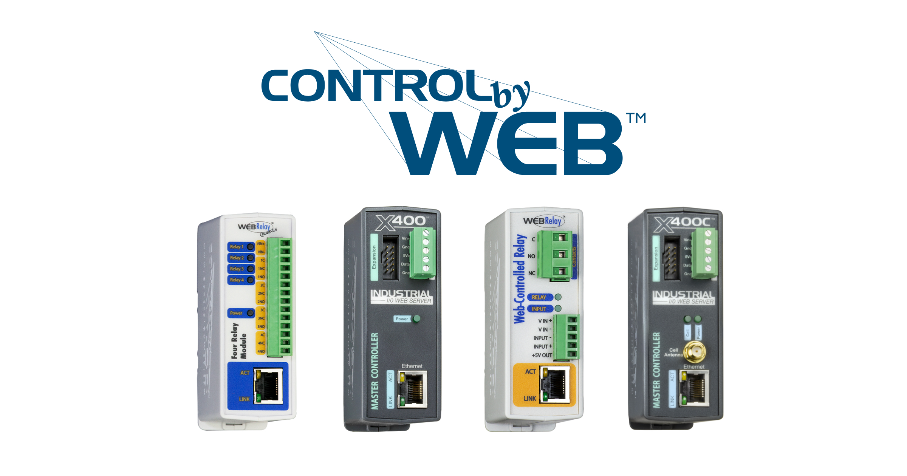
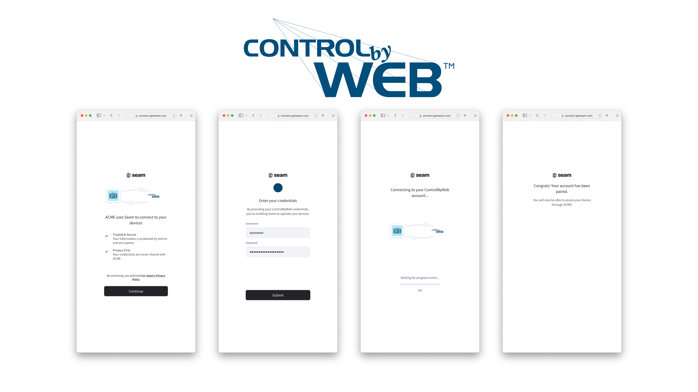

# Get started with ControlByWeb Devices

<figure><figcaption><p>ControlByWeb Devices</p></figcaption></figure>

## Overview

Seam provides a universal API to connect and control many brands of smart devices. This guide provides a rapid introduction to connecting and controlling your [ControlByWeb](https://www.seam.co/manufacturers/control-by-web) relay device using the Seam API. To learn more about other smart device brands supported by Seam such as Yale, Schlage, and August, head over to our [integration page](https://www.seam.co/supported-devices-and-systems).

## 1 — Install Seam SDK

Seam provides client libraries for many languages, such as JavaScript, Python, Ruby, PHP, and others, as well as a Postman collection and [OpenAPI](https://connect.getseam.com/openapi.json) spec.

* JavaScript / TypeScript ([npm](https://www.npmjs.com/package/seam), [GitHub](https://github.com/seamapi/javascript))
* Python ([pip](https://pypi.org/project/seamapi/), [GitHub](https://github.com/seamapi/python))
* Ruby Gem ([rubygem](https://rubygems.org/gems/seamapi), [GitHub](https://github.com/seamapi/ruby))
* PHP ([packagist](https://packagist.org/packages/seamapi/seam), [GitHub](https://github.com/seamapi/php))
* Java ([GitHub](https://github.com/seamapi/java))
* C# ([nuget](https://www.nuget.org/packages/Seam), [GitHub](https://github.com/seamapi/csharp))
* Go ([GitHub](https://github.com/seamapi/go))



```bash
npm i seam
```



```bash
pip install seamapi
# For some development environments, use pip3 in this command instead of pip.
```



```bash
bundle add seamapi
```



```bash
composer require seamapi/seam
```



**Gradle:**

```gradle
// build.gradle
dependencies {
    implementation 'io.github.seamapi:java:0.x.x'
}
```

**Maven:**

```xml
<!-- pom.xml -->
<dependency>
    <groupId>io.github.seamapi</groupId>
    <artifactId>java</artifactId>
    <version>0.x.x</version>
</dependency>
```



Install using [nuget](https://www.nuget.org/packages/Seam).



```bash
go get github.com/seamapi/go
```



Once installed, [sign-up for Seam](https://console.seam.co/) to get your API key, and export it as an environment variable:

```
$ export SEAM_API_KEY=seam_test2ZTo_0mEYQW2TvNDCxG5Atpj85Ffw
```


This guide uses a Sandbox Workspace. Only virtual devices can be connected. If you need to connect a real ControlByWeb device, use a non-sandbox workspace and API key.


## 2 — Link ControlByWeb Account with Seam

To control your ControlByWeb relay device via the Seam API, you must first authorize your Seam workspace against your ControlByWeb Cloud account. To do so, Seam provides[ Connect Webviews](../core-concepts/connect-webviews/): pre-built UX flows that walk you through authorizing your application to control your ControlByWeb device.

#### Request a Connect Webview



```python
from seamapi import Seam

seam = Seam()

webview = seam.connect_webviews.create(accepted_providers=["controlbyweb"])

assert webview.login_successful is False

# Send the webview URL to your user
print(webview.url)
```



```javascript
import { Seam } from 'seam'

const seam = new Seam()

const connectWebview = await seam.connectWebviews.create({
  accepted_providers: ['controlbyweb'],
})

console.log(connectWebview.login_successful) // false

// Send the webview URL to your user
console.log(connectWebview.url)
```



<pre class="language-ruby"><code class="lang-ruby">require "seamapi"

<strong>seam = Seam::Client.new(api_key: "MY_API_KEY")
</strong>
webview = seam.connect_webviews.create(
  accepted_providers: ["controlbyweb"]
)

puts webview.login_successful # false

# Send the webview URL to your user
puts webview.url
</code></pre>



#### Authorize Your Workspace

Navigate to the URL returned by the Webview object. Since you are using a sandbox workspace, complete the login flow by entering the ControlByWeb [sandbox test account](https://docs.seam.co/latest/device-guides/sandbox-and-sample-data) credentials below:

* **username:** jane
* **password:** 1234

<figure><figcaption><p>Seam Connect Webview flow to connect ControlByWeb account with Seam</p></figcaption></figure>

Confirm the Connect Webview was successful by querying its status:



```python
updated_webview = seam.connect_webviews.get(webview.connect_webview_id)

assert updated_webview.login_successful # true
```



```javascript
const updatedWebview = await seam.connectWebviews.get(
  connectWebview.connect_webview_id,
)

console.log(updatedWebview.login_successful) // true
```



```ruby
updated_webview = seam.connect_webviews.get(webview.connect_webview_id)

puts updated_webview.login_successful # true
```



## 3 — Retrieve ControlByWeb devices

After a ControlByWeb account is linked with Seam, you can retrieve devices for this ControlByWeb account. The main device property currently exposed by the Seam API is whether the device is online and reachable.



````python
all_locks = seam.locks.list()

some_lock = all_locks[0]

assert some_lock.properties["online"] is True
assert some_lock.properties["locked"] is True

print(some_lock)
```python
# Device(
#   device_id='4a570d13-9704-46e0-b69c-9fea80d6a7aa',
#   device_type='controlbyweb_device',
#   location=None,
#   properties={
#     'locked': True,
#     'online': True,
#     'manufacturer': 'controlbyweb',
#     'controlbyweb_metadata': {
#       'device_id': '9997',
#       'relay_name': 'firstRelay',
#       'device_name': 'Device 2'
#     },
#     'name': 'Device 2',
#     'image_url': 'https://connect.getseam.com/assets/images/devices/unknown-lock.png',
#     'image_alt_text': 'Placeholder Lock Image'
#   },
#   capabilities_supported=['lock'],
#   errors=[]
# )
````



```javascript
const allLocks = await seam.locks.list()

const someLock = allLocks[0]

console.log(someLock.properties.online) // true
console.log(someLock.properties.locked) // true

console.log(someLock)
/*
{
  device_id: '4a570d13-9704-46e0-b69c-9fea80d6a7aa',
  device_type: 'controlbyweb_device',
  capabilities_supported: [ 'lock' ],
  properties: {
    locked: true,
    online: true,
    manufacturer: 'controlbyweb',
    controlbyweb_metadata: {
      device_id: '9997',
      relay_name: 'firstRelay',
      device_name: 'Device 2'
    },
    name: 'Device 2',
    image_url: 'https://connect.getseam.com/assets/images/devices/unknown-lock.png',
    image_alt_text: 'Placeholder Lock Image'
  },
  location: null,
  connected_account_id: '5e0f49ac-3cb5-4e81-8c74-aba262218611',
  workspace_id: '40a179ca-3553-4226-9483-21df4e12f5fe',
  created_at: '2023-04-25T14:34:50.508Z',
  errors: [],
  warnings: []
}
*/
```



```ruby
some_lock = seam.locks.list.first

puts some_lock.properties['online'] # true
puts some_lock.properties['locked'] # true

puts some_lock.inspect # > #   warnings=[] #   errors=[] #   created_at=2023-04-25 14:34:50 UTC #   } #     "image_alt_text"=>"Placeholder Lock Image" #     "image_url"=>"https://connect.getseam.com/assets/images/devices/unknown-lock.png", #     "name"=>"Device 2", #     }, #       "device_name"=>"Device 2" #       "relay_name"=>"firstRelay", #       "device_id"=>"9997", #     "controlbyweb_metadata"=>{ #     "manufacturer"=>"controlbyweb", #     "online"=>true, #     "locked"=>true, #   properties={ #   device_type="controlbyweb_device" #   device_id="4a570d13-9704-46e0-b69c-9fea80d6a7aa" # <Seam::Device:0x00146639380
```



### 4 — Triggering a ControlByWeb relay

Next, you can perform the basic action of triggering a relay on the device. This action is mapped to an unlock API call in Seam.

## Unlock a door

<mark style="color:green;">`POST`</mark> `https://connect.getseam.com/locks/unlock_door`

#### Request Body

| Name       | Type   | Description |
| ---------- | ------ | ----------- |
| device\_id | String |             |



```python
# trigger the relay
seam.locks.unlock_door(some_lock)
```



```javascript
// trigger the relay
await seam.locks.unlockDoor(someLock.device_id)
```



```ruby
# trigger the relay
seam.locks.unlock_door(some_lock)
```



## Next Steps

Now that you've completed this guide, you can try to connect a real ControlByWeb device. To do so, make sure to switch to a non-sandbox workspace and API key as real devices cannot be connected to sandbox workspaces.

In addition, if you'd like to explore other aspects of Seam, here is a list of helpful resources:

* [Yale Getting Started Guide](get-started-with-yale-locks.md)
* [August Getting Started Guide](get-started-with-august-locks.md)
* [Schlage Getting Started Guide](get-started-with-schlage-locks.md)
* [SmartThings Getting Started Guide](get-started-with-smartthings-hubs-+-smart-locks.md)
* [Minut Getting Started Guide](get-started-with-minut-sensors.md)
* [Receiving webhook](../core-concepts/webhooks.md) for [device events](../api-clients/events/list-events.md)
* [Core Concepts](../core-concepts/overview.md)

If you have any questions or want to report an issue, email us at support@seam.co.
