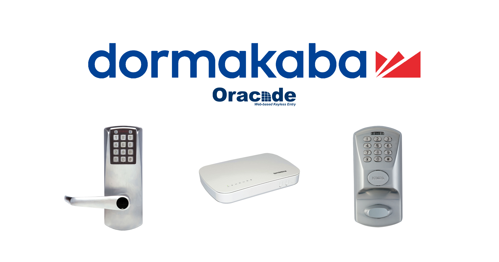
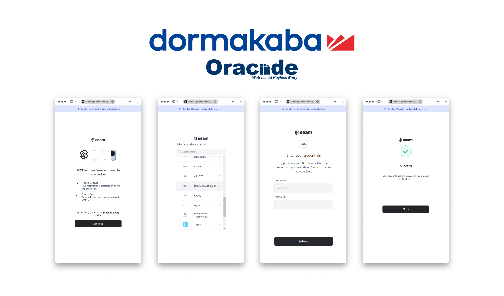

# Get started with dormakaba Oracode Locks

<figure><figcaption><p>Dormakaba Locks</p></figcaption></figure>

## Overview

Seam provides a universal API to connect and control many brands of locks. This guide provides a rapid introduction to connecting and controlling your [dormakaba Oracode](https://www.seam.co/manufacturers/dormakaba) locks using the Seam API. To learn more about other device brands supported by the Seam API, such as Yale, Schlage, and August, head over to our [integration page](https://www.seam.co/supported-devices-and-systems).

Note that dormakaba offers multiple lines of products, including Lyazon, Sapphire, Oracode, and more. This guide is specifically for dormakaba Oracode.

## 1 — Install the Seam SDK

Seam provides client libraries for many languages, such as JavaScript, Python, Ruby, PHP, and others, as well as a Postman collection and [OpenAPI](https://connect.getseam.com/openapi.json) spec.

* JavaScript / TypeScript ([npm](https://www.npmjs.com/package/seam), [GitHub](https://github.com/seamapi/javascript))
* Python ([pip](https://pypi.org/project/seam/), [GitHub](https://github.com/seamapi/python))
* Ruby Gem ([rubygem](https://rubygems.org/gems/seamapi), [GitHub](https://github.com/seamapi/ruby))
* PHP ([packagist](https://packagist.org/packages/seamapi/seam), [GitHub](https://github.com/seamapi/php))
* Java ([GitHub](https://github.com/seamapi/java))
* C# ([nuget](https://www.nuget.org/packages/Seam), [GitHub](https://github.com/seamapi/csharp))
* Go ([GitHub](https://github.com/seamapi/go))



```bash
npm i seam
```



```bash
pip install seam
# For some development environments, use pip3 in this command instead of pip.
```



```bash
bundle add seamapi
```



```bash
composer require seamapi/seam
```



**Gradle:**

```gradle
// build.gradle
dependencies {
    implementation 'io.github.seamapi:java:0.x.x'
}
```

**Maven:**

```xml
<!-- pom.xml -->
<dependency>
    <groupId>io.github.seamapi</groupId>
    <artifactId>java</artifactId>
    <version>0.x.x</version>
</dependency>
```



Install using [nuget](https://www.nuget.org/packages/Seam).



```bash
go get github.com/seamapi/go
```



Once installed, [sign-up for Seam](https://console.seam.co/) to get your API key, and export it as an environment variable:

```
$ export SEAM_API_KEY=seam_test2ZTo_0mEYQW2TvNDCxG5Atpj85Ffw
```


This guide uses a sandbox [workspace](../core-concepts/workspaces/). You can only connect virtual devices to a sandbox workspace. If you need to connect real Oracode devices, use a non-sandbox workspace and API key.


## 2 — Link Your dormakaba Oracode Account with Seam

To control your dormakaba Oracode locks using the Seam API, the owner or manager of these locks must first authorize your Seam workspace to access their dormakaba Oracode account. To do so, Seam provides[ Connect Webviews](../core-concepts/connect-webviews/), which are pre-built UX flows that walk the device owner or manager through authorizing your application to control Oracode locks.


This guide discusses using a Seam sandbox workspace with virtual devices. However, to connect real devices to Seam, some manufacturers may require additional prerequisite setup steps. For dormakaba Oracode-specific instructions, see the [dormakaba Oracode device integration guide](dormakaba-oracode-locks.md#setup-instructions).


#### Request a Connect Webview



```python
from seam import Seam

seam = Seam()

webview = seam.connect_webviews.create(accepted_providers=["dormakaba_oracode"])

assert webview.login_successful is False

# Send the Connect Webview URL to your user.
print(webview.url)
```



```javascript
import { Seam } from 'seam'

const seam = new Seam()

const { connect_webview: connectWebview } = await seam.connectWebviews.create({
  accepted_providers: ['dormakaba_oracode'],
})

console.log(connectWebview.login_successful) // false

// Send the Connect Webview URL to your user.
console.log(connectWebview.url)
```



```ruby
require 'seamapi'

seam = Seam::Client.new(api_key: 'MY_API_KEY')

webview = seam.connect_webviews.create(accepted_providers: %w[dormakaba_oracode])

puts webview.login_successful # false

# Send the Connect Webview URL to your user.
puts webview.url
```



```php
use Seam\SeamClient;

$seam = new SeamClient("YOUR_API_KEY");

$webview = $seam->connect_webviews->create(
  accepted_providers: ["dormakaba_oracode"]
);
```



#### Authorize Your Workspace

Navigate to the URL that the Connect Webview object returned. Because you are using a sandbox workspace, complete the login flow by entering the following dormakaba Oracode [sandbox test account ](sandbox-and-sample-data/dormakaba-oracode-sample-data.md)credentials:

* **username:** jane
* **password:** 1234

<figure><figcaption><p>Seam Connect Webview flow to connect dormakaba Oracode account with Seam</p></figcaption></figure>

Confirm the Connect Webview was successful by querying the status.



```python
updated_webview = seam.connect_webviews.get(webview.connect_webview_id)

assert updated_webview.login_successful # true
```



```javascript
const updatedWebview = await seam.connectWebviews.get(
  connectWebview.connect_webview_id,
)

console.log(updatedWebview.login_successful) // true
```



```ruby
updated_webview = seam.connect_webviews.get(webview.connect_webview_id)

puts updated_webview.login_successful # true
```



```php
$webview = $seam->connect_webviews->get('729847ff-98e0-418d-aeba-1e3cb38157c6');
assert($webview->status == 'pending');
```



## 3 — Retrieve dormakaba Oracode Devices

After a dormakaba Oracode account is linked with Seam, you can retrieve the connected devices.



```python
all_locks = seam.locks.list()

some_lock = all_locks[0]

assert some_lock.properties["battery_level"] is True

print(some_lock)
```



```javascript
const allLocks = await seam.locks.list()

const someLock = allLocks[0]

console.log(someLock.properties.battery_level)

console.log(someLock)

```



```ruby
some_lock = seam.locks.list.first

puts some_lock.properties['battery_level']

puts some_lock

```



```php
use Seam\SeamClient;

$seam = new SeamClient('YOUR_API_KEY');

$locks = $seam->locks->list();

echo json_encode($locks);

*/
```



### 4 — Programming Access Codes on a dormakaba Oracode Lock

The Seam API enables you to create access codes on dormakaba Oracode devices, such as the 480i and 660i locks. Users can then enter these codes to unlock the door. To learn more, see [Managing Access Codes](../products/smart-locks/access-codes/).


dormakaba Oracode does not let you specify a code for an access code. Instead it auto-generates a six-digit code, which the Seam API returns. If you try to pass the `code` argument to the access code `create` function, the Seam API returns an error.




```python
# Create an ongoing code.
seam.access_codes.create(
  device=some_lock,
  name="Personal Access Code")

# Create a time-bound code.
seam.access_codes.create(
  device=some_lock,
  name="My Temp Access Code",
  starts_at="2028-08-12T19:23:42+0000",
  ends_at="2028-08-13T19:23:42+0000")

# You can use a device or a device_id as the `device` parameter.
seam.access_codes.list(device=some_lock)

# [
#   AccessCode(access_code_id='631a3a30-3fa7-462a-b3bc-65528ccf8765', type='time_bound', code=None, starts_at='2028-08-12T19:24:00.000Z', ends_at='2028-08-13T19:24:00.000Z', name='My Temp Access Code', status='unset', common_code_key=None),
#  AccessCode(access_code_id='4d2f4952-5446-4051-ba7e-a6fc01a376d7', type='ongoing', code='123*12346', starts_at=None, ends_at=None, name='Personal Access Code', status='set', common_code_key=None)
#  ]
```



```javascript
// Create an ongoing code.
await seam.accessCodes.create({
  device_id: someLock.device_id,
  name: 'Personal Access Code',
})

// Create a time-bound code.
await seam.accessCodes.create({
  device_id: someLock.device_id,
  name: 'My Temp Access Code',
  starts_at: '2028-11-12T19:23:42+0000',
  ends_at: '2028-11-13T19:23:42+0000',
})

// Use a device_id as the `device_id` parameter.
await seam.accessCodes.list({
  device_id: someLock.device_id,
})

/*
[
  {
    access_code_id: '631a3a30-3fa7-462a-b3bc-65528ccf8765',
    device_id: '681bf7bc-e7c6-48e6-acfe-6dbabd0615c5',
    name: 'My Temp Access Code',
    code: null,
    is_waiting_for_code_assignment: true,
    common_code_key: null,
    type: 'time_bound',
    status: 'unset',
    starts_at: '2028-08-12T19:24:00.000Z',
    ends_at: '2028-08-13T19:24:00.000Z',
    created_at: '2023-02-08T23:28:57.061Z',
    errors: [],
    warnings: []
  },
  {
    access_code_id: '774986f8-5fad-4911-a4fb-e5a2ef9f15bd',
    device_id: '681bf7bc-e7c6-48e6-acfe-6dbabd0615c5',
    name: 'Personal Access Code',
    code: '123*12346',
    common_code_key: null,
    type: 'ongoing',
    status: 'set',
    created_at: '2023-02-08T23:10:54.096Z',
    errors: [],
    warnings: []
  },
]
*/
```



```ruby
# Create an ongoing code.
seam.access_codes.create(
  device_id: some_lock.device_id, name: 'Personal Access Code'
)

# Create a time-bound code.
seam.access_codes.create(
  device_id: some_lock.device_id,
  name: 'My Temp Access Code',
  starts_at: '2028-08-12T19:23:42+0000',
  ends_at: '2028-08-13T19:23:42+0000'
)

# You can use a device or a device_id as the `device` parameter.
seam.access_codes.list(some_lock)

# [<Seam::AccessCode:0x00690
#   access_code_id="631a3a30-3fa7-462a-b3bc-65528ccf8765"
#   name="My Temp Access Code"
#   code=nil
#   type="time_bound"
#   starts_at=2028-08-12 19:24:00 UTC
#   ends_at=2028-08-13 19:24:00 UTC
#   errors=[]
#   warnings=[]>, <Seam::AccessCode:0x006b8
#   access_code_id="774986f8-5fad-4911-a4fb-e5a2ef9f15bd"
#   name="Personal Access Code"
#   code="123*12346"
#   type="ongoing"
#   errors=[]
#   warnings=[]>]
```



```php
use Seam\SeamClient;

$seam = new SeamClient("YOUR_API_KEY");

$some_lock = $seam->locks->list()[0];
$seam->access_codes->create(
  device_id: $some_lock->device_id, name: 'Personal Access Code'
);

$seam->access_codes->create(
  device_id: $some_lock->device_id,
  name: 'My Temp Access Code',
  starts_at: '2028-08-12T19:23:42+0000',
  ends_at: '2028-08-13T19:23:42+0000'
);

echo json_encode($access_code)
/*
[{"access_code_id":"19cea367-fd8c-40b7-9ce3-6dec76fe1763","name":"My Temp Access Code","type":"time_bound","status":"unset","starts_at":"2028-08-12T19:24:00.000Z","ends_at":"2028-08-13T19:24:00.000Z","code":null,"created_at":"2023-02-09T05:53:46.293Z","errors":[],"warnings":[]},{"access_code_id":"f797a8f0-b8f7-4734-9bea-962de5cad413","name":"Personal Access Code","type":"ongoing","status":"set","starts_at":null,"ends_at":null,"code":"123*12346","created_at":"2023-02-09T05:53:46.172Z","errors":[],"warnings":[]}]
*/
```



## Next Steps

Now that you've completed this guide, you can try to connect a real dormakaba Oracode device. To do so, make sure to switch to a non-sandbox workspace and API key because you cannot connect real devices to sandbox workspaces.

In addition, if you'd like to explore other aspects of Seam, check out the following helpful resources:

* [Schlage Getting Started Guide](get-started-with-schlage-locks.md)
* [Yale Getting Started Guide](get-started-with-yale-locks.md)
* [SmartThings Getting Started Guide](get-started-with-smartthings-hubs-+-smart-locks.md)
* [Configuring webhooks](../core-concepts/webhooks.md) for [device events](../api-clients/events/list-events.md)
* [Core Concepts](broken-reference/)

If you have any questions or want to report an issue, email us at [support@seam.co](mailto:support@seam.co).
