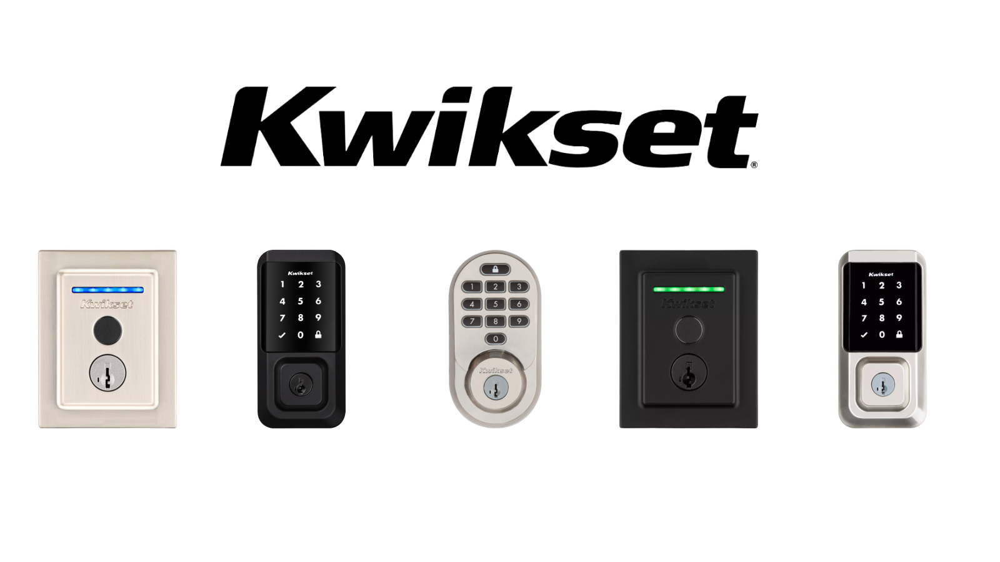
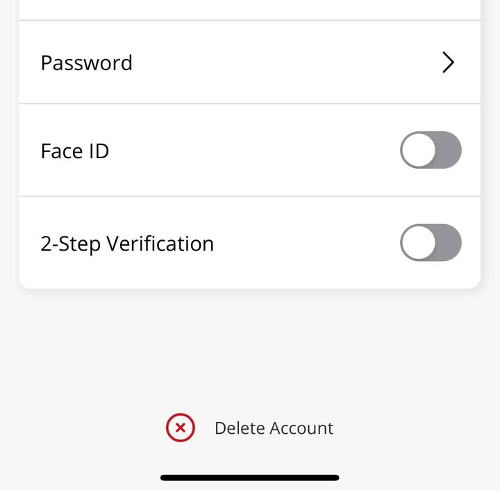
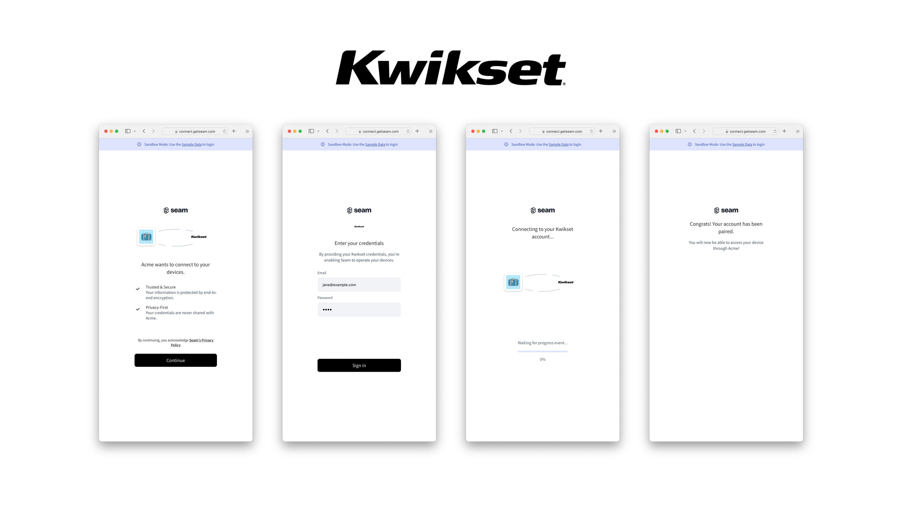

# Get started with Kwikset Halo Locks

<figure><figcaption><p>Kwikset Halo Smart Locks</p></figcaption></figure>

## Overview

Seam provides a universal API to connect and control many brands of smart locks. This guide provides a rapid introduction to connecting and controlling your [Kwikset Halo](https://www.seam.co/manufacturers/kwikset) lock using the Seam API. To learn more about other smart lock brands supported by Seam such as Yale, Schlage, and August, head over to our [integration page](https://www.seam.co/supported-devices-and-systems).


Access Code management and login for Kwikset accounts that require MFA are not supported yet. Please ensure your Kwikset MFA settings are disabled before attempting to connect your Kwikset account with Seam.

These settings can be found in your Kwikset app under **Account Settings**:
<figure><div align="center"></div><figcaption><p align="center">Kwikset MFA Settings</p></figcaption></figure>





## 1 — Install Seam SDK

Seam provides client libraries for many languages such as Javascript, Python, Ruby, and PHP, as well as a Postman collection and [OpenAPI](https://connect.getseam.com/openapi.json) spec.

- **Javascript:** `npm i seamapi` ([npm](https://www.npmjs.com/package/seamapi), [github](https://github.com/seamapi/javascript))
- **Python:** `pip install seamapi` ([pip](https://pypi.org/project/seamapi/), [github](https://github.com/seamapi/python))
- **Ruby:** `bundle add seamapi` ([rubygem](https://rubygems.org/gems/seamapi), [github](https://github.com/seamapi/ruby))
- **PHP:** `composer require seamapi/seam` ([packagist](https://packagist.org/packages/seamapi/seam), [github](https://github.com/seamapi/php))

Once installed, [sign-up for Seam](https://dashboard.getseam.com/) to get your API key, and export it as an environment variable:

```
$ export SEAM_API_KEY=seam_test2ZTo_0mEYQW2TvNDCxG5Atpj85Ffw
```


This guide uses a Sandbox Workspace. Only virtual devices can be connected. If you need to connect a real Kwikset Halo Lock, use a non-sandbox workspace and API key.


## 2 — Link Kwikset Account with Seam

To control your Kwikset Halo lock via the Seam API, you must first authorize your Seam workspace against your Kwikset account. To do so, Seam provides[ Connect Webviews](../core-concepts/connect-webviews.md): pre-built UX flows that walk you through authorizing your application to control your Kwikset Halo lock.

#### Request a Connect Webview




```python
from seamapi import Seam

seam = Seam()

webview = seam.connect_webviews.create(accepted_providers=["kwikset"])

assert webview.login_successful is False

# Send the webview URL to your user
print(webview.url)
```





```javascript
import Seam from 'seamapi'

const seam = new Seam()

const connectWebview = await seam.connectWebviews.create({
  accepted_providers: ['kwikset'],
})

console.log(connectWebview.login_successful) // false

// Send the webview URL to your user
console.log(connectWebview.url)
```





<pre class="language-ruby"><code class="lang-ruby">require "seamapi"

<strong>seam = Seam::Client.new(api_key: "MY_API_KEY")
</strong>
webview = seam.connect_webviews.create(
  accepted_providers: ["kwikset"]
)

puts webview.login_successful # false

# Send the webview URL to your user 
puts webview.url
</code></pre>




#### Authorize Your Workspace

Navigate to the URL returned by the Webview object. Since you are using a sandbox workspace, complete the login flow by entering the Kwikset [sandbox test accounts ](https://docs.seam.co/latest/device-guides/sandbox-and-sample-data)credentials below:

- **email:** jane@example.com
- **password:** 1234


Login for Kwikset accounts that require MFA (Multi-Factor Authentication) is not supported yet. Please ensure your Kwikset MFA settings are disabled before attempting to connect your Kwikset account with Seam.

These settings can be found in your Kwikset app under **Account Settings**:
<figure><div align="center"></div><figcaption><p align="center">Kwikset MFA Settings</p></figcaption></figure>



<figure><figcaption><p>Seam Connect Webview flow to connect Kwikset account with Seam</p></figcaption></figure>

Confirm the Connect Webview was successful by querying its status:




```python
updated_webview = seam.connect_webviews.get(webview.connect_webview_id)

assert updated_webview.login_successful # true
```





```javascript
const updatedWebview = await seam.connectWebviews.get(
  connectWebview.connect_webview_id,
)

console.log(updatedWebview.login_successful) // true
```





```ruby
updated_webview = seam.connect_webviews.get(webview.connect_webview_id)

puts updated_webview.login_successful # true
```




## 3 — Retrieve Kwikset Halo Lock Devices

After a Kwikset account is linked with Seam, you can retrieve devices for this Kwikset account. The Seam API exposes most of the device's properties such as battery level or door lock status.




```python
all_locks = seam.locks.list()

some_lock = all_locks[0]

assert some_lock.properties["online"] is True
assert some_lock.properties["locked"] is True

print(some_lock)
```python
# Device(
#     device_id='10891c43-29e0-4b93-b071-34749025a123', 
#     device_type='kwikset_lock', 
#     location=None, 
#     properties={
#         'locked': True, 
#         'online': True, 
#         'manufacturer': 'kwikset', 
#         'battery_level': 0.65, 
#         'kwikset_metadata': {
#             'device_id': '10d221f8e8445dbe07', 
#             'device_name': 'Kwikset Halo Touch', 
#             'model_number': 'HALO-01'
#         }, 
#         'name': 'Kwikset Halo Touch', 
#         'battery': {
#             'level': 0.65, 
#             'status': 'good'
#         }, 
#         'image_url': 'https://connect.getseam.com/assets/images/devices/kwikset_halo_touchscreen-wi-fi-enabled-smart-lock_polished-chrome_front.png', 
#         'image_alt_text': 'Kwikset Halo Touchscreen Wifi Enabled Smart Lock, Polished Chrome, Front'
#     }, 
#     capabilities_supported=['lock']
# )
```



```javascript
const allLocks = await seam.locks.list()

const someLock = allLocks[0]

console.log(someLock.properties.online) // true
console.log(someLock.properties.locked) // true

console.log(someLock)
/*
{
  device_id: '10891c43-29e0-4b93-b071-34749025a123',
  device_type: 'kwikset_lock',
  capabilities_supported: [
    'lock'
  ],
  properties: {
    locked: true,
    online: true,
    manufacturer: 'kwikset',
    battery_level: 0.65,
    kwikset_metadata: {
      device_id: '10d221f8e8445dbe07',
      device_name: 'Kwikset Halo Touch',
      model_number: 'HALO-01'
    },
    name: 'Kwikset Halo Touch',
    battery: {
      level: 0.65,
      status: 'good'
    },
    image_url: 'https://connect.getseam.com/assets/images/devices/kwikset_halo_touchscreen-wi-fi-enabled-smart-lock_polished-chrome_front.png',
    image_alt_text: 'Kwikset Halo Touchscreen Wifi Enabled Smart Lock, Polished Chrome, Front'
  },
  location: null,
}
*/
```





```ruby
some_lock = seam.locks.list.first

puts some_lock.properties['online'] # true
puts some_lock.properties['locked'] # true

puts some_lock.inspect
# <Seam::Device:0x00438
#   device_id="10891c43-29e0-4b93-b071-34749025a123"
#   device_type="kwikset_lock"
#   properties={
#     "locked"=>true, 
#     "online"=>true, 
#     "manufacturer"=>"kwikset", 
#     "battery_level"=>0.65, 
#     "kwikset_metadata"=>{"device_id"=>"10d221f8e8445dbe07", "device_name"=>"Kwikset Halo Touch", "model_number"=>"HALO-01"}, 
#     "name"=>"Kwikset Halo Touch", 
#     "battery"=>{"level"=>0.65, "status"=>"good"}, 
#     "image_url"=>"https://connect.getseam.com/assets/images/devices/kwikset_halo_touchscreen-wi-fi-enabled-smart-lock_polished-chrome_front.png", 
#     "image_alt_text"=>"Kwikset Halo Touchscreen Wifi Enabled Smart Lock, Polished Chrome, Front"
#   }
>

```



### 4 — Locking & Unlocking a Door

Next, you can perform the basic action of locking and unlocking the door.


[openapi (1).json](<../.gitbook/assets/openapi (1).json>)














```python
# lock the door
seam.locks.lock_door(some_lock)
updated_lock = seam.locks.get(some_lock.device_id)
assert updated_lock.properties["locked"] is True

# Now unlock the door
seam.locks.unlock_door(some_lock)
updated_lock = seam.locks.get(some_lock.device_id)
assert updated_lock.properties["locked"] is False
```



```javascript
// lock the door
await seam.locks.lockDoor(someLock.device_id)
const updatedLock = await seam.locks.get(someLock.device_id)
console.log(updatedLock.properties.locked) // true

// unlock the door
await seam.locks.unlockDoor(someLock.device_id)
updatedLock = await seam.locks.get(someLock.device_id)
console.log(updatedLock.properties.locked) // false
```



```ruby
# lock the door
seam.locks.lock_door(some_lock)
updated_lock = seam.locks.get(some_lock.device_id)
puts updated_lock.properties['locked'] # true

# unlock the door
seam.locks.unlock_door(some_lock)
updated_lock = seam.locks.get(some_lock.device_id)
puts updated_lock.properties['locked'] # false
```




###

## Next Steps

Now that you've completed this guide, you can try to connect a real Kwikset Halo device. To do so, make sure to switch to a non-sandbox workspace and API key as real devices cannot be connected to sandbox workspaces.

In addition, if you'd like to explore other aspects of Seam, here is a list of helpful resources:

* [Yale Getting Started Guide](get-started-with-yale-locks.md)
* [August Getting Started Guide](get-started-with-august-locks.md)
* [Schlage Getting Started Guide](get-started-with-schlage-locks.md)
* [SmartThings Getting Started Guide](get-started-with-smartthings-hubs-+-smart-locks.md)
* [Receiving webhook](../core-concepts/webhooks.md) for [device events](../api-clients/events/list-events.md)
* [Core Concepts](../core-concepts/overview.md)

If you have any questions or want to report an issue, email us at support@seam.co.