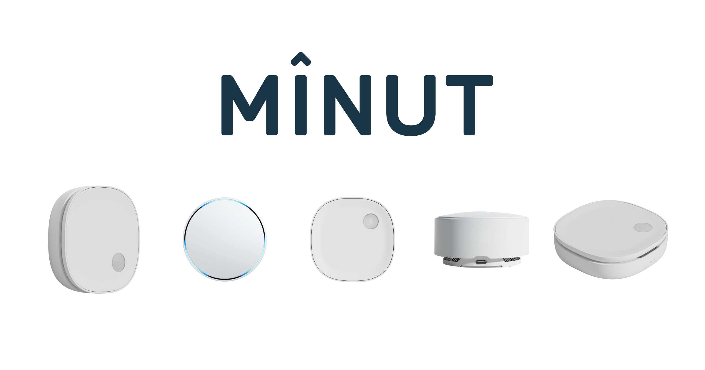
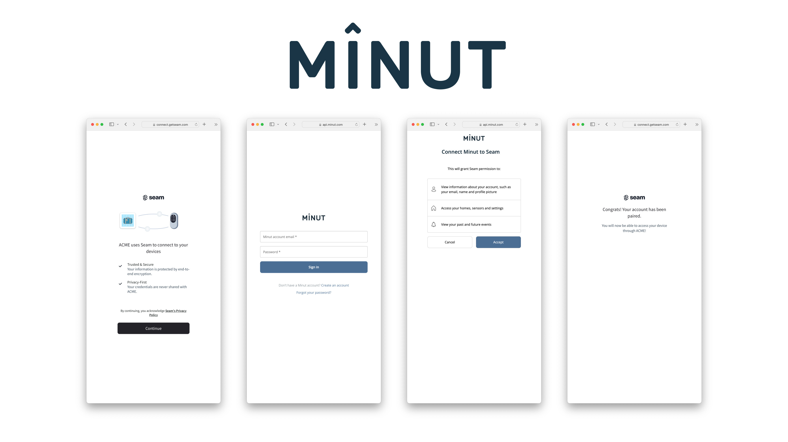

# Get started with Minut Sensors

<figure><figcaption><p>Minut Noise Sensors</p></figcaption></figure>

## Overview

Seam provides a universal API to connect and control many brands of devices such as smart locks, thermostats, and sensors. This guide provides a rapid introduction to connecting and controlling your [Minut](https://www.seam.co/manufacturers/minut) sensors using the Seam API. To learn more about other brands of devices supported by Seam, head over to our [integration page](https://www.seam.co/supported-devices-and-systems).

## 1. Install Seam SDK

Seam provides client libraries for many languages, such as JavaScript, Python, Ruby, PHP, and others, as well as a Postman collection and [OpenAPI](https://connect.getseam.com/openapi.json) spec.

* JavaScript / TypeScript ([npm](https://www.npmjs.com/package/seam), [GitHub](https://github.com/seamapi/javascript))
* Python ([pip](https://pypi.org/project/seam/), [GitHub](https://github.com/seamapi/python))
* Ruby Gem ([rubygem](https://rubygems.org/gems/seamapi), [GitHub](https://github.com/seamapi/ruby))
* PHP ([packagist](https://packagist.org/packages/seamapi/seam), [GitHub](https://github.com/seamapi/php))
* Java ([GitHub](https://github.com/seamapi/java))
* C# ([nuget](https://www.nuget.org/packages/Seam), [GitHub](https://github.com/seamapi/csharp))
* Go ([GitHub](https://github.com/seamapi/go))



```bash
npm i seam
```



```bash
pip install seam
# For some development environments, use pip3 in this command instead of pip.
```



```bash
bundle add seamapi
```



```bash
composer require seamapi/seam
```



**Gradle:**

```gradle
// build.gradle
dependencies {
    implementation 'io.github.seamapi:java:0.x.x'
}
```

**Maven:**

```xml
<!-- pom.xml -->
<dependency>
    <groupId>io.github.seamapi</groupId>
    <artifactId>java</artifactId>
    <version>0.x.x</version>
</dependency>
```



Install using [nuget](https://www.nuget.org/packages/Seam).



```bash
go get github.com/seamapi/go
```



Once installed, [sign-up for Seam](https://console.seam.co/) to get your API key, and export it as an environment variable:

```
$ export SEAM_API_KEY=seam_test2ZTo_0mEYQW2TvNDCxG5Atpj85Ffw
```


This guide uses a Sandbox Workspace. Only virtual sensors can be connected. If you need to connect a real Minut sensor, use a non-sandbox workspace and API key.


## 2. Link Minut Account with Seam

To control your Minut sensor via the Seam API, you must first authorize your Seam workspace against your Minut account. To do so, Seam provides[ Connect Webviews](../core-concepts/connect-webviews/): pre-built UX flows that walk you through authorizing your application to control your Minut sensor.

### Create a Connect Webview



```python
from seam import Seam
seam = Seam()

webview = seam.connect_webviews.create(accepted_providers=["minut"])

assert webview.login_successful is False

# Send this webview url to your user!
print(webview.url)
```



```javascript
import { Seam } from 'seam'
const seam = new Seam()
const connectWebview = await seam.connectWebviews.create({
  accepted_providers: ["minut"],
})
console.log(connectWebview.login_successful) // false
// Send the webview URL to your user
console.log(connectWebview.url)
```



```ruby
require "seamapi"

seam = Seam::Client.new(api_key: "MY_API_KEY")

webview = seam.connect_webviews.create(
  accepted_providers: ["minut"]
)

puts webview.login_successful # false

# Send the webview URL to your user 
puts webview.url
```



```php
use Seam\SeamClient;
$seam = new SeamClient("YOUR_API_KEY");
$webview = $seam->connect_webviews->create(
  accepted_providers: ["minut"]
);
echo json_encode($webview)
/*
{"connect_webview_id":"70c4df9e-1070-441f-92f8-fd6524062cec","workspace_id":"d7418ff3-a476-4f48-9a4b-211d1d21a03d","url":"https:\/\/connect.getseam.com\/connect_webviews\/view?connect_webview_id=70c4df9e-1070-441f-92f8-fd6524062cec&auth_token=9HJbwWKbD5aJLifZcozU9WWZXxropn9Bg","connected_account_id":null,"status":"pending","custom_redirect_url":null,"custom_redirect_failure_url":null,"created_at":"2023-02-09T02:14:06.147745+00:00","error":null}
*/
```



### Authorize Your Workspace

Navigate to the URL returned by the Webview object. Since you are using a sandbox workspace, complete the login flow by entering the Minut [sandbox test accounts ](https://docs.seam.co/latest/device-guides/sandbox-and-sample-data)credentials below:

* **email**: jane@example.com
* **password**: 1234

<figure><figcaption><p>Seam Connect Webview flow to connect Minut account with Seam</p></figcaption></figure>

### Get the New Webview

After you complete the login above, you'll get an event for [`connected_account.created`](../api-clients/events/)if you set up a [webhook handler](../core-concepts/webhooks.md). Otherwise you can just poll for the webview until it's status changes, as shown below:



```python
updated_webview = seam.connect_webviews.get(
    webview.connect_webview_id
)

assert updated_webview.login_successful # true
```



```javascript
const updatedWebview = await seam.connectWebviews.get(
  connectWebview.connect_webview_id,
)
console.log(updatedWebview.login_successful) // true
```



```ruby
updated_webview = seam.connect_webviews.get(webview.connect_webview_id)
puts updated_webview.login_successful # true
```



```php
$webview = $seam->connect_webviews->get($webview->id);
echo json_encode($webview);
```



## 3. Retrieve Minut Noise Sensors

Minut noise sensors appear with the `device_type` `"minut_sensor"`. The Minut noise sensors report properties in addition to noise levels, namely `temperature` and `humidity`.



```python
sensors = seam.devices.list(device_type="minut_sensor")

sensors[0]
# Device(
#   device_id='fd200f4b-3815-497a-8520-10725c597e0c',
#   device_type='minut_sensor',
#   location={
#     'timezone': 'America/Los_Angeles',
#     'location_name': "Jane's Test Home"
#   },
#   properties={
#     'online': True,
#     'manufacturer': 'minut',
#     'battery_level': 0.5,
#     'minut_metadata': {
#       'home_id': 'f53026ff7c5e314521f285f9',
#       'device_id': '5bb32b83525d243950a92ab8',
#       'home_name': "Jane's Test Home",
#       'device_name': 'Living Room',
#       'home_address': {
#         'city': 'San Francisco',
#         'notes': 'string',
#         'region': 'San Francisco County',
#         'country': 'US',
#         'post_code': '44210',
#         'street_name1': '2258 24th Street',
#         'street_name2': ''
#       },
#       'home_location': {
#         'latitude': 0,
#         'longitude': 0
#       },
#       'device_location': {
#         'latitude': 0,
#         'longitude': 0
#       },
#       'latest_sensor_values': {
#         'sound': {
#           'time': '1970-01-01T00:00:00.000Z',
#           'value': 47.7117919921875
#         },
#         'humidity': {
#           'time': '1970-01-01T00:00:00.000Z',
#           'value': 31.110000610351562
#         },
#         'pressure': {
#           'time': '1970-01-01T00:00:00.000Z',
#           'value': 101923
#         },
#         'temperature': {
#           'time': '1970-01-01T00:00:00.000Z',
#           'value': 21.270000457763672
#         },
#         'accelerometer_z': {
#           'time': '1970-01-01T00:00:00.000Z',
#           'value': -1.00390625
#         }
#       }
#     },
#     'name': 'Living Room',
#     'battery': {
#       'level': 0.5,
#       'status': 'good'
#     },
#     'image_url': 'https://connect.getseam.com/assets/images/devices/minut_gen-3_front.png',
#     'image_alt_text': 'Minut Sensor'
#   },
#   capabilities_supported=['noise_detection'],
#   errors=[]
# )
```



```javascript
const devices = await seam.devices.list({
  device_type: 'minut_sensor',
})
console.log(devices[0])
/*
{
  "device_id": "1efc294e-3a85-403a-8a2a-21b8f8b27cfa",
  "device_type": "minut_sensor",
  "capabilities_supported": [
    "noise_detection"
  ],
  "properties": {
    "online": true,
    "manufacturer": "minut",
    "battery_level": 1,
    "minut_metadata": {
      "home_id": "f53026ff7c5e314521f285f9",
      "device_id": "e0d8283f314c5ad10b82571e",
      "home_name": "Jane's Test Home",
      "device_name": "Living Room",
      "home_address": {
        "city": "San Francisco",
        "notes": "string",
        "region": "San Francisco County",
        "country": "US",
        "post_code": "44210",
        "street_name1": "2258 24th Street",
        "street_name2": ""
      },
      "home_location": {
        "latitude": 0,
        "longitude": 0
      },
      "device_location": {
        "latitude": 0,
        "longitude": 0
      },
      "latest_sensor_values": {
        "sound": {
          "time": "1970-01-01T00:00:00.000Z",
          "value": 47.7117919921875
        },
        "humidity": {
          "time": "1970-01-01T00:00:00.000Z",
          "value": 31.110000610351562
        },
        "pressure": {
          "time": "1970-01-01T00:00:00.000Z",
          "value": 101923
        },
        "temperature": {
          "time": "1970-01-01T00:00:00.000Z",
          "value": 21.270000457763672
        },
        "accelerometer_z": {
          "time": "1970-01-01T00:00:00.000Z",
          "value": -1.00390625
        }
      }
    },
    "name": "Living Room",
    "battery": {
      "level": 1,
      "status": "full"
    },
    "image_url": "https://connect.getseam.com/assets/images/devices/minut_gen-3_front.png",
    "image_alt_text": "Minut Sensor"
  },
  "location": {
    "timezone": "America/Los_Angeles",
    "location_name": "Jane's Test Home"
  },
  "connected_account_id": "257160cb-c2f0-4ee0-9c76-be80b3751f28",
  "workspace_id": "2c5f5397-37b9-4236-beac-f47f050d42cd",
  "created_at": "2023-05-08T17:01:43.650Z",
  "errors": [],
  "warnings": []
}
*/
```



```ruby
seam.devices.list(
  device_type: "minut_sensor"
).first
# <Seam::Device:0x00c08
#   device_id="01e6c107-9855-48ec-ae66-d0e839302492"
#   device_type="minut_sensor"
#   properties={
#     "online"=>true,
#     "manufacturer"=>"minut",
#     "battery_level"=>1,
#     "minut_metadata"=>{
#       "home_id"=>"2978b6d5dba395ec08300e45",
#       "device_id"=>"770bd3153deca3dee0fe0614",
#       "home_name"=>"Jane's Test Home",
#       "device_name"=>"Living Room",
#       "home_address"=>{
#         "city"=>"San Francisco",
#         "notes"=>"string",
#         "region"=>"San Francisco County",
#         "country"=>"US",
#         "post_code"=>"44210",
#         "street_name1"=>"2258 24th Street",
#         "street_name2"=>""
#       },
#       "home_location"=>{
#         "latitude"=>0,
#         "longitude"=>0
#       },
#       "device_location"=>{
#         "latitude"=>0,
#         "longitude"=>0
#       },
#       "latest_sensor_values"=>{
#         "sound"=>{
#           "time"=>"1970-01-01T00:00:00.000Z",
#           "value"=>47.7117919921875
#         },
#         "humidity"=>{
#           "time"=>"1970-01-01T00:00:00.000Z",
#           "value"=>31.110000610351562
#         },
#         "pressure"=>{
#           "time"=>"1970-01-01T00:00:00.000Z",
#           "value"=>101923
#         },
#         "temperature"=>{
#           "time"=>"1970-01-01T00:00:00.000Z",
#           "value"=>21.270000457763672
#         },
#         "accelerometer_z"=>{
#           "time"=>"1970-01-01T00:00:00.000Z",
#           "value"=>-1.00390625
#         }
#       }
#     },
#     "name"=>"Living Room",
#     "battery"=>{
#       "level"=>1,
#       "status"=>"full"
#     },
#     "image_url"=>"https://connect.getseam.com/assets/images/devices/minut_gen-3_front.png",
#     "image_alt_text"=>"Minut Sensor"
#   }
#   created_at=2023-05-08 17:01:45.79 UTC
#   errors=[]
#   warnings=[]>
```



```php
$devices = $seam->devices->list(device_type: 'minut_sensor');
echo json_encode($device[0]);
/*
{
  "device_id": "1efc294e-3a85-403a-8a2a-21b8f8b27cfa",
  "device_type": "minut_sensor",
  "capabilities_supported": [
    "noise_detection"
  ],
  "properties": {
    "online": true,
    "manufacturer": "minut",
    "battery_level": 1,
    "minut_metadata": {
      "home_id": "f53026ff7c5e314521f285f9",
      "device_id": "e0d8283f314c5ad10b82571e",
      "home_name": "Jane's Test Home",
      "device_name": "Living Room",
      "home_address": {
        "city": "San Francisco",
        "notes": "string",
        "region": "San Francisco County",
        "country": "US",
        "post_code": "44210",
        "street_name1": "2258 24th Street",
        "street_name2": ""
      },
      "home_location": {
        "latitude": 0,
        "longitude": 0
      },
      "device_location": {
        "latitude": 0,
        "longitude": 0
      },
      "latest_sensor_values": {
        "sound": {
          "time": "1970-01-01T00:00:00.000Z",
          "value": 47.7117919921875
        },
        "humidity": {
          "time": "1970-01-01T00:00:00.000Z",
          "value": 31.110000610351562
        },
        "pressure": {
          "time": "1970-01-01T00:00:00.000Z",
          "value": 101923
        },
        "temperature": {
          "time": "1970-01-01T00:00:00.000Z",
          "value": 21.270000457763672
        },
        "accelerometer_z": {
          "time": "1970-01-01T00:00:00.000Z",
          "value": -1.00390625
        }
      }
    },
    "name": "Living Room",
    "battery": {
      "level": 1,
      "status": "full"
    },
    "image_url": "https://connect.getseam.com/assets/images/devices/minut_gen-3_front.png",
    "image_alt_text": "Minut Sensor"
  },
  "location": {
    "timezone": "America/Los_Angeles",
    "location_name": "Jane's Test Home"
  },
  "connected_account_id": "257160cb-c2f0-4ee0-9c76-be80b3751f28",
  "workspace_id": "2c5f5397-37b9-4236-beac-f47f050d42cd",
  "created_at": "2023-05-08T17:01:43.650Z",
  "errors": [],
  "warnings": []
}
*/
```



## 4. Receive Noise Events

Minut users can define noise thresholds at which noise alerts are sent.

You'll get an event for `noise_threshold.noise_threshold_triggered` when you set up a [webhook handler](../core-concepts/webhooks.md). You can also [poll for events](../api-clients/events/list-events.md).


Minut has a builtin threshold that can be triggered multiple times. Each Minut notice will trigger a `noise_threshold_triggered` event with the `minut_metadata.event_name` containing the Minut event name, which can be any of the following:

* `disturbance_first_notice`
* `disturbance_second_notice`
* `disturbance_third_notice`
* `disturbance_ended`




```python
@app.route("/my_webhook_endpoint", methods=["POST"])
def endpoint():
    event = request.json["event"]
    # {
    #    noise_threshold_id: "...",
    #    noise_threshold_name: "builtin_disturbance"
    #    minut_metadata: {
    #       "event_name": "disturbance_first_notice",
    #    },
    #    device_id: "...";
    #    noise_level_decibels: 40,
    #    created_at: "2023-03-14T05:00:35.451Z"
    # }
        
```



```javascript
app.post('/my_webhook_endpoint', (req, res) => {
  const event = req.body.event;
  // {
  // "event_id": "d8ffcf85-73f7-4383-b832-ed65db93c802",
  // "device_id": "617415c6-2aa4-43ac-b436-879951f891b0",
  // "event_type": "noise_sensor.noise_threshold_triggered",
  // "workspace_id": "2c5f5397-37b9-4236-beac-f47f050d42cd",
  // "created_at": "2023-03-14T05:00:35.451Z"
  // "occurred_at": "2023-05-20T00:01:31.273Z",
  // "minut_metadata": {
  //   "minut_event_id": "2690d0909b90a06e1ceac185"
  //   "minut_event_type": "disturbance_first_notice"
  //   "minut_home_id": "f53026ff7c5e314521f285f9",
  //   "minut_user_id": "d3bd127911d71d7d7da85bd3"
  // }
});
```



```ruby
post '/my_webhook_endpoint' do
  request.body.rewind
  payload = JSON.parse(request.body.read)
  event = payload['event']
  # {
  #   "event_id": "d8ffcf85-73f7-4383-b832-ed65db93c802",
  #   "device_id": "617415c6-2aa4-43ac-b436-879951f891b0",
  #   "event_type": "noise_sensor.noise_threshold_triggered",
  #   "workspace_id": "2c5f5397-37b9-4236-beac-f47f050d42cd",
  #   "created_at": "2023-03-14T05:00:35.451Z"
  #   "occurred_at": "2023-05-20T00:01:31.273Z",
  #   "noiseaware_metadata": {
  #     "minut_event_id": "2690d0909b90a06e1ceac185"
  #     "minut_event_type": "disturbance_first_notice"
  #     "minut_home_id": "f53026ff7c5e314521f285f9",
  #     "minut_user_id": "d3bd127911d71d7d7da85bd3"
  #   }
  # }
end
```



```php
$app->post('/my_webhook_endpoint', function (Request $request, Response $response) {
    $data = $request->getParsedBody();
    $event = $data['event'];
    // {
    // "event_id": "d8ffcf85-73f7-4383-b832-ed65db93c802",
    // "device_id": "617415c6-2aa4-43ac-b436-879951f891b0",
    // "event_type": "noise_sensor.noise_threshold_triggered",
    // "workspace_id": "2c5f5397-37b9-4236-beac-f47f050d42cd",
    // "created_at": "2023-03-14T05:00:35.451Z",
    // "occurred_at": "2023-05-20T00:01:31.273Z",
    // "minut_metadata": {
    //   "minut_event_id": "2690d0909b90a06e1ceac185"
    //   "minut_event_type": "disturbance_first_notice"
    //   "minut_home_id": "f53026ff7c5e314521f285f9",
    //   "minut_user_id": "d3bd127911d71d7d7da85bd3"
    // }
});
```



## Next Steps

Now that you've completed this guide, you can try to connect a real Minut device. To do so, make sure to switch to a non-sandbox workspace and API key as real devices cannot be connected to sandbox workspaces.

If you have any questions or want to report an issue, email us at support@seam.co
