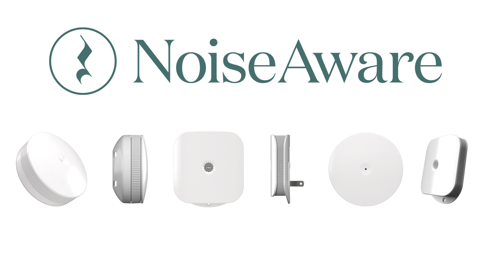
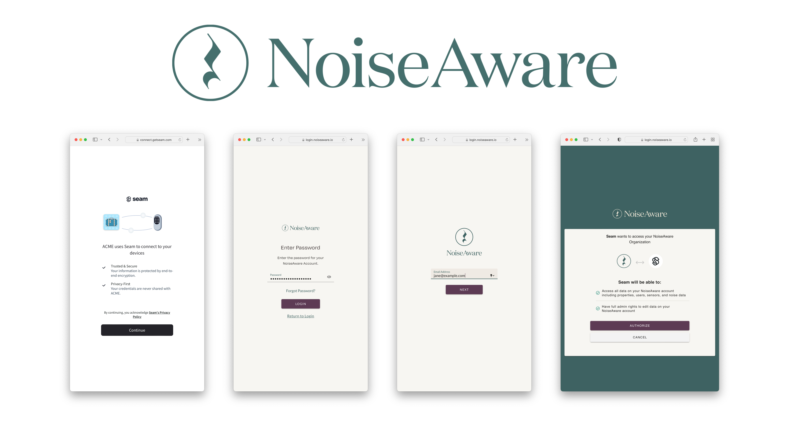

# Get started with NoiseAware Sensors

<figure><figcaption><p>NoiseAware Noise Devices</p></figcaption></figure>

## Overview

Seam provides a universal API to connect and control many brands of devices such as smart locks, thermostats, and sensors. This guide provides a rapid introduction to connecting and controlling your [NoiseAware](https://www.seam.co/manufacturers/noiseaware) devices (called "activity zones" by NoiseAware) using the Seam API. To learn more about other brands of devices supported by Seam, head over to our [integration page](https://www.seam.co/supported-devices-and-systems).

To simplify the examples below, we'll use the following modules and utility variables:

## 1. Install Seam SDK

Seam provides client libraries for many languages, such as JavaScript, Python, Ruby, PHP, and others, as well as a Postman collection and [OpenAPI](https://connect.getseam.com/openapi.json) spec.

* JavaScript / TypeScript ([npm](https://www.npmjs.com/package/seam), [GitHub](https://github.com/seamapi/javascript))
* Python ([pip](https://pypi.org/project/seam/), [GitHub](https://github.com/seamapi/python))
* Ruby Gem ([rubygem](https://rubygems.org/gems/seamapi), [GitHub](https://github.com/seamapi/ruby))
* PHP ([packagist](https://packagist.org/packages/seamapi/seam), [GitHub](https://github.com/seamapi/php))
* Java ([GitHub](https://github.com/seamapi/java))
* C# ([nuget](https://www.nuget.org/packages/Seam), [GitHub](https://github.com/seamapi/csharp))
* Go ([GitHub](https://github.com/seamapi/go))



```bash
npm i seam
```



```bash
pip install seam
# For some development environments, use pip3 in this command instead of pip.
```



```bash
bundle add seamapi
```



```bash
composer require seamapi/seam
```



**Gradle:**

```gradle
// build.gradle
dependencies {
    implementation 'io.github.seamapi:java:0.x.x'
}
```

**Maven:**

```xml
<!-- pom.xml -->
<dependency>
    <groupId>io.github.seamapi</groupId>
    <artifactId>java</artifactId>
    <version>0.x.x</version>
</dependency>
```



Install using [nuget](https://www.nuget.org/packages/Seam).



```bash
go get github.com/seamapi/go
```



Once installed, [sign-up for Seam](https://console.seam.co/) to get your API key, and export it as an environment variable:

```
$ export SEAM_API_KEY=seam_test2ZTo_0mEYQW2TvNDCxG5Atpj85Ffw
```


This guide uses a Sandbox Workspace. Only virtual activity zones can be connected. If you need to connect a real Noiseaware device, use a non-sandbox workspace and API key.


## 2. Link NoiseAware Account with Seam

To control your NoiseAware device via the Seam API, you must first authorize your Seam workspace against your NoiseAware account. To do so, Seam provides[ Connect Webviews](../core-concepts/connect-webviews/): pre-built UX flows that walk you through authorizing your application to control your NoiseAware device.

### Create a Connect Webview



```python
from seam import Seam
seam = Seam()

webview = seam.connect_webviews.create(accepted_providers=["noiseaware"])

assert webview.login_successful is False

# Send this webview url to your user!
print(webview.url)
```



```javascript
import { Seam } from 'seam'

const seam = new Seam()

const connectWebview = await seam.connectWebviews.create({
  accepted_providers: ["noiseaware"],
})

console.log(connectWebview.login_successful) // false

// Send the webview URL to your user
console.log(connectWebview.url)
```



```ruby
require "seamapi"

seam = Seam::Client.new(api_key: "MY_API_KEY")

webview = seam.connect_webviews.create(
  accepted_providers: ["noiseaware"]
)

puts webview.login_successful # false

# Send the webview URL to your user 
puts webview.url
```



```php
use Seam\SeamClient;

$seam = new SeamClient("YOUR_API_KEY");

$webview = $seam->connect_webviews->create(
  accepted_providers: ["noiseaware"]
);

echo json_encode($webview)
/*
{"connect_webview_id":"70c4df9e-1070-441f-92f8-fd6524062cec","workspace_id":"d7418ff3-a476-4f48-9a4b-211d1d21a03d","url":"https:\/\/connect.getseam.com\/connect_webviews\/view?connect_webview_id=70c4df9e-1070-441f-92f8-fd6524062cec&auth_token=9HJbwWKbD5aJLifZcozU9WWZXxropn9Bg","connected_account_id":null,"status":"pending","custom_redirect_url":null,"custom_redirect_failure_url":null,"created_at":"2023-02-09T02:14:06.147745+00:00","error":null}
*/
```



### Authorize Your Workspace

Navigate to the URL returned by the Webview object. Since you are using a sandbox workspace, complete the login flow by entering the NoiseAware [sandbox test accounts ](https://docs.seam.co/latest/device-guides/sandbox-and-sample-data)credentials below:

* **email**: jane@example.com
* **password**: 1234

<figure><figcaption><p>Seam Connect Webview flow to connect NoiseAware account with Seam</p></figcaption></figure>

### Get the New Webview

After you complete the login above, you'll get an event for [`connected_account.created`](../api-clients/events/)if you set up a [webhook handler](../core-concepts/webhooks.md). Otherwise you can just poll for the webview until it's status changes, as shown below:



```python
updated_webview = seam.connect_webviews.get(
    webview.connect_webview_id
)

assert updated_webview.login_successful # true
```



```ruby
updated_webview = seam.connect_webviews.get(webview.connect_webview_id)

puts updated_webview.login_successful # true
```



```php
$webview = $seam->connect_webviews->get($webview->id);
echo json_encode($webview);
```



```javascript
const updatedWebview = await seam.connectWebviews.get(
  connectWebview.connect_webview_id,
)

console.log(updatedWebview.login_successful) // true
```



## 3. Retrieve NoiseAware

NoiseAware noise devices appear with the `device_type` `"noiseaware_activity_zone"`.



```python
devices = seam.devices.list(device_type="noiseaware_activity_zone")

devices[0]
# Device(
# Device(
#   device_id="617415c6-2aa4-43ac-b436-879951f891b0",
#   device_type="noiseaware_activity_zone",
#   location=None,
#   properties={
#     "online": True,
#     "manufacturer": "noiseaware",
#     "has_direct_power": True,
#     "noiseaware_metadata": {
#       "device_id": "98765",
#       "device_name": "Conference Room",
#       "noise_level_nrs": 0,
#       "noise_level_decibel": 2},
#       "name": "Conference Room",
#       "image_url": "https://connect.getseam.com/assets/images/devices/noiseaware_logo_square.png",
#       "image_alt_text": "NoiseAware Noise Sensor"
#     },
#     capabilities_supported=["noise_detection"],
#   errors=[]
# )
```



```javascript
const devices = await seam.devices.list({
  device_type: 'noiseaware_activity_zone',
})

console.log(devices[0])
/*
{
  device_id: '617415c6-2aa4-43ac-b436-879951f891b0',
  device_type: 'noiseaware_activity_zone',
  capabilities_supported: [ 'noise_detection' ],
  properties: {
    online: true,
    manufacturer: 'noiseaware',
    has_direct_power: true,
    noiseaware_metadata: {
      device_id: '98765',
      device_name: 'Conference Room',
      noise_level_nrs: 0,
      noise_level_decibel: 2
    },
    name: 'Conference Room',
    image_url: 'https://connect.getseam.com/assets/images/devices/noiseaware_logo_square.png',
    image_alt_text: 'NoiseAware Noise Sensor'
  },
  location: null,
  connected_account_id: 'cf7d41f9-cdbb-444a-b3f0-5a8143727dbd',
  workspace_id: '2c5f5397-37b9-4236-beac-f47f050d42cd',
  created_at: '2023-05-19T20:06:10.789Z',
  errors: [],
  warnings: []
}
*/
```



```ruby
seam.devices.list(
  device_type: "noiseaware_activity_zone"
).first

# <Seam::Device:0x00be0
#  device_id="617415c6-2aa4-43ac-b436-879951f891b0"
#  device_type="noiseaware_activity_zone"
#  properties={
#    "online"=>true,
#    "manufacturer"=>"noiseaware",
#    "has_direct_power"=>true,
#    "noiseaware_metadata"=>{
#      "device_id"=>"98765",
#      "device_name"=>"Conference Room",
#      "noise_level_nrs"=>0,
#      "noise_level_decibel"=>2
#   },
#   "name"=>"Conference Room",
#   "image_url"=>"https://connect.getseam.com/assets/images/devices/noiseaware_logo_square.png",
#   "image_alt_text"=>"NoiseAware Noise Sensor"
# }
# created_at=2023-05-19 20:06:10.789 UTC
# errors=[]
# warnings=[]>
```



```php
$devices = $seam->devices->list(device_type: 'noiseaware_activity_zone');

echo json_encode($device[0]);
/*
{
  device_id: '617415c6-2aa4-43ac-b436-879951f891b0',
  device_type: 'noiseaware_activity_zone',
  capabilities_supported: [ 'noise_detection' ],
  properties: {
    online: true,
    manufacturer: 'noiseaware',
    has_direct_power: true,
    noiseaware_metadata: {
      device_id: '98765',
      device_name: 'Conference Room',
      noise_level_nrs: 0,
      noise_level_decibel: 2
    },
    name: 'Conference Room',
    image_url: 'https://connect.getseam.com/assets/images/devices/noiseaware_logo_square.png',
    image_alt_text: 'NoiseAware Noise Sensor'
  },
  location: null,
  connected_account_id: 'cf7d41f9-cdbb-444a-b3f0-5a8143727dbd',
  workspace_id: '2c5f5397-37b9-4236-beac-f47f050d42cd',
  created_at: '2023-05-19T20:06:10.789Z',
  errors: [],
  warnings: []
}
*/
```



## 4. Receive Noise Events

NoiseAware users can define noise thresholds at which noise alerts are sent.

You'll get an event for `noise_threshold.noise_threshold_triggered` when you set up a [webhook handler](../core-concepts/webhooks.md). You can also [poll for events](../api-clients/events/list-events.md).


NoiseAware has three distinct noise alerts: `newNoise`, `continuedNoise`, and `resolvedNoise`. It is essential to keep in mind that Seam will solely trigger the `noise_threshold.noise_threshold_triggered` event for `newNoise`.




```python
@app.route("/my_webhook_endpoint", methods=["POST"])
def endpoint():
    event = request.json["event"]
    # {
    # "event_id": "d8ffcf85-73f7-4383-b832-ed65db93c802",
    # "device_id": "617415c6-2aa4-43ac-b436-879951f891b0",
    # "event_type": "noise_sensor.noise_threshold_triggered",
    # "workspace_id": "2c5f5397-37b9-4236-beac-f47f050d42cd",
    # "created_at": "2023-03-14T05:00:35.451Z"
    # "occurred_at": "2023-05-20T00:01:31.273Z",
    # "noiseaware_metadata": {
    #   "noiseaware_alert_info": "ALERT: Noise Sensors at [PropertyName] has sustained noise above the NRS threshold. dashboard.noiseaware.io/properties/[APIKey]",
    #   "noiseaware_alert_time": "2023-05-20T00:01:31.180Z",
    #   "noiseaware_alert_type": "newNoise",
    #   "noiseaware_property_id": 12345,
    #   "noiseaware_property_name": "Acme Corporation"
    # }
        
```



```javascript
app.post('/my_webhook_endpoint', (req, res) => {
  const event = req.body.event;
  // {
  // "event_id": "d8ffcf85-73f7-4383-b832-ed65db93c802",
  // "device_id": "617415c6-2aa4-43ac-b436-879951f891b0",
  // "event_type": "noise_sensor.noise_threshold_triggered",
  // "workspace_id": "2c5f5397-37b9-4236-beac-f47f050d42cd",
  // "created_at": "2023-03-14T05:00:35.451Z"
  // "occurred_at": "2023-05-20T00:01:31.273Z",
  // "noiseaware_metadata": {
  //   "noiseaware_alert_info": "ALERT: Noise Sensors at [PropertyName] has sustained noise above the NRS threshold. dashboard.noiseaware.io/properties/[APIKey]",
  //   "noiseaware_alert_time": "2023-05-20T00:01:31.180Z",
  //   "noiseaware_alert_type": "newNoise",
  //   "noiseaware_property_id": 12345,
  //   "noiseaware_property_name": "Acme Corporation"
  // }
});
```



```ruby
post '/my_webhook_endpoint' do
  request.body.rewind
  payload = JSON.parse(request.body.read)
  event = payload['event']
  # {
  #   "event_id": "d8ffcf85-73f7-4383-b832-ed65db93c802",
  #   "device_id": "617415c6-2aa4-43ac-b436-879951f891b0",
  #   "event_type": "noise_sensor.noise_threshold_triggered",
  #   "workspace_id": "2c5f5397-37b9-4236-beac-f47f050d42cd",
  #   "created_at": "2023-03-14T05:00:35.451Z"
  #   "occurred_at": "2023-05-20T00:01:31.273Z",
  #   "noiseaware_metadata": {
  #     "noiseaware_alert_info": "ALERT: Noise Sensors at [PropertyName] has sustained noise above the NRS threshold. dashboard.noiseaware.io/properties/[APIKey]",
  #     "noiseaware_alert_time": "2023-05-20T00:01:31.180Z",
  #     "noiseaware_alert_type": "newNoise",
  #     "noiseaware_property_id": 12345,
  #     "noiseaware_property_name": "Acme Corporation"
  #   }
  # }
end
```



```php
$app->post('/my_webhook_endpoint', function (Request $request, Response $response) {
    $data = $request->getParsedBody();
    $event = $data['event'];
    // {
    //   "event_id": "d8ffcf85-73f7-4383-b832-ed65db93c802",
    //   "device_id": "617415c6-2aa4-43ac-b436-879951f891b0",
    //   "event_type": "noise_sensor.noise_threshold_triggered",
    //   "workspace_id": "2c5f5397-37b9-4236-beac-f47f050d42cd",
    //   "created_at": "2023-03-14T05:00:35.451Z",
    //   "occurred_at": "2023-05-20T00:01:31.273Z",
    //   "noiseaware_metadata": {
    //     "noiseaware_alert_info": "ALERT: Noise Sensors at [PropertyName] has sustained noise above the NRS threshold. dashboard.noiseaware.io/properties/[APIKey]",
    //     "noiseaware_alert_time": "2023-05-20T00:01:31.180Z",
    //     "noiseaware_alert_type": "newNoise",
    //     "noiseaware_property_id": 12345,
    //     "noiseaware_property_name": "Acme Corporation"
    //   }
    // }
});
```



## Next Steps

Now that you've completed this guide, you can try to connect a real NoiseAware device. To do so, make sure to switch to a non-sandbox workspace and API key as real devices cannot be connected to sandbox workspaces.

If you have any questions or want to report an issue, email us at support@seam.co
