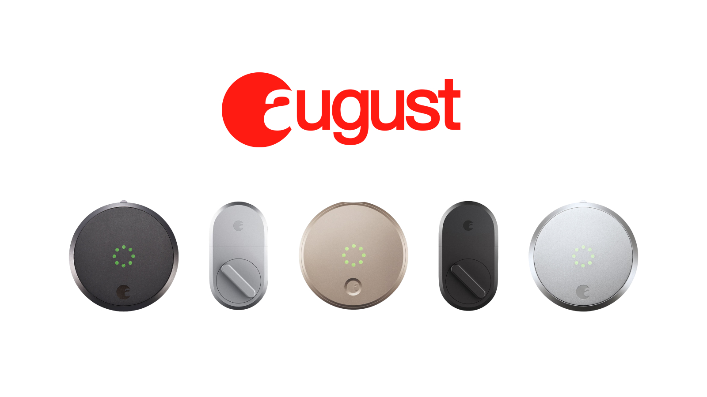

# Get started with React Components and Client Session Tokens

<!-- <figure><figcaption><p>August Smart Locks</p></figcaption></figure> -->

## Overview

Seam provides React Components and hooks to connect and control many types of smart devices. This guide provides a rapid introduction to using React
Components with Client Session Tokens.

For this guide, we expect you to have a **backend server** and a **client frontend react application**. If you want to integrate Seam using only a client without
a backend, you'll need to use a `publishable_key` (guide coming soon!)

### What are Client Session Tokens?

Client Session Tokens are tokens that allow a device owner to make API requests
to Seam, but only interact with their own devices. You'll need to create a
client session token and give it to the `<SeamProvider />` in order for your
user to interact with their devices.

## 1 — Install Seam SDK on your Server

Seam provides client libraries for many languages such as Javascript, Python, Ruby, and PHP, as well as a Postman collection and [OpenAPI](https://connect.getseam.com/openapi.json) spec.

- **Javascript:** `npm i seamapi` ([npm](https://www.npmjs.com/package/seamapi), [github](https://github.com/seamapi/javascript))
- **Python:** `pip install seamapi` ([pip](https://pypi.org/project/seamapi/), [github](https://github.com/seamapi/python))
- **Ruby:** `bundle add seamapi` ([rubygem](https://rubygems.org/gems/seamapi), [github](https://github.com/seamapi/ruby))
- **PHP:** `composer require seamapi/seam` ([packagist](https://packagist.org/packages/seamapi/seam), [github](https://github.com/seamapi/php))

Once installed, [sign-up for Seam](https://console.seam.co/) to get your API key, and export it as an environment variable:

```
$ export SEAM_API_KEY=seam_test2ZTo_0mEYQW2TvNDCxG5Atpj85Ffw
```


This guide uses a Sandbox Workspace. Only virtual devices can be connected. If you need to connect a real August Lock, use a non-sandbox workspace and API key.


## 2 - Install `@seamapi/react`

```bash
npm install --save @seamapi/react
# or via yarn
yarn add @seamapi/react
```

## 3 — Create a Client Session on your Server, and pass it to the Client

We'll start by writing some server code that returns a client session. There
are a lot of ways to do this depending on your server framework:

- Create an endpoint such as `/api/seam/get_client_session_token` and call it
  from your frontend app
- Inject the client session token in your html if you're using an HTML
  templating engine.

For this guide, we'll assume you're creating an endpoint that will return
a client session token. This is often appropriate for Single Page Applications.




```javascript
import { Seam } from "seamapi"

export default (req, res) => {
  // Do authentication logic
  const userId = "<from your internal authentication>"

  // Pull any accounts associated with this user
  // You can also use connect webview ids, or just pass an empty array if you'd
  // like the user to make the connect webviews themselves in the frontend!
  const accountsAssociatedWithUser = [{ seamConnectedAccountId: "..." }]

  const seam = new Seam()

  const clientSession = seam.client_sessions.create({
    connected_account_ids: accountsAssociatedWithUser.map(
      (acc) => acc.seamConnectedAccountId
    ),
  })

  res.status(200).json({
    seamClientSessionToken: clientSession.token,
  })
}
```




```php
<?php

namespace App\Http\Controllers\Api;

use App\Http\Controllers\Controller;
use Illuminate\Http\Request;

class SeamController extends Controller
{
    public function getSeamCst()
    {
        // Assuming you have some data to return
        $data = [
            'seamClientSessionToken' => $seam->client_sessions->create(
              // pull any connected accounts the current user has access to
              connected_account_ids: ["..."]
            )
        ];

        return response()->json($data);
    }
}
```

```php
// routes/api.php
// ...
Route::get('/seam/get_seam_cst', 'Api\SeamController@getSeamCst');
// ...

```




Awesome! We can now request this from the frontent client application using
something a hook like this:

```javascript
// lib/hooks/use-seam-cst.js
import { useState, useEffect } from "react"

export const useSeamCST = () => {
  const [cst, setCST] = useState()

  useEffect(() => {
    const res = fetch("/api/seam/get_client_session_token", {
      method: "POST",
      headers: {
        Authorization: `Bearer ${myAppAuthToken}`,
      },
    }).json()
    setCST(res.seamClientSessionToken)
  }, [])

  return cst
}
```


Why do we need the backend for getting the Client Session Token? It allows you
to use your application's existing authentication! If you want to have Seam
handle all the user authentication, you can use a publishable key, but we
recommend using client session tokens!


## 4 - Use Your Client Session Token to Display a User's Devices

```javascript
import { SeamProvider, DeviceTable } from "@seamapi/react"
import { useSeamCST } from "lib/hooks/use-seam-cst"

export const App = () => {
  const cst = useSeamCST()
  return (
    <SeamProvider clientSessionToken={cst}>
      <DeviceTable />
    </SeamProvider>
  )
}
```

You should see a list of devices like what's shown below:

<figure><figcaption><p>Device Table React Component</p></figcaption></figure>

## Next Steps

- View and play with components in the [interactive storybook component library](https://seam-react.vercel.app/)
- Check out some [Full Example Apps](https://github.com/seamapi/react/tree/main/examples)

If you have any questions or want to report an issue, email us at support@seam.co.
