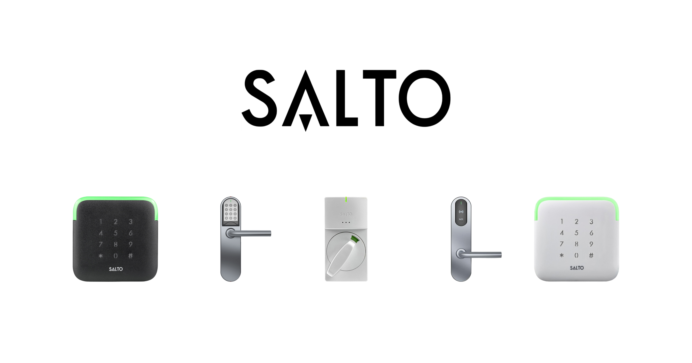
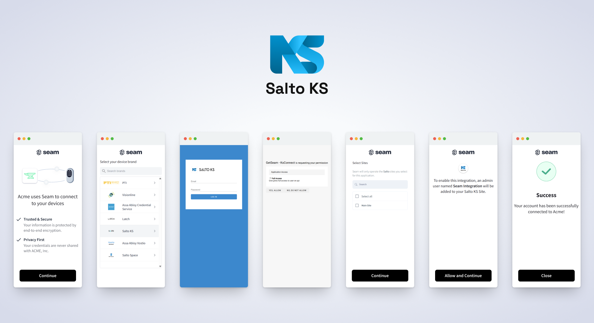

# Get started with Salto KS Locks

<figure><figcaption><p>Salto Locks</p></figcaption></figure>

## Overview

Seam provides a universal API to connect and control many brands of locks. This guide provides a rapid introduction to connecting and controlling your [Salto](https://www.seam.co/manufacturers/salto) locks using the Seam API. To learn more about other device brands supported by the Seam API, such as Yale, Schlage, and August, head over to our [integration page](https://www.seam.co/supported-devices-and-systems).

Note that Salto offers multiple lines of products: Salto Space, Salto KS, and Salto Nebula. This guide is specifically for Salto KS. Salto Space is an on-prem system that is offline. Salto Nebula is not yet fully available as of this writing.

## 1 — Install Seam SDK

Seam provides client libraries for many languages, such as JavaScript, Python, Ruby, PHP, and others, as well as a Postman collection and [OpenAPI](https://connect.getseam.com/openapi.json) spec.

* JavaScript / TypeScript ([npm](https://www.npmjs.com/package/seam), [GitHub](https://github.com/seamapi/javascript))
* Python ([pip](https://pypi.org/project/seam/), [GitHub](https://github.com/seamapi/python))
* Ruby Gem ([rubygem](https://rubygems.org/gems/seam), [GitHub](https://github.com/seamapi/ruby))
* PHP ([packagist](https://packagist.org/packages/seamapi/seam), [GitHub](https://github.com/seamapi/php))
* C# ([nuget](https://www.nuget.org/packages/Seam), [GitHub](https://github.com/seamapi/csharp))



```bash
npm i seam
```



```bash
pip install seam
# For some development environments, use pip3 in this command instead of pip.
```



```bash
bundle add seam
```



```bash
composer require seamapi/seam
```



Install using [nuget](https://www.nuget.org/packages/Seam).



Once installed, [sign-up for Seam](https://console.seam.co/) to get your API key, and export it as an environment variable:

```
$ export SEAM_API_KEY=seam_test2ZTo_0mEYQW2TvNDCxG5Atpj85Ffw
```


This guide uses a Sandbox Workspace. Only virtual devices can be connected. If you need to connect a real Salto site, use a non-sandbox workspace and API key.


## 2 — Link Your Salto KS Account with Seam

To control your Salto locks via the Seam API, you must first authorize your Seam workspace against your Salto KS account. To do so, Seam provides[ Connect Webviews](../core-concepts/connect-webviews/): pre-built UX flows that walk you through authorizing your application to control your Salto sites.

#### Create a Connect Webview



**Code:**

```python
from seam import Seam

seam = Seam()  # Seam automatically uses your exported SEAM_API_KEY.

connect_webview = seam.connect_webviews.create(accepted_providers=["salto_ks"])

assert connect_webview.login_successful is False

# Use the returned Connect Webview URL to display
# the Connect Webview authorization flow to your user.
print(connect_webview.url)
```

**Output:**

```
https://connect.getseam.com/connect_webviews/view?connect_webview_id=12345678-1234-1234-1234-123456789012&auth_token=XXXXXXXXXXXXXXXXXXXXXXXXXXXXXXXXX
```



**Code:**

```bash
curl -X 'POST' \
  'https://connect.getseam.com/connect_webviews/create' \
  -H 'accept: application/json' \
  -H "Authorization: Bearer ${SEAM_API_KEY}" \
  -H 'Content-Type: application/json' \
  -d '{
  "accepted_providers": ["salto_ks"]
}' | jq -r '"Login Successful (false): " + (.connect_webview.login_successful | tostring),
  "URL: " + .connect_webview.url'
  # Use the returned Connect Webview URL to display
  # the Connect Webview authorization flow to your user.
```

**Output:**

```
Login Successful (false): false
https://connect.getseam.com/connect_webviews/view?connect_webview_id=12345678-1234-1234-1234-123456789012&auth_token=XXXXXXXXXXXXXXXXXXXXXXXXXXXXXXXXX
```



**Code:**

```javascript
import { Seam } from "seam";

const seam = new Seam(); // Seam automatically uses your exported SEAM_API_KEY.

const connectWebview = await seam.connectWebviews.create({
  accepted_providers: ['salto_ks']
});

console.log(connectWebview.login_successful); // false

// Use the returned Connect Webview URL to display
// the Connect Webview authorization flow to your user.
console.log(connectWebview.url);
```

**Output:**

```
false
https://connect.getseam.com/connect_webviews/view?connect_webview_id=12345678-1234-1234-1234-123456789012&auth_token=XXXXXXXXXXXXXXXXXXXXXXXXXXXXXXXXX
```



**Code:**

```ruby
require "seam"

seam = Seam.new() # Seam automatically uses your exported SEAM_API_KEY.

connect_webview = seam.connect_webviews.create(
  accepted_providers: ["salto_ks"]
)

puts connect_webview.login_successful # false

# Use the returned Connect Webview URL to display
# the Connect Webview authorization flow to your user.
puts connect_webview.url
```

**Output:**

```
false
https://connect.getseam.com/connect_webviews/view?connect_webview_id=12345678-1234-1234-1234-123456789012&auth_token=XXXXXXXXXXXXXXXXXXXXXXXXXXXXXXXXX
```



**Code:**

```php
<?php
require 'vendor/autoload.php';

$seam = new Seam\SeamClient(); // Seam automatically uses your exported SEAM_API_KEY.

$connect_webview = $seam->connect_webviews->create(
  accepted_providers: ["salto_ks"]
);

echo $connect_webview->login_successful ? 'true' : 'false', "\n"; // false

// Use the returned Connect Webview URL to display
// the Connect Webview authorization flow to your user.
echo $connect_webview->url;
```

**Output:**

```
false
https://connect.getseam.com/connect_webviews/view?connect_webview_id=12345678-1234-1234-1234-123456789012&auth_token=XXXXXXXXXXXXXXXXXXXXXXXXXXXXXXXXX
```



**Code:**

```csharp
using Seam.Client;

var seam = new SeamClient(apiToken: SEAM_API_KEY);

var connectWebview = seam.ConnectWebviews.Create(
  acceptedProviders: new() {Seam.Api.ConnectWebviews.CreateRequest.AcceptedProvidersEnum.SaltoKs}
);

Console.WriteLine(connectWebview.LoginSuccessful); // False

// Use the returned Connect Webview URL to display
// the Connect Webview authorization flow to your user.
Console.WriteLine(connectWebview.Url);
```

**Output:**

```
False
https://connect.getseam.com/connect_webviews/view?connect_webview_id=12345678-1234-1234-1234-123456789012&auth_token=XXXXXXXXXXXXXXXXXXXXXXXXXXXXXXXXX
```



#### Authorize Your Workspace

Navigate to the URL returned by the Webview object. Since you are using a sandbox workspace, complete the login flow by entering the Salto [sandbox test accounts ](https://docs.seam.co/latest/device-guides/sandbox-and-sample-data)credentials below:

* **email:** jane@example.com
* **password:** 1234


During the authorization process, Seam adds an admin user to your Salto KS site. Do not suspend or remove this Seam Integration admin user.


<figure><picture><source srcset="../.gitbook/assets/salto-ks_connect-flow-screens_dark.png" media="(prefers-color-scheme: dark)"></picture><figcaption><p>Seam Connect Webview flow to connect your Salto KS account with Seam</p></figcaption></figure>

Confirm the Connect Webview was successful by querying its status:



```python
updated_webview = seam.connect_webviews.get(connect_webview_id: webview.connect_webview_id)

assert updated_webview.login_successful # true
```



```javascript
const updatedWebview = await seam.connectWebviews.get(
  connectWebview.connect_webview_id,
)

console.log(updatedWebview.login_successful) // true
```



```ruby
updated_webview = seam.connect_webviews.get(connect_webview_id: webview.connect_webview_id)

puts updated_webview.login_successful # true
```



```php
$webview = $seam->connect_webviews->get('729847ff-98e0-418d-aeba-1e3cb38157c6');
assert($webview->status == 'pending');
```



## 3 — Retrieve Salto Devices

After a Salto account is linked with Seam, you can retrieve devices for this Salto account. The Seam API exposes most of the device's properties such as battery level.



```python
all_locks = seam.locks.list()

some_lock = all_locks[0]

assert some_lock.properties["online"] is True
assert some_lock.properties["battery_level"] is True

print(some_lock)
# Device(device_id='681bf7bc-e7c6-48e6-acfe-6dbabd0615c5', device_type='salto_lock', location=None, properties={'locked': True, 'online': True, 'battery_level': 1, 'salto_metadata': {'model': 'wall_reader_pin', 'lock_id': 'lock_2', 'lock_type': 'wall_reader_pin', 'locked_state': 'locked', 'battery_level': 'fresh', 'customer_reference': 'BACK DOOR'}, 'has_direct_power': True, 'max_active_codes_supported': 100, 'supported_code_lengths': [6], 'name': 'BACK DOOR'}, capabilities_supported=['access_code', 'lock'])
```



```javascript
const allLocks = await seam.locks.list()

const someLock = allLocks[0]

console.log(someLock.properties.online) // true
console.log(someLock.properties.locked) // true

console.log(someLock)
/*
    {
        "device_id": "681bf7bc-e7c6-48e6-acfe-6dbabd0615c5",
        "device_type": "salto_lock",
        "capabilities_supported": [
            "access_code",
            "lock"
        ],
        "properties": {
            "locked": true,
            "online": true,
            "battery_level": 1,
            "salto_metadata": {
                "model": "wall_reader_pin",
                "lock_id": "lock_2",
                "lock_type": "wall_reader_pin",
                "locked_state": "locked",
                "battery_level": "fresh",
                "customer_reference": "BACK DOOR"
            },
            "has_direct_power": true,
            "max_active_codes_supported": 100,
            "supported_code_lengths": [
                6
            ],
            "name": "BACK DOOR"
        },
        "location": null,
        "connected_account_id": "690dead6-e176-4f25-930b-9aef7c7137ad",
        "workspace_id": "d7418ff3-a476-4f48-9a4b-211d1d21a03d",
        "created_at": "2023-02-08T22:14:09.921Z",
        "errors": [],
        "warnings": []
    }
*/
```



```ruby
some_lock = seam.locks.list.first

puts some_lock.properties.online # true
puts some_lock.properties.locked # true

puts some_lock

# <Seam::Device:0x005c8
#   device_id="681bf7bc-e7c6-48e6-acfe-6dbabd0615c5"
#   device_type="salto_lock"
#   properties={"locked"=>true, "online"=>true, "battery_level"=>1, "salto_metadata"=>{"model"=>"wall_reader_pin", "lock_id"=>"lock_2", "lock_type"=>"wall_reader_pin", "locked_state"=>"locked", "battery_level"=>"fresh", "customer_reference"=>"BACK DOOR"}, "has_direct_power"=>true, "max_active_codes_supported": 100, "supported_code_lengths"=>[6], "name"=>"BACK DOOR"}
#   created_at=2023-02-08 22:14:09.921 UTC
#   errors=[]
#   warnings=[]>
```



```php
use Seam\SeamClient;

$seam = new SeamClient('YOUR_API_KEY');

$locks = $seam->locks->list();

echo json_encode($locks);
/*
[{"device_id":"681bf7bc-e7c6-48e6-acfe-6dbabd0615c5","workspace_id":"d7418ff3-a476-4f48-9a4b-211d1d21a03d","connected_account_id":"690dead6-e176-4f25-930b-9aef7c7137ad","device_type":"salto_lock","properties":{"online":true,"locked":true,"door_open":null,"battery_level":1,"name":"BACK DOOR","manufacturer":null,"august_metadata":null,"schlage_metadata":null,"smartthings_metadata":null},"location":null,"created_at":"2023-02-08T22:14:09.921Z","capabilities_supported":["access_code","lock"],"errors":[]},{"device_id":"c9fc699a-3f87-4d23-b5c2-1f8ac85aeca1","workspace_id":"d7418ff3-a476-4f48-9a4b-211d1d21a03d","connected_account_id":"690dead6-e176-4f25-930b-9aef7c7137ad","device_type":"salto_lock","properties":{"online":true,"locked":true,"door_open":null,"battery_level":1,"name":"EXTRA DOOR","manufacturer":null,"august_metadata":null,"schlage_metadata":null,"smartthings_metadata":null},"location":null,"created_at":"2023-02-08T22:14:09.952Z","capabilities_supported":[],"errors":[]},{"device_id":"da9dcedb-20ee-46df-8c08-e5268f624377","workspace_id":"d7418ff3-a476-4f48-9a4b-211d1d21a03d","connected_account_id":"690dead6-e176-4f25-930b-9aef7c7137ad","device_type":"salto_lock","properties":{"online":true,"locked":true,"door_open":null,"battery_level":1,"name":"FRONT_DOOR","manufacturer":null,"august_metadata":null,"schlage_metadata":null,"smartthings_metadata":null},"location":null,"created_at":"2023-02-08T22:14:09.890Z","capabilities_supported":["access_code","lock"],"errors":[]}]
*/
```



### 4 — Locking & Unlocking a Door

Next, you can perform the basic action of locking and unlocking a door. Note that Salto disables this functionality by default and requires a special pass-through waiver via Seam. Seam automatically configures your IQ hubs to enable this functionality. Please contact us if you need to disable it.


[Broken link](broken-reference)


## Unlock a door

<mark style="color:green;">`POST`</mark> `https://connect.getseam.com/locks/unlock_door`

#### Request Body

| Name       | Type   | Description |
| ---------- | ------ | ----------- |
| device\_id | String |             |



```python
# lock the door
seam.locks.lock_door(device_id: some_lock.device_id)
updated_lock = seam.locks.get(device_id: some_lock.device_id)
assert updated_lock.properties["locked"] is True

# Now unlock the door
seam.locks.unlock_door(device_id: some_lock.device_id)
updated_lock = seam.locks.get(device_id: some_lock.device_id)
assert updated_lock.properties["locked"] is False
```



```javascript
// lock the door
await seam.locks.lockDoor(someLock.device_id)
const updatedLock = await seam.locks.get(someLock.device_id)
console.log(updatedLock.properties.locked) // true

// unlock the door
await seam.locks.unlockDoor(someLock.device_id)
updatedLock = await seam.locks.get(someLock.device_id)
console.log(updatedLock.properties.locked) // false
```



```ruby
# lock the door
seam.locks.lock_door(device_id: some_lock.device_id)
updated_lock = seam.locks.get(device_id: some_lock.device_id)
puts updated_lock.properties.locked # true

# unlock the door
seam.locks.unlock_door(device_id: some_lock.device_id)
updated_lock = seam.locks.get(device_id: some_lock.device_id)
puts updated_lock.properties.locked # false
```



```php
use Seam\SeamClient;

$seam = new SeamClient('YOUR_API_KEY');

$some_lock = $seam->locks->list()[0];

# unlock the door
$seam->locks->unlock_door($lock->device_id);
# lock the door
$seam->locks->lock_door($lock->device_id);
```



### 5 — Setting Access Code on Salto Lock

Some Salto locks and access points will have a keypad available to program access codes. These codes can then be entered to unlock the door.

The Seam API makes it easy to program both `ongoing` codes and `timebound` codes on an Salto lock. You can find out more about Salto lock access code in our [core concept section on access codes.](../products/smart-locks/access-codes/)


Salto does not let you specify a code for an access code. Instead Salto generates a 6-digit code, which the Seam API returns.




```python
# create an ongoing code
seam.access_codes.create(
  device=some_lock,
  name="Personal Access Code")

# create a timebound code
seam.access_codes.create(
  device=some_lock,
  name="My Temp Access Code",
  starts_at="2028-08-12T19:23:42+0000",
  ends_at="2028-08-13T19:23:42+0000")

# you can use a device or a device_id as the "device" parameter
seam.access_codes.list(device=some_lock)

# [
#   AccessCode(access_code_id='631a3a30-3fa7-462a-b3bc-65528ccf8765', type='time_bound', code=None, starts_at='2028-08-12T19:24:00.000Z', ends_at='2028-08-13T19:24:00.000Z', name='My Temp Access Code', status='unset', common_code_key=None),
#  AccessCode(access_code_id='4d2f4952-5446-4051-ba7e-a6fc01a376d7', type='ongoing', code='59026', starts_at=None, ends_at=None, name='Personal Access Code', status='set', common_code_key=None)
#  ]

```



```javascript
// create an ongoing code
await seam.accessCodes.create({
  device_id: someLock.device_id,
  name: 'Personal Access Code',
})

// create a timebound code
await seam.accessCodes.create({
  device_id: someLock.device_id,
  name: 'My Temp Access Code',
  starts_at: '2028-11-12T19:23:42+0000',
  ends_at: '2028-11-13T19:23:42+0000',
})

// use a device_id as the "device_id" parameter
await seam.accessCodes.list({
  device_id: someLock.device_id,
})

/*
[
  {
    access_code_id: '631a3a30-3fa7-462a-b3bc-65528ccf8765',
    device_id: '681bf7bc-e7c6-48e6-acfe-6dbabd0615c5',
    name: 'My Temp Access Code',
    code: null,
    is_waiting_for_code_assignment: true,
    common_code_key: null,
    type: 'time_bound',
    status: 'unset',
    starts_at: '2028-08-12T19:24:00.000Z',
    ends_at: '2028-08-13T19:24:00.000Z',
    created_at: '2023-02-08T23:28:57.061Z',
    errors: [],
    warnings: []
  },
  {
    access_code_id: '774986f8-5fad-4911-a4fb-e5a2ef9f15bd',
    device_id: '681bf7bc-e7c6-48e6-acfe-6dbabd0615c5',
    name: 'Personal Access Code',
    code: '10542',
    common_code_key: null,
    type: 'ongoing',
    status: 'set',
    created_at: '2023-02-08T23:10:54.096Z',
    errors: [],
    warnings: []
  },
]
*/
```



```ruby
# create an ongoing code
seam.access_codes.create(
  device_id: some_lock.device_id, name: 'Personal Access Code'
)

# create a timebound code
seam.access_codes.create(
  device_id: some_lock.device_id,
  name: 'My Temp Access Code',
  starts_at: '2028-08-12T19:23:42+0000',
  ends_at: '2028-08-13T19:23:42+0000'
)

seam.access_codes.list(device_id: some_lock.device_id)

# [<Seam::AccessCode:0x00690
#   access_code_id="631a3a30-3fa7-462a-b3bc-65528ccf8765"
#   name="My Temp Access Code"
#   code=nil
#   type="time_bound"
#   starts_at=2028-08-12 19:24:00 UTC
#   ends_at=2028-08-13 19:24:00 UTC
#   errors=[]
#   warnings=[]>, <Seam::AccessCode:0x006b8
#   access_code_id="774986f8-5fad-4911-a4fb-e5a2ef9f15bd"
#   name="Personal Access Code"
#   code="10542"
#   type="ongoing"
#   errors=[]
#   warnings=[]>]
```



```php
use Seam\SeamClient;

$seam = new SeamClient("YOUR_API_KEY");

$some_lock = $seam->locks->list()[0];
$seam->access_codes->create(
  device_id: $some_lock->device_id, name: 'Personal Access Code'
);

$seam->access_codes->create(
  device_id: $some_lock->device_id,
  name: 'My Temp Access Code',
  starts_at: '2028-08-12T19:23:42+0000',
  ends_at: '2028-08-13T19:23:42+0000'
);

echo json_encode($access_code)
/*
[{"access_code_id":"19cea367-fd8c-40b7-9ce3-6dec76fe1763","name":"My Temp Access Code","type":"time_bound","status":"unset","starts_at":"2028-08-12T19:24:00.000Z","ends_at":"2028-08-13T19:24:00.000Z","code":null,"created_at":"2023-02-09T05:53:46.293Z","errors":[],"warnings":[]},{"access_code_id":"f797a8f0-b8f7-4734-9bea-962de5cad413","name":"Personal Access Code","type":"ongoing","status":"set","starts_at":null,"ends_at":null,"code":"37840","created_at":"2023-02-09T05:53:46.172Z","errors":[],"warnings":[]}]
*/
```



###

## Next Steps

Now that you've completed this guide, you can try to connect a real Salto device. To do so, make sure to switch to a non-sandbox workspace and API key as real devices cannot be connected to sandbox workspaces.

In addition, if you'd like to explore other aspects of Seam, here is a list of helpful resources:

* [Schlage Getting Started Guide](get-started-with-schlage-locks.md)
* [Yale Getting Started Guide](get-started-with-yale-locks.md)
* [SmartThings Getting Started Guide](get-started-with-smartthings-hubs-+-smart-locks.md)
* [Receiving webhook](../core-concepts/webhooks.md) for [device events](../api/events/list.md)
* [Core Concepts](../core-concepts/overview.md)

If you have any questions or want to report an issue, email us at [support@seam.co](mailto:support@seam.co).
