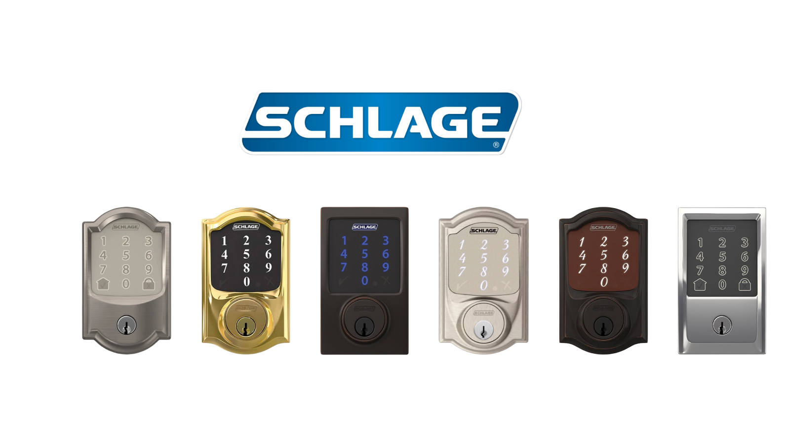

# Get started with Schlage Locks

<figure><figcaption><p>Schlage Smart Locks</p></figcaption></figure>

## Overview

Seam provides a universal API to connect and control many brands of smart locks. This guide provides a rapid introduction to connecting and controlling your [Schlage](https://www.seam.co/manufacturers/schlage) lock using the Seam API. Note that this guide is intended for Schlage Sense locks and Schlage Encode locks that connect to wifi. For Z-Wave Schlage locks such as Schlage Connect, head over to [our guide for SmartThings](get-started-with-smartthings-hubs-+-smart-locks.md).

To learn more about other smart lock brands supported by Seam such as August, Yale, and Salto, head over to our [integration page](https://www.seam.co/supported-devices-and-systems).

## 1 — Install Seam SDK

Seam provides client libraries for many languages, such as JavaScript, Python, Ruby, PHP, and others, as well as a Postman collection and [OpenAPI](https://connect.getseam.com/openapi.json) spec.

* JavaScript / TypeScript ([npm](https://www.npmjs.com/package/seam), [GitHub](https://github.com/seamapi/javascript))
* Python ([pip](https://pypi.org/project/seam/), [GitHub](https://github.com/seamapi/python))
* Ruby Gem ([rubygem](https://rubygems.org/gems/seam), [GitHub](https://github.com/seamapi/ruby))
* PHP ([packagist](https://packagist.org/packages/seamapi/seam), [GitHub](https://github.com/seamapi/php))
* C# ([nuget](https://www.nuget.org/packages/Seam), [GitHub](https://github.com/seamapi/csharp))



```bash
npm i seam
```



```bash
pip install seam
# For some development environments, use pip3 in this command instead of pip.
```



```bash
bundle add seam
```



```bash
composer require seamapi/seam
```



Install using [nuget](https://www.nuget.org/packages/Seam).



Once installed, [sign-up for Seam](https://console.seam.co/) to get your API key, and export it as an environment variable:

```
$ export SEAM_API_KEY=seam_test2ZTo_0mEYQW2TvNDCxG5Atpj85Ffw
```


This guide uses a Sandbox Workspace. Only virtual devices can be connected. If you need to connect a real Schlage Lock, use a non-sandbox workspace and API key.


## 2 — Link Schlage Account with Seam

To control your Schlage lock via the Seam API, you must first authorize your Seam workspace against your Schlage account. To do so, Seam provides[ Connect Webviews](../core-concepts/connect-webviews/): pre-built UX flows that walk you through authorizing your application to control your Schlage lock.

#### Request a Connect Webview



```python
from seam import Seam

seam = Seam()

webview = seam.connect_webviews.create(accepted_providers=["schlage"])

assert webview.login_successful is False

# Send the webview URL to your user
print(webview.url)
```



```javascript
import { Seam } from 'seam'

const seam = new Seam()

const { connect_webview: connectWebview } = await seam.connectWebviews.create({
  accepted_providers: ['schlage'],
})

console.log(connectWebview.login_successful) // false

// Send the webview URL to your user
console.log(connectWebview.url)
```



```ruby
require "seam"

seam = Seam.new(api_key: "MY_API_KEY")

webview = seam.connect_webviews.create(
  accepted_providers: ["schlage"]
)

puts webview.login_successful # false

# Send the webview URL to your user
puts webview.url
```



#### Authorize Your Workspace

Navigate to the URL returned by the Webview object. Since you are using a sandbox workspace, complete the login flow by entering the Schlage [sandbox test accounts ](https://docs.seam.co/latest/device-guides/sandbox-and-sample-data)credentials below:

* **email:** jane@example.com
* **password:** 1234
* **2-factor-auth:** 123456

<figure><figcaption><p>Seam Connect Webview flow to connect Schlage account with Seam</p></figcaption></figure>

Confirm the Connect Webview was successful by querying its status:



```python
updated_webview = seam.connect_webviews.get(connect_webview_id: webview.connect_webview_id)

assert updated_webview.login_successful # true
```



```javascript
const updatedWebview = await seam.connectWebviews.get(
  connectWebview.connect_webview_id,
)

console.log(updatedWebview.login_successful) // true
```



```ruby
updated_webview = seam.connect_webviews.get(connect_webview_id: webview.connect_webview_id)

puts updated_webview.login_successful # true
```



## 3 — Retrieve Schlage Lock Devices

After a Schlage account is linked with Seam, you can retrieve devices for this Schlage account. The Seam API exposes most of the device's properties such as battery level or door lock status.



\\\\\\\\\\\\\\\\\\\\\\\\\\\\\\\\\\\\\\\\\\\\\\\\\\\\\\\\\\\\\\\\\\\\\\\\\\\\\\\\\\\\\\\\\\\\\\\\\\\\\\\\\\\\\\\\\\\\\\\\\\\\\\\`\\\\\\\\\\\\\\\\\\\\\\\\\\\\\\\\\\\\\\\\\\\\\\\\\\\\\\\\\\\\\\\\\\\\\\\\\\\\\\\\\\\\\\\\\\\\\\\\\\\\\\\\\\\\\\\\\\\\\\\\\\\\\\\`\\\\\\\\\\\\\\\\\\\\\\\\\\\\\\\\\\\\\\\\\\\\\\\\\\\\\\\\\\\\\\\\\\\\\\\\\\\\\\\\\\\\\\\\\\\\\\\\\\\\\\\\\\\\\\\\\\\\\\\\\\\\\\\`\\\\\\\\\\\\\\\\\\\\\\\\\\\\\\\\\\\\\\\\\\\\\\\\\\\\\\\\\\\\\\\\\\\\\\\\\\\\\\\\\\\\\\\\\\\\\\\\\\\\\\\\\\\\\\\\\\\\\\\\\\\\\\\`python all\\\\\\\\\\\\\\\\\\\\\\\\\\\\\\\\\\\\\\\\\\\\\\\\\\\\\\\\\\\\\\\\\\\\\\\\\\\\\\\\\\\\\\\\\\\\\\\\\\\\\\\\\\\\\\\\\\\\\\\\\\\\\\\_locks = seam.locks.list()

some\_lock = all\_locks\[0]

assert some\_lock.properties\["online"] is True assert some\_lock.properties\["locked"] is True

print(some\_lock)

```python
# Device(device_id='e2d95c42-b2bf-4d07-9211-7407d9c90c73',
#   device_type='schlage_lock',
#   location=None,
#   properties={
#     'locked': True,
#     'online': True,
#     'manufacturer': 'schlage',
#     'battery_level': 0.48,
#     'schlage_metadata': {'device_id': 'device-1', 'device_name': 'FRONT DOOR', 'access_code_length': 4}, 'name': 'FRONT DOOR'
#   },
#   capabilities_supported=['access_code', 'lock'])
```

````



`

``javascript
const allLocks = await seam.locks.list()

const someLock = allLocks[0]

console.log(someLock.properties.online) // true
console.log(someLock.properties.locked) // true

console.log(someLock)
/*
{
  device_id: 'e2d95c42-b2bf-4d07-9211-7407d9c90c73',
  device_type: 'schlage_lock',
  capabilities_supported: [ 'access_code', 'lock' ],
  properties: {
    locked: false,
    online: true,
    manufacturer: 'schlage',
    battery_level: 0.48,
    schlage_metadata: {
      device_id: 'device-1',
      device_name: 'FRONT DOOR',
      access_code_length: 4
    },
    name: 'FRONT DOOR'
  },
  location: null,
  connected_account_id: '1de737bc-12d1-4631-8a56-dbb2e61f1f51',
  workspace_id: 'd7418ff3-a476-4f48-9a4b-211d1d21a03d',
  created_at: '2022-12-16T01:15:17.478Z',
  errors: [],
  warnings: []
}
*/
```

</div>

<div data-gb-custom-block data-tag="tab" data-title='Ruby'>

```ruby
some_lock = seam.locks.list.first

puts some_lock.properties.online # true
puts some_lock.properties.locked # true

puts some_lock #   warnings=[]> #   errors=[] #   created_at=2022-12-16 01:15:17.478 UTC #     "name"=>"FRONT DOOR"} #     "schlage_metadata"=>{"device_id"=>"device-1", "device_name"=>"FRONT DOOR", "access_code_length"=>4},  #     "battery_level"=>0.48,  #     "manufacturer"=>"schlage",  #     "online"=>true,  #     "locked"=>false,  #   properties={ #   device_type="schlage_lock" #   device_id="e2d95c42-b2bf-4d07-9211-7407d9c90c73" # <Seam::Device:0x009b0
```

</div>

</div>

### 4 — Locking & Unlocking a Door

Next, you can perform the basic action of locking and unlocking the door.

<div data-gb-custom-block data-tag="openapi" data-src='../.gitbook/assets/openapi.json' data-path='/locks/lock_door' data-method='post'>

[openapi.json](../.gitbook/assets/openapi.json)

</div>

## Unlock a door

<mark style="color:green;">`POST`</mark> `https://connect.getseam.com/locks/unlock_door`

#### Request Body

| Name       | Type   | Description |
| ---------- | ------ | ----------- |
| device\_id | String |             |

<div data-gb-custom-block data-tag="tabs">

<div data-gb-custom-block data-tag="tab" data-title='Python'>

```python
# lock the door
seam.locks.lock_door(device_id: some_lock.device_id)
updated_lock = seam.locks.get(device_id: some_lock.device_id)
assert updated_lock.properties["locked"] is True

# Now unlock the door
seam.locks.unlock_door(device_id: some_lock.device_id)
updated_lock = seam.locks.get(device_id: some_lock.device_id)
assert updated_lock.properties["locked"] is False
```

</div>

<div data-gb-custom-block data-tag="tab" data-title='Javascript'>

```javascript
// lock the door
await seam.locks.lockDoor(someLock.device_id)
const updatedLock = await seam.locks.get(someLock.device_id)
console.log(updatedLock.properties.locked) // true

// unlock the door
await seam.locks.unlockDoor(someLock.device_id)
updatedLock = await seam.locks.get(someLock.device_id)
console.log(updatedLock.properties.locked) // false
```

</div>

<div data-gb-custom-block data-tag="tab" data-title='Ruby'>

```ruby
# lock the door
seam.locks.lock_door(device_id: some_lock.device_id)
updated_lock = seam.locks.get(device_id: some_lock.device_id)
puts updated_lock.properties.locked # true

# unlock the door
seam.locks.unlock_door(device_id: some_lock.device_id)
updated_lock = seam.locks.get(device_id: some_lock.device_id)
puts updated_lock.properties.locked # false
```

</div>

</div>

### 5 — Setting Access Code on Schlage Lock

All Schlage wifi locks come with a keypad built-in to program access codes. These codes can then be entered to unlock a Schlage lock.

The Seam API makes it easy to program both `ongoing` codes and `timebound` codes on a Schlage lock. You can find out more about Schlage lock access code in our [core concept section on access codes.](../products/smart-locks/access-codes/)

<div data-gb-custom-block data-tag="tabs">

<div data-gb-custom-block data-tag="tab" data-title='Python'>

```python
# create an ongoing code
seam.access_codes.create(
    device=some_lock, code="123456", name="Personal Access Code"
)

# create a timebound code
seam.access_codes.create(
    device=some_lock,
    code="888888",
    name="My Temp Access Code",
    starts_at="2028-08-12T19:23:42+0000",
    ends_at="2028-08-13T19:23:42+0000"
)

# you can use a device or a device_id as the "device" parameter
seam.access_codes.list(device=some_lock)
# [
#   AccessCode(
#     access_code_id='af5272b1-2a49-4eb5-9388-2447fc7b5bd1',
#     type='ongoing',
#     code='123459'
#   ),
#   AccessCode(
#     access_code_id='8c2db4da-b137-4c08-a2c3-d611e6ff91b3',
#     type='timebound',
#     code='888888',
#     starts_at='2028-08-12T19:24:00.000Z',
#     ends_at='2028-08-13T19:24:00.000Z',
#   )
# ]

```

</div>

<div data-gb-custom-block data-tag="tab" data-title='Javascript'>

```javascript
// create an ongoing code
await seam.accessCodes.create({
  device_id: someLock.device_id,
  code: '123456',
  name: 'Personal Access Code',
})

// create a timebound code
await seam.accessCodes.create({
  device_id: someLock.device_id,
  code: '888888',
  name: 'My Temp Access Code',
  starts_at: '2028-11-12T19:23:42+0000',
  ends_at: '2028-11-13T19:23:42+0000',
})

// use a device_id as the "device_id" parameter
await seam.accessCodes.list({
  device_id: someLock.device_id,
})

/*
[
  {
    code: '1988',
    type: 'ongoing',
    status: 'setting',
    created_at: '2022-08-26T12:50:17.858Z',
    access_code_id: '26d6138c-6524-4f3c-ac96-43cc3bea0a8d'
  },
  {
    type: 'timebound',
    code: '888888',
    starts_at: '2028-08-12T19:24:00.000Z',
    ends_at: '2028-08-13T19:24:00.000Z',
    access_code_id: '8c2db4da-b137-4c08-a2c3-d611e6ff91b3',
  }
]
*/
```

</div>

<div data-gb-custom-block data-tag="tab" data-title='Ruby'>

```ruby
# create an ongoing code
seam.access_codes.create(
  device_id: some_lock.device_id, code: '123456', name: 'Personal Access Code'
)

# create a timebound code
seam.access_codes.create(
  device_id: some_lock.device_id,
  code: '888888',
  name: 'My Temp Access Code',
  starts_at: '2028-08-12T19:23:42+0000',
  ends_at: '2028-08-13T19:23:42+0000'
)

seam.access_codes.list(device_id: some_lock.device_id)

# [<Seam::AccessCode:0x00730
#   code="888888"
#   name="My Temp Access Code"
#   type="time_bound"
#   errors=[]
#   warnings=[]
#   access_code_id="ce2c298c-364f-4b13-aa12-712f3976288e"
#   ends_at=2028-08-13 19:24:00 UTC
#   starts_at=2028-08-12 19:24:00 UTC>, <Seam::AccessCode:0x00758
#   code="123456"
#   name="Personal Access Code"
#   type="ongoing"
#   errors=[]
#   warnings=[]
#   access_code_id="75f49550-fc9b-481a-a158-5bc53ac9bb34">, <Seam::AccessCode:0x00780
#   code="086355"
#   name="some-code2"
#   type="ongoing"
#   errors=[]
#   warnings=[]
#   access_code_id="5243e5f3-528a-4378-ba3c-21447bf844a8">, <Seam::AccessCode:0x007a8
#   code="376525"
#   name="some-code"
#   type="ongoing"
#   errors=[]
#   warnings=[]
#   access_code_id="91a08a3d-a0bb-4ff0-bfb4-ced164353988">]
```

</div>

</div>

###

## Next Steps

Now that you've completed this guide, you can try to connect a real Schlage device. To do so, make sure to switch to a non-sandbox workspace and API key as real devices cannot be connected to sandbox workspaces.

In addition, if you'd like to explore other aspects of Seam, here is a list of helpful resources:

* [Yale Getting Started Guide](get-started-with-yale-locks.md)
* [August Getting Started Guide](get-started-with-august-locks.md)
* [SmartThings Getting Started Guide](get-started-with-smartthings-hubs-+-smart-locks.md)
* [Receiving webhook](../core-concepts/webhooks.md) for [device events](../api/events/list.md)
* [Core Concepts](../core-concepts/overview.md)

If you have any questions or want to report an issue, email us at support@seam.co. If you would like help
````


