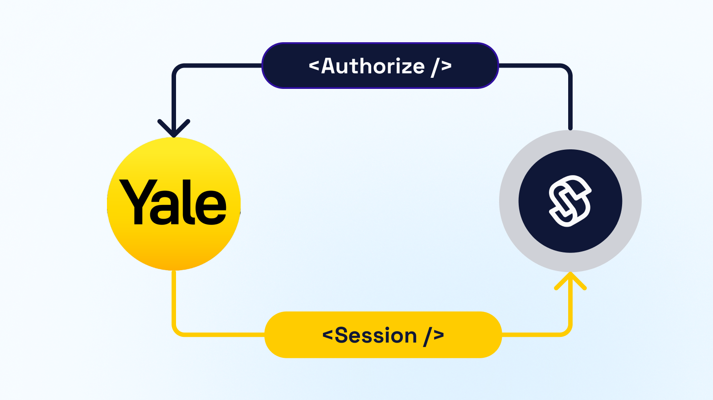
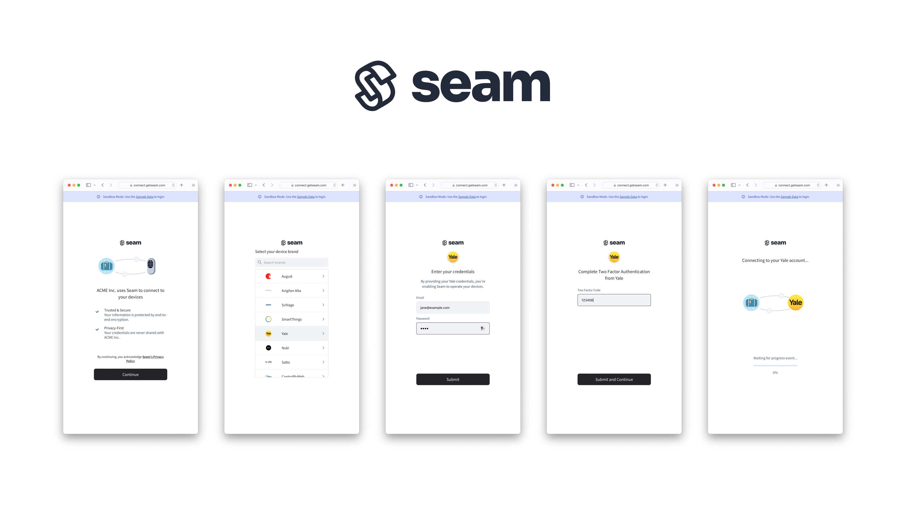

# Get started with Smart Locks

<figure><figcaption><p>Seam Smart Locks API</p></figcaption></figure>

## Overview

Seam is a simple API to connect and control almost any smartlocks. Seam already integrates popular smartlock brands such as [August](https://seam.co/manufacturers/august), [Yale](https://seam.co/manufacturers/yale), [Schlage](https://seam.co/manufacturers/schlage), [Igloo](https://www.seam.co/manufacturers/igloohome), and [Kwikset](https://www.seam.co/manufacturers/kwikset), as well as lesser known ones like [Nuki](https://www.seam.co/manufacturers/nuki), [Wyze](https://www.seam.co/manufacturers/wyze), or [TTLock](https://www.seam.co/manufacturers/ttlock).

The main benefit of Seam is that you can connect devices from these brands and control them with an easy to use API without having to worry about the underlying specific of each devices. Seam abstracts functions in [capabilities](../capability-guides/device-and-system-capabilities.md) such as `access_codes` or `locks` which you can use to integrate devices from multiple brands while expecting them to all behave more or less in the same way.

This guide is intended to show you how to connect and control smartlocks. To learn more about all devices supported by Seam such as thermostats and sensors, head over to our [integration page](https://www.seam.co/supported-devices-and-systems).

Let's get started.

## 1 — Install Seam SDK

Seam provides client libraries for many languages, such as JavaScript, Python, Ruby, PHP, and others, as well as a Postman collection and [OpenAPI](https://connect.getseam.com/openapi.json) spec.

* JavaScript / TypeScript ([npm](https://www.npmjs.com/package/seam), [GitHub](https://github.com/seamapi/javascript))
* Python ([pip](https://pypi.org/project/seam/), [GitHub](https://github.com/seamapi/python))
* Ruby Gem ([rubygem](https://rubygems.org/gems/seam), [GitHub](https://github.com/seamapi/ruby))
* PHP ([packagist](https://packagist.org/packages/seamapi/seam), [GitHub](https://github.com/seamapi/php))
* C# ([nuget](https://www.nuget.org/packages/Seam), [GitHub](https://github.com/seamapi/csharp))



```bash
npm i seam
```



```bash
pip install seam
# For some development environments, use pip3 in this command instead of pip.
```



```bash
bundle add seam
```



```bash
composer require seamapi/seam
```



Install using [nuget](https://www.nuget.org/packages/Seam).



Once installed, [sign-up for Seam](https://console.seam.co/) to get your API key, and export it as an environment variable:

```
$ export SEAM_API_KEY=seam_test2ZTo_0mEYQW2TvNDCxG5Atpj85Ffw
```


This guide uses a Sandbox Workspace. Only virtual devices can be connected. If you need to connect a real device, use a non-sandbox workspace and API key.


## 2 — Link Your Smartlock Account with Seam

To control a smartlock via the Seam API, we need to first connect to your smartlock account and authorize your Seam workspace to control its device(s). To make this easy, Seam provides [Connect Webviews](../core-concepts/connect-webviews/) authorization flows that walk you (or a device owner) through authorizing your workspace to control your device.

#### Request a Connect Webview

To start, we will create a Connect Webview and pass "stable" as the `provider_category`. This will ensure that only stable integrations are being presented.



```python
from seam import Seam

seam = Seam()

webview = seam.connect_webviews.create(provider_category="stable")

assert webview.login_successful is False

# Send the webview URL to your user
print(webview.url)
```



```javascript
import { Seam } from 'seam'

const seam = new Seam()

const connectWebview = await seam.connectWebviews.create({
  provider_category: 'stable',
})

console.log(connectWebview.login_successful) // false

// Send the webview URL to your user
console.log(connectWebview.url)
```



```ruby
require "seam"

seam = Seam.new(api_key: "MY_API_KEY")

webview = seam.connect_webviews.create(
  provider_category: "stable"
)

puts webview.login_successful # false

# Send the webview URL to your user
puts webview.url
```



```php
use Seam\SeamClient;

$seam = new SeamClient("YOUR_API_KEY");

$webview = $seam->connect_webviews->create(
  provider_category: "stable"
);

echo json_encode($webview)
```



<figure><figcaption></figcaption></figure>

#### Authorize Your Workspace

Using a browser, navigate to the URL returned by the Connect Webview object. If you are in a sandbox workspace, you can select Yale as the provider and use the test login below to complete the process. If you have a non-sandbox workspace and a real device, simply use your account credentials.

Yale Test credentials:

* **email:** jane@example.com
* **password:** 1234

<figure><figcaption><p>Seam Connect Webview flow to connect an account with Seam</p></figcaption></figure>

Confirm the Connect Webview was successful by querying its status:



```python
updated_webview = seam.connect_webviews.get(connect_webview_id: webview.connect_webview_id)

assert updated_webview.login_successful # true
```



```javascript
const updatedWebview = await seam.connectWebviews.get(
  connectWebview.connect_webview_id,
)

console.log(updatedWebview.login_successful) // true
```



```ruby
updated_webview = seam.connect_webviews.get(connect_webview_id: webview.connect_webview_id)

puts updated_webview.login_successful # true
```



```php
$webview = $seam->connect_webviews->get($webview->id);
echo json_encode($webview);
```



## 3 — Retrieve Smartlock Devices

After an account is linked with Seam, you can retrieve devices for this linked account. The Seam API exposes most of the device's properties such as battery level or door lock status.



```python
all_locks = seam.locks.list()

some_lock = all_locks[0]

assert some_lock.properties["online"] is True
assert some_lock.properties["locked"] is True
```



```javascript
const allLocks = await seam.locks.list()

const someLock = allLocks[0]

console.log(someLock.properties.online) // true
console.log(someLock.properties.locked) // true
```



```ruby
some_lock = seam.locks.list.first

puts some_lock.properties.online # true
puts some_lock.properties.locked # true

```



```php
use Seam\SeamClient;

$seam = new SeamClient('YOUR_API_KEY');

$locks = $seam->locks->list();

echo json_encode($locks);
```



### 4 — Locking & Unlocking a Door

Next, you can perform the basic action of locking and unlocking the door as most devices will support the `locks` capability.


[openapi (1).json](<../.gitbook/assets/openapi (1).json>)


## Unlock a door

<mark style="color:green;">`POST`</mark> `https://connect.getseam.com/locks/unlock_door`

#### Request Body

| Name       | Type   | Description |
| ---------- | ------ | ----------- |
| device\_id | String |             |



```python
# lock the door
seam.locks.lock_door(device_id: some_lock.device_id)
updated_lock = seam.locks.get(device_id: some_lock.device_id)
assert updated_lock.properties["locked"] is True

# Now unlock the door
seam.locks.unlock_door(device_id: some_lock.device_id)
updated_lock = seam.locks.get(device_id: some_lock.device_id)
assert updated_lock.properties["locked"] is False
```



```javascript
// lock the door
await seam.locks.lockDoor(someLock.device_id)
const updatedLock = await seam.locks.get(someLock.device_id)
console.log(updatedLock.properties.locked) // true

// unlock the door
await seam.locks.unlockDoor(someLock.device_id)
updatedLock = await seam.locks.get(someLock.device_id)
console.log(updatedLock.properties.locked) // false
```



```ruby
# lock the door
seam.locks.lock_door(device_id: some_lock.device_id)
updated_lock = seam.locks.get(device_id: some_lock.device_id)
puts updated_lock.properties.locked # true

# unlock the door
seam.locks.unlock_door(device_id: some_lock.device_id)
updated_lock = seam.locks.get(device_id: some_lock.device_id)
puts updated_lock.properties.locked # false
```



```php
use Seam\SeamClient;

$seam = new SeamClient('YOUR_API_KEY');

$some_lock = $seam->locks->list()[0];

# unlock the door
$seam->locks->unlock_door($lock->device_id);
# lock the door
$seam->locks->lock_door($lock->device_id);
```



###

### 5 — Setting Access Code

Many smartlocks have a built-in keypad or an external one that can be paired over bluetooth. This lets you program access codes that a user can then enter at a later time to unlock a door.

.gif>)

The Seam API makes it easy to program both `ongoing` codes and `timebound` codes on a smartlock. An `ongoing` code is a code that will be permanently programmed onto the device until you tell the Seam API you wish to remove it. A `timebound` code is, as the time implies, time bound by a set of ISO8601 timestamp that you provide the Seam API. You can find out more about access code in our [core concept section on access codes.](../products/smart-locks/access-codes/)



```python
# create an ongoing code
seam.access_codes.create(
    device=some_lock, code="123456", name="My Access Code"
)

# create a timebound code
seam.access_codes.create(
    device=some_lock,
    code="888888",
    name="Scheduled Code",
    starts_at="2028-08-12T19:23:42+0000",
    ends_at="2028-08-13T19:23:42+0000"
)

# you can use a device or a device_id as the "device" parameter
seam.access_codes.list(device=some_lock)
# [
#   AccessCode(
#     access_code_id='af5272b1-2a49-4eb5-9388-2447fc7b5bd1',
#     type='ongoing',
#     code='123459'
#   ),
#   AccessCode(
#     access_code_id='8c2db4da-b137-4c08-a2c3-d611e6ff91b3',
#     type='timebound',
#     code='888888',
#     starts_at='2028-08-12T19:24:00.000Z',
#     ends_at='2028-08-13T19:24:00.000Z',
#   )
# ]

```



```javascript
// create an ongoing code
await seam.accessCodes.create({
  device_id: someLock.device_id,
  code: '123456',
  name: 'My Access Code',
})

// create a timebound code
await seam.accessCodes.create({
  device_id: someLock.device_id,
  code: '888888',
  name: 'Scheduled Code',
  starts_at: '2028-11-12T19:23:42+0000',
  ends_at: '2028-11-13T19:23:42+0000',
})

// use a device_id as the "device_id" parameter
await seam.accessCodes.list({
  device_id: someLock.device_id,
})

/*
[
  {
    code: '1988',
    type: 'ongoing',
    status: 'setting',
    created_at: '2022-08-26T12:50:17.858Z',
    access_code_id: '26d6138c-6524-4f3c-ac96-43cc3bea0a8d'
  },
  {
    type: 'timebound',
    code: '888888',
    starts_at: '2028-08-12T19:24:00.000Z',
    ends_at: '2028-08-13T19:24:00.000Z',
    access_code_id: '8c2db4da-b137-4c08-a2c3-d611e6ff91b3',
  }
]
*/
```



```ruby
# create an ongoing code
seam.access_codes.create(
  device_id: some_lock.device_id, code: '123456', name: 'My Access Code'
)

# create a timebound code
seam.access_codes.create(
  device_id: some_lock.device_id,
  code: '888888',
  name: 'Scheduled Code',
  starts_at: '2028-08-12T19:23:42+0000',
  ends_at: '2028-08-13T19:23:42+0000'
)

seam.access_codes.list(device_id: some_lock.device_id)

# [<Seam::AccessCode:0x00730
#   code="888888"
#   name="Scheduled Code"
#   type="time_bound"
#   errors=[]
#   warnings=[]
#   access_code_id="ce2c298c-364f-4b13-aa12-712f3976288e"
#   ends_at=2028-08-13 19:24:00 UTC
#   starts_at=2028-08-12 19:24:00 UTC>, <Seam::AccessCode:0x00758
#   code="123456"
#   name="My Access Code"
#   type="ongoing"
#   errors=[]
#   warnings=[]
#   access_code_id="75f49550-fc9b-481a-a158-5bc53ac9bb34">, <Seam::AccessCode:0x00780
#   code="086355"
#   name="some-code2"
#   type="ongoing"
#   errors=[]
#   warnings=[]
#   access_code_id="5243e5f3-528a-4378-ba3c-21447bf844a8">, <Seam::AccessCode:0x007a8
#   code="376525"
#   name="some-code"
#   type="ongoing"
#   errors=[]
#   warnings=[]
#   access_code_id="91a08a3d-a0bb-4ff0-bfb4-ced164353988">]
```



```php
use Seam\SeamClient;

$seam = new SeamClient("YOUR_API_KEY");

$some_lock = $seam->locks->list()[0];
$seam->access_codes->create(
  device_id: $some_lock->device_id, code: '123456', name: 'My Access Code'
);

$seam->access_codes->create(
  device_id: $some_lock->device_id,
  name: 'Scheduled Code',
  code: '888888',
  starts_at: '2028-08-12T19:23:42+0000',
  ends_at: '2028-08-13T19:23:42+0000'
);

```



## Next Steps

Now that you've completed this guide, you can try to build a real application to connect and control a device. Don't hesitate to reach out to our team if we can help with anything, or explore other aspects of Seam, here is a list of helpful resources:

* [Yale Getting Started Guide](get-started-with-yale-locks.md)
* [August Getting Started Guide](get-started-with-august-locks.md)
* [Schlage Getting Started Guide](get-started-with-schlage-locks.md)
* [SmartThings Getting Started Guide](get-started-with-smartthings-hubs-+-smart-locks.md)
* [Receiving webhook](../core-concepts/webhooks.md) for [device events](../api/events/list.md)
* [Core Concepts](../core-concepts/overview.md)
