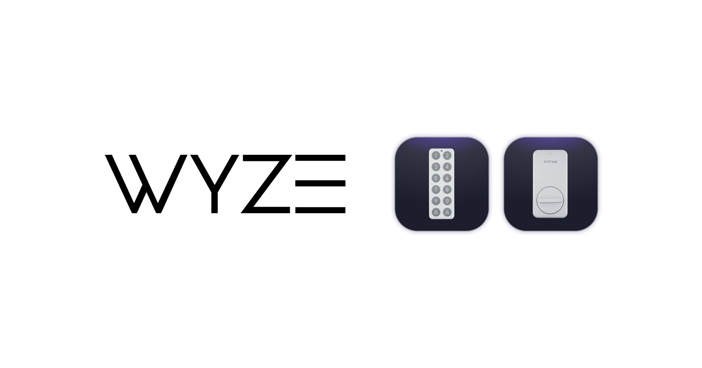
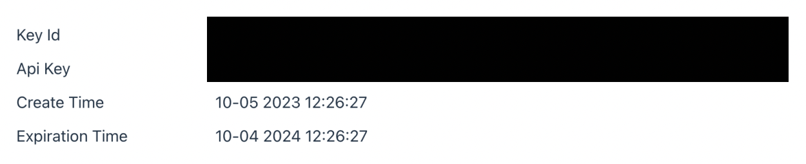
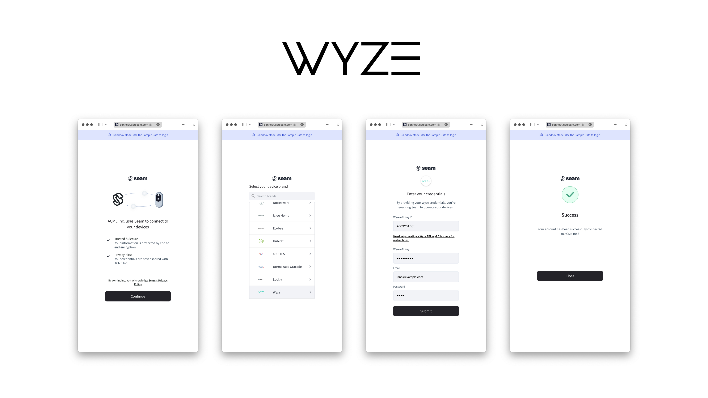

# Get started with Wyze Locks

<figure><figcaption></figcaption></figure>

## Overview

Seam provides a universal API to connect and control many brands of locks. This guide provides a rapid introduction to connecting and controlling your [Wyze](https://www.seam.co/manufacturers/wyze) locks using the Seam API. To learn more about other device brands supported by the Seam API, such as Yale, Schlage, Kwikset and August, head over to our [integration page](https://www.seam.co/supported-devices-and-systems).


There are two types of Wyze Locks, a [Gateway Wyze Lock](https://www.wyze.com/products/wyze-lock) that supports Wi-Fi connections and a [Wyze Lock Bolt](https://www.wyze.com/products/wyze-lock-bolt) that supports bluetooth connections only.

For **Gateway Wyze Locks** we support all normal functionality including locking or unlocking the device and setting access codes remotely through Seam as long as the lock is proplery connected to the provided gateway.

For **Bluetooth-only Wyze Lock Bolts** we're not able to control the lock remotely (meaning no locking or unlocking the device and no setting access codes) but we are able to return some information on the lock such as the battery level and the locked / unlocked state.


## 1 — Install Seam SDK

Seam provides client libraries for many languages, such as JavaScript, Python, Ruby, PHP, and others, as well as a Postman collection and [OpenAPI](https://connect.getseam.com/openapi.json) spec.

* JavaScript / TypeScript ([npm](https://www.npmjs.com/package/seam), [GitHub](https://github.com/seamapi/javascript))
* Python ([pip](https://pypi.org/project/seam/), [GitHub](https://github.com/seamapi/python))
* Ruby Gem ([rubygem](https://rubygems.org/gems/seam), [GitHub](https://github.com/seamapi/ruby))
* PHP ([packagist](https://packagist.org/packages/seamapi/seam), [GitHub](https://github.com/seamapi/php))
* C# ([nuget](https://www.nuget.org/packages/Seam), [GitHub](https://github.com/seamapi/csharp))



```bash
npm i seam
```



```bash
pip install seam
# For some development environments, use pip3 in this command instead of pip.
```



```bash
bundle add seam
```



```bash
composer require seamapi/seam
```



Install using [nuget](https://www.nuget.org/packages/Seam).



Once installed, [sign-up for Seam](https://console.seam.co/) to get your API key, and export it as an environment variable:

```
$ export SEAM_API_KEY=seam_test2ZTo_0mEYQW2TvNDCxG5Atpj85Ffw
```


This guide uses a Sandbox Workspace. Only virtual devices can be connected. If you need to connect a real Wyze device, use a non-sandbox workspace and API key.


## 2 — Link Your Wyze with Seam

To control your Wyze locks via the Seam API, you must first authorize your Seam workspace against your Wyze account. To do so, Seam provides[Connect Webviews](../core-concepts/connect-webviews/): pre-built UX flows that walk you through authorizing your application to control Wyze locks.

#### Obtain a Wyze API Key and Wyze API Key ID

You will need create a Wyze API Key for your Wyze account. To see how to create a Wyze API Key for your Wyze account, [click here](https://support.wyze.com/hc/en-us/articles/16129834216731-Creating-an-API-Key).


Note that both the API Key and Key ID returned from Wyze are required to connect your Wyze account to Seam. Make sure to copy both values to somewhere secure!



For Sandbox integrations, you can simply use `ABC123ABC` for both the API Key and API Key ID.


#### Request a Connect Webview



```python
from seam import Seam

seam = Seam()

webview = seam.connect_webviews.create(accepted_providers=["wyze"])

assert webview.login_successful is False

# Send the webview URL to your user
print(webview.url)
```



```javascript
import { Seam } from "seam";

const seam = new Seam();

const { connect_webview: connectWebview } = await seam.connectWebviews.create({
  accepted_providers: ["wyze"],
});

console.log(connectWebview.login_successful); // false

// Send the webview URL to your user
console.log(connectWebview.url);
```



```ruby
require "seam"

seam = Seam.new(api_key: 'MY_API_KEY')

webview = seam.connect_webviews.create(accepted_providers: %w[wyze])

puts webview.login_successful # false

# Send the webview URL to your user
puts webview.url
```



```php
use Seam\SeamClient;

$seam = new SeamClient("YOUR_API_KEY");

$webview = $seam->connect_webviews->create(
  accepted_providers: ["wyze"]
);
```



#### Authorize Your Workspace

Navigate to the URL returned by the Webview object. Since you are using a sandbox workspace, complete the login flow by entering the Wyze [sandbox test account](https://docs.seam.co/latest/device-guides/sandbox-and-sample-data)credentials below:

* **Wyze API Key ID:** ABC123ABC
* **Wyze API Key** ABC123ABC
* **email:** jane@example.com
* **password:** 1234

<figure><figcaption><p>Seam Connect Webview flow to connect Wyze account with Seam</p></figcaption></figure>

Confirm the Connect Webview was successful by querying its status:



```python
updated_webview = seam.connect_webviews.get(connect_webview_id: webview.connect_webview_id)

assert updated_webview.login_successful # true
```



```javascript
const updatedWebview = await seam.connectWebviews.get(
  connectWebview.connect_webview_id
);

console.log(updatedWebview.login_successful); // true
```



```ruby
updated_webview = seam.connect_webviews.get(connect_webview_id: webview.connect_webview_id)

puts updated_webview.login_successful # true
```



```php
$webview = $seam->connect_webviews->get('729847ff-98e0-418d-aeba-1e3cb38157c6');
assert($webview->status == 'pending');
```



## 3 — Retrieve Wyze Devices

After a Wyze account is linked with Seam, you can retrieve its devices.



```python
all_locks = seam.locks.list()

some_lock = all_locks[0]

assert some_lock.properties["battery_level"] is True

print(some_lock)
```



```javascript
const allLocks = await seam.locks.list();

const someLock = allLocks[0];

console.log(someLock.properties.battery_level);

console.log(someLock);
```



```ruby
some_lock = seam.locks.list.first

puts some_lock.properties.battery_level

puts some_lock

```



```php
use Seam\SeamClient;

$seam = new SeamClient('YOUR_API_KEY');

$locks = $seam->locks->list();

echo json_encode($locks);

*/
```



## 4 — Locking & Unlocking a Door

Next, you can perform the basic action of locking and unlocking the door.


[openapi (1).json](<../.gitbook/assets/openapi (1).json>)


## Unlock a door

<mark style="color:green;">`POST`</mark> `https://connect.getseam.com/locks/unlock_door`

#### Request Body

| Name       | Type   | Description |
| ---------- | ------ | ----------- |
| device\_id | String |             |



```python
# lock the door
seam.locks.lock_door(device_id: some_lock.device_id)
updated_lock = seam.locks.get(device_id: some_lock.device_id)
assert updated_lock.properties["locked"] is True

# Now unlock the door
seam.locks.unlock_door(device_id: some_lock.device_id)
updated_lock = seam.locks.get(device_id: some_lock.device_id)
assert updated_lock.properties["locked"] is False
```



```javascript
// lock the door
await seam.locks.lockDoor(someLock.device_id);
const updatedLock = await seam.locks.get(someLock.device_id);
console.log(updatedLock.properties.locked); // true

// unlock the door
await seam.locks.unlockDoor(someLock.device_id);
updatedLock = await seam.locks.get(someLock.device_id);
console.log(updatedLock.properties.locked); // false
```



```ruby
# lock the door
seam.locks.lock_door(device_id: some_lock.device_id)
updated_lock = seam.locks.get(device_id: some_lock.device_id)
puts updated_lock.properties.locked # true

# unlock the door
seam.locks.unlock_door(device_id: some_lock.device_id)
updated_lock = seam.locks.get(device_id: some_lock.device_id)
puts updated_lock.properties.locked # false
```



```php
use Seam\SeamClient;

$seam = new SeamClient('YOUR_API_KEY');

$some_lock = $seam->locks->list()[0];

# unlock the door
$seam->locks->unlock_door($lock->device_id);
# lock the door
$seam->locks->lock_door($lock->device_id);
```



## 5 — Programming Access Code on a Wyze Lock

The Seam API lets you create access codes on Wyze locks with a gateway. These codes can then be entered to unlock the door. You can find out more info about how Seam access codes in our [core concept section on access codes.](../products/smart-locks/access-codes/)


Wyze does not allow pin code values to be seen after the code is created. If you create a code through Seam, avoid changing the pin code through the app and instead use Seam to change any information about the code!




```python
# create an ongoing code
seam.access_codes.create(
  device=some_lock,
  name="Personal Access Code")

# create a timebound code
seam.access_codes.create(
  device=some_lock,
  name="My Temp Access Code",
  starts_at="2028-08-12T19:23:42+0000",
  ends_at="2028-08-13T19:23:42+0000")

# you can use a device or a device_id as the "device" parameter
seam.access_codes.list(device=some_lock)

# [
#   AccessCode(access_code_id='631a3a30-3fa7-462a-b3bc-65528ccf8765', type='time_bound', code=None, starts_at='2028-08-12T19:24:00.000Z', ends_at='2028-08-13T19:24:00.000Z', name='My Temp Access Code', status='unset', common_code_key=None),
#  AccessCode(access_code_id='4d2f4952-5446-4051-ba7e-a6fc01a376d7', type='ongoing', code='123*12346', starts_at=None, ends_at=None, name='Personal Access Code', status='set', common_code_key=None)
#  ]

```



```javascript
// create an ongoing code
await seam.accessCodes.create({
  device_id: someLock.device_id,
  name: "Personal Access Code",
});

// create a timebound code
await seam.accessCodes.create({
  device_id: someLock.device_id,
  name: "My Temp Access Code",
  starts_at: "2028-11-12T19:23:42+0000",
  ends_at: "2028-11-13T19:23:42+0000",
});

// use a device_id as the "device_id" parameter
await seam.accessCodes.list({
  device_id: someLock.device_id,
});

/*
[
  {
    access_code_id: '631a3a30-3fa7-462a-b3bc-65528ccf8765',
    device_id: '681bf7bc-e7c6-48e6-acfe-6dbabd0615c5',
    name: 'My Temp Access Code',
    code: null,
    is_waiting_for_code_assignment: true,
    common_code_key: null,
    type: 'time_bound',
    status: 'unset',
    starts_at: '2028-08-12T19:24:00.000Z',
    ends_at: '2028-08-13T19:24:00.000Z',
    created_at: '2023-02-08T23:28:57.061Z',
    errors: [],
    warnings: []
  },
  {
    access_code_id: '774986f8-5fad-4911-a4fb-e5a2ef9f15bd',
    device_id: '681bf7bc-e7c6-48e6-acfe-6dbabd0615c5',
    name: 'Personal Access Code',
    code: '123*12346',
    common_code_key: null,
    type: 'ongoing',
    status: 'set',
    created_at: '2023-02-08T23:10:54.096Z',
    errors: [],
    warnings: []
  },
]
*/
```



```ruby
# create an ongoing code
seam.access_codes.create(
  device_id: some_lock.device_id, name: 'Personal Access Code'
)

# create a timebound code
seam.access_codes.create(
  device_id: some_lock.device_id,
  name: 'My Temp Access Code',
  starts_at: '2028-08-12T19:23:42+0000',
  ends_at: '2028-08-13T19:23:42+0000'
)

seam.access_codes.list(device_id: some_lock.device_id)

# [<Seam::AccessCode:0x00690
#   access_code_id="631a3a30-3fa7-462a-b3bc-65528ccf8765"
#   name="My Temp Access Code"
#   code=nil
#   type="time_bound"
#   starts_at=2028-08-12 19:24:00 UTC
#   ends_at=2028-08-13 19:24:00 UTC
#   errors=[]
#   warnings=[]>, <Seam::AccessCode:0x006b8
#   access_code_id="774986f8-5fad-4911-a4fb-e5a2ef9f15bd"
#   name="Personal Access Code"
#   code="123*12346"
#   type="ongoing"
#   errors=[]
#   warnings=[]>]
```



```php
use Seam\SeamClient;

$seam = new SeamClient("YOUR_API_KEY");

$some_lock = $seam->locks->list()[0];
$seam->access_codes->create(
  device_id: $some_lock->device_id, name: 'Personal Access Code'
);

$seam->access_codes->create(
  device_id: $some_lock->device_id,
  name: 'My Temp Access Code',
  starts_at: '2028-08-12T19:23:42+0000',
  ends_at: '2028-08-13T19:23:42+0000'
);

echo json_encode($access_code)
/*
[{"access_code_id":"19cea367-fd8c-40b7-9ce3-6dec76fe1763","name":"My Temp Access Code","type":"time_bound","status":"unset","starts_at":"2028-08-12T19:24:00.000Z","ends_at":"2028-08-13T19:24:00.000Z","code":null,"created_at":"2023-02-09T05:53:46.293Z","errors":[],"warnings":[]},{"access_code_id":"f797a8f0-b8f7-4734-9bea-962de5cad413","name":"Personal Access Code","type":"ongoing","status":"set","starts_at":null,"ends_at":null,"code":"123*12346","created_at":"2023-02-09T05:53:46.172Z","errors":[],"warnings":[]}]
*/
```



###

## Next Steps

Now that you've completed this guide, you can try to connect a real Wyze device. To do so, make sure to switch to a non-sandbox workspace and API key as real devices cannot be connected to sandbox workspaces.

In addition, if you'd like to explore other aspects of Seam, here is a list of helpful resources:

* [Yale Getting Started Guide](get-started-with-yale-locks.md)
* [August Getting Started Guide](get-started-with-august-locks.md)
* [Schlage Getting Started Guide](get-started-with-schlage-locks.md)
* [SmartThings Getting Started Guide](get-started-with-smartthings-hubs-+-smart-locks.md)
* [Receiving webhook](../core-concepts/webhooks.md) for [device events](../api/events/list.md)
* [Core Concepts](../core-concepts/overview.md)

If you have any questions or want to report an issue, email us at support@seam.co.
