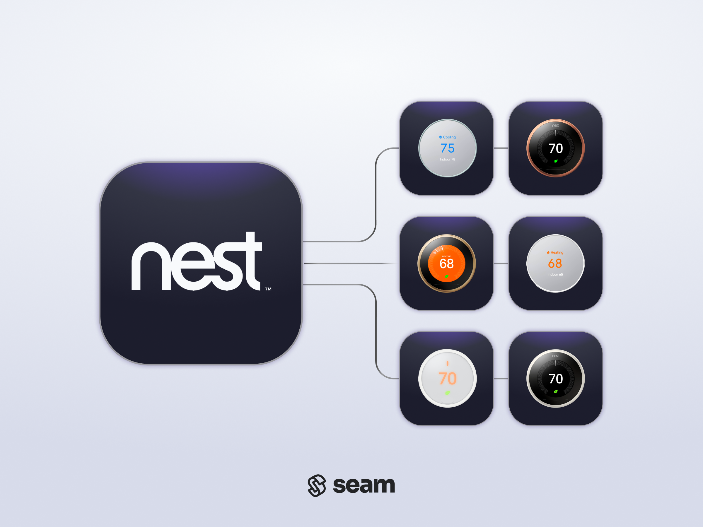

# Google Nest Thermostats

<figure><picture><source srcset="../../.gitbook/assets/nest-manufacturer-page-cover-dark.png" media="(prefers-color-scheme: dark)"></picture><figcaption>
Google Nest Thermostats
</figcaption></figure>

## Overview

Google produces Nest smart thermostats as part of the Google smart home product group. Nest thermostats are designed to lower energy costs through energy efficiency features, such as remote climate monitoring and control, as well as climate setting scheduling. Google also produces an optional Nest Temperature Sensor accessory to prioritize certain rooms.

***

## Supported Devices

This integration supports all [Nest thermostats](https://store.google.com/us/category/nest_thermostats).

For detailed information about the Google Nest devices that Seam supports, see the following table and our [Nest Supported Devices page](https://www.seam.co/manufacturers/nest):



***

## Supported Features

We support the following features:

* [Configuring current thermostat settings](../../products/thermostats/configure-current-climate-settings.md)
* [Creating and managing climate presets](../../capability-guides/thermostats/creating-and-managing-climate-presets/)
* [Creating and managing thermostat schedules](../../capability-guides/thermostats/creating-and-managing-thermostat-schedules.md)
* [Setting and monitoring temperature thresholds](../../capability-guides/thermostats/setting-and-monitoring-temperature-thresholds.md)

***

### Device Provider Key

To create a [Connect Webview](../../capability-guides/device-and-system-capabilities/connect-webviews/) that enables your users to connect their Nest devices to Seam, include the `google_nest` device provider key in the `accepted_providers` list. For more information, see [Customize the Brands to Display in Your Connect Webviews](../../capability-guides/device-and-system-capabilities/connect-webviews/customizing-connect-webviews.md#customize-the-brands-to-display-in-your-connect-webviews).

***

## Setup Instructions

This integration requires several steps, including both Google Nest and Seam.

### Create a Google Device Access Project

First, create a [Google Device Access](https://developers.google.com/nest/device-access) project—including an associated OAuth client—and provide information about this project to Seam through the [Seam Console](../../core-concepts/seam-console/).

### Apply for Google Commercial Development

We recommend that you apply for [Google Commercial Development](https://developers.google.com/nest/device-access/project/apply) for your Nest devices. For detailed instructions, see [Obtain Google Nest Device Access and Commercial Development](obtain-google-nest-device-access-and-commercial-development.md).


Note the restrictive [rate limits](https://developers.google.com/nest/device-access/project/limits) in the Google Device Access Sandbox environment while testing the integration with customers.


The period of time that Google takes to approve Commercial Development may range from a week to more than a month. For more information, see [Apply for Commercial Development](https://developers.google.com/nest/device-access/project/apply) on the Google Device Access site.

Further, once Google approves your Commercial Development application, you can gradually scale the number of managed devices as you proceed through the Google stages to reach [Google certification for Commercial Production](https://developers.google.com/nest/device-access/project/apply#certification_for_commercial_production).

### Connect Your Google Nest Devices to Seam

Once you have set up Google Device Access, prompt the owners of these Google Nest devices (that is, your end users) to perform the following steps:

1. Create an account in the [Google Home app](https://home.google.com/get-app/) if you have not done so already.
2. In the Google Home app, add your Nest thermostats.
3. Note your login credentials for the Google Home app, and use these credentials to log in to the [Seam Connect Webview](../../capability-guides/device-and-system-capabilities/connect-webviews/) to add your devices to Seam.

***

## Brand-Specific Errors

If you have not yet [obtained Google Commercial Development](obtain-google-nest-device-access-and-commercial-development.md), and your end user attempts to connect a Google Nest thermostat to Seam using a [Connect Webview](../../capability-guides/device-and-system-capabilities/connect-webviews/), the Connect Webview displays the following error:

> No access to partner
>
> Information could not be retrieved. Please contact \<Your Company Name> to verify that your account has been properly set up. You may need to add the developer email address as a home member in the Google Home app settings.

Note that, until you obtain Google Commercial Development, you can only connect devices associated directly with your own Google test users' accounts to Seam.

***

## Where to Order

Order Nest thermostats from the Google online store or from Amazon.

<table data-view="cards"><thead><tr><th></th><th data-hidden></th><th data-hidden></th><th data-hidden data-type="content-ref"></th><th data-hidden data-type="files"></th><th data-hidden data-card-cover data-type="files"></th><th data-hidden data-card-target data-type="content-ref"></th></tr></thead><tbody><tr><td><strong>Google Online Store</strong></td><td></td><td></td><td><a href="https://store.google.com/us/category/nest_thermostats">https://store.google.com/us/category/nest_thermostats</a></td><td><a href="../../.gitbook/assets/nest-logo.png">nest-logo.png</a></td><td><a href="../../.gitbook/assets/nest-logo.png">nest-logo.png</a></td><td><a href="https://store.google.com/us/category/nest_thermostats">https://store.google.com/us/category/nest_thermostats</a></td></tr><tr><td><strong>Nest Products on Amazon</strong></td><td></td><td></td><td><a href="https://amzn.to/3R6K2Uq">https://amzn.to/3R6K2Uq</a></td><td><a href="../../.gitbook/assets/nest-on-amazon.png">nest-on-amazon.png</a></td><td><a href="../../.gitbook/assets/nest-on-amazon.png">nest-on-amazon.png</a></td><td><a href="https://amzn.to/4aaJfus">https://amzn.to/4aaJfus</a></td></tr></tbody></table>

***
