# Obtain Google Nest Device Access and Commercial Development

To control Nest devices using Seam, you must first create a [Google Device Access](https://developers.google.com/nest/device-access) project—including an associated OAuth client—and provide information about this project to Seam through the [Seam Console](../../core-concepts/seam-console/). The initial Google Device Access Sandbox environment includes [account and rate limits](https://developers.google.com/nest/device-access/project/limits). Consequently, we recommend that you apply for [Google Commercial Development](https://developers.google.com/nest/device-access/project/apply) for your Nest devices.


The period of time that Google takes to approve Commercial Development may range from a week to more than a month. For more information, see [Apply for Commercial Development](https://developers.google.com/nest/device-access/project/apply) on the Google Device Access site.

Further, once Google approves your Commercial Development application, you can gradually scale the number of managed devices as you proceed through the Google stages to reach [Google certification for Commercial Production](https://developers.google.com/nest/device-access/project/apply#certification\_for\_commercial\_production).


## 1. Start Google Device Access Project Creation

Sign in to your Google account and start the process of creating a Google Device Access Project.

1.  Open a web browser and go to the following URL:\
    [https://developers.google.com/nest/device-access](https://developers.google.com/nest/device-access)

    <figure>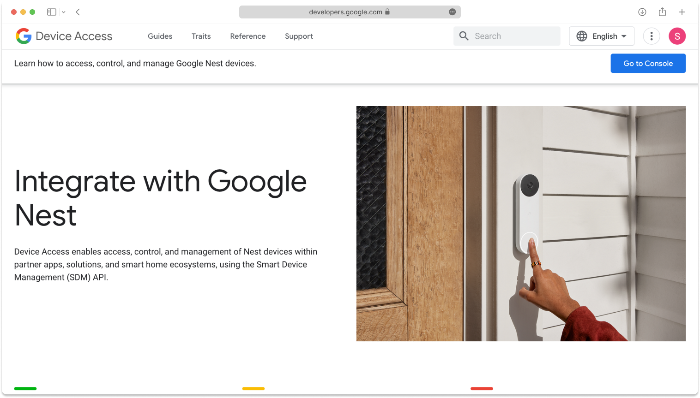<figcaption></figcaption></figure>
2. Click **Go to Console**.
3. Sign in to your Google account.
4.  If you have not yet paid the Google Developer Registration Fee (currently, US$5) to access the Google Device Access Console, perform the following steps:

    1. Select the checkbox to agree to the Google terms of service and then click **Continue to payment**.
    2. Add a credit or debit card if you have not done so already.
    3. Click **Buy**.

    When the purchase is complete, Google displays the Device Access Console welcome page.

    <figure>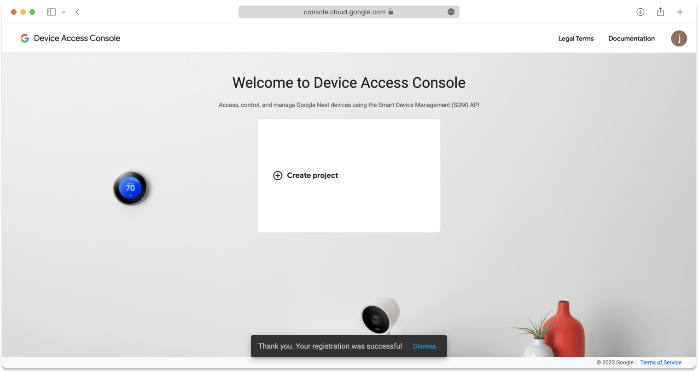<figcaption></figcaption></figure>
5. Click **Create project**.
6. Type a name for your Nest development project and then click **Next**.

## 2. Create an OAuth Client

Use the Google Cloud console to create an OAuth 2.0 client and then download the associated client ID and secret.

1.  On the **Add your OAuth client ID** page, click **Learn more**.

    <figure>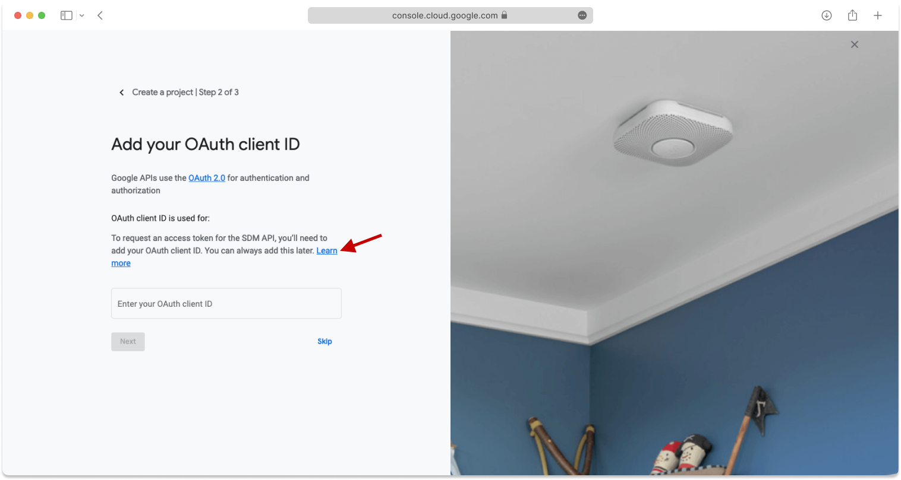<figcaption></figcaption></figure>


Google displays the **Authorize an Account** page in a separate browser tab or window. Do not close the original browser window or tab containing the **Add your OAuth client ID** page.


2.  On the **Authorize an Account** page, click **Google Cloud Credentials**.

    <figure>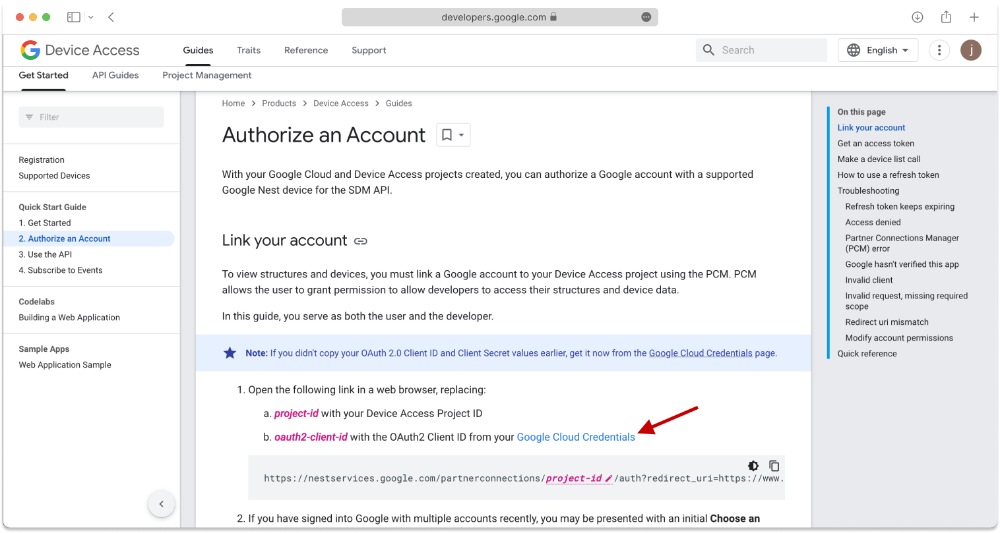<figcaption></figcaption></figure>
3.  In the Google Cloud welcome dialog, select your country, select the checkbox to agree to the Google terms of service, and then click **Agree and Continue**.

    <figure>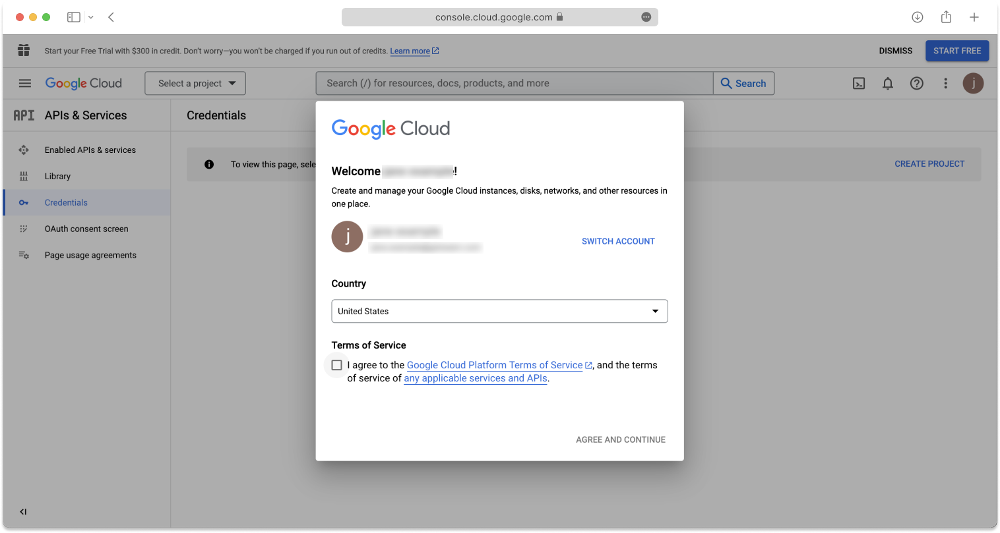<figcaption></figcaption></figure>
4.  On the Google Cloud **Credentials** page, click **Create Project**.

    <figure>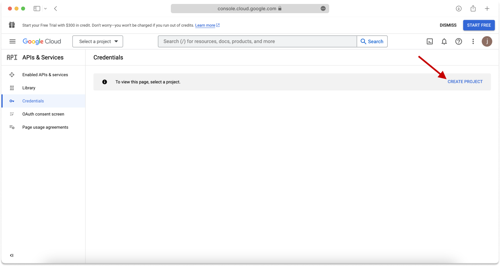<figcaption></figcaption></figure>
5.  In the Google Cloud **Select a resource** window, click **New Project**.

    <figure>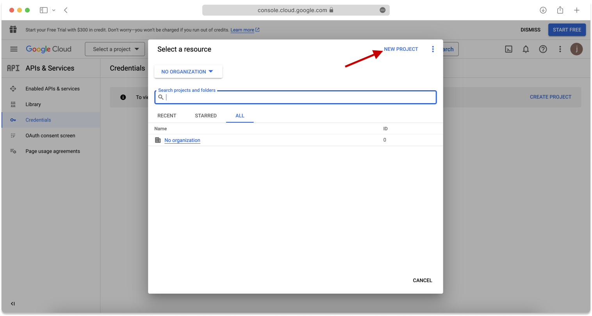<figcaption></figcaption></figure>
6.  In the Google Cloud **New Project** page, type a name for the new project, specify the organization and location, and then click **Create**.

    <figure>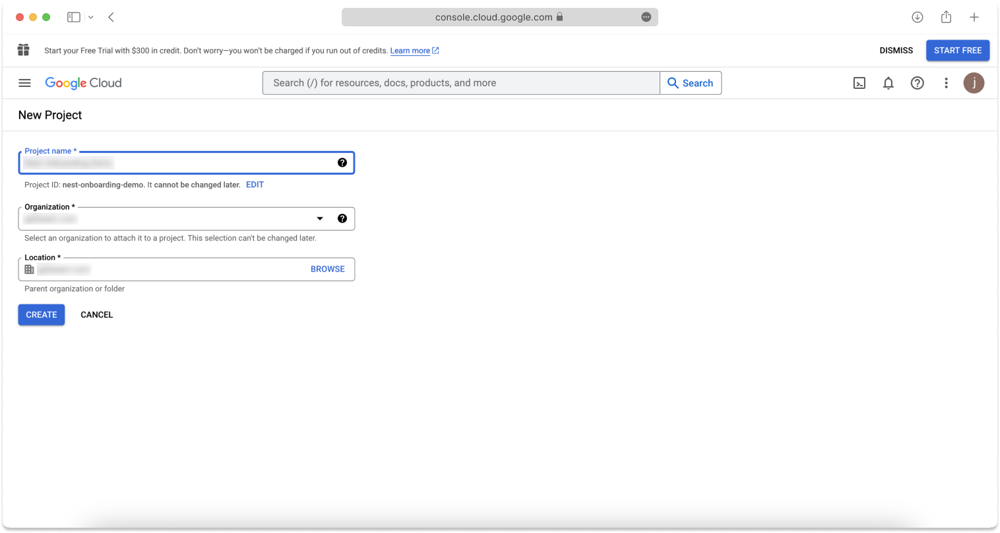<figcaption></figcaption></figure>
7.  On the Google Cloud **Create OAuth client ID** page, click **Configure Consent Screen**.

    <figure>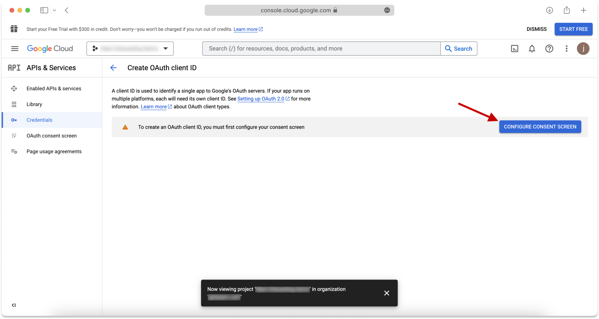<figcaption></figcaption></figure>
8.  On the Google Cloud **OAuth consent screen** page, select the **External** user type and then click **Create**.

    <figure>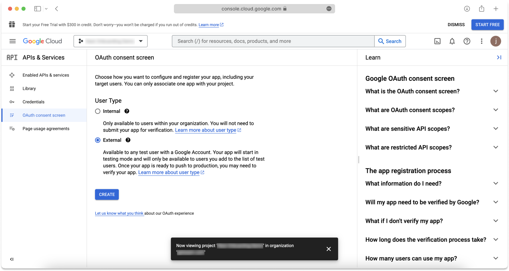<figcaption></figcaption></figure>
9.  On the Google Cloud **Edit app registration** page, type the **App name**, **User support email**, and **Developer Contact information** **Email addresses** and then click **Save and Continue**.

    <figure>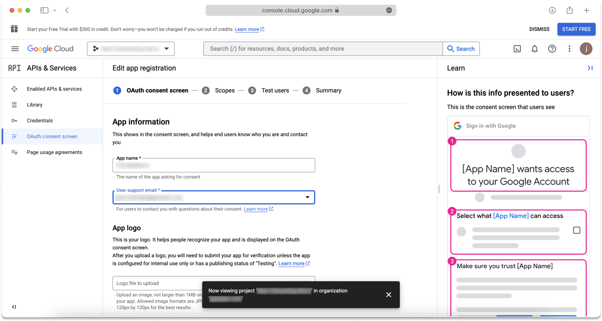<figcaption></figcaption></figure>
10. Move to the bottom of the Google Cloud **Scopes** page and click **Save and Continue**.
11. On the Google Cloud **Test Users** page, click **Add Users**, add the Google account associated with a Nest thermostat as a test user, and then click **Save and Continue**.\
    It is important to remember that the initial Google Device Access Sandbox environment includes [account and rate limits](https://developers.google.com/nest/device-access/project/limits). Consequently, we recommend that you [apply for Google Commercial Development](obtain-google-nest-device-access-and-commercial-development.md#5.-apply-for-google-commercial-development) as part of this procedure. In addition, before you obtain Google Commercial Development, you an only use the Seam API to control devices associated directly with the test user accounts that you specify on the **Test Users** page. For more information, see [Brand-Specific Errors](./#brand-specific-errors).

    <figure>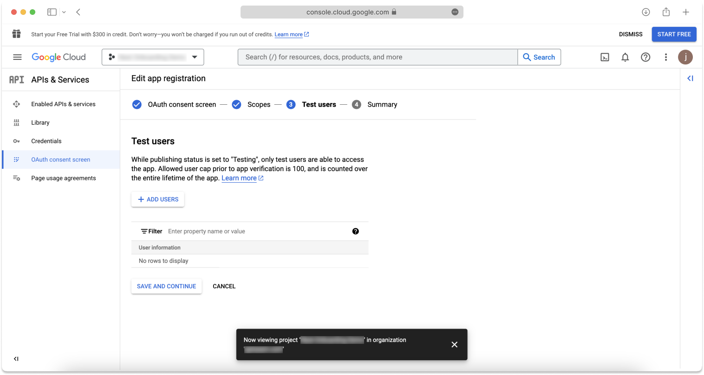<figcaption></figcaption></figure>
12. In the left navigation pane of the Google Cloud **Summary** page, click **Credentials**.

    <figure>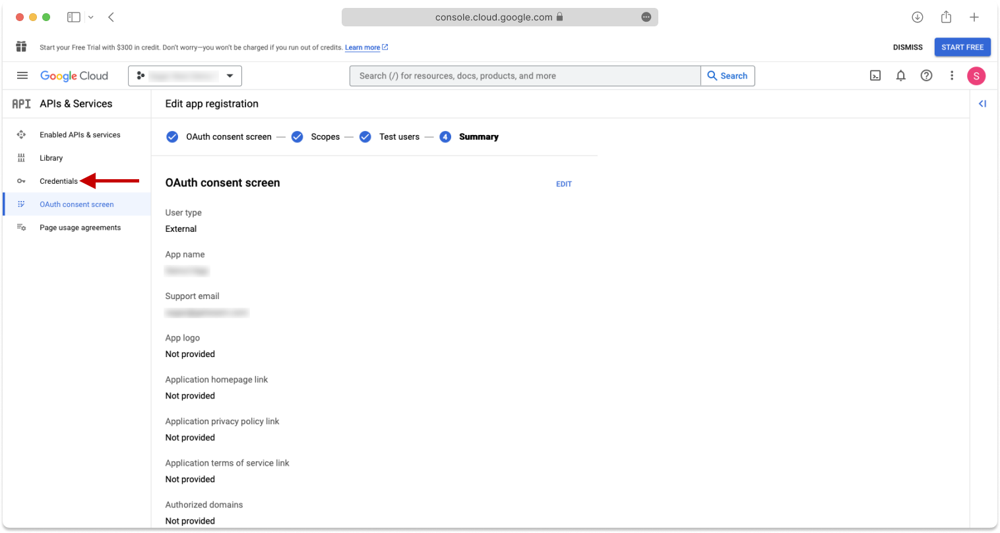<figcaption></figcaption></figure>
13. On the Google Cloud **Credentials** page, click **Create Credentials** > **OAuth client ID**.

    <figure>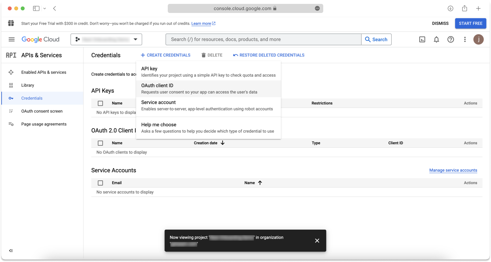 OAuth client ID."><figcaption></figcaption></figure>
14. On the Google Cloud **Create OAuth client ID** page, specify the following information:
    1.  In the **Application type** field, select **Web application**.\

        <figure>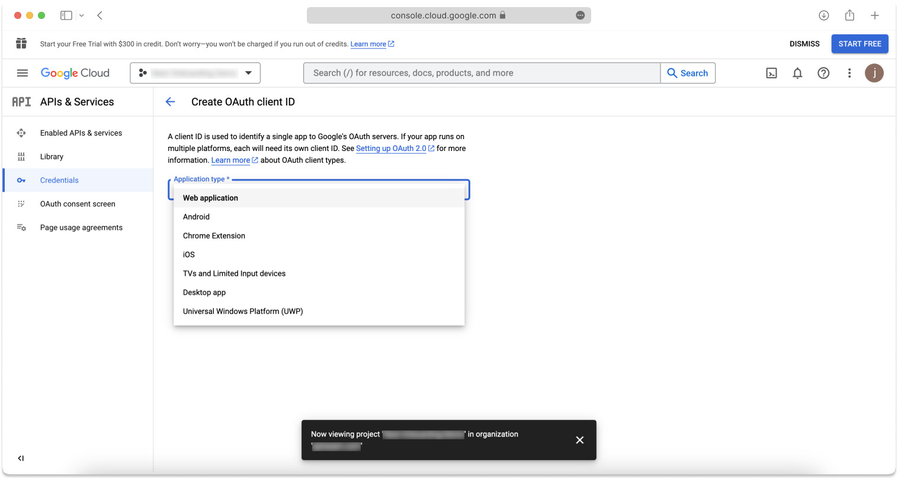<figcaption></figcaption></figure>
    2. Type a name for the OAuth 2.0 client.
    3. In the **Authorized redirect URIs** area, click **Add URI** and then choose one of the following two options:
       * **Option 1 (easy):** Add the following URI to redirect to Seam:\
         [`https://connect.getseam.com/internal/nest/complete_oauth`](https://connect.getseam.com/internal/nest/complete\_oauth)
       *   **Option 2 (recommended):** Create a CNAME record in your DNS settings (for example, `nestoauth.mydomain.com`) and redirect it to the following URI:

           [`https://connect.getseam.com/internal/nest/complete_oauth`](https://connect.getseam.com/internal/nest/complete\_oauth)\
           Setting up a CNAME ensures that the Google OAuth screen displays "continue to \[mydomain.com]" instead of "continue to getseam.com."

           <figure>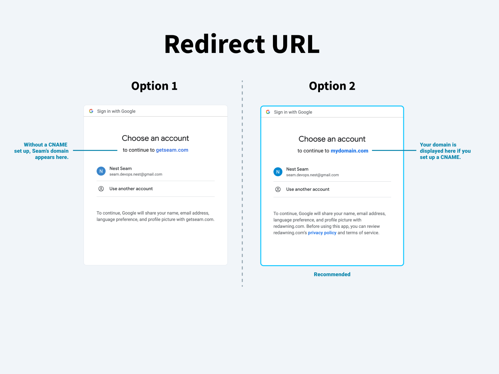<figcaption></figcaption></figure>
15. At the bottom of the Google Cloud **Create OAuth client ID** page, click **Create**.\
    The OAuth client created dialog displays the client ID and secret for the newly-created OAuth client.
16. In the **OAuth client created** dialog, click **Download JSON** and then click **OK**.

    <figure>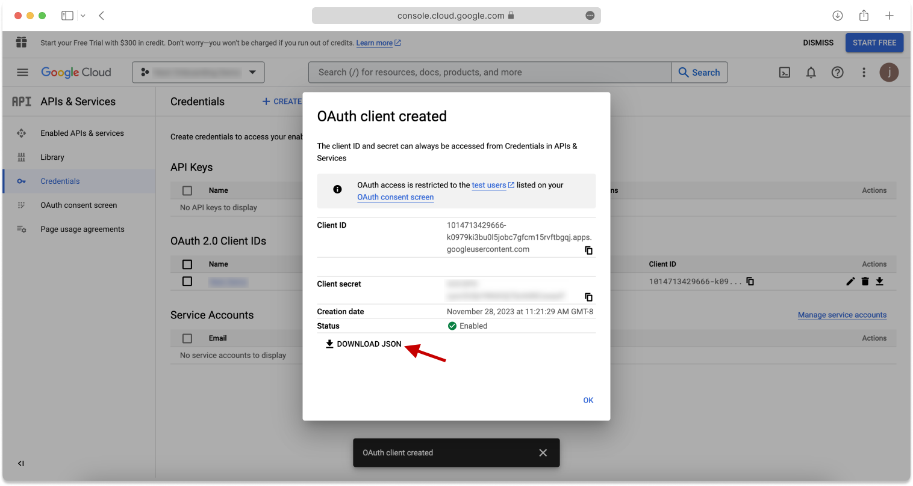<figcaption></figcaption></figure>
17. In the **OAuth 2.0 Client IDs** area on the Google Cloud **Credentials** page, click the copy button in the row that represents the client ID that you created.

    <figure>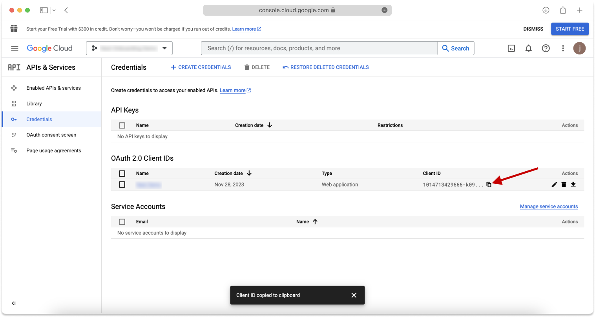<figcaption></figcaption></figure>


Make sure to keep this copied OAuth client ID in the clipboard. You must paste this ID into a field later in this procedure.


## 3. Enable the Google Smart Device Management API

To control Nest devices with the Seam API, you must enable the Google Smart Device Management API.

1.  In the left navigation pane of the **Google Credentials** page, click **Enabled APIs & services** and then click **Enable APIs and Services**.

    <figure>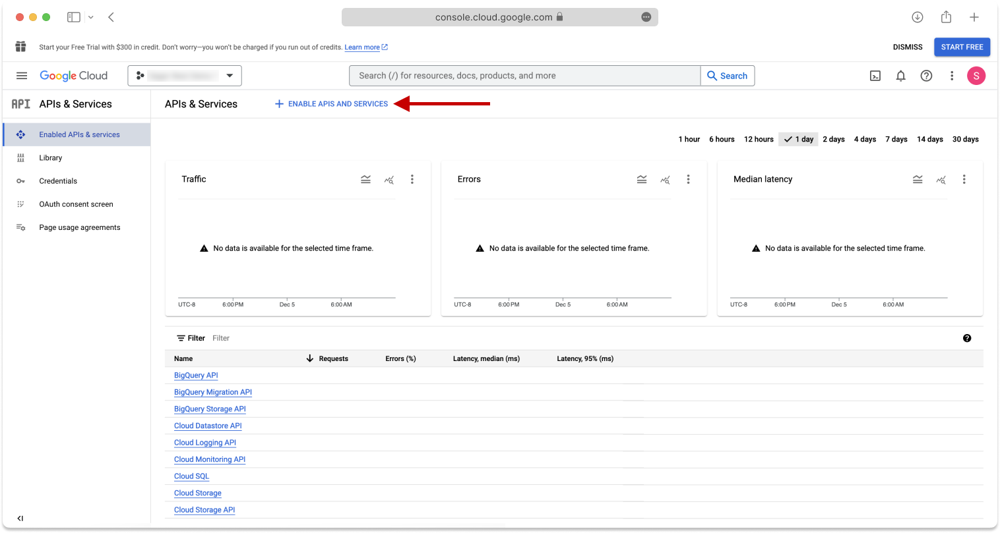<figcaption></figcaption></figure>
2.  In the search box on the Google Cloud **API Library** welcome page, type `Smart Device Management API` and then press **Enter**.

    <figure>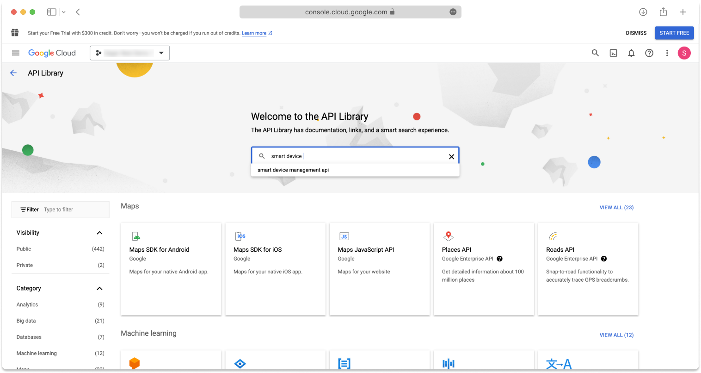<figcaption></figcaption></figure>
3.  In the search results, click **Smart Device Management API**.

    <figure>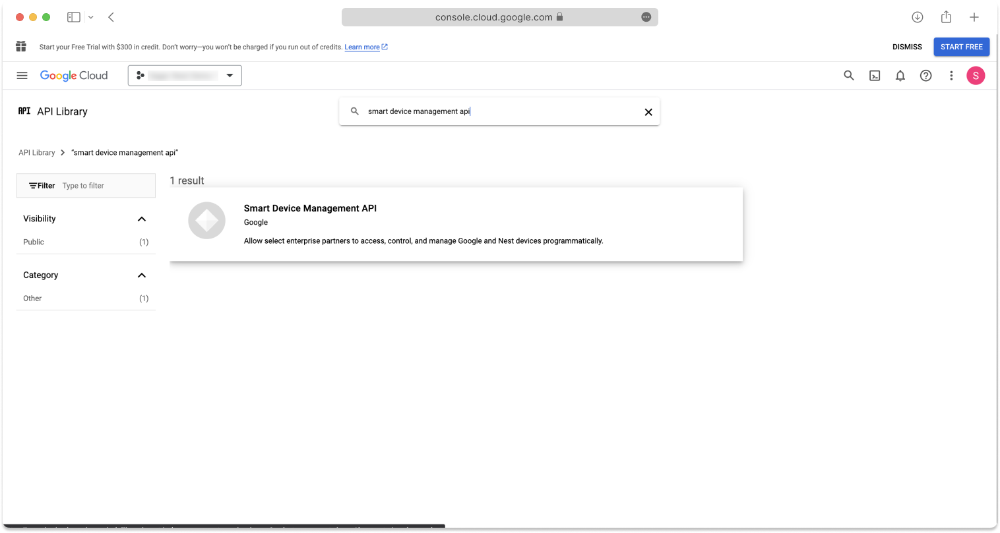<figcaption></figcaption></figure>
4.  On the **Product details** page for the Smart Device Management API, click **Enable**.

    <figure>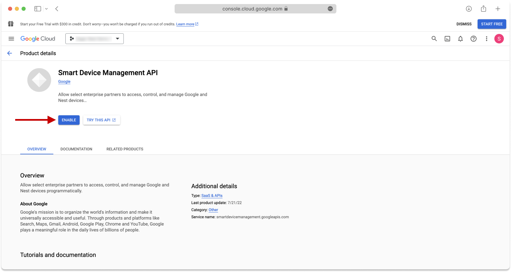<figcaption></figcaption></figure>

## 4. Complete Google Device Access Project Creation

Add the ID of the OAuth client that you created to the Google Device Access project that you are creating and then complete the project creation.

1.  Return to the browser tab or window that contains the **Add your OAuth client ID** page from the beginning of this procedure.

    <figure><figcaption></figcaption></figure>
2. In the **Enter your OAuth client ID** field, paste the copied OAuth client ID and then click **Next**.
3.  On the **Events** page, click **Enable** and then click **Create project**.

    <figure><figcaption></figcaption></figure>

## 5. Apply for Google Commercial Development

We recommend that you apply for [Google Commercial Development](https://developers.google.com/nest/device-access/project/apply), which enables you to control more devices. Before Google approves your Commercial Development application, you are subject to [account and rate limits](https://developers.google.com/nest/device-access/project/limits). Then, once Google approves your Commercial Development application, you can gradually scale the number of managed devices as you proceed through the Google stages to reach [Google certification for Commercial Production](https://developers.google.com/nest/device-access/project/apply#certification\_for\_commercial\_production).


Once you have applied for Google Commercial Development, Google reviews your application. The period of time that Google takes to approve Commercial Development may range from a week to more than a month.&#x20;

It is imperative to be aware of this delay before testing your commercial application.

However, we can help you test the settings and configuration of the original test device that you added to your account at the beginning of this procedure.


1.  On the Google project information page for your new project, click **Apply for commercial development**.

    <figure>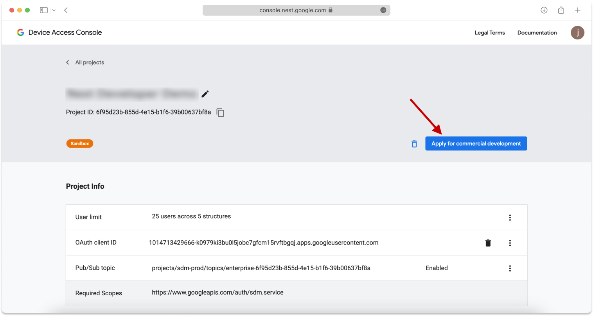<figcaption></figcaption></figure>
2. On the **Applying for Commercial Development** page, click **Next**.
3.  On the **Google Non-Disclosure Agreement** page, type the following information:

    * **Company Name**
    * **Developer Name**
    * **Developer Corporate Email Address**
    * **Name of Company Authorized Representative**

    <figure>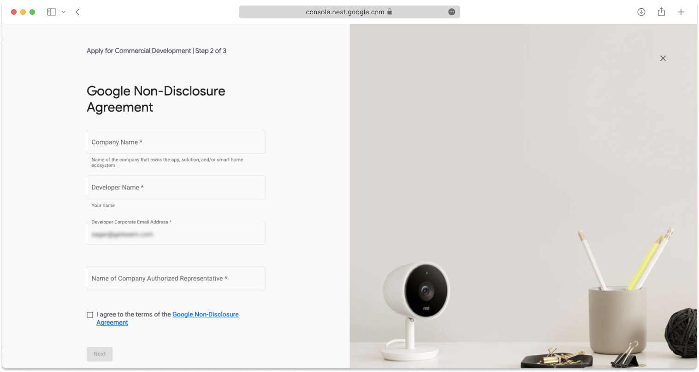<figcaption></figcaption></figure>
4. Select the checkbox to agree to the Google Non-Disclosure Agreement and then click **Next**.
5.  In the Google Commercial Development application, specify the requested information and then click **Apply**.\

    <figure>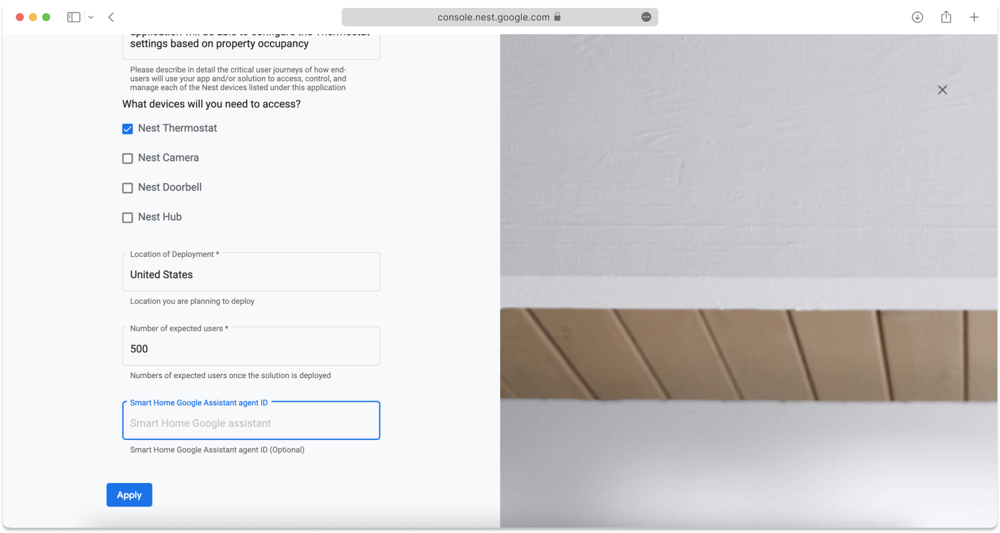<figcaption></figcaption></figure>

## 6.  Provide Your Project Information to Seam through the Seam Console

In the [Seam Console](../../core-concepts/seam-console/), add your Google Device Access project information. It is not necessary to wait for Google Commercial Development approval before adding this information in the Seam Console.


You must be the owner of your Seam [workspace](../../core-concepts/workspaces/) to perform this procedure.


1. Locate and note the following information:
   *   Google Device Access project ID\
       Find this information on the project information page for your Google Device Access project.\

       <figure>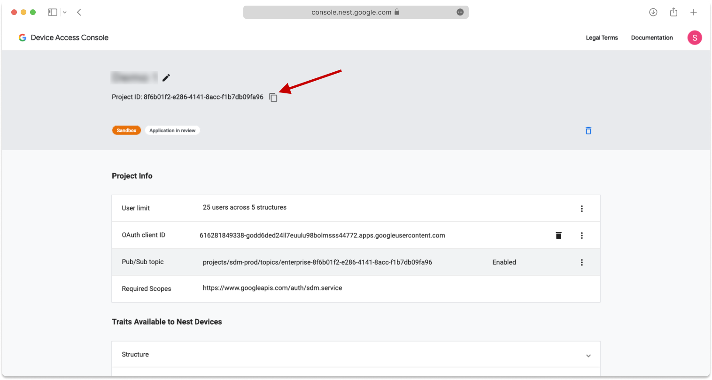<figcaption></figcaption></figure>
   * OAuth client ID and secret\
     Find this information in the JSON file that you downloaded when creating the OAuth client earlier in this procedure.
2. In a web browser, go to [https://console.seam.co](https://console.seam.co).
3. [Log in to the Seam Console](../../core-concepts/seam-console/#log-in-to-the-seam-console-using-an-email-address).
4. In the left navigation pane, click **Beta > Workspace Settings**.
5. on the **Workspace Settings** page, next to **Nest Developer Settings**, click **Edit**.
6. In the **Nest Developer Settings** dialog, type or paste your project ID, Client ID, and Client secret.&#x20;

<figure>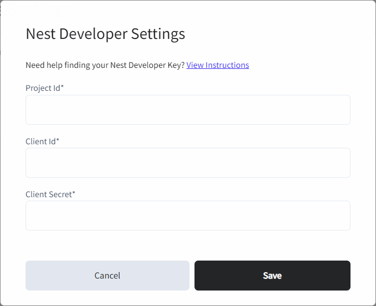<figcaption></figcaption></figure>

6. Click **Save**.
