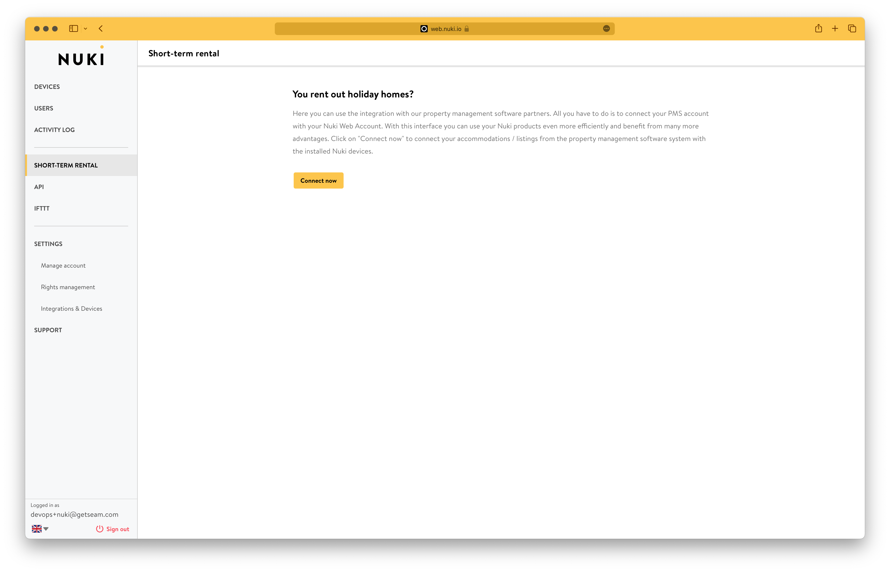
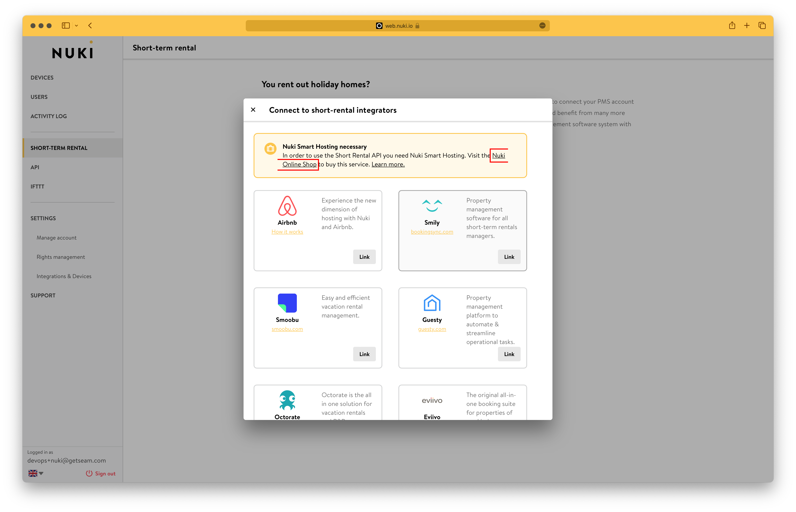
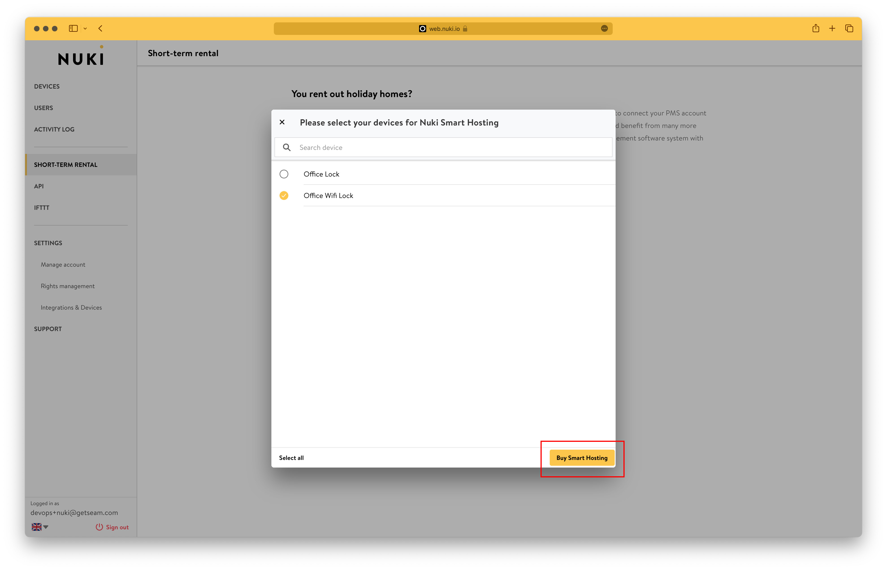

# Nuki Locks

<figure><figcaption></figcaption></figure>

## Overview

Nuki produces a smart lock and accompanying products for the residential, rental, vacation rental, and corporate markets. Seam integrates directly with the Wi-Fi-enabled Nuki Smart Lock Pro, as well as with the Nuki Smart Lock through the Nuki Wi-Fi Bridge. Because Nuki Smart Locks attach to existing deadbolts, they replace only the lock components on the insides of doors.

Seam also supports the Nuki Keypad accessory for access code-based entry. In addition, the Nuki Opener works with the Nuki Bridge to control the intercom in a multi-unit building. In this way, Nuki products provide keyless access all the way from the street.

***

## Supported Devices

This integration supports all Nuki Smart Lock and Nuki Opener models that are connected to Wi-Fi, either through built-in Wi-Fi or using the [Nuki Bridge](https://nuki.io/en/bridge/). Seam also supports the addition of the optional [Nuki Keypad](https://nuki.io/en/keypad-code/) to enable entering access codes to control the lock or opener.


You must purchase [Nuki Smart Hosting](https://nuki.io/en-us/products/smart-hosting-service) for each of your Nuki locks to enable you to program access codes on these Nuki locks through Seam.


The following table details the requirements for compatibility with this Seam integration:

<table><thead><tr><th width="187.33333333333331">Product Models</th><th>Compatibility</th><th>Accessories</th></tr></thead><tbody><tr><td><a href="https://nuki.io/en/smart-lock/">Smart Lock</a></td><td>Compatible only with Nuki Bridge</td><td><ul><li>Bridge</li><li>Keypad (optional)</li></ul></td></tr><tr><td><a href="https://nuki.io/en/smart-lock-pro/">Smart Lock Pro</a></td><td>Compatible</td><td><ul><li>Keypad (optional)</li></ul></td></tr><tr><td><a href="https://nuki.io/en/opener/">Opener</a></td><td>Compatible only with Nuki Bridge</td><td><ul><li>Bridge</li><li>Keypad (optional)</li></ul></td></tr></tbody></table>

For detailed information about the Nuki devices that Seam supports, see our [Nuki Supported Devices page](https://www.seam.co/manufacturers/nuki).

***

## Supported Features

We support the following features:

* [Triggering web lock and unlock actions](../products/smart-locks/lock-and-unlock.md)
* [Programming access codes](../products/smart-locks/access-codes/) on locks and openers that have an installed Nuki Keypad


Nuki does not allow the use of zeros in PIN codes.


***

### Device Provider Key

To create a [Connect Webview](../core-concepts/connect-webviews/) that enables your users to connect their Nuki devices to Seam, include the `nuki` device provider key in the `accepted_providers` list. For more information, see [Customize the Brands to Display in Your Connect Webviews](../core-concepts/connect-webviews/customizing-connect-webviews.md#customize-the-brands-to-display-in-your-connect-webviews).

***

## Setup Instructions

To control Nuki devices using Seam, you must prompt owners of these devices to perform the following steps:

1. Create an account in the [Nuki App](https://nuki.io/en/app/) if you have not done so already.
2. In the Nuki App, add your Nuki devices.
3. Note your login credentials for the Nuki App.
4. Perform the following steps to purchase Nuki Smart Hosting to enable you to program access codes on your Nuki locks through Seam.
   1. In a web browser, navigate to [Nuki Web](https://web.nuki.io/).
   2. Click **Go To Nuki Web**.
   3. Log in to Nuki Web using your Nuki App credentials.
   4.  In the left-hand navigation pane, click **Short-Term Rental**.

       <figure><figcaption></figcaption></figure>
   5. On the **Short-term rental** page, click **Connect now**.
   6.  In the **Connect to short-rental integrators** dialog, click **Nuki Online Shop**.

       <figure><figcaption></figcaption></figure>
   7.  In the **Please select your devices for Nuki Smart Hosting** dialog, select the devices for which you want to be able to program access codes and then click **Buy Smart Hosting**.

       <figure><figcaption></figcaption></figure>
   8. In the Nuki online store, complete your Nuki Smart Hosting purchase.
5. Use your credentials for the Nuki app to log in to the [Seam Connect Webview](../core-concepts/connect-webviews/) to add your devices to Seam.

***

## Brand-Specific Restrictions

Nuki imposes the following limits on Nuki App users, lock permissions, and entry codes, that is, access codes:

### Nuki App Users

For Nuki Smart Lock 2.0 and newer, you can create 200 app users.

### Lock Permissions

For Nuki Smart Lock, you can create 100 permissions.

### Access Codes

For Smart Lock 3.0 and newer connected to a Nuki Keypad, you can create 200 access codes, in addition to the aforementioned permissions.

For Smart Lock 2.0 and previous versions connected to a Nuki Keypad, you can create 100 access codes, in addition to the aforementioned permissions.

***

## Where to Order

To purchase Nuki devices, visit the Nuki online store.

<table data-view="cards"><thead><tr><th></th><th></th><th></th><th data-hidden data-card-target data-type="content-ref"></th><th data-hidden data-card-cover data-type="files"></th></tr></thead><tbody><tr><td></td><td><strong>Nuki Online Store</strong></td><td></td><td><a href="https://shop.nuki.io/en/">https://shop.nuki.io/en/</a></td><td><a href="../.gitbook/assets/nuki-logo.png">nuki-logo.png</a></td></tr></tbody></table>

***
