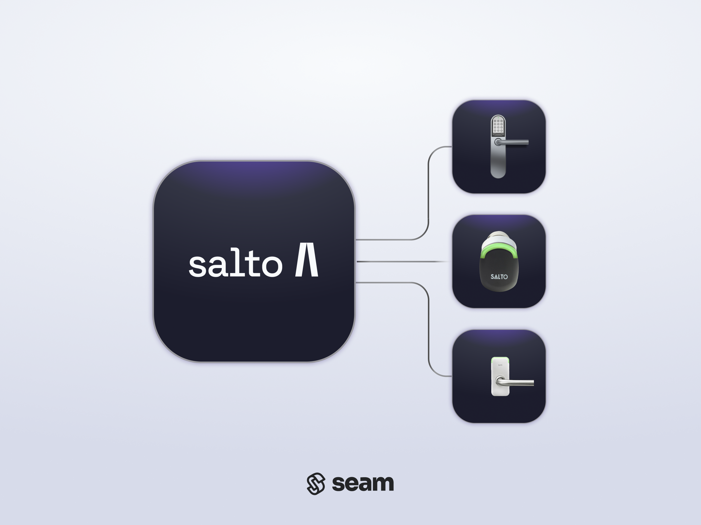

# Salto KS Locks

<figure><picture><source srcset="../.gitbook/assets/salto-ks-manufacturer-page-cover-dark.png" media="(prefers-color-scheme: dark)"></picture><figcaption>
Connect and control your Salto KS locks using the Seam API.
</figcaption></figure>

## Overview

Salto Systems produces world-class electronic access control solutions. Their locks work with a vast array of entrance types, from traditional doors and elevators, to key cylinders and parking stiles. They also support a versatile range of key credentials; their locks work with RFID tags, mobile keys, and PIN codes. Using their mobile app and app dashboard, businesses can easily assign, monitor, and revoke access rights.


Seam supports two integrations for Salto KS. We recommend using the [Salto KS access control system integration](../device-and-system-integration-guides/salto-ks-access-control-system/) because it provides more robust functionality, such as managing ACS users and credentials. However, if you want to connect a single or just a few Salto KS locks, you can choose the Salto KS lock integration that this topic describes.


***

## Supported Devices

This integration works any devices connected via their [Salto KS platform](https://saltoks.com/).

For detailed information about the Salto devices that Seam supports, see our [Salto Supported Devices page](https://www.seam.co/manufacturers/salto).

***

## Supported Features

We support the following features:

* [Triggering web unlock actions](../api/locks/unlock_door.md)
* [Programming access codes](../products/smart-locks/access-codes/) on door locks and card readers that have a PIN pad

***

### Device Provider Key

To create a [Connect Webview](../core-concepts/connect-webviews/) that enables your users to connect their Salto devices to Seam, include the `salto_ks` device provider key in the `accepted_providers` list. For more information, see [Customize the Brands to Display in Your Connect Webviews](../core-concepts/connect-webviews/customizing-connect-webviews.md#customize-the-brands-to-display-in-your-connect-webviews).

***

## Setup Instructions

This section describes how to connect your Salto KS devices to Seam.

### Prerequisites

Note the following requirements before connecting your Salto KS devices to Seam:

#### Site Admin

You must use a Salto KS web app user account that has "Site Admin" rights.

#### Salto KS Production Environment

You must use a Salto KS production environment account to connect to Seam. You cannot use "Accept Environment" credentials.

To confirm that your Salto KS account is a production environment account, note the Salto KS dashboard URL. Make sure that the subdomain within this URL is `app`, for example, `https://app.saltoks.com`.

A subdomain of `app-accept`, for example, `https://app-accept.saltoks.com`, indicates an "Accept Environment" that you cannot connect to Seam.

#### Released Salto KS Sites

Make sure that your installer has released your Salto KS sites. Seam cannot perform actions on unreleased Salto KS sites.

***

### Setup Process

To control Salto KS devices using Seam, you must prompt owners of these devices to perform the following steps:

1. Create an account in the [Salto KS app](https://app.saltoks.com/) if you have not done so already.
2. In the Salto KS app, add your Salto KS devices.
3. Note your login credentials for the Salto KS app, and use these credentials to log in to the [Seam Connect Webview](../core-concepts/connect-webviews/) to add your devices to Seam.
   1. If the Connect Webview displays multiple brand options, select **Salto KS**.
   2. In the **Enter your credentials** dialog, type your username and password for the Salto KS web app and then click **Log In**.
   3. Select **Full Access** and then click **Yes, Allow**.
   4. Select the Salto KS sites that you want to integrate with Seam and then click **Continue**.
   5.  Click **Allow and Continue** to confirm that you allow Seam to add the requisite admin user to your Salto KS site for the integration with Seam.

       \{% hint style="warning" %\} Do not suspend or remove the Seam Integration admin user from your Salto KS site. \{% endhint %\}\*\*\*

## Brand-Specific Integration Considerations

### Access Code Limitations

Salto does not allow a user to configure custom PIN codes. When creating an access code on a Salto door lock, their system will automatically generate a 6-10 digit PIN code. You will be able to retrieve the PIN code from the `code` property on the access code object.

### Salto-Specific Access Code Errors

`salto_site_user_not_subscribed`

When you encounter this error, it means that the Salto KS site has exceeded the allowed number of users, as defined by its subscription plan. There are a few ways to resolve this:

1. You can reduce the number of access codes you've created. Each access code will take up one user slot.
2. You can ask the device owner to contact their Salto installer to increase the subscription limit on their site.

***

## Troubleshooting

### What to do with a Salto lock with an `unknown` device type?

A Salto lock displaying an `unknown` device type indicates a weak connection with the Salto IQ hub. Please contact a Salto installer for assistance.

***

## Where to Order

Get in touch with a Salto representative in your region. They can refer you to a local installer that will service your area.

<table data-view="cards"><thead><tr><th></th><th></th><th></th><th data-hidden data-card-target data-type="content-ref"></th><th data-hidden data-card-cover data-type="files"></th></tr></thead><tbody><tr><td></td><td><strong>Salto Systems Sales Contact</strong></td><td></td><td><a href="https://saltosystems.com/en-us/offices/">https://saltosystems.com/en-us/offices/</a></td><td><a href="../.gitbook/assets/salto-logo.png">salto-logo.png</a></td></tr></tbody></table>
