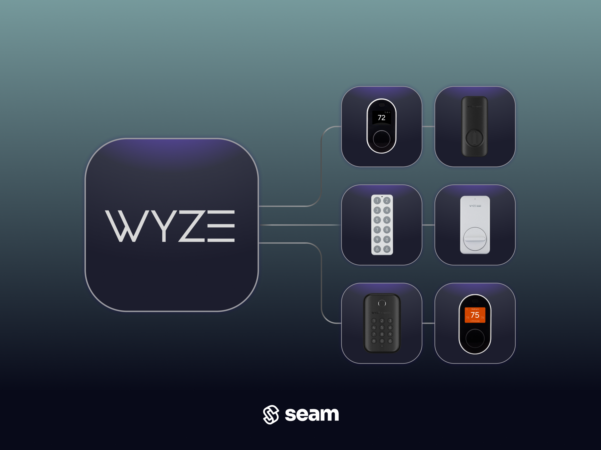

# Wyze Locks

<figure><figcaption></figcaption></figure>

## Overview

Wyze produces a smart lock with an accompanying gateway and an optional keypad. Intended for the residential and short-term rental industries, Wyze Locks provide fast installation, virtual keys, and automatic unlocking and locking functionality. Wyze Locks replace only the interior side of existing deadbolts, so existing physical keys still work. Further, Wyze Locks are compatible with most single-cylinder deadbolts.

To integrate the Wyze Smart Lock with Seam, you must first install the Wyze Lock Gateway and connect this gateway to the internet.

***

## Supported Devices

This integration supports the [Wyze Lock](https://www.wyze.com/products/wyze-lock), when accompanied by a [Wyze Lock Gateway](https://support.wyze.com/hc/en-us/articles/360037584772-How-does-Wyze-Lock-connect-to-the-internet-) that is connected to the internet. In addition, this integration supports access code functions for the optional [Wyze Lock Keypad](https://www.wyze.com/products/wyze-lock-keypad).


Seam does not integrate with the [Wyze Lock Bolt](https://www.wyze.com/products/wyze-lock-bolt).




We support the following features:

* [Triggering web lock and unlock actions](../products/smart-locks/lock-and-unlock.md)
* [Programming access codes](../products/smart-locks/access-codes/) on locks that have an installed Wyze Lock Keypad


The Seam platform cannot determine the PIN codes for access codes that were created outside of the Seam platform.


***

### Device Provider Key

To create a [Connect Webview](../core-concepts/connect-webviews/) that enables your users to connect their Wyze devices to Seam, include the `wyze` [device provider key](../api-clients/connect-webviews/#device-provider-keys) in the `accepted_providers` list. For more information, see [Customize the Brands to Display in Your Connect Webview](../core-concepts/connect-webviews/customizing-connect-webviews.md#customize-the-brands-to-display-in-your-connect-webviews).

***

## Setup Instructions

To control Wyze devices using Seam, you must prompt owners of these devices to perform the following steps:

1. Create an account in the [Wyze app](https://support.wyze.com/hc/en-us/articles/360032748451-Wyze-App-Setup-Guide) if you have not done so already.
2. In the Wyze app, add your Wyze devices.
3. Log in to the [Wyze online portal](https://developer-api-console.wyze.com/#/apikey/view).
4. In the Wyze online portal, click **Create an API key**.
5. Click **view** and note the API key.
6. Use your credentials for the Wyze app and the noted API key to log in to the [Seam Connect Webview](../core-concepts/connect-webviews/) to add your Wyze devices to Seam.

***

## Where to Order

To purchase Wyze devices, visit the Wyze online store.

<table data-view="cards"><thead><tr><th></th><th></th><th></th><th data-hidden data-card-target data-type="content-ref"></th><th data-hidden data-card-cover data-type="files"></th></tr></thead><tbody><tr><td></td><td><strong>Wyze Online Store</strong></td><td></td><td><a href="https://www.wyze.com/products/wyze-lock">https://www.wyze.com/products/wyze-lock</a></td><td><a href="../.gitbook/assets/wyze-logo.png">wyze-logo.png</a></td></tr></tbody></table>

***

