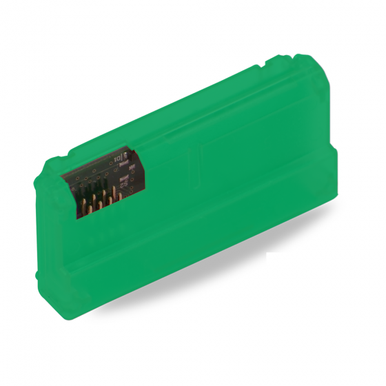

# Yale Locks

## Overview

Yale manufacturers some of the most advanced smart locks on the market such as the Yale [Assure](https://amzn.to/452zo6n) and [Nextouch](https://amzn.to/3DAeRdP) locks. With a unique interchangeable network module, Yale Locks are designed to be incredibly versatile, allowing for compatibility with a range of communication standards such as Z-wave, Wi-Fi, Bluetooth, and Zigbee. This adaptability ensures that they seamlessly fit into various smart home ecosystems.

***

## Supported Devices

The Seam integration is tailored for Yale Locks that are connected via the following platforms:

* [**Yale Home**](https://www.yalehome.com/au/en/products/smart-products/yale-home-app) **or** [**Yale Access**](https://www.yalehome.com/us/en/products/smart-technology/yale-access) **apps**: Some Yale locks come with built-in WiFi support, enabling them to connect directly to the Yale Home app (for global implementations) or Yale Access app (for North American implementations). However, for locks without integrated WiFi, you must install the [Yale Access Upgrade Kit](https://amzn.to/3OyUVOT) for compatibility with these apps.\
  \
  [**Yale Access Upgrade Kit**](https://www.amazon.com/Yale-Bluetooth-Upgrade-Assure-Levers/dp/B07GPXN936?hvadid=309748512713\&hvpos=\&hvnetw=g\&hvrand=898690352114198212\&hvpone=\&hvptwo=\&hvqmt=\&hvdev=c\&hvdvcmdl=\&hvlocint=\&hvlocphy=9031939\&hvtargid=pla-628163958927\&psc=1\&linkCode=sl1\&tag=seam0f-20\&linkId=2a3f40625fb6f9267c822adfd793a950\&language=en\_US\&ref\_=as\_li\_ss\_tl)


Seam does not currently support integration with the Yale Smart Living app (for implementations in Europe, the Middle East, India, and Africa) or the Yale Connect app (mainly for implementations in Latin America).


* **Z-Wave with** [**Aeotec SmartThings**](https://amzn.to/44OulH1): To use Yale Locks with these Z-Wave based hubs, the lock must have the [Yale Z-Wave network module](https://amzn.to/3DC9nis) installed. This module ensures seamless communication between the lock and the hub, allowing for integration into broader smart home setups.\
  \
  [**Yale Z-Wave Network Module**](https://www.amazon.com/Yale-Z-wave-Module-Electronic-AYR202-ZWV-USA/dp/B07B1G5LR9?crid=1M97DIL3OHT0E\&keywords=yale+z-wave+plus+module\&qid=1690480444\&sprefix=yale+z-wave+plus+module,aps,318\&sr=8-1\&ufe=app\_do:amzn1.fos.f5122f16-c3e8-4386-bf32-63e904010ad0\&linkCode=sl1\&tag=seam0f-20\&linkId=62ce481be465b16a59d4e8e1f69e4965\&language=en\_US\&ref\_=as\_li\_ss\_tl)

When purchasing a Yale Lock or a network module separately, always verify the specific compatibility needs for your desired setup.



We support the following features:

* [Triggering web unlock actions](../api-clients/locks/unlock-a-lock.md)
* [Programming access codes](../products/smart-locks/access-codes/) on door locks that have a keypad

***

### Device Provider Key

To create a [Connect Webview](../core-concepts/connect-webviews/) that enables your users to connect their Yale devices to Seam, include the `yale` [device provider key](../api-clients/connect-webviews/#device-provider-keys) in the `accepted_providers` list. For more information, see [Customize the Brands to Display in Your Connect Webview](../core-concepts/connect-webviews/customizing-connect-webviews.md#customize-the-brands-to-display-in-your-connect-webviews).

***

## Brand-Specific Integration Considerations

### Yale Home & Yale Access-specific Access Code Errors

Since August and Yale are both using the same app to control the locks, you might see this `august_*` prefix on your errors.

`august_device_programming_delay`

Yale has acknowledged a request to program the code, but the access code has not yet been fully moved to the device. The device likely has a flaky internet connection. We will continue to try and set the code on the device.

`august_device_slots_full`

All access code slots on the device are full. Please remove some codes from the lock to resolve this.

`august_lock_bad_access_code_format`

The access code format is not correct. Please delete the code and try programming it again.

`august_lock_missing_keypad`

The Yale lock is missing a keypad. You could install an [August keypad](https://amzn.to/3rOdSUN) to add key code functionality to your door lock.

`august_lock_temporarily_offline`

August lock was temporarily offline while setting/removing a code, the code should be set/remove when it comes back online.

### SmartThings Hub-specific Access Code Errors

`smartthings_failed_to_set_after_multiple_retries`

When you encounter this error, it means that Seam has failed to set code on device after multiple retries. This may be due to a conflict with an existing code on the device that was created by a user, or by other software that may be used to program codes. To fix this, delete any conflicting codes. Please also make sure that other applications like like Rboy or Operto are disabled on the device.

`smartthings_no_free_slots_available`

When you encounter this error, it means that here are no more free slots available on the device. You will need to delete existing codes before more codes can be added to the device.

***

## Where to Order

Here are a few recommended vendors you can use to order Yale locks. Some of these vendors can even help with installation services.

<table data-view="cards"><thead><tr><th></th><th></th><th></th><th data-hidden data-card-target data-type="content-ref"></th><th data-hidden data-card-cover data-type="files"></th></tr></thead><tbody><tr><td><strong>Amazon - Yale Locks</strong></td><td></td><td></td><td><a href="https://amzn.to/3q5R5TM">https://amzn.to/3q5R5TM</a></td><td><a href="../.gitbook/assets/Screen Shot 2023-07-27 at 10.40.18 AM.png">Screen Shot 2023-07-27 at 10.40.18 AM.png</a></td></tr><tr><td><strong>GoKeyless - Yale Locks</strong></td><td></td><td></td><td><a href="https://www.gokeyless.com/pa_brand/yale-home/">https://www.gokeyless.com/pa_brand/yale-home/</a></td><td><a href="../.gitbook/assets/Screen Shot 2023-07-27 at 10.37.07 AM (1).png">Screen Shot 2023-07-27 at 10.37.07 AM (1).png</a></td></tr></tbody></table>
