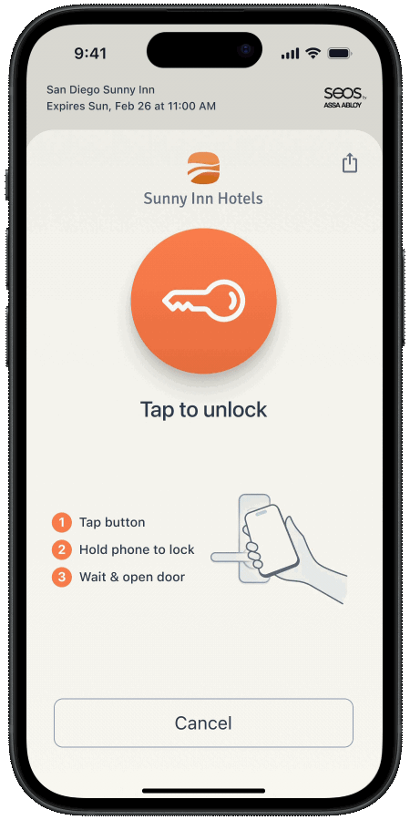

# Additional Guest Access Actions

You can use the Seam API to handle common and edge case guest access scenarios, such as the following:

* [Sharing access with additional guests on the same reservation](additional-guest-access-actions.md#sharing-access)
* [Multi-unit access](additional-guest-access-actions.md#multi-unit-access)
* [Mid-stay room changes](additional-guest-access-actions.md#room-changes)
* [Early check in/late check out](additional-guest-access-actions.md#early-check-in-late-check-out)
* [Lost cards](additional-guest-access-actions.md#lost-cards)
* [Check out](additional-guest-access-actions.md#check-out)

***

## Sharing Access

Seam Instant Key supports guest sharing. When you issue an Instant Key, you can configure how many times guests can share it. That is, you configure the desired maximum number of uses for the Instant Key.

Users can forward their Instant Key link—using text or email—to others in their reservation group, like a partner or family member. Then, people in the reservation group can use the shared Instant Key, up to the configured maximum number of uses (`max_use_count`).

<figure><figcaption><p>A guest can share their Instant Key with other members within their party.</p></figcaption></figure>

***

## Multi-unit Access

Some guests may need access to multiple rooms or amenities (for example, a suite and a gym). You can grant access to multiple sets of doors simply by specifying the desired `acs_entrance_ids` when creating an Access Grant for the guest. Alternately, you can assign the desired set of entrances to a space resource and then specify one or more `space_ids` when creating the Access Grant.



**Code:**

```python
seam.access_grants.create(
  user_identity_id=jane_user.user_identity_id,
  acs_entrance_ids=[
    "48ebfb50-c531-43c5-b9ea-409f26dabbd7",
    "f74e4879-5991-4e2f-a368-888983dcfbfc"
  ],
  space_ids=[
    "c1eb6eb5-58f0-4ba3-8166-f21445ae9427",
    "2b19ddaa-44db-404b-aa2e-d99fa58020c8"
  ],
  requested_access_methods=[
    {"mode": "mobile_key"}
  ],
  starts_at="2025-07-13T15:00:00.000Z",
  ends_at="2025-07-16T11:00:00.000Z"
)
```

**Output:**

```python
AccessGrant(
  access_grant_id="ef83cca9-5fdf-4ac2-93f3-c21c5a8be54b",
  display_name="My Access Grant",
  user_identity_id="43947360-cdc8-4db6-8b22-e079416d1d8b",
  starts_at="2025-07-13T15:00:00.000Z",
  ends_at="2025-07-16T11:00:00.000Z",
  ...
)
```



**Code:**

```bash
curl -X 'POST' \
  'https://connect.getseam.com/access_grants/create' \
  -H 'accept: application/json' \
  -H "Authorization: Bearer ${SEAM_API_KEY}" \
  -H 'Content-Type: application/json' \
  -d "{
    \"user_identity_id\": \"$(jq -r '.user_identity.user_identity_id' <<< ${jane_user})\"
    \"acs_entrance_ids\": [
      \"48ebfb50-c531-43c5-b9ea-409f26dabbd7\",
      \"f74e4879-5991-4e2f-a368-888983dcfbfc\"
    ],
    \"space_ids\": [
      \"c1eb6eb5-58f0-4ba3-8166-f21445ae9427\",
      \"2b19ddaa-44db-404b-aa2e-d99fa58020c8\"
    ],
    \"requested_access_methods\": [
      {\"mode\": \"mobile_key\"}
    ],
    \"starts_at\": \"2025-07-13T15:00:00.000Z\",
    \"ends_at\": \"2025-07-16T11:00:00.000Z\"
}"
```

**Output:**

```json
{
  "access_grant": {
    "access_grant_id": "ef83cca9-5fdf-4ac2-93f3-c21c5a8be54b",
    "display_name": "My Access Grant",
    "user_identity_id": "43947360-cdc8-4db6-8b22-e079416d1d8b",
    "starts_at": "2025-07-13T15:00:00.000Z",
    "ends_at": "2025-07-16T11:00:00.000Z",
    ...
  }
}
```



**Code:**

```javascript
await seam.accessGrants.create({
  user_identity_id: janeUser.user_identity_id,
  acs_entrance_ids: [
    "48ebfb50-c531-43c5-b9ea-409f26dabbd7",
    "f74e4879-5991-4e2f-a368-888983dcfbfc"
  ],
  space_ids: [
    "c1eb6eb5-58f0-4ba3-8166-f21445ae9427",
    "2b19ddaa-44db-404b-aa2e-d99fa58020c8"
  ],
  requested_access_methods: [
    {"mode": "mobile_key"}
  ],
  starts_at: "2025-07-13T15:00:00.000Z",
  ends_at: "2025-07-16T11:00:00.000Z"
});
```

**Output:**

```json
{
  "access_grant_id": "ef83cca9-5fdf-4ac2-93f3-c21c5a8be54b",
  "display_name": "My Access Grant",
  "user_identity_id": "43947360-cdc8-4db6-8b22-e079416d1d8b",
  "starts_at": "2025-07-13T15:00:00.000Z",
  "ends_at": "2025-07-16T11:00:00.000Z",
  ...
}
```



**Code:**

```ruby
seam.access_grants.create(
  user_identity_id: jane_user.user_identity_id,
  acs_entrance_ids: %w[48ebfb50-c531-43c5-b9ea-409f26dabbd7 f74e4879-5991-4e2f-a368-888983dcfbfc],
  space_ids: %w[48ebfb50-c531-43c5-b9ea-409f26dabbd7 2b19ddaa-44db-404b-aa2e-d99fa58020c8],
  requested_access_methods: [
    {"mode": "mobile_key"}
  ],
  starts_at: "2025-07-13T15:00:00.000Z",
  ends_at: "2025-07-16T11:00:00.000Z"
)
```

**Output:**

```ruby
{
  "access_grant_id" => "ef83cca9-5fdf-4ac2-93f3-c21c5a8be54b",
  "display_name" => "My Access Grant",
  "user_identity_id" => "43947360-cdc8-4db6-8b22-e079416d1d8b",
  "starts_at" => "2025-07-13T15:00:00.000Z",
  "ends_at" => "2025-07-16T11:00:00.000Z",
  ...
}
```



**Code:**

```php
$seam->access_grants->create(
  user_identity_id: $jane_user->user_identity_id,
  acs_entrance_ids: [
    "48ebfb50-c531-43c5-b9ea-409f26dabbd7",
    "f74e4879-5991-4e2f-a368-888983dcfbfc",
  ],
  space_ids: [
    "c1eb6eb5-58f0-4ba3-8166-f21445ae9427",
    "2b19ddaa-44db-404b-aa2e-d99fa58020c8"
  ],
  requested_access_methods: [
    ["mode" => "mobile_key"],
  ],
  starts_at: "2025-07-13T15:00:00.000Z",
  ends_at: "2025-07-16T11:00:00.000Z"
);
```

**Output:**

```php
[
  "access_grant_id" => "ef83cca9-5fdf-4ac2-93f3-c21c5a8be54b",
  "display_name" => "My Access Grant",
  "user_identity_id" => "43947360-cdc8-4db6-8b22-e079416d1d8b",
  "starts_at" => "2025-07-13T15:00:00.000Z",
  "ends_at" => "2025-07-16T11:00:00.000Z",
  ...
];
```



**Code:**

```csharp
// Coming Soon!
```

**Output:**

```json
// Coming Soon!
```



***

## Room Changes

If a guest is moved to a different room during their stay, you can create a new Access Grant to update their access. Note that, for some access systems with encoded plastic cards, the guest must tap the card on an online reader to apply the changes.

***

## Early Check In/Late Check Out

If a guest arrives early or extends their stay, you can adjust the access schedule for access systems that support this feature, such as Salto KS. Update the `starts_at` or `ends_at` property in the Access Grant for the user.



**Code:**

```python
seam.access_grants.update(
  user_identity_id=jane_user.user_identity_id,
  starts_at="2025-07-14T15:00:00.000Z",
  ends_at="2025-07-17T11:00:00.000Z"
)
```

**Output:**

```python
AccessGrant(
  access_grant_id="ef83cca9-5fdf-4ac2-93f3-c21c5a8be54b",
  display_name="My Access Grant",
  user_identity_id="43947360-cdc8-4db6-8b22-e079416d1d8b",
  starts_at="2025-07-14T15:00:00.000Z",
  ends_at="2025-07-17T11:00:00.000Z",
  ...
)
```



**Code:**

```bash
curl -X 'POST' \
  'https://connect.getseam.com/access_grants/update' \
  -H 'accept: application/json' \
  -H "Authorization: Bearer ${SEAM_API_KEY}" \
  -H 'Content-Type: application/json' \
  -d "{
    \"user_identity_id\": \"$(jq -r '.user_identity.user_identity_id' <<< ${jane_user})\"
    \"starts_at\": \"2025-07-14T15:00:00.000Z\",
    \"ends_at\": \"2025-07-17T11:00:00.000Z\"
}"
```

**Output:**

```json
{
  "access_grant": {
    "access_grant_id": "ef83cca9-5fdf-4ac2-93f3-c21c5a8be54b",
    "display_name": "My Access Grant",
    "user_identity_id": "43947360-cdc8-4db6-8b22-e079416d1d8b",
    "starts_at": "2025-07-14T15:00:00.000Z",
    "ends_at": "2025-07-17T11:00:00.000Z",
    ...
  }
}
```



**Code:**

```javascript
await seam.accessGrants.update({
  user_identity_id: janeUser.user_identity_id,
  starts_at: "2025-07-14T15:00:00.000Z",
  ends_at: "2025-07-17T11:00:00.000Z"
});
```

**Output:**

```json
{
  "access_grant_id": "ef83cca9-5fdf-4ac2-93f3-c21c5a8be54b",
  "display_name": "My Access Grant",
  "user_identity_id": "43947360-cdc8-4db6-8b22-e079416d1d8b",
  "starts_at": "2025-07-14T15:00:00.000Z",
  "ends_at": "2025-07-17T11:00:00.000Z",
  ...
}
```



**Code:**

```ruby
seam.access_grants.update(
  user_identity_id: jane_user.user_identity_id,
  starts_at: "2025-07-14T15:00:00.000Z",
  ends_at: "2025-07-17T11:00:00.000Z"
)
```

**Output:**

```ruby
{
  "access_grant_id" => "ef83cca9-5fdf-4ac2-93f3-c21c5a8be54b",
  "display_name" => "My Access Grant",
  "user_identity_id" => "43947360-cdc8-4db6-8b22-e079416d1d8b",
  "starts_at" => "2025-07-14T15:00:00.000Z",
  "ends_at" => "2025-07-17T11:00:00.000Z",
  ...
}
```



**Code:**

```php
$seam->access_grants->update(
  user_identity_id: $jane_user->user_identity_id,
  starts_at: "2025-07-14T15:00:00.000Z",
  ends_at: "2025-07-17T11:00:00.000Z"
);
```

**Output:**

```php
[
  "access_grant_id" => "ef83cca9-5fdf-4ac2-93f3-c21c5a8be54b",
  "display_name" => "My Access Grant",
  "user_identity_id" => "43947360-cdc8-4db6-8b22-e079416d1d8b",
  "starts_at" => "2025-07-14T15:00:00.000Z",
  "ends_at" => "2025-07-17T11:00:00.000Z",
  ...
];
```



**Code:**

```csharp
// Coming Soon!
```

**Output:**

```json
// Coming Soon!
```



Mobile keys update automatically to match the new time window. If a Seam Instant Key is within its validity period, it also updates automatically to match the new time window. If the Instant Key has expired, you can [generate a new one](../../api/user_identities/generate_instant_key.md) and share the new Instant Key link with the guest. Note that, for some access systems with encoded plastic cards, the guest must tap the card on an online reader to apply the changes.

***

## Lost Cards

Once you have encoded an access method onto a card, you cannot reuse the access method for another card. If a guest loses their key card, you can create a new access method and encode it onto a new card.



**Code:**

```python
# Create a new Access Grant.
seam.access_grants.create(
  user_identity_id=jane_user.user_identity_id,
  acs_entrance_ids=[
    "48ebfb50-c531-43c5-b9ea-409f26dabbd7",
    "f74e4879-5991-4e2f-a368-888983dcfbfc"
  ],  
  requested_access_methods=[
    {"mode": "card"}
  ],
  starts_at="2025-07-13T15:00:00.000Z",
  ends_at="2025-07-16T11:00:00.000Z"
)

# Encode the new card.
encoder = seam.acs.encoders.list(
  acs_system_ids = [hotel_a.acs_system_id]
)[0]

encoding_action_attempt = seam.access_methods.encode(
  access_method_id = "ef3a5e10-5a76-4382-96f7-627f810ef849",
  acs_encoder_id = encoder.acs_encoder_id
)

# To confirm that the encoding succeeded, 
# poll the returned action attempt
# until its status is success.
seam.action_attempts.get(
  action_attempt_id = encoding_action_attempt.action_attempt_id
)
```

**Output:**

```python
AccessGrant(
  access_grant_id="ef83cca9-5fdf-4ac2-93f3-c21c5a8be54b",
  display_name="My Access Grant",
  user_identity_id="43947360-cdc8-4db6-8b22-e079416d1d8b",
  starts_at="2025-07-13T15:00:00.000Z",
  ends_at="2025-07-16T11:00:00.000Z",
  requested_access_methods=[
    {
      "display_name": "Plastic Card",
      "mode": "card",
      "created_access_method_ids": ["ef3a5e10-5a76-4382-96f7-627f810ef849"],
      ...
    }
  ],
  ...
)

ActionAttempt(
  status='success',
  action_attempt_id='4f80761b-2bfa-401a-9f73-a08439c970f7',
  action_type='ENCODE_ACCESS_METHOD',
  result={
    access_method_id='ef3a5e10-5a76-4382-96f7-627f810ef849',
    card_number='1234abc',
    is_issued=True,
    issued_at='2025-07-14T11:00:00.000Z',
    ...
  },
  error=null
)
```



**Code:**

```bash
# Create a new Access Grant.
curl -X 'POST' \
  'https://connect.getseam.com/access_grants/create' \
  -H 'accept: application/json' \
  -H "Authorization: Bearer ${SEAM_API_KEY}" \
  -H 'Content-Type: application/json' \
  -d "{
    \"user_identity_id\": \"$(jq -r '.user_identity.user_identity_id' <<< ${jane_user})\"
    \"acs_entrance_ids\": [
      \"48ebfb50-c531-43c5-b9ea-409f26dabbd7\",
      \"f74e4879-5991-4e2f-a368-888983dcfbfc\"
    ],
    \"requested_access_methods\": [
      {\"mode\": \"card\"}
    ],
    \"starts_at\": \"2025-07-13T15:00:00.000Z\",
    \"ends_at\": \"2025-07-16T11:00:00.000Z\"
}"

# Encode the new card.
encoder=$(curl -X 'POST' \
  'https://connect.getseam.com/acs/encoders/list' \
  -H 'accept: application/json' \
  -H "Authorization: Bearer ${SEAM_API_KEY}" \
  -H 'Content-Type: application/json' \
  -d "{
  \"acs_system_id\": \"$(jq -r '.acs_system.acs_system_id' <<< ${hotel_a})\"
}" | jq -r '.acs_encoders[0]')

encoding_action_attempt=$(curl -X 'POST' \
  'https://connect.getseam.com/access_methods/encode' \
  -H 'accept: application/json' \
  -H "Authorization: Bearer ${SEAM_API_KEY}" \
  -H 'Content-Type: application/json' \
  -d "{
  \"access_method_id\": \"ef3a5e10-5a76-4382-96f7-627f810ef849\",
  \"acs_encoder_id\": \"$(jq -r '.acs_encoder_id' <<< ${encoder})\"
}")

# To confirm that the encoding succeeded, 
# poll the returned action attempt
# until its status is success.
curl -X 'POST' \
  'https://connect.getseam.com/action_attempts/get' \
  -H 'accept: application/json' \
  -H "Authorization: Bearer ${SEAM_API_KEY}" \
  -H 'Content-Type: application/json' \
  -d "{
  \"action_attempt_id\": \"$(jq -r '.action_attempt.action_attempt_id' <<< ${encoding_action_attempt})\"
}"
```

**Output:**

```json
{
  "access_grant": {
    "access_grant_id": "ef83cca9-5fdf-4ac2-93f3-c21c5a8be54b",
    "display_name": "My Access Grant",
    "user_identity_id": "43947360-cdc8-4db6-8b22-e079416d1d8b",
    "starts_at": "2025-07-13T15:00:00.000Z",
    "ends_at": "2025-07-16T11:00:00.000Z",
    "requested_access_methods": [
      {
        "display_name": "Plastic Card",
        "mode": "card",
        "created_access_method_ids": ["ef3a5e10-5a76-4382-96f7-627f810ef849"],
        ...
      }
    ],
    ...
  }
}

{
  "action_attempt":
    {
      "status": "success",
      "action_attempt_id": "4f80761b-2bfa-401a-9f73-a08439c970f7",
      "action_type": "ENCODE_ACCESS_METHOD",
      "result": {
        "access_method_id": "ef3a5e10-5a76-4382-96f7-627f810ef849",
        "card_number": "1234abc",
        "is_issued": true,
        "issued_at": "2025-07-14T11:00:00.000Z",
        ...
      },
      "error": null
    },
  "ok": true
}
```



**Code:**

```javascript
// Create a new Access Grant.
await seam.accessGrants.create({
  user_identity_id: janeUser.user_identity_id,
  acs_entrance_ids: [
    "48ebfb50-c531-43c5-b9ea-409f26dabbd7",
    "f74e4879-5991-4e2f-a368-888983dcfbfc"
  ],
  requested_access_methods: [
    {"mode": "card"}
  ],
  starts_at: "2025-07-13T15:00:00.000Z",
  ends_at: "2025-07-16T11:00:00.000Z"
});

// Encode the new card.
const encoder = (await seam.acs.encoders.list({
  acs_system_ids = [hotel_a.acs_system_id]
}))[0];

const encodingActionAttempt = await seam.accessMethods.encode({
  access_method_id: "ef3a5e10-5a76-4382-96f7-627f810ef849",
  acs_encoder_id: encoder.acs_encoder_id
});

// To confirm that the encoding succeeded, 
// poll the returned action attempt
// until its status is success.
await seam.actionAttempts.get({
  action_attempt_id: encodingActionAttempt.action_attempt_id
});
```

**Output:**

```json
{
  "access_grant_id": "ef83cca9-5fdf-4ac2-93f3-c21c5a8be54b",
  "display_name": "My Access Grant",
  "user_identity_id": "43947360-cdc8-4db6-8b22-e079416d1d8b",
  "starts_at": "2025-07-13T15:00:00.000Z",
  "ends_at": "2025-07-16T11:00:00.000Z",
  "requested_access_methods": [
    {
      "display_name": "Plastic Card",
      "mode": "card",
      "created_access_method_ids": ["ef3a5e10-5a76-4382-96f7-627f810ef849"],
      ...
    }
  ],
  ...
}

{
  "status": "success",
  "action_attempt_id": "4f80761b-2bfa-401a-9f73-a08439c970f7",
  "action_type": "ENCODE_ACCESS_METHOD",
  "result": {
    "access_method_id": "ef3a5e10-5a76-4382-96f7-627f810ef849",
    "card_number": "1234abc",
    "is_issued": true,
    "issued_at": "2025-07-14T11:00:00.000Z",
    ...
  },
  "error": null
}
```



**Code:**

```ruby
# Create a new Access Grant.
seam.access_grants.create(
  user_identity_id: jane_user.user_identity_id,
  acs_entrance_ids: %w[48ebfb50-c531-43c5-b9ea-409f26dabbd7 f74e4879-5991-4e2f-a368-888983dcfbfc],
  requested_access_methods: [
    {"mode": "card"}
  ],
  starts_at: "2025-07-13T15:00:00.000Z",
  ends_at: "2025-07-16T11:00:00.000Z"
)

# Encode the new card.
encoder = (seam.acs.encoders.list(
  acs_system_ids = [hotel_a.acs_system_id]
))[0]

encoding_action_attempt = seam.access_methods.encode(
  access_method_id: "ef3a5e10-5a76-4382-96f7-627f810ef849",
  acs_encoder_id: encoder.acs_encoder_id
)

# To confirm that the encoding succeeded, 
# poll the returned action attempt
# until its status is success.
seam.action_attempts.get(
  action_attempt_id: encoding_action_attempt.action_attempt_id
)
```

**Output:**

```ruby
{
  "access_grant_id" => "ef83cca9-5fdf-4ac2-93f3-c21c5a8be54b",
  "display_name" => "My Access Grant",
  "user_identity_id" => "43947360-cdc8-4db6-8b22-e079416d1d8b",
  "starts_at" => "2025-07-13T15:00:00.000Z",
  "ends_at" => "2025-07-16T11:00:00.000Z",
  "requested_access_methods" => [
    {
      "display_name": "Plastic Card",
      "mode": "card",
      "created_access_method_ids": ["ef3a5e10-5a76-4382-96f7-627f810ef849"],
      ...
    }
  ],
  ...
}

{
  "status" => "success",
  "action_attempt_id" => "4f80761b-2bfa-401a-9f73-a08439c970f7",
  "action_type" => "ENCODE_ACCESS_METHOD",
  "result" => {
    "access_method_id": "ef3a5e10-5a76-4382-96f7-627f810ef849"
    "card_number": "1234abc"
    "is_issued": true,
    issued_at="2025-07-13T14:00:00.000Z"
    ...
  }
  error=nil
}
```



**Code:**

```php
// Create a new Access Grant.
$seam->access_grants->create(
  user_identity_id: $jane_user->user_identity_id,
  acs_entrance_ids: [
    "48ebfb50-c531-43c5-b9ea-409f26dabbd7",
    "f74e4879-5991-4e2f-a368-888983dcfbfc",
  ],
  requested_access_methods: [
    ["mode" => "card"],
  ],
  starts_at: "2025-07-13T15:00:00.000Z",
  ends_at: "2025-07-16T11:00:00.000Z"
);

// Encode the access method onto a card.
$encoder = $seam->acs->encoders->list(
  acs_system_ids = [$hotel_a->acs_system_id]
)[0];

$encoding_action_attempt = $seam->access_methods->encode(
  access_method_id: "ef3a5e10-5a76-4382-96f7-627f810ef849",
  acs_encoder_id: $encoder->acs_encoder_id
);

// To confirm that the encoding succeeded, 
// poll the returned action attempt
// until its status is success.
$seam->action_attempts->get(
  action_attempt_id: $encoding_action_attempt->action_attempt_id
);
```

**Output:**

```php
[
  "access_grant_id" => "ef83cca9-5fdf-4ac2-93f3-c21c5a8be54b",
  "display_name" => "My Access Grant",
  "user_identity_id" => "43947360-cdc8-4db6-8b22-e079416d1d8b",
  "starts_at" => "2025-07-13T15:00:00.000Z",
  "ends_at" => "2025-07-16T11:00:00.000Z",
  "requested_access_methods" => [
    {
      "display_name": "Plastic Card",
      "mode": "card",
      "created_access_method_ids": ["ef3a5e10-5a76-4382-96f7-627f810ef849"],
      ...
    }
  ],
  ...
];

[
  "status" => "success",
  "action_attempt_id" => "4f80761b-2bfa-401a-9f73-a08439c970f7",
  "action_type" => "ENCODE_ACCESS_METHOD",
  "result" => {
    "access_method_id": "ef3a5e10-5a76-4382-96f7-627f810ef849"
    "card_number": "1234abc"
    "is_issued": true,
    issued_at="2025-07-13T14:00:00.000Z"
    ...
  }
  error=nil
];
```



**Code:**

```csharp
// Coming Soon!
```

**Output:**

```json
// Coming Soon!
```



***

## Check Out

For some access systems, such as Salto KS, you can specify an ending time for a guest's access. Set the `ends_at` parameter when creating an Access Grant.



**Code:**

```python
seam.access_grants.create(
  user_identity_id=jane_user.user_identity_id,
  acs_entrance_ids=[
    "48ebfb50-c531-43c5-b9ea-409f26dabbd7",
    "f74e4879-5991-4e2f-a368-888983dcfbfc"
  ],  
  requested_access_methods=[
    {"mode": "mobile_key"}
  ],
  starts_at="2025-07-13T15:00:00.000Z",
  ends_at="2025-07-16T11:00:00.000Z"
)
```

**Output:**

```python
AccessGrant(
  access_grant_id="ef83cca9-5fdf-4ac2-93f3-c21c5a8be54b",
  display_name="My Access Grant",
  user_identity_id="43947360-cdc8-4db6-8b22-e079416d1d8b",
  starts_at="2025-07-13T15:00:00.000Z",
  ends_at="2025-07-16T11:00:00.000Z",
  instant_key_url="https://ik.seam.co/ABCXYZ",
  ...
)
```



**Code:**

```bash
curl -X 'POST' \
  'https://connect.getseam.com/access_methods/get' \
  -H 'accept: application/json' \
  -H "Authorization: Bearer ${SEAM_API_KEY}" \
  -H 'Content-Type: application/json' \
  -d "{
    \"user_identity_id\": \"$(jq -r '.user_identity.user_identity_id' <<< ${jane_user})\"
    \"acs_entrance_ids\": [
      \"48ebfb50-c531-43c5-b9ea-409f26dabbd7\",
      \"f74e4879-5991-4e2f-a368-888983dcfbfc\"
    ],
    \"requested_access_methods\": [
      {\"mode\": \"mobile_key\"}
    ],
    \"starts_at\": \"2025-07-13T15:00:00.000Z\",
    \"ends_at\": \"2025-07-16T11:00:00.000Z\"
}"
```

**Output:**

```json
{
  "access_grant": {
    "access_grant_id": "ef83cca9-5fdf-4ac2-93f3-c21c5a8be54b",
    "display_name": "My Access Grant",
    "user_identity_id": "43947360-cdc8-4db6-8b22-e079416d1d8b",
    "starts_at": "2025-07-13T15:00:00.000Z",
    "ends_at": "2025-07-16T11:00:00.000Z",
    "instant_key_url": "https://ik.seam.co/ABCXYZ",
    ...
  }
}
```



**Code:**

```javascript
await seam.accessGrants.create({
  user_identity_id: janeUser.user_identity_id,
  acs_entrance_ids: [
    "48ebfb50-c531-43c5-b9ea-409f26dabbd7",
    "f74e4879-5991-4e2f-a368-888983dcfbfc"
  ],
  requested_access_methods: [
    {"mode": "mobile_key"}
  ],
  starts_at: "2025-07-13T15:00:00.000Z",
  ends_at: "2025-07-16T11:00:00.000Z"
});
```

**Output:**

```json
{
  "access_grant_id": "ef83cca9-5fdf-4ac2-93f3-c21c5a8be54b",
  "display_name": "My Access Grant",
  "user_identity_id": "43947360-cdc8-4db6-8b22-e079416d1d8b",
  "starts_at": "2025-07-13T15:00:00.000Z",
  "ends_at": "2025-07-16T11:00:00.000Z",
  "instant_key_url": "https://ik.seam.co/ABCXYZ",
  ...
}
```



**Code:**

```ruby
seam.access_grants.create(
  user_identity_id: jane_user.user_identity_id,
  acs_entrance_ids: %w[48ebfb50-c531-43c5-b9ea-409f26dabbd7 f74e4879-5991-4e2f-a368-888983dcfbfc],
  requested_access_methods: [
    {"mode": "mobile_key"}
  ],
  starts_at: "2025-07-13T15:00:00.000Z",
  ends_at: "2025-07-16T11:00:00.000Z"
)
```

**Output:**

```ruby
{
  "access_grant_id" => "ef83cca9-5fdf-4ac2-93f3-c21c5a8be54b",
  "display_name" => "My Access Grant",
  "user_identity_id" => "43947360-cdc8-4db6-8b22-e079416d1d8b",
  "starts_at" => "2025-07-13T15:00:00.000Z",
  "ends_at" => "2025-07-16T11:00:00.000Z",
  "instant_key_url" => "https://ik.seam.co/ABCXYZ",
  ...
}
```



**Code:**

```php
$seam->access_grants->create(
  user_identity_id: $jane_user->user_identity_id,
  acs_entrance_ids: [
    "48ebfb50-c531-43c5-b9ea-409f26dabbd7",
    "f74e4879-5991-4e2f-a368-888983dcfbfc",
  ],
  requested_access_methods: [
    ["mode" => "mobile_key"],
  ],
  starts_at: "2025-07-13T15:00:00.000Z",
  ends_at: "2025-07-16T11:00:00.000Z"
);
```

**Output:**

```php
[
  "access_grant_id" => "ef83cca9-5fdf-4ac2-93f3-c21c5a8be54b",
  "display_name" => "My Access Grant",
  "user_identity_id" => "43947360-cdc8-4db6-8b22-e079416d1d8b",
  "starts_at" => "2025-07-13T15:00:00.000Z",
  "ends_at" => "2025-07-16T11:00:00.000Z",
  "instant_key_url" => "https://ik.seam.co/ABCXYZ",
  ...
];
```



**Code:**

```csharp
// Coming Soon!
```

**Output:**

```json
// Coming Soon!
```


