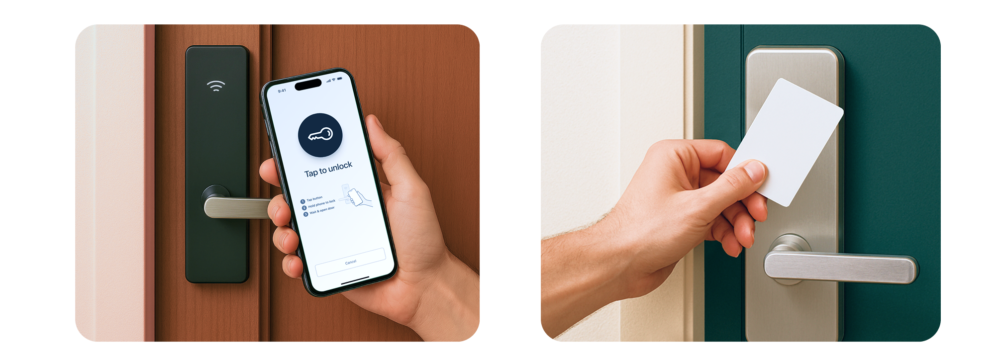
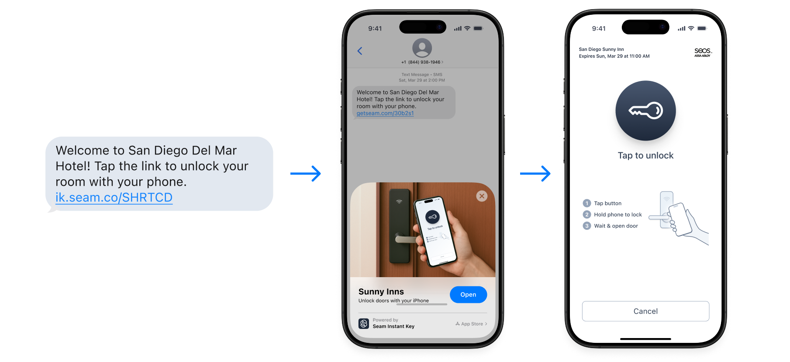
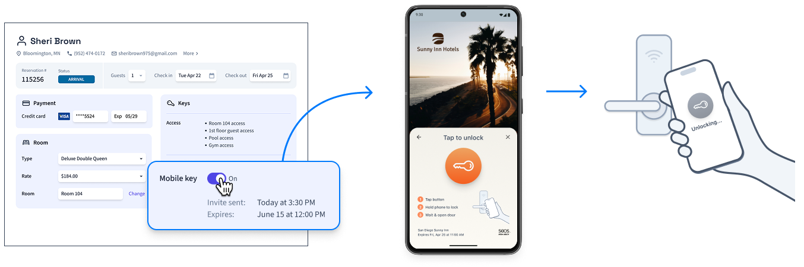
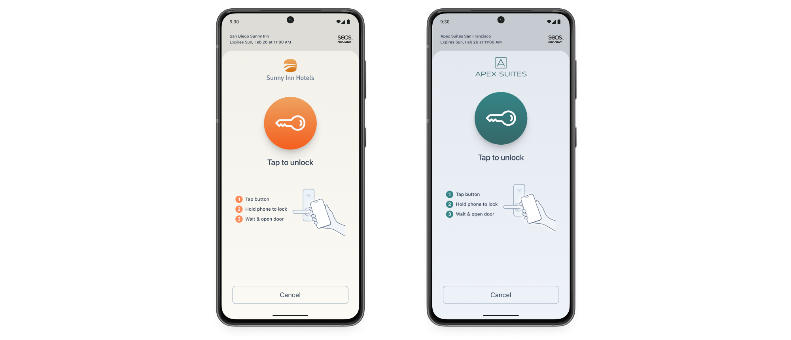
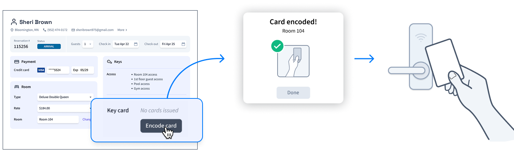

# Feature Overview

Seam enables you to grant access using Instant Keys, mobile keys, plastic cards, and PIN codes. Further, Seam supports encoding credentials onto cards for access systems that use a data-on-card model, as well as access systems that use preconfigured cards. This section describes each of the access modes that you can issue with Seam.

<figure><figcaption>
Seam supports common hospitality access methods like mobile keys (including Instant Keys), encoded key cards, and PIN codes.
</figcaption></figure>

***

## Seam Instant Keys

[Instant Key](../../capability-guides/instant-keys/) is the fastest way to share access. It's a no-code, fully-hosted mobile key solution. With a single API call, you can create a mobile key and send it through text or email, or in your own app. There's no app to install and no account to create. The user just taps a link and gets a lightweight, native-feeling experience. Instant Keys are instant, intuitive, and secure. For issuing Bluetooth mobile keys, this is the most streamlined mobile access experience available today.

### The Instant Key Access Flow

Your PMS app issues an Instant Key and sends it to a hotel guest—with no app download required. The guest taps the Instant Key link on their mobile device and gets a Bluetooth mobile key through iOS App Clip technology or Instant Apps on Android.

<figure><figcaption>
For a streamlined mobile access experience, use Instant Keys.
</figcaption></figure>


If you want the ability to customize the access flow completely for your users, you can use the Seam mobile SDK to integrate our [mobile key solution](feature-overview.md#integrate-mobile-keys-into-your-mobile-app).


***

## Integrate Mobile Keys into Your Mobile App

Seam enables you to build your own custom mobile key app to grant access to hotel guests. The Seam mobile SDK enables you to integrate once, giving you universal access to all supported access systems.

<figure><figcaption>
Create your own mobile app to present mobile keys to hotel guests.
</figcaption></figure>


If you do not want your hotels' guests to have to download a mobile app, use [Seam Instant Keys](feature-overview.md#seam-instant-keys).


### Hospitality Use Cases for Mobile Keys

In a hotel environment, mobile keys are often part of automated, self-serve scenarios. In addition to credential issuance, these processes may include handling for pre-assigned room allocation, just-in-time room assignment, and walk-in and manual reservations.

Your PMS app can also offer front desk staff the option of issuing mobile keys to arriving guests.

<figure><figcaption>
Use the Seam API and mobile SDK to power your hotel PMS app's mobile key feature for guests.
</figcaption></figure>

### Seam Mobile SDK

Seam provides a mobile SDK for iOS and Android that enables you to develop your mobile access app. For details, see [Mobile Access](../../capability-guides/mobile-access/) and [Integrating into Your Mobile Application](../../capability-guides/mobile-access/mobile-device-sdks/).

***

## Encode Plastic Cards

With Seam, a hospitality PMS app can convert a reservation into an issued access method and then encode it onto a plastic key card.

A common hotel key card scenario is as follows:

A guest arrives at a hotel front desk. The staff member retrieves the guest's reservation and encodes the corresponding access method onto one or more plastic key cards. The access setup for each guest room should include both the room, itself, and the set of all other necessary access points, such as the nearest elevator, the hotel gym, and so on.

Your PMS app can also handle the same credential issuance and card encoding functions at a self-serve kiosk.

<figure><figcaption>
Use the Seam API to power your hotel PMS app's plastic card encoding feature for guests.
</figcaption></figure>
