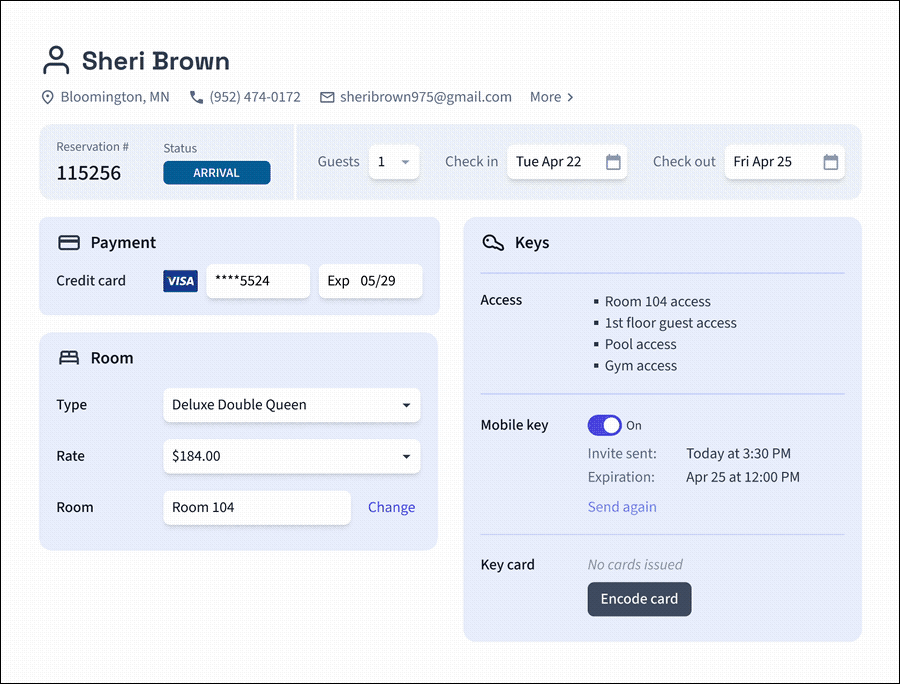
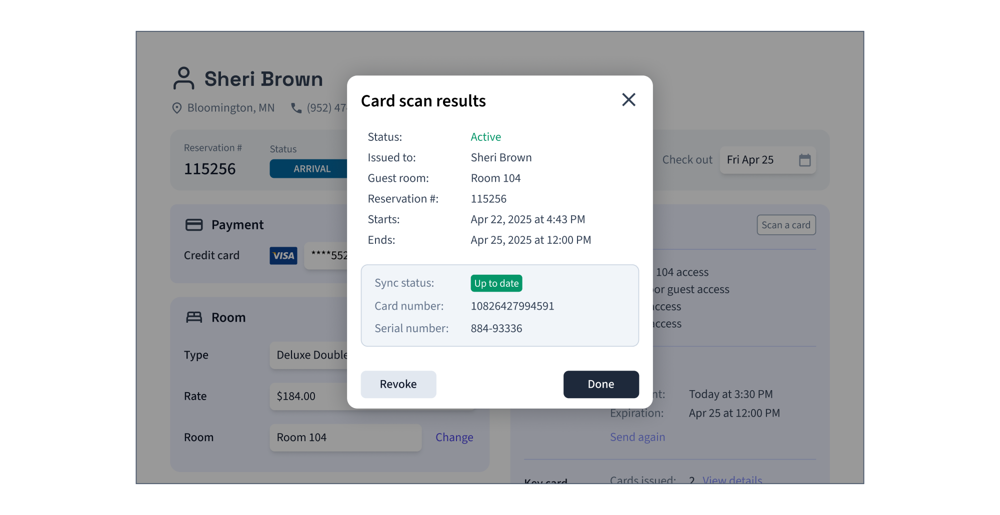

# Granting Access Using Encoded Plastic Key Cards

To issue a plastic key card, identify the user to whom you want to grant access and create a user identity to represent this user. Then, create an Access Grant to specify the entrances and spaces to which you want to grant the user access. The Access Grant creates a card access method. You use the Seam API to encode the access method onto a plastic key card. You can also use the Seam API to scan encoded cards.

This section details the steps in this process and provides accompanying Seam API code samples. See the following instructions:

1. [Create a User Identity](granting-access-using-encoded-plastic-key-cards.md#create-a-user-identity)
2. [Create an Access Grant](granting-access-using-encoded-plastic-key-cards.md#create-an-access-grant)
3. [Encode the Card](granting-access-using-encoded-plastic-key-cards.md#encode-the-card)
4. [Scan the Card](granting-access-using-encoded-plastic-key-cards.md#scan-the-card)

***

## Create a User Identity

Use the Seam API to create a `user_identity`. A user identity represents the hotel guest.



**Code:**

```python
# Create a user identity for your user.
jane_user = seam.user_identities.create(
  full_name = "Jane Doe",
  phone_number = "+15555550100"
)
```

**Output:**

```
UserIdentity(
  user_identity_id='43947360-cdc8-4db6-8b22-e079416d1d8b',
  full_name='Jane Doe',
  phone_number='+15555550100',
  ...
)
```



**Code:**

```bash
# Create a user identity for your user.
jane_user=$(curl -X 'POST' \
  'https://connect.getseam.com/user_identities/create' \
  -H 'accept: application/json' \
  -H "Authorization: Bearer ${SEAM_API_KEY}" \
  -H 'Content-Type: application/json' \
  -d '{
  "full_name": "Jane Doe",
  "phone_number": "+15555550100"
}')
```

**Output:**

```json
{
  "user_identity": {
    "user_identity_id": "43947360-cdc8-4db6-8b22-e079416d1d8b",
    "full_name": "Jane Doe",
    "phone_number": "+15555550100",
    ...
  },
  "ok": true
}
```



**Code:**

```javascript
// Create a user identity for your user.
const janeUser = await seam.userIdentities.create({
  full_name: "Jane Doe",
  phone_number: "+15555550100"
});
```

**Output:**

```json
{
  "user_identity_id": "43947360-cdc8-4db6-8b22-e079416d1d8b",
  "full_name": "Jane Doe",
  "phone_number": "+15555550100",
  ...
}
```



**Code:**

```ruby
# Create a user identity for your user.
jane_user = seam.user_identities.create(
  full_name: "Jane Doe",
  phone_number: "+15555550100"
)
```

**Output:**

```
<Seam::Resources::UserIdentity:0x005f0
  user_identity_id="43947360-cdc8-4db6-8b22-e079416d1d8b"
  full_name="Jane Doe"
  phone_number="+15555550100"
  ...
>
```



**Code:**

```php
// Create a user identity for your user.
$jane_user = $seam->user_identities->create(
  full_name: "Jane Doe",
  phone_number: "+15555550100"
);
```

**Output:**

```json
{
  "user_identity_id": "43947360-cdc8-4db6-8b22-e079416d1d8b",
  "full_name": "Jane Doe",
  "phone_number": "+15555550100",
  ...
}
```



**Code:**

```csharp
// Coming soon!
```

**Output:**

```json
// Coming soon!
```



***

## Create an Access Grant

To create an Access Grant, specify the user identity, entrance or space IDs, and starting and ending times. Include `card` as a requested access method.



**Code:**

```python
seam.access_grants.create(
  # You can specify the ID of an existing user identity or
  # use the user_identity parameter to create a new one.
  user_identity_id=jane_user.user_identity_id,
  # You can specify acs_entrance_ids, space_ids, or both.
  acs_entrance_ids=[
    "48ebfb50-c531-43c5-b9ea-409f26dabbd7",
    "f74e4879-5991-4e2f-a368-888983dcfbfc"
  ],  
  requested_access_methods=[
    {"mode": "card"}
  ],
  starts_at="2025-07-13T15:00:00.000Z",
  ends_at="2025-07-16T11:00:00.000Z"
)
```

**Output:**

```python
AccessGrant(
  access_grant_id="ef83cca9-5fdf-4ac2-93f3-c21c5a8be54b",
  display_name="My Access Grant",
  user_identity_id="43947360-cdc8-4db6-8b22-e079416d1d8b",
  starts_at="2025-07-13T15:00:00.000Z",
  ends_at="2025-07-16T11:00:00.000Z",
  requested_access_methods=[
    {
      "display_name": "Plastic Card",
      "mode": "card",
      "created_access_method_ids": ["c7d8e9f0-1a2b-3c4d-5e6f-7a8b9c0d1e2f"],
      ...
    }
  ],
  ...
)
```



**Code:**

```bash
# You can specify the ID of an existing user identity or
# use the user_identity parameter to create a new one.
# Also, you can specify acs_entrance_ids, space_ids, or both.
curl -X 'POST' \
  'https://connect.getseam.com/access_grants/create' \
  -H 'accept: application/json' \
  -H "Authorization: Bearer ${SEAM_API_KEY}" \
  -H 'Content-Type: application/json' \
  -d "{
    \"user_identity_id\": \"$(jq -r '.user_identity.user_identity_id' <<< ${jane_user})\"
    \"acs_entrance_ids\": [
      \"48ebfb50-c531-43c5-b9ea-409f26dabbd7\",
      \"f74e4879-5991-4e2f-a368-888983dcfbfc\"
    ],
    \"requested_access_methods\": [
      {\"mode\": \"card\"}
    ],
    \"starts_at\": \"2025-07-13T15:00:00.000Z\",
    \"ends_at\": \"2025-07-16T11:00:00.000Z\"
}"
```

**Output:**

```json
{
  "access_grant": {
    "access_grant_id": "ef83cca9-5fdf-4ac2-93f3-c21c5a8be54b",
    "display_name": "My Access Grant",
    "user_identity_id": "43947360-cdc8-4db6-8b22-e079416d1d8b",
    "starts_at": "2025-07-13T15:00:00.000Z",
    "ends_at": "2025-07-16T11:00:00.000Z",
    "requested_access_methods": [
      {
        "display_name": "Plastic Card",
        "mode": "card",
        "created_access_method_ids": ["c7d8e9f0-1a2b-3c4d-5e6f-7a8b9c0d1e2f"],
        ...
      }
    ],
    ...
  }
}
```



**Code:**

```javascript
await seam.accessGrants.create({
  // You can specify the ID of an existing user identity or
  // use the user_identity parameter to create a new one.
  user_identity_id: janeUser.user_identity_id,
  // You can specify acs_entrance_ids, space_ids, or both.
  acs_entrance_ids: [
    "48ebfb50-c531-43c5-b9ea-409f26dabbd7",
    "f74e4879-5991-4e2f-a368-888983dcfbfc"
  ],
  requested_access_methods: [
    {"mode": "card"}
  ],
  starts_at: "2025-07-13T15:00:00.000Z",
  ends_at: "2025-07-16T11:00:00.000Z"
});
```

**Output:**

```json
{
  "access_grant_id": "ef83cca9-5fdf-4ac2-93f3-c21c5a8be54b",
  "display_name": "My Access Grant",
  "user_identity_id": "43947360-cdc8-4db6-8b22-e079416d1d8b",
  "starts_at": "2025-07-13T15:00:00.000Z",
  "ends_at": "2025-07-16T11:00:00.000Z",
  "requested_access_methods": [
    {
      "display_name": "Plastic Card",
      "mode": "card",
      "created_access_method_ids": ["c7d8e9f0-1a2b-3c4d-5e6f-7a8b9c0d1e2f"],
      ...
    }
  ],
  ...
}
```



**Code:**

```ruby
seam.access_grants.create(
  # You can specify the ID of an existing user identity or
  # use the user_identity parameter to create a new one.
  user_identity_id: jane_user.user_identity_id,
  # You can specify acs_entrance_ids, space_ids, or both.
  acs_entrance_ids: %w[48ebfb50-c531-43c5-b9ea-409f26dabbd7 f74e4879-5991-4e2f-a368-888983dcfbfc],
  requested_access_methods: [
    {"mode": "card"}
  ],
  starts_at: "2025-07-13T15:00:00.000Z",
  ends_at: "2025-07-16T11:00:00.000Z"
)
```

**Output:**

```ruby
{
  "access_grant_id" => "ef83cca9-5fdf-4ac2-93f3-c21c5a8be54b",
  "display_name" => "My Access Grant",
  "user_identity_id" => "43947360-cdc8-4db6-8b22-e079416d1d8b",
  "starts_at" => "2025-07-13T15:00:00.000Z",
  "ends_at" => "2025-07-16T11:00:00.000Z",
  "requested_access_methods" => [
    {
      "display_name": "Plastic Card",
      "mode": "card",
      "created_access_method_ids": ["c7d8e9f0-1a2b-3c4d-5e6f-7a8b9c0d1e2f"],
      ...
    }
  ],
  ...
}
```



**Code:**

```php
$seam->access_grants->create(
  // You can specify the ID of an existing user identity or
  // use the user_identity parameter to create a new one.
  user_identity_id: $jane_user->user_identity_id,
  // You can specify acs_entrance_ids, space_ids, or both.
  acs_entrance_ids: [
    "48ebfb50-c531-43c5-b9ea-409f26dabbd7",
    "f74e4879-5991-4e2f-a368-888983dcfbfc",
  ],
  requested_access_methods: [
    ["mode" => "card"],
  ],
  starts_at: "2025-07-13T15:00:00.000Z",
  ends_at: "2025-07-16T11:00:00.000Z"
);
```

**Output:**

```php
[
  "access_grant_id" => "ef83cca9-5fdf-4ac2-93f3-c21c5a8be54b",
  "display_name" => "My Access Grant",
  "user_identity_id" => "43947360-cdc8-4db6-8b22-e079416d1d8b",
  "starts_at" => "2025-07-13T15:00:00.000Z",
  "ends_at" => "2025-07-16T11:00:00.000Z",
  "requested_access_methods" => [
    {
      "display_name": "Plastic Card",
      "mode": "card",
      "created_access_method_ids": ["c7d8e9f0-1a2b-3c4d-5e6f-7a8b9c0d1e2f"],
      ...
    }
  ],
  ...
];
```



**Code:**

```csharp
// Coming Soon!
```

**Output:**

```json
// Coming Soon!
```



## Encode the Card

As a final step in creating a plastic key card, use the Seam API to encode the access method onto the plastic card. Your app can serve hotel front desk staff as well as self-serve check-in kiosks with built-in physical encoders.

<figure><figcaption><p>Encode the access method onto a plastic key card.</p></figcaption></figure>

First, list the available card encoders within the access system and identify the encoder that the person encoding the card should use. Then, initiate the encoding action. The Seam API returns an [action attempt](../../core-concepts/action-attempts.md) so that your app can track the status of the encoding. When the encoding completes successfully, the action attempt payload includes information about the encoded card, such as the card number and the date and time at which the card was issued (that is, encoded). If the encoding fails, the action attempt reports any encoding errors.

For more details about card encoding, see [Creating and Encoding Card Access Methods](../../capability-guides/access-systems/working-with-card-encoders-and-scanners/creating-and-encoding-card-access-methods.md).



**Code:**

```python
# First, get the encoder that you want to use.
encoder = seam.acs.encoders.list(
  acs_system_ids = [hotel_a.acs_system_id]
)[0]

# Then, encode the card.
encoding_action_attempt = seam.access_methods.encode(
  access_method_id = "c7d8e9f0-1a2b-3c4d-5e6f-7a8b9c0d1e2f",
  acs_encoder_id = encoder.acs_encoder_id
)

# To confirm that the encoding succeeded, 
# poll the returned action attempt
# until its status is success.
seam.action_attempts.get(
  action_attempt_id = encoding_action_attempt.action_attempt_id
)
```

**Output:**

```
ActionAttempt(
  status='success',
  action_attempt_id='e49a33f7-9596-4b45-8e66-550b72fea134',
  action_type='ENCODE_ACCESS_METHOD',
  result={
    access_method_id='c7d8e9f0-1a2b-3c4d-5e6f-7a8b9c0d1e2f',
    card_number='1234abc',
    is_issued=True,
    issued_at='2025-07-13T14:00:00.000Z',
    ...
  },
  error=null
)
```



**Code:**

```bash
# First, get the encoder that you want to use.
encoder=$(curl -X 'POST' \
  'https://connect.getseam.com/acs/encoders/list' \
  -H 'accept: application/json' \
  -H "Authorization: Bearer ${SEAM_API_KEY}" \
  -H 'Content-Type: application/json' \
  -d "{
  \"acs_system_id\": \"$(jq -r '.acs_system.acs_system_id' <<< ${hotel_a})\"
}" | jq -r '.acs_encoders[0]')

# Then, encode the card.
encoding_action_attempt=$(curl -X 'POST' \
  'https://connect.getseam.com/access_methods/encode' \
  -H 'accept: application/json' \
  -H "Authorization: Bearer ${SEAM_API_KEY}" \
  -H 'Content-Type: application/json' \
  -d "{
  \"access_method_id\": \"c7d8e9f0-1a2b-3c4d-5e6f-7a8b9c0d1e2f\",
  \"acs_encoder_id\": \"$(jq -r '.acs_encoder_id' <<< ${encoder})\"
}")

# To confirm that the encoding succeeded, 
# poll the returned action attempt
# until its status is success.
curl -X 'POST' \
  'https://connect.getseam.com/action_attempts/get' \
  -H 'accept: application/json' \
  -H "Authorization: Bearer ${SEAM_API_KEY}" \
  -H 'Content-Type: application/json' \
  -d "{
  \"action_attempt_id\": \"$(jq -r '.action_attempt.action_attempt_id' <<< ${encoding_action_attempt})\"
}"
```

**Output:**

```json
{
  "action_attempt":
    {
      "status": "success",
      "action_attempt_id": "e49a33f7-9596-4b45-8e66-550b72fea134",
      "action_type": "ENCODE_ACCESS_METHOD",
      "result": {
        "access_method_id": "c7d8e9f0-1a2b-3c4d-5e6f-7a8b9c0d1e2f",
        "card_number": "1234abc",
        "is_issued": true,
        "issued_at": "2025-07-13T14:00:00.000Z",
        ...
      },
      "error": null
    },
  "ok": true
}
```



**Code:**

```javascript
// First, get the encoder that you want to use.
const encoder = (await seam.acs.encoders.list({
  acs_system_ids = [hotel_a.acs_system_id]
}))[0];

// Then, encode the card.
const encodingActionAttempt = await seam.accessMethods.encode({
  access_method_id: "c7d8e9f0-1a2b-3c4d-5e6f-7a8b9c0d1e2f",
  acs_encoder_id: encoder.acs_encoder_id
});

// To confirm that the encoding succeeded, 
// poll the returned action attempt
// until its status is success.
await seam.actionAttempts.get({
  action_attempt_id: encodingActionAttempt.action_attempt_id
});
```

**Output:**

```json
{
  status: 'success',
  action_attempt_id: 'e49a33f7-9596-4b45-8e66-550b72fea134',
  action_type: 'ENCODE_ACCESS_METHOD',
  result: {
    acs_credential_id: 'c7d8e9f0-1a2b-3c4d-5e6f-7a8b9c0d1e2f',
    card_number: '1234abc',
    is_issued: true,
    issued_at: '2025-07-13T14:00:00.000Z',
    ...
  },
  error: null
}
```



**Code:**

```ruby
# First, get the encoder that you want to use.
encoder = (seam.acs.encoders.list(
  acs_system_ids = [hotel_a.acs_system_id]
))[0]

# Then, encode the card.
encoding_action_attempt = seam.access_methods.encode(
  access_method_id: "c7d8e9f0-1a2b-3c4d-5e6f-7a8b9c0d1e2f",
  acs_encoder_id: encoder.acs_encoder_id
)

# To confirm that the encoding succeeded, 
# poll the returned action attempt
# until its status is success.
seam.action_attempts.get(
  action_attempt_id: encoding_action_attempt.action_attempt_id
)
```

**Output:**

```
<Seam::Resources::ActionAttempt:0x00410
  status="success"
  action_attempt_id="e49a33f7-9596-4b45-8e66-550b72fea134"
  action_type="ENCODE_ACCESS_METHOD"
  result={
    acs_credential_id="c7d8e9f0-1a2b-3c4d-5e6f-7a8b9c0d1e2f"
    card_number="1234abc"
    is_issued=true,
    issued_at="2025-07-13T14:00:00.000Z"
    ...
  }
  error=nil
>
```



**Code:**

```php
// First, get the encoder that you want to use.
$encoder = $seam->acs->encoders->list(
  acs_system_ids = [$hotel_a->acs_system_id]
)[0];

// Then, encode the card.
$encoding_action_attempt = $seam->access_methods->encode(
  access_method_id: "c7d8e9f0-1a2b-3c4d-5e6f-7a8b9c0d1e2f",
  acs_encoder_id: $encoder->acs_encoder_id
);

// To confirm that the encoding succeeded, 
// poll the returned action attempt
// until its status is success.
$seam->action_attempts->get(
  action_attempt_id: $encoding_action_attempt->action_attempt_id
);
```

**Output:**

```json
{
  "status": "success",
  "action_attempt_id": "e49a33f7-9596-4b45-8e66-550b72fea134",
  "action_type": "ENCODE_ACCESS_METHOD",
  "result": {
    "acs_credential_id": "c7d8e9f0-1a2b-3c4d-5e6f-7a8b9c0d1e2f",
    "card_number": "1234abc",
    "is_issued": true,
    "issued_at": "2025-07-13T14:00:00.000Z",
    ...
  },
  "error": null
}
```



**Code:**

```csharp
// Coming soon!
```

**Output:**

```json
// Coming soon!
```



***

## Scan the Card

You can scan the card to view its data and confirm that it's up to date with the server. The scan result includes the card's properties, such as its card number, serial number, and other useful details. If discrepancies are detected, Seam provides warnings to indicate that the card is out of date and needs re-encoding.

<figure><figcaption><p>Use the Seam API to scan a plastic card to view its details.</p></figcaption></figure>

To scan a card, first initiate the scanning process. This scanning action returns an action attempt that you can poll to track the status. When the scan completes, view the card payload within the action attempt. Note any `action_attempt.result.warnings`. Warning messages show which properties are out of sync.&#x20;

Pay special attention to the following parts of the returned payload:

* `action_attempt.result.warnings` list any properties that Seam has detected are out-of-sync between the card and the encoder.
* `action_attempt.result.acs_credential_on_seam` lists the properties of the access method as stored on the access system server.
* `action_attempt.result.acs_credential_on_encoder` lists the properties of the access method as stored on the card.

For more details, see [Scanning Encoded Cards](../../capability-guides/access-systems/working-with-card-encoders-and-scanners/scanning-encoded-cards.md).



**Code:**

```python
# Retrieve a list of all available encoders in a hotel, 
# that is, connected to a single acs_system.
seam.acs.encoders.list(
  acs_system_ids = [hotel_a_system_id]
)

# Scan the card using the desired encoder.
scanning_action_attempt = seam.acs.encoders.scan_credential(
  acs_encoder_id = encoder.acs_encoder_id
)
```

**Output:**

```
ActionAttempt(
  status='success',
  action_attempt_id='0243f349-68bf-4323-9e61-4c40eb72eb1e',
  action_type='SCAN_CREDENTIAL',
  result={
    warnings=[
      {
        "warning_code": "acs_credential_on_encoder_out_of_sync",
        "warning_message": "The following properties are out of sync
                            between acs_credential_on_encoder and
                            acs_credential_on_seam: ends_at"
      }
    ],
    acs_credential_on_seam={
      "starts_at": "2025-07-13T15:00:00.000Z",
      "ends_at": "2025-07-16T11:00:00.000Z",  
      "card_number": "1234abc",
      "display_name": "Card 1234abc",
      "access_method": "card",
      ...      
    },
    acs_credential_on_encoder={
      "starts_at": "2025-07-13T15:00:00.000Z",
      "ends_at": "2025-07-15T11:00:00.000Z",
      "card_number": "1234abc",
      ...
    }
  },
  error=null
)
```



**Code:**

```bash
# Retrieve a list of all available encoders in a hotel, 
# that is, connected to a single acs_system.
curl -X 'POST' \
  'https://connect.getseam.com/acs/encoders/list' \
  -H 'accept: application/json' \
  -H "Authorization: Bearer ${SEAM_API_KEY}" \
  -H 'Content-Type: application/json' \
  -d "{
  \"acs_system_ids\": [\"${hotel_a_system_id}\"]
}"

# Scan the card using the desired encoder.
scanning_action_attempt=$(curl -X 'POST' \
  'https://connect.getseam.com/acs/encoders/scan_credential' \
  -H 'accept: application/json' \
  -H "Authorization: Bearer ${SEAM_API_KEY}" \
  -H 'Content-Type: application/json' \
  -d "{
  \"acs_encoder_id\": \"${acs_encoder_id}\"
}")
```

**Output:**

```json
{
  "action_attempt":
    {
      "status": "success",
      "action_attempt_id": "0243f349-68bf-4323-9e61-4c40eb72eb1e",
      "action_type": "SCAN_CREDENTIAL",
      "result": {
        "warnings": [
          {
            "warning_code": "acs_credential_on_encoder_out_of_sync",
            "warning_message": "The following properties are out of sync
                                between acs_credential_on_encoder and
                                acs_credential_on_seam: ends_at"
          }
        ],
        "acs_credential_on_seam": {
          "starts_at": "2025-07-13T15:00:00.000Z",
          "ends_at": "2025-07-16T11:00:00.000Z",
          "card_number": "1234abc",
          "display_name": "Card 1234abc",
          "access_method": "card",
          ...      
        },
        "acs_credential_on_encoder": {
          "starts_at": "2025-07-13T15:00:00.000Z",
          "ends_at": "2025-07-15T11:00:00.000Z",
          "card_number": "1234abc",
          ...
        }
      },
      "error": null
    },
  "ok": true
}
```



**Code:**

```javascript
// Retrieve a list of all available encoders in a hotel, 
// that is, connected to a single acs_system.
await seam.acs.encoders.list({
  acs_system_ids: [hotelASystemId]
});

// Scan the card using the desired encoder.
const scanningActionAttempt = await seam.acs.encoders.scanCredential({
  acs_encoder_id: encoder.acs_encoder_id
});
```

**Output:**

```json
{
  status: 'success',
  action_attempt_id: '0243f349-68bf-4323-9e61-4c40eb72eb1e",
  action_type: 'SCAN_CREDENTIAL',
  result: {
    'warnings': [
      {
        'warning_code': 'acs_credential_on_encoder_out_of_sync',
        'warning_message': 'The following properties are out of sync
                            between acs_credential_on_encoder and
                            acs_credential_on_seam: ends_at'
      }
    ],
    'acs_credential_on_seam': {
      'starts_at': '2025-07-13T15:00:00.000Z',
      'ends_at': '2025-07-16T11:00:00.000Z',
      'card_number': '1234abc',
      'display_name': 'Card 1234abc',
      'access_method': 'card',
      ...      
    },
    'acs_credential_on_encoder': {
      'starts_at': '2025-07-13T15:00:00.000Z',
      'ends_at': '2025-07-15T11:00:00.000Z',
      'card_number': '1234abc',
      ...
    }
  },
  error: null
}
```



**Code:**

```ruby
# Retrieve a list of all available encoders in a hotel, 
# that is, connected to a single acs_system.
seam.acs.encoders.list(
  acs_system_ids: [hotel_a_system_id]
)

# Scan the card using the desired encoder.
scanning_action_attempt = seam.acs.encoders.scan_credential(
  acs_encoder_id: encoder.acs_encoder_id
)
```

**Output:**

```
<Seam::Resources::ActionAttempt:0x00410
  status="success"
  action_attempt_id="0243f349-68bf-4323-9e61-4c40eb72eb1e"
  action_type="SCAN_CREDENTIAL"
  result={
    "warnings": [
      {
        "warning_code": "acs_credential_on_encoder_out_of_sync",
        "warning_message": "The following properties are out of sync
                            between acs_credential_on_encoder and
                            acs_credential_on_seam: ends_at"
      }
    ],
    "acs_credential_on_seam": {
      "starts_at": "2025-07-13T15:00:00.000Z",
      "ends_at": "2025-07-16T11:00:00.000Z",
      "card_number": "1234abc",
      "display_name": "Card 1234abc",
      "access_method": "card",
      ...      
    },
    "acs_credential_on_encoder": {
      "starts_at": "2025-07-13T15:00:00.000Z",
      "ends_at": "2025-07-15T11:00:00.000Z",
      "card_number": "1234abc",
      ...
    }
  }
  error=nil
>
```



**Code:**

```php
// Retrieve a list of all available encoders in a hotel, 
// that is, connected to a single acs_system.
$seam->acs->encoders->list(
  acs_system_ids: [$hotel_a_system_id]
);

// Scan the card using the desired encoder.
$scanning_action_attempt = $seam->acs->encoders->scan_credential(
  acs_encoder_id: $encoder->acs_encoder_id
);
```

**Output:**

```json
{
  "status": "success",
  "action_attempt_id": "0243f349-68bf-4323-9e61-4c40eb72eb1e",
  "action_type": "SCAN_CREDENTIAL",
  "result": {
    "warnings": [
      {
        "warning_code": "acs_credential_on_encoder_out_of_sync",
        "warning_message": "The following properties are out of sync
                            between acs_credential_on_encoder and
                            acs_credential_on_seam: ends_at"
      }
    ],
    "acs_credential_on_seam": {
      "starts_at": "2025-07-13T15:00:00.000Z",
      "ends_at": "2025-07-16T11:00:00.000Z",
      "card_number": "1234abc",
      "display_name": "Card 1234abc",
      "access_method": "card",
      ...      
    },
    "acs_credential_on_encoder": {
      "starts_at": "2025-07-13T15:00:00.000Z",
      "ends_at": "2025-07-15T11:00:00.000Z",
      "card_number": "1234abc",
      ...
    }
  },
  "error": null
}
```



**Code:**

```csharp
// Coming soon!
```

**Output:**

```json
// Coming soon!
```


