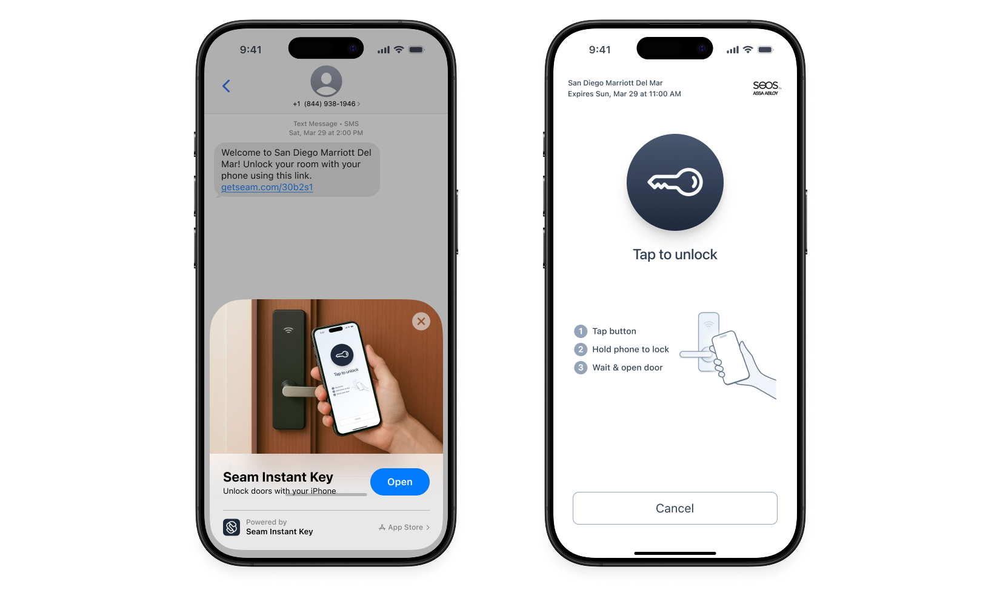
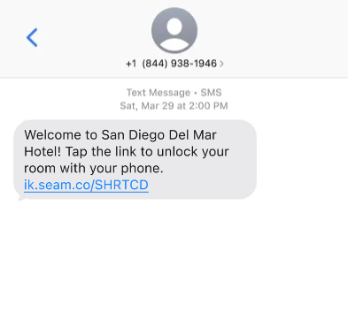

# Granting Access Using Seam Instant Keys

To issue an Instant Key, identify the user to whom you want to grant access and create a user identity to represent this user. Then, create an Access Grant to specify the entrances and spaces to which you want to grant the user access. The Access Grant returns the Instant Key URL that you can deliver to your user through text or email.

<figure><figcaption><p>Send hotel guests Seam Instant Keys in a text message or email—No app download required!</p></figcaption></figure>

This section details the steps in this process and provides accompanying Seam API code samples. See the following instructions:

1. [Create a User Identity](granting-access-using-seam-instant-keys.md#create-a-user-identity)
2. [Create an Access Grant](granting-access-using-seam-instant-keys.md#create-an-access-grant)
3. [Deliver the Instant Key](granting-access-using-seam-instant-keys.md#deliver-the-instant-key)

***

## Create a User Identity

Use the Seam API to create a `user_identity`. A user identity represents the hotel guest.



**Code:**

```python
# Create a user identity for your user.
jane_user = seam.user_identities.create(
  full_name = "Jane Doe",
  phone_number = "+15555550100"
)
```

**Output:**

```
UserIdentity(
  user_identity_id='43947360-cdc8-4db6-8b22-e079416d1d8b',
  full_name='Jane Doe',
  phone_number='+15555550100',
  ...
)
```



**Code:**

```bash
# Create a user identity for your user.
jane_user=$(curl -X 'POST' \
  'https://connect.getseam.com/user_identities/create' \
  -H 'accept: application/json' \
  -H "Authorization: Bearer ${SEAM_API_KEY}" \
  -H 'Content-Type: application/json' \
  -d '{
  "full_name": "Jane Doe",
  "phone_number": "+15555550100"
}')
```

**Output:**

```json
{
  "user_identity": {
    "user_identity_id": "43947360-cdc8-4db6-8b22-e079416d1d8b",
    "full_name": "Jane Doe",
    "phone_number": "+15555550100",
    ...
  },
  "ok": true
}
```



**Code:**

```javascript
// Create a user identity for your user.
const janeUser = await seam.userIdentities.create({
  full_name: "Jane Doe",
  phone_number: "+15555550100"
});
```

**Output:**

```json
{
  "user_identity_id": "43947360-cdc8-4db6-8b22-e079416d1d8b",
  "full_name": "Jane Doe",
  "phone_number": "+15555550100",
  ...
}
```



**Code:**

```ruby
# Create a user identity for your user.
jane_user = seam.user_identities.create(
  full_name: "Jane Doe",
  phone_number: "+15555550100"
)
```

**Output:**

```
<Seam::Resources::UserIdentity:0x005f0
  user_identity_id="43947360-cdc8-4db6-8b22-e079416d1d8b"
  full_name="Jane Doe"
  phone_number="+15555550100"
  ...
>
```



**Code:**

```php
// Create a user identity for your user.
$jane_user = $seam->user_identities->create(
  full_name: "Jane Doe",
  phone_number: "+15555550100"
);
```

**Output:**

```json
{
  "user_identity_id": "43947360-cdc8-4db6-8b22-e079416d1d8b",
  "full_name": "Jane Doe",
  "phone_number": "+15555550100",
  ...
}
```



**Code:**

```csharp
// Coming soon!
```

**Output:**

```json
// Coming soon!
```



***

## Create an Access Grant

To create an Access Grant, specify the user identity, entrance or space IDs, and starting and ending times. Include `mobile_key` as a requested access method.



**Code:**

```python
seam.access_grants.create(
  # You can specify the ID of an existing user identity or
  # use the user_identity parameter to create a new one.
  user_identity_id=jane_user.user_identity_id,
  # You can specify acs_entrance_ids, space_ids, or both.
  acs_entrance_ids=[
    "48ebfb50-c531-43c5-b9ea-409f26dabbd7",
    "f74e4879-5991-4e2f-a368-888983dcfbfc"
  ],  
  requested_access_methods=[
    {"mode": "mobile_key"}
  ],
  starts_at="2025-07-13T15:00:00.000Z",
  ends_at="2025-07-16T11:00:00.000Z"
)
```

**Output:**

```python
AccessGrant(
  access_grant_id="ef83cca9-5fdf-4ac2-93f3-c21c5a8be54b",
  display_name="My Access Grant",
  user_identity_id="43947360-cdc8-4db6-8b22-e079416d1d8b",
  starts_at="2025-07-13T15:00:00.000Z",
  ends_at="2025-07-16T11:00:00.000Z",
  instant_key_url="https://ik.seam.co/ABCXYZ",
  ...
)

# Share the instant_key_url with your user.
```



**Code:**

```bash
# You can specify the ID of an existing user identity or
# use the user_identity parameter to create a new one.
# Also, you can specify acs_entrance_ids, space_ids, or both.
curl -X 'POST' \
  'https://connect.getseam.com/access_methods/get' \
  -H 'accept: application/json' \
  -H "Authorization: Bearer ${SEAM_API_KEY}" \
  -H 'Content-Type: application/json' \
  -d "{
    \"user_identity_id\": \"$(jq -r '.user_identity.user_identity_id' <<< ${jane_user})\"
    \"acs_entrance_ids\": [
      \"48ebfb50-c531-43c5-b9ea-409f26dabbd7\",
      \"f74e4879-5991-4e2f-a368-888983dcfbfc\"
    ],
    \"requested_access_methods\": [
      {\"mode\": \"mobile_key\"}
    ],
    \"starts_at\": \"2025-07-13T15:00:00.000Z\",
    \"ends_at\": \"2025-07-16T11:00:00.000Z\"
}"
```

**Output:**

```json
{
  "access_grant": {
    "access_grant_id": "ef83cca9-5fdf-4ac2-93f3-c21c5a8be54b",
    "display_name": "My Access Grant",
    "user_identity_id": "43947360-cdc8-4db6-8b22-e079416d1d8b",
    "starts_at": "2025-07-13T15:00:00.000Z",
    "ends_at": "2025-07-16T11:00:00.000Z",
    "instant_key_url": "https://ik.seam.co/ABCXYZ",
    ...
  }
}

# Share the instant_key_url with your user.
```



**Code:**

```javascript
await seam.accessGrants.create({
  // You can specify the ID of an existing user identity or
  // use the user_identity parameter to create a new one.
  user_identity_id: janeUser.user_identity_id,
  // You can specify acs_entrance_ids, space_ids, or both.
  acs_entrance_ids: [
    "48ebfb50-c531-43c5-b9ea-409f26dabbd7",
    "f74e4879-5991-4e2f-a368-888983dcfbfc"
  ],
  requested_access_methods: [
    {"mode": "mobile_key"}
  ],
  starts_at: "2025-07-13T15:00:00.000Z",
  ends_at: "2025-07-16T11:00:00.000Z"
});
```

**Output:**

```json
{
  "access_grant_id": "ef83cca9-5fdf-4ac2-93f3-c21c5a8be54b",
  "display_name": "My Access Grant",
  "user_identity_id": "43947360-cdc8-4db6-8b22-e079416d1d8b",
  "starts_at": "2025-07-13T15:00:00.000Z",
  "ends_at": "2025-07-16T11:00:00.000Z",
  "instant_key_url": "https://ik.seam.co/ABCXYZ",
  ...
}

// Share the instant_key_url with your user.
```



**Code:**

```ruby
seam.access_grants.create(
  # You can specify the ID of an existing user identity or
  # use the user_identity parameter to create a new one.
  user_identity_id: jane_user.user_identity_id,
  # You can specify acs_entrance_ids, space_ids, or both.
  acs_entrance_ids: %w[48ebfb50-c531-43c5-b9ea-409f26dabbd7 f74e4879-5991-4e2f-a368-888983dcfbfc],
  requested_access_methods: [
    {"mode": "mobile_key"}
  ],
  starts_at: "2025-07-13T15:00:00.000Z",
  ends_at: "2025-07-16T11:00:00.000Z"
)
```

**Output:**

```ruby
{
  "access_grant_id" => "ef83cca9-5fdf-4ac2-93f3-c21c5a8be54b",
  "display_name" => "My Access Grant",
  "user_identity_id" => "43947360-cdc8-4db6-8b22-e079416d1d8b",
  "starts_at" => "2025-07-13T15:00:00.000Z",
  "ends_at" => "2025-07-16T11:00:00.000Z",
  "instant_key_url" => "https://ik.seam.co/ABCXYZ",
  ...
}

# Share the instant_key_url with your user.
```



**Code:**

```php
$seam->access_grants->create(
  // You can specify the ID of an existing user identity or
  // use the user_identity parameter to create a new one.
  user_identity_id: $jane_user->user_identity_id,
  // You can specify acs_entrance_ids, space_ids, or both.
  acs_entrance_ids: [
    "48ebfb50-c531-43c5-b9ea-409f26dabbd7",
    "f74e4879-5991-4e2f-a368-888983dcfbfc",
  ],
  requested_access_methods: [
    ["mode" => "mobile_key"],
  ],
  starts_at: "2025-07-13T15:00:00.000Z",
  ends_at: "2025-07-16T11:00:00.000Z"
);
```

**Output:**

```php
[
  "access_grant_id" => "ef83cca9-5fdf-4ac2-93f3-c21c5a8be54b",
  "display_name" => "My Access Grant",
  "user_identity_id" => "43947360-cdc8-4db6-8b22-e079416d1d8b",
  "starts_at" => "2025-07-13T15:00:00.000Z",
  "ends_at" => "2025-07-16T11:00:00.000Z",
  "instant_key_url" => "https://ik.seam.co/ABCXYZ",
  ...
];

// Share the instant_key_url with your user.
```



**Code:**

```csharp
// Coming Soon!
```

**Output:**

```json
// Coming Soon!
```



***

## Deliver the Instant Key

Share the generated `instant_key_url` with your user in your preferred way, depending on your product flow and guest experience. For most use cases, the simplest way to deliver an Instant Key is using a link in a text message or email. This method works well if you already collect the guest's phone number or email at booking.

<figure><figcaption><p>You can deliver an Instant Key using a link in a text message or email.</p></figcaption></figure>

Note that Instant Keys are also designed to have an appropriately-short validity period, as indicated by the Instant Key resource's `expires_at` property.
