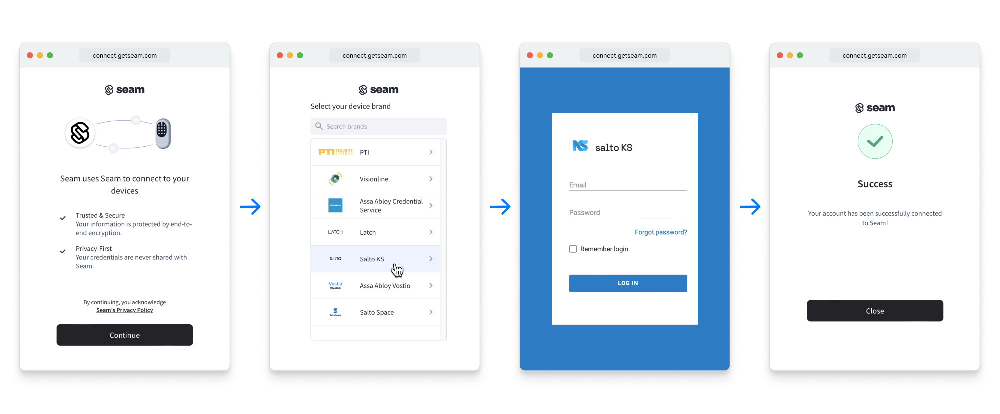
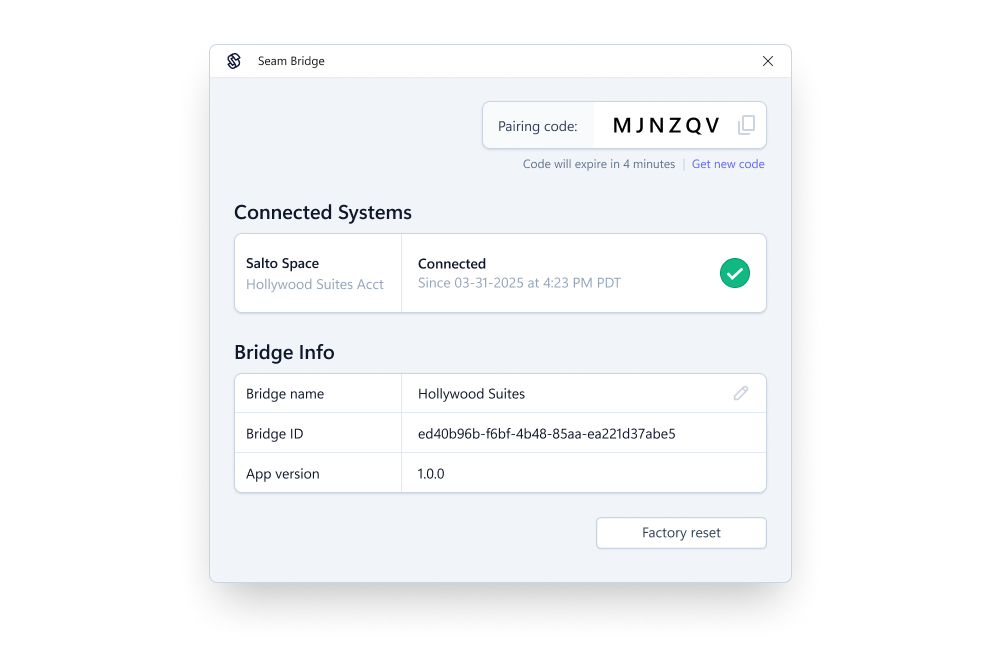

# Setting Up the Hotel Site

Before you can grant access using Seam, you must first set up the hotel access system and integrate it with your Seam-powered PMS app. This process consists of the following steps:

1. [Confirm access system capabilities and requirements.](setting-up-the-hotel-site.md#access-system-capabilities-and-requirements)
2. [Configure the access system to integrate with Seam.](setting-up-the-hotel-site.md#access-system-settings)
3. [Connect the hotel site to Seam.](setting-up-the-hotel-site.md#access-system-seam-connection)
4. [Configure the desired access settings for the hotel's guest rooms.](setting-up-the-hotel-site.md#guest-room-access-settings)

***

## Access System Capabilities and Requirements

Before integrating an access system with Seam, make sure that the system—including hardware and software—supports the capabilities that you want to offer guests in your hotel PMS app.

This section provides an overview of the capabilities and requirements. For more information about each supported access system and for detailed setup instructions, see the corresponding [system integration guide](../../device-and-system-integration-guides/overview.md#access-control-systems).

### Supported Capabilities

Before integrating an access system with Seam, it is imperative to understand which access methods the system supports, such as mobile keys and Instant Keys, plastic cards, and PIN codes. Some access systems support a subset of the access methods that you can issue through Seam. For details, see the [system integration guide](../../device-and-system-integration-guides/overview.md#access-control-systems) for the access system.

### Hotel Access System Requirements

To integrate with Seam, the hotel must meet the following requirements:

* The hotel may need to confirm that their access system is in a released state, rather than using a prerelease or test environment.
* If you want to use mobile keys, you must confirm that all locks support Bluetooth.
* To use encoded plastic key cards or mobile keys, the hotel may need to purchase and install the appropriate access system feature licenses.

***

## Access System Settings

To ensure successful integration with Seam, confirm or configure the following settings in the hotel access system:

* Make sure that the user account that you plan to use for the integration with Seam has the appropriate permissions.
* For some access systems, you may need to configure communications protocol settings.
* You may want to configure any available proximity behavior settings.

For details, see the [system integration guide](../../device-and-system-integration-guides/overview.md#access-control-systems) for the access system.

***

## Access System-Seam Connection

To connect the access system to Seam, we recommend embedding a [Connect Webview](../../core-concepts/connect-webviews/) in your app. The Seam Connect Webview flow guides the property manager through each step of the connection process.

<figure><figcaption>
Example Connect Webview for an access system
</figcaption></figure>

### Connecting On-Premises Access Systems

For on-premises access systems, Seam offers the lightweight [Seam Bridge](../../capability-guides/seam-bridge.md) app. This software-only component runs on a computer within the same local network as the access system and creates a secure tunnel between Seam Cloud and the access system. Seam Bridge manages encryption, handles authentication, and removes the need to expose local ports to the internet.

<figure><figcaption>
Use Seam Bridge to connect on-premises access systems to Seam.
</figcaption></figure>

***

## Guest Room Access Settings

In the access system dashboard, the property manager configures each guest room with access to the room's door and to any relevant common access points, such as the main entrance, nearest elevator, gym, and so on. This mapping is critical to ensure that each guest has the proper access to the necessary access points at the start of their reservation.

Seam resources enable you to set a custom unique key on each object. Use this to map your own data, such as rooms, listings, or reservations, to the corresponding Seam resources. This makes it easier to cross-reference and sync information between your systems and Seam.

<figure><figcaption>
Example: Dashboard for mapping a hotel room listing to the corresponding set of access points
</figcaption></figure>

