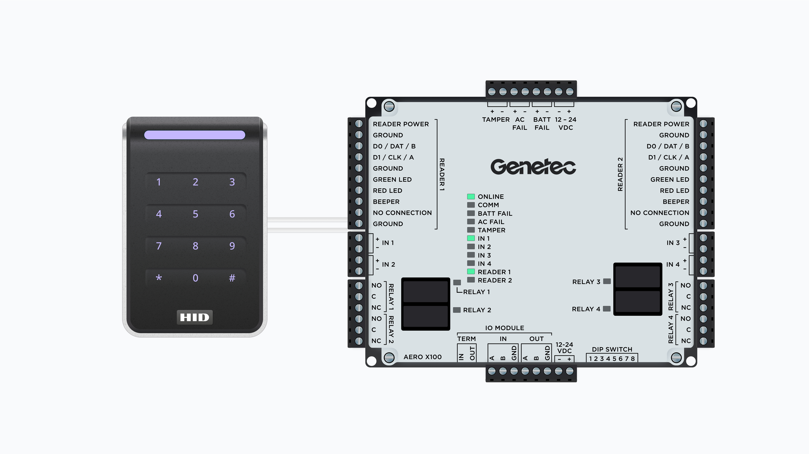
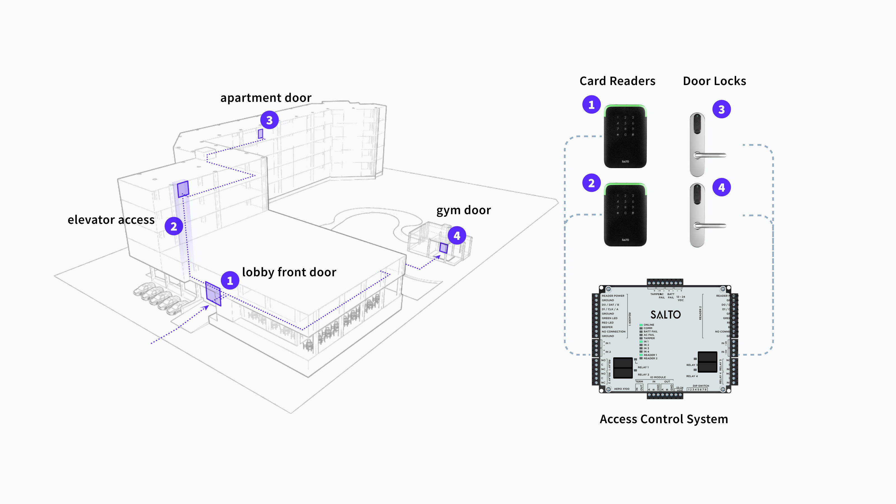
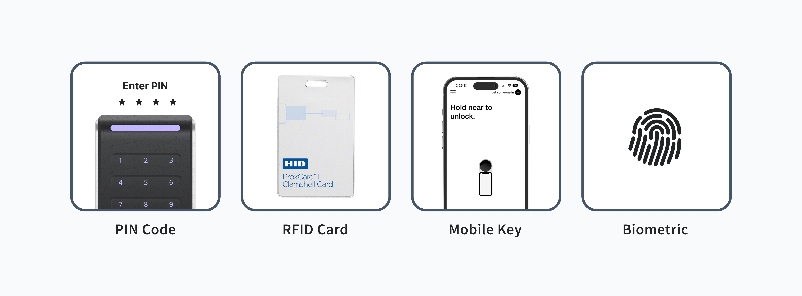

# 🏢 Access Control Systems

<figure><figcaption></figcaption></figure>

Seam provides **a unified API across multiple brands of access control systems** (ACSs) to grant and manage access to apartment buildings, hotels, commercial offices, warehouses, and much more. The Seam API standardizes key functions across systems and brands, such as creating users, issuing credentials (PIN codes, key cards, and mobile keys), managing access permissions, retrieving access logs, and more.&#x20;

***

## What Is an Access Control System?

Access control systems enable you to manage and monitor access to physical spaces, such as offices, residential complexes, and special-purpose facilities. A key aspect of ACSs is that they centralize access authorization, which enables you to grant access to a user across multiple doors using a single credential.

An access control system generally manages the following permissions:

* Who has access
* The entrances to which they have access
* The access schedule for each ACS user and entrance
* The access mechanism—such as a PIN code, mobile key, or RFID card—for each ACS user and entrance

<figure><figcaption>
Example of a residential building with multiple doors connected to an ACS system
</figcaption></figure>

***

## Access Methods

Seam enables you to grant ACS users access to entrances through digital credentials, including PIN codes, mobile keys, and RFID cards. The Seam API combines centralized access management and audit log capabilities with the flexibility to create credentials using the access methods that best suit your users' needs.

<figure><figcaption>
Seam provides the flexibility to grant access to ACS users through a variety of access methods.
</figcaption></figure>

***

## ACS Resources

The Seam ACS schema consists of a series of resources. These resources interact intuitively, enabling you to manage your ACS in a logical, efficient manner. Seam's universal API provides the flexibility to manage a variety of [ACSs](../../capability-guides/access-systems/understanding-access-control-system-differences.md), each of which may have manufacturer-specific differences. For details about your ACS, see the corresponding [system integration guide](../../device-and-system-integration-guides/overview.md#access-control-systems).

The following diagram shows an example of one ACS, including the ACS resources and the relationships between them:

<figure><figcaption>
Seam's ACS resources provide the flexibility to manage your ACS intuitively, regardless of the differences between various ACS manufacturers.
</figcaption></figure>

The following table provides a brief description of each of the Seam ACS resources:

<table><thead><tr><th width="248">ACS Resource</th><th>Description</th></tr></thead><tbody><tr><td><picture><source srcset="../../.gitbook/assets/acs-system_dark.png" media="(prefers-color-scheme: dark)"></picture> <a href="../../api-clients/access-control-systems/systems/"><code>acs_system</code></a></td><td>The top-level object. Represents one or more buildings, residential locations, or other sites that you manage using this ACS. For more information, see <a href="../../capability-guides/access-systems/retrieving-acs-system-details.md">Retrieving ACS System Details</a>.</td></tr><tr><td><picture><source srcset="../../.gitbook/assets/acs-user_dark.png" media="(prefers-color-scheme: dark)"></picture> <a href="../../api-clients/access-control-systems/users/"><code>acs_user</code></a></td><td>The set of users who access the entrances. For more information, see <a href="user-management.md">Managing ACS Users</a>.</td></tr><tr><td><picture><source srcset="../../.gitbook/assets/acs-access-group_dark.png" media="(prefers-color-scheme: dark)"></picture> <a href="../../api-clients/access-control-systems/access-groups/"><code>acs_access_group</code></a></td><td>Some ACSs use access groups as an efficient way to grant sets of scheduled entrance access to one or more users. For more information, see <a href="assigning-users-to-access-groups.md">Assigning ACS Users to Access Groups</a>.</td></tr><tr><td><picture><source srcset="../../.gitbook/assets/acs-credential_dark.png" media="(prefers-color-scheme: dark)"></picture> <a href="../../api-clients/access-control-systems/credentials/"><code>acs_credential</code></a></td><td>A digital means that authorizes a user to access one or more entrances at specific days and times. Examples of credentials include RFID cards, mobile keys, and PIN codes. For more information, see <a href="../../capability-guides/access-systems/managing-credentials.md">Managing Credentials</a>.</td></tr><tr><td><picture><source srcset="../../.gitbook/assets/acs-entrance_dark.png" media="(prefers-color-scheme: dark)"></picture> <a href="../../api-clients/access-control-systems/entrances/"><code>acs_entrance</code></a></td><td>The set of entrances, doors, or zones that you want to manage. You identify each entrance by the corresponding lock object. For more information, see <a href="../../capability-guides/access-systems/retrieving-entrance-details.md">Retrieving Entrance Details</a>.</td></tr></tbody></table>


You configure the access schedules for your ACS users either through access groups or credentials, depending on your specific ACS. There is no separate schedule resource in the Seam API.


***

## Basic ACS Configuration Process

While there are some manufacturer-specific differences between ACSs, all ACSs share the following basic resources and relationships:

*   **ACS users:** You create [ACS users](user-management.md) to represent the users in a specific ACS.

    If you manage multiple ACSs and need to grant the same user access to [entrances](../../capability-guides/access-systems/retrieving-entrance-details.md) in multiple ACSs, you can also use Seam [user identities](../../api-clients/user-identities/). With user identities, you can link an application user in your own system to one or more Seam ACS users.
* **Access permissions:** Access permissions define the allowed entrances and the days and times at which this access is valid. Depending on your ACS, you configure access permissions by [assigning ACS users to access groups](../../capability-guides/access-systems/understanding-access-control-system-differences.md#access-group-based-access-control-systems) or by [specifying access permissions for each ACS user or credential](../../capability-guides/access-systems/understanding-access-control-system-differences.md#credential-based-access-control-systems).
*   **Credentials:** Credentials serve as the mechanism that allows your ACS users to gain access to entrances. Examples of credentials that Seam supports include RFID cards, mobile keys, and PIN codes. You create [credentials](../../capability-guides/access-systems/managing-credentials.md) and assign these credentials to your ACS users.

    If you are developing a mobile app to provide access for your ACS users, you can  also use [Seam's iOS and Android SDKs](../../developer-tools/mobile-sdks/) that pair with the Seam API to create and manage [mobile keys](../mobile-access-in-development/).

***

## **Next Steps**

To learn how to manage ACS components, see the following guides:

* [Understanding ACS Differences](../../capability-guides/access-systems/understanding-access-control-system-differences.md)
* [Retrieving ACS System Details](../../capability-guides/access-systems/retrieving-acs-system-details.md)
* [Managing ACS Users](user-management.md)
* [Assigning ACS Users to Access Groups](assigning-users-to-access-groups.md)
* [Retrieving Entrance Details](../../capability-guides/access-systems/retrieving-entrance-details.md)
* [Managing Credentials](../../capability-guides/access-systems/managing-credentials.md)

For the corresponding Seam API reference, see [Access Control Systems](../../api-clients/access-control-systems/).
