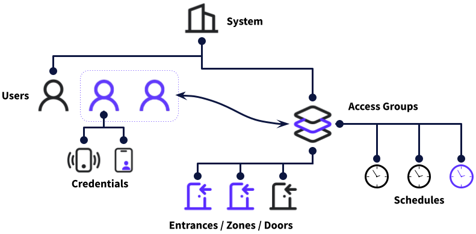

# 🏢 Access Systems

## What is an Access System?

Access Control Systems (ACSs) enable you to manage and monitor access to physical spaces, such as offices, residential complexes, and special-purpose facilities.

Instead of using mechanical keys, an ACS generally uses electronic means of access, like RFID cards, mobile keys, biometric identifiers, or PIN codes as credentials. This use of electronic means of access enables Seam to grant or rescind access easily, as well as to compile an audit log of when a key was used.

ACSs generally manage the following parameters:

* Who has access
* To which doors, entrances, or zones each person has access
* At what times each person can gain access
* Under what conditions each person is allowed access (for example, COVID test completed, ID verification, and so on)

The Seam API provides the capability to manage users and their access permissions. You can also issue credentials (such as PIN codes and key cards) to users.

## Access System Components

The Seam access system schema consists of a series of objects that interact to enable you manage your ACS in a logical, efficient manner. The top-level object is the [system](../../api-clients/access-control-systems/systems/) that represents one or more buildings, residential locations, or other sites that you manage using this ACS. Within the system, you identify the set of doors, entrances, or zones that you want to manage, identifying each by the corresponding lock object. You also identify the set of [users](./#what-is-a-user) who access these doors, entrances, or zones.

[Access groups](./#what-is-an-access-group) provide an efficient way to grant sets of scheduled access to one or more users. That is, you create access group objects that specify the doors, entrances, or zones to which a set of users has access, as well as the days and times at which these users have access to these doors, entrances, or zones.

Finally, you issue sets of [credentials](issuing-credentials.md)—such as access codes, key cards, and mobile passes—to individual users.

The following diagram illustrates the relationship between Seam access system components:

<figure><figcaption></figcaption></figure>

## What Is a User?

A "user" typically refers to an individual who requires access, like an employee or resident. Each user can possess multiple "credentials" that serve as their keys or identifiers for access. The type of credential can vary widely. For example, in the [Salto](../../device-guides/salto-locks.md) system, a user can have a PIN code, a mobile app account, and a fob. In other platforms, it is not uncommon for a user to have more than one of the same credential type, such as multiple key cards. Additionally, these credentials can have a schedule or validity period.

## What Is an Access Group?

An "access group" is a set of users, combined with a set of permissions. These permissions include both the set of areas or assets that the users can access and the schedule during which the users can access these areas or assets. Instead of assigning access rights individually to each user, which can be time-consuming and error-prone, administrators can assign users to an access group, thereby ensuring that the users inherit all the permissions associated with the access group. Using access groups streamlines the process of managing large numbers of users, especially in bigger organizations or complexes.

## **Use Cases**

Leverage the Seam API for the following tasks:

* **Creating and managing users:** Streamline the process of adding and removing users, as well as defining users' access permissions.
* **Issuing and distributing credentials:** Automate issuing PIN codes, key cards, or mobile app passes to users.

## **Next Steps**

To learn how to manage users, check out our [User Management guide](user-management.md). For guidance on assigning users to access groups, see [Assigning Users to Access Groups](assigning-users-to-access-groups.md). To work with access control systems in the Seam API, see [Access Control Systems](../../api-clients/access-control-systems/).
