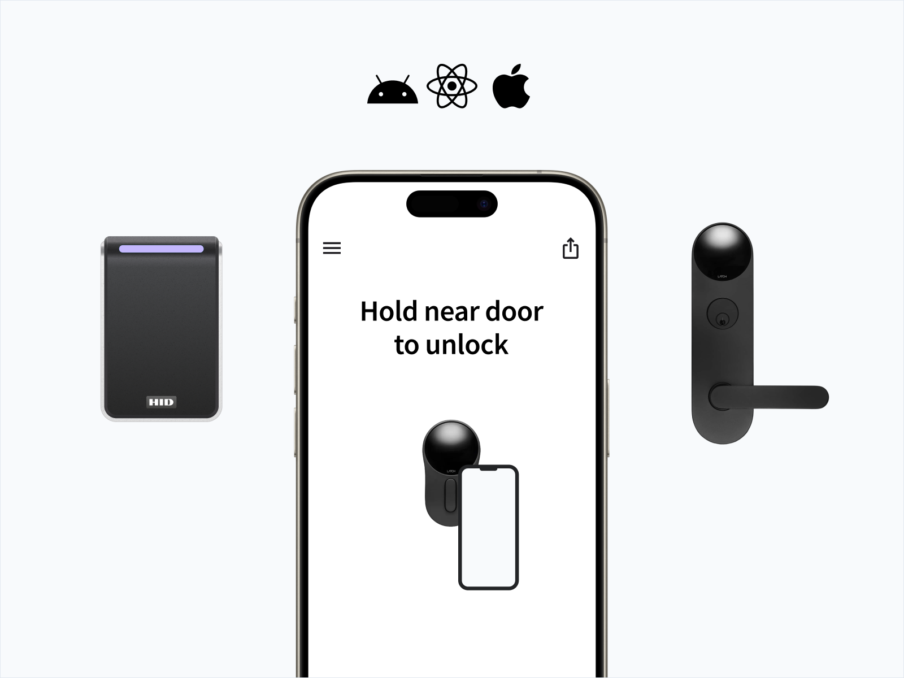

# 📱 Mobile Access

<figure><figcaption>
Seam SDK lets you unlock doors using BLE and NFC credentials across a wide variety of access platforms
</figcaption></figure>

## Managing Mobile Credentials

Mobile access is the use of a mobile device, such as a smartphone, tablet, or wearable, to gain access to secured doors, gates, services, and more. This functionality is incorporated in [access control systems](../access-systems/) (ACSs) of diverse types and levels of complexity.

The Seam mobile access solution makes it easy to issue and retrieve mobile credentials across a wide variety of access control systems. This guide provides an overview of these basic operations and introduces the basic terminology related to mobile access.&#x20;

***

## Applicable Lock and Access Platforms

The Seam mobile access solution is primarily focused on electronic locks and access hardware that support Bluetooth® or near-field communication (NFC) wireless technology. These groups of devices include a vast array of modern electronic door locks, turnstiles, and gate systems. Before implementation, it is important to verify that the existing hardware can communicate with smartphones through one of these wireless technologies.\
If you aim to enable mobile access with Wi-Fi or Z-Wave locks, see [Smart Locks](../smart-locks/). This section describes  API endpoints that you can use directly in your mobile application.

***

## Mobile Credential Process

The following process describes how mobile credentials work:

1. **Installation of an app**\
   First, users download a specialized app onto their smartphones. Your team can develop this app, or you can use the Seam Passport app.
2.  **Credential assignment**

    Credentials are then issued to the user's app account. This process also links their specific account to their unique user profile in the access control system.
3.  **Bluetooth or NFC technology**

    The smartphone communicates with the access control system using either Bluetooth or NFC. These technologies enable the phone to communicate with a reader installed at the access point.
4.  **Authentication**

    When a user approaches an access point, such as a door or gate, they use the app to signal their intent to enter. The app communicates with the reader to authenticate the user's credentials. This signaling can occur by the user tapping a button in the app, by the user using a gesture, or even automatically when the phone comes into range, depending on the configuration of the system.
5.  **Access granted or denied**

    The access control system verifies the credentials and either grants access (by unlocking the door or gate) or denies it. The system can also record the access event, noting the time and the identity of the user.

***

## Use Cases

Use the Seam API and Mobile SDK for the following tasks:

*   **Issue and distribute mobile credentials across many platforms.**

    The Seam API is compatible with many access control systems. The Mobile SDK also supports multiple mobile technologies, like Bluetooth low energy (BLE), NFC, and Apple Wallet.
* **Automatically provision new phones and issue credentials.**\
  When a user signs into their account on a new phone, Seam automatically provisions the device and issues the necessary credentials. It also ensures that the mobile credentials are synced to the access control system.
