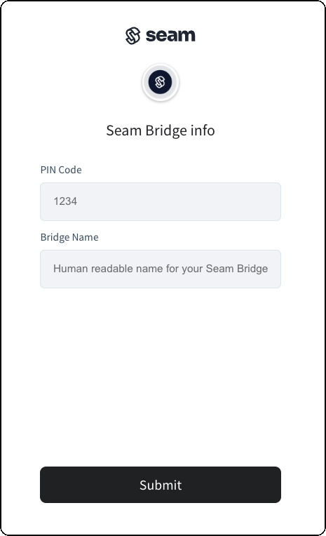

# 🌩️ Seam Bridge

## Overview

The Seam Bridge enables you to connect on-premises software systems to the Seam platform. Consisting of an executable file (that is, an application), the Seam Bridge is easy to install on an on-premises computer. Once installed, the Seam Bridge creates a Seam Network and functions as a secure intermediary, facilitating network requests between Seam and the on-premises network. This setup aims to enable smooth communication between cloud-based services and existing local systems, while prioritizing data security and network integrity.

***

## System Requirements

* **Operating System:** Window 7 or later versions
* **Memory:** At least 1 GB of RAM
* **Network:** LAN connection required

***

## Installation Instructions

To install the Seam Bridge, first install the Seam Bridge application on an on-premises computer. Then, pair the Seam Bridge with your Seam [workspace](../core-concepts/workspaces/).

### **Install the Seam Bridge Application on the On-Premises Computer**

1. In a web browser, go to [the Seam Bridge releases page](https://github.com/seamapi/seam-bridge-client/releases/latest) and download the latest version of `SeamBridge.exe`.
2.  Run the downloaded `SeamBridge.exe`.

    This application opens a webpage containing the Seam Bridge settings.
3.  Click on "Create Pairing Code".\

    <figure><figcaption></figcaption></figure>
4.  Copy the pairing code that the webpage displays.

    The installer uses this code to pair the Seam Bridge to the workspace, using a Connect Webview.\

    <figure><figcaption></figcaption></figure>

### Pairing the Seam Bridge with Your Workspace

Seam provides two options for connecting the Seam Bridge to your workspace. If you are a developer who wants to connect your own device, see [Pair using the Seam Console](seam-bridge-in-development.md#pair-using-the-seam-console). Alternately, if you are coordinating with an external party to set up a Seam Bridge, see [Pair Using a Connect Webview](seam-bridge-in-development.md#pair-using-a-connect-webview).

#### **Pair Using the Seam Console**

1. Log in to your account on the [Seam Console](https://console.getseam.com).
2. Click **Devices** to view the **Devices** page.
3. In the upper-right corner of the **Devices** page, click **+ Add Devices**.
4. Select **Seam Bridge**.
5. In the **Bridge Name** field, type a unique name.
6. In the **PIN Code** field, type the invitation code that you copied during the [Seam Bridge application installation](seam-bridge-in-development.md#install-the-seam-bridge-application-on-the-on-premises-computer).
7. Make sure to remember the name of the Seam Network for future reference.\
   You must use this Seam Network name when connecting the on-premises access control system in a Connect Webview.

#### **Pair Using a Connect Webview**

First, perform the following steps:

1. Create a Connect Webview using `seam_bridge` as the `accepted_providers` key.
2. Share the following two pieces of information with your end user:
   * The `url` of the created Connect Webview
   * The invitation code that you copied during the [Seam Bridge application installation](seam-bridge-in-development.md#install-the-seam-bridge-application-on-the-on-premises-computer)

Next, your end user performs the following steps:

1. The end user accesses the Connect Webview and chooses **Seam Bridge** from the list of brands, if available.
2. In the **Bridge Name** field, the end user types a unique name.
3. In the **PIN Code** field, the end user types the invitation code that you copied during the [Seam Bridge application installation](seam-bridge-in-development.md#install-the-seam-bridge-application-on-the-on-premises-computer).
4. The end user must remember the name of the Seam Network for future reference.\
   They must use this Seam Network name when connecting their on-premises access control system in a Connect Webview.

<figure><figcaption></figcaption></figure>

***

## Connecting the On-Premises Software System

After installing the Seam Bridge application and connecting the Seam Bridge to your workspace, connect your on-premises software system to Seam using a Connect Webview. For detailed instructions on how to connect your system, see the setup instructions in the appropriate brand-specific guide within the [Device Guides](broken-reference) section.

<table data-card-size="large" data-view="cards"><thead><tr><th></th><th></th><th></th><th data-hidden data-card-target data-type="content-ref"></th><th data-hidden data-card-cover data-type="files"></th></tr></thead><tbody><tr><td><strong>Device Guides</strong></td><td>Get started →</td><td></td><td><a href="broken-reference">Broken link</a></td><td><a href="../.gitbook/assets/image (9).png">image (9).png</a></td></tr></tbody></table>
