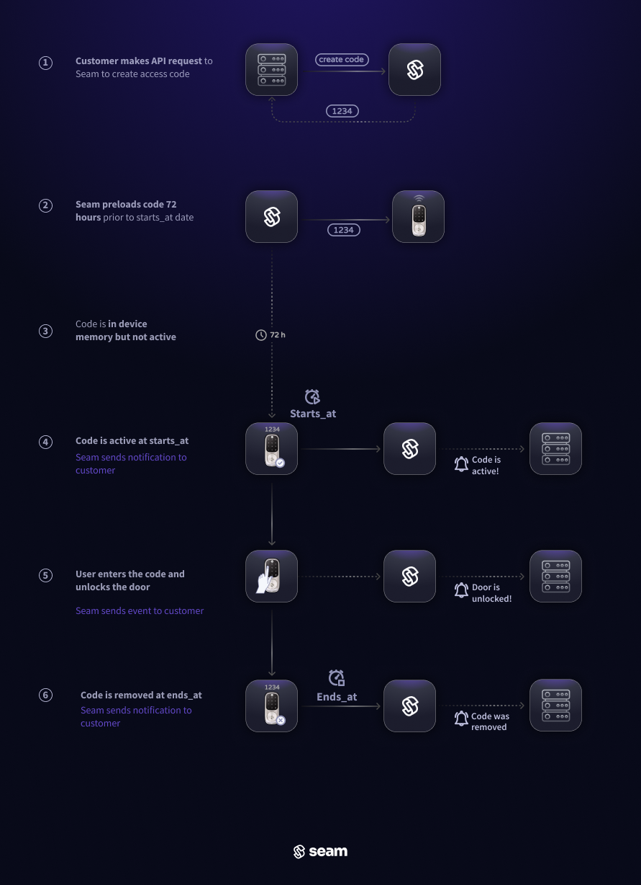
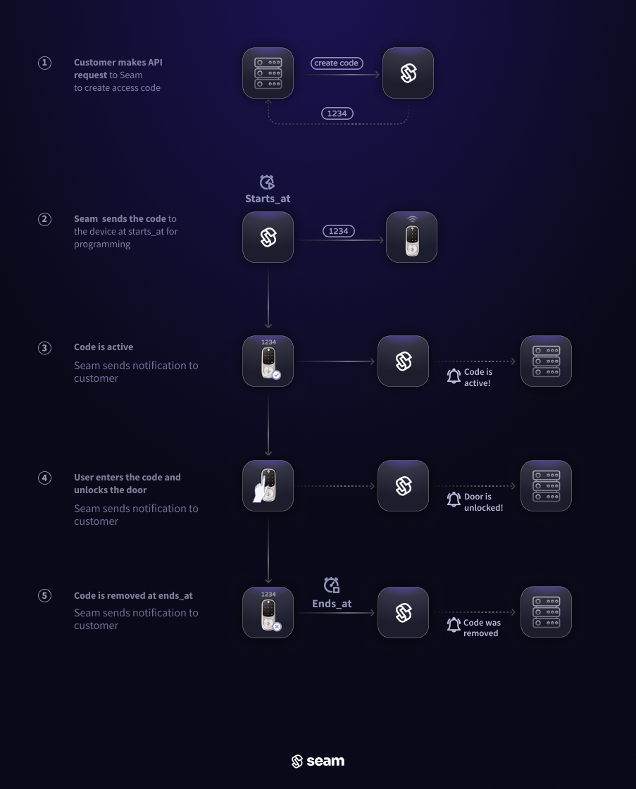

# Managing Access Codes

<figure><figcaption></figcaption></figure>

## What Is an Access Code?

An Access code is a code used for a keypad or pinpad device. Unlike physical keys, which can be easily lost or duplicated, PIN codes can be customized, tracked, and altered on-the-fly. Using the Seam [Access Code API](../../../api-clients/access-codes/), you can easily generate access codes on the hundreds of door lock models with which we integrate.

Seam supports programming two types of access codes: [ongoing](./#ongoing-access-codes) and [time-bound](./#time-bound-access-codes). To differentiate between the two, refer to the `type` property of the access code. Ongoing codes display as `ongoing`, whereas time-bound codes are labeled `time_bound`.

In addition, for certain devices, Seam also supports [offline access codes](./#offline-access-codes).

### **Ongoing Access Codes**

Ongoing access code are ideal for residents or long-term users. Ongoing codes remain active on a device until removed. They can start right away or at a later date if you provide a `starts_at`timestamp.

<figure><figcaption>
Timeline of an ongoing access code. The code will remain active until you ask Seam to remove it.
</figcaption></figure>

### **Time-Bound Access Codes**

Time-bound access codes are suitable for temporary access like guest visits or service appointments. These codes operate between a designated `starts_at` and `ends_at` time window, granting access only during that period.

<figure><figcaption>
Timeline of an time-bound access code. The code will remain active until the <code>ends_at</code> timestamp you provide Seam.
</figcaption></figure>

### Offline Access Codes

Offline access (PIN) codes are designed for door locks that might not always maintain an internet connection. Currently, Seam supports offline access codes for [igloohome locks](../../../device-guides/igloohome-locks.md) and [dormakaba Oracode locks](../../../device-guides/dormakaba-oracode-locks.md). For this type of access code, the device manufacturer uses encryption keys (tokens) to create server-based registries of algorithmically-generated offline PIN codes. Because the tokens remain synchronized with the managed devices, the locks do not require an active internet connection—and you do not need to be near the locks—to create an offline access code. Then, owners or managers can share these offline codes with users through a variety of mechanisms, such as messaging applications. That is, lock users do not need to install a smartphone application to receive an offline access code.


You cannot modify a created offline access code. In addition, you cannot revoke a created offline access code before the configured expiration date for the code. To invalidate an offline access code before the expiration date, you must either perform a factory reset on the device or re-pair your smartphone with the device.


Seam supports two types of offline access codes: [time-bound](./#time-bound-offline-access-codes) and [one-time-use](./#one-time-use-offline-access-codes). Note that this support varies based on the device manufacturer. Before creating an offline access code, it is imperative to understand any manufacturer- or device-specific constraints, such as the maximum number of access codes, any time slot or activation requirements, and so on. For details, see the corresponding device guide.

* [igloohome Locks device guide](../../../device-guides/igloohome-locks.md)
* [dormakaba Oracode Locks device guide](../../../device-guides/dormakaba-oracode-locks.md)

#### Time-Bound Offline Access Codes

For [igloohome locks](../../../device-guides/igloohome-locks.md) and [dormakaba Oracode locks](../../../device-guides/dormakaba-oracode-locks.md), you can create time-bound offline access codes with validity durations at either the hour level or the day level.

Hourly-bound offline access codes are intended for shorter durations, while daily-bound offline codes are intended for longer durations. Device manufacturers set the bounds for these short- and long-term access codes, and some device manufacturers enforce a maximum duration for hourly-bound offline access codes. See the corresponding device guide for more information.

To [create an hourly-bound offline access code](offline-access-codes.md#program-an-hourly-bound-offline-access-code), specify the desired `starts_at` and `ends_at` date and time. To [create a daily-bound offline access code](offline-access-codes.md#program-a-daily-bound-offline-access-code), you must specify the same time in the `starts_at` and `ends_at` properties.

#### One-Time-Use Offline Access Codes

For [igloohome locks](../../../device-guides/igloohome-locks.md), you can create [one-time-use offline access codes](offline-access-codes.md#creating-one-time-use-offline-access-codes) that are valid for 24 hours from the `starts_at` date and time that you configure. These codes expire after a single use.

***

## How Seam Programs Codes onto the Lock

Seam ensures access reliability by initiating the programming of access codes onto the lock ahead of its `starts_at` time. This approach minimizes the risks of delays or disruptions during the programming process.

### **Native Scheduling**

For locks that support setting codes with a schedule, Seam will preload access codes onto the device a full **72 hours** before the `starts_at` timestamp of a time-bound code. When the `starts_at` time arrives, the code automatically activates and will remain active until its `ends_at` time. We enable this "native scheduling" functionality by default for all providers that support it. See [Native Scheduling—Supported Providers](./#native-scheduling-supported-providers) for a list of supported providers. You can choose to override this default behavior and have Seam perform "just-in-time scheduling" by setting `prefer_native_scheduling` to `false` when creating a code.

<figure><figcaption>
72 hours before the <code>starts_at</code> timestamp, Seam inserts the code into the device's internal memory. When the <code>starts_at</code> time arrives, the device automatically activates the code. It is then automatically deactivated at the <code>ends_at</code> timestamp.
</figcaption></figure>

#### Native Scheduling—Supported Providers

| ✅ Supported | ✖️ Not Supported  |
| ----------- | ----------------- |
| 2N          | Dormakaba Oracode |
| August      | Lockly            |
| Igloohome   | SmartThings       |
| Kwikset     |                   |
| Nuki        |                   |
| Salto       |                   |
| Schlage     |                   |
| Tedee       |                   |
| TTLock      |                   |
| Yale        |                   |
| Wyze        |                   |

### **Just-in-time Scheduling**

For those locks that lack native scheduling functionality, Seam will use its own scheduling infrastructure to program the code 30 minutes before the `starts_at` time, and remove it at the `ends_at` time.

<figure><figcaption>
When the <code>starts_at</code> time arrives, Seam adds the code to the device and activates it. It is then automatically deactivated at the <code>ends_at</code> timestamp.
</figcaption></figure>

***

## Linking Unlock Events and Access Codes

When a user unlocks a door using an access code, Seam issues a [`lock.unlocked` event](../../../api-clients/events/#event-types). Some device manufacturers include the ID of the access code in [lock-related events](../../../api-clients/events/#lock-events). This information is useful for troubleshooting and logging. Further, if you name access codes in a way that identifies the associated users, you can use these `lock.unlocked` events to identify the users who unlocked the doors.

Currently, the following device manufacturers send the `access_code_id` in the `lock.unlocked` event:

* August
* Salto KS
* Schlage
* Tedee
* TTLock
* Yale

***

## Advanced Feature: Backup Access Codes

Occasionally, Seam may encounter issues when programming codes onto locks. Such hiccups can arise from device connectivity issues, manual interventions from the lock or its accompanying app, or service disruptions from the lock providers. Given these issues, we strongly advise preprogramming a set of backup codes onto the door lock. Should you detect a failure in access code programming, these backup codes can be promptly shared.

Seam offers a Backup Access Code service. When activated, this service automatically maintain a pool of pre-programmed access codes on a device. These codes are programmed in addition to the regular access codes on Seam, acting as a safety net in case of any issues with the primary codes. Please read about [how to enable and request a back up code here](backup-access-codes.md).

<table data-card-size="large" data-view="cards"><thead><tr><th></th><th></th><th></th><th data-hidden data-card-cover data-type="files"></th><th data-hidden data-card-target data-type="content-ref"></th></tr></thead><tbody><tr><td>
<a href="backup-access-codes.md"><strong>Backup Access Code Pool</strong></a>

Use our backup code pool service to automatically maintain a set of back up codes on your device.
</td><td></td><td></td><td><a href="../../../.gitbook/assets/spaces_xnN2A67918om1UthYWsF_uploads_6mrS1LVdcoGmXAagf0SI_recycle key.webp">spaces_xnN2A67918om1UthYWsF_uploads_6mrS1LVdcoGmXAagf0SI_recycle key.webp</a></td><td><a href="broken-reference/">broken-reference</a></td></tr></tbody></table>
