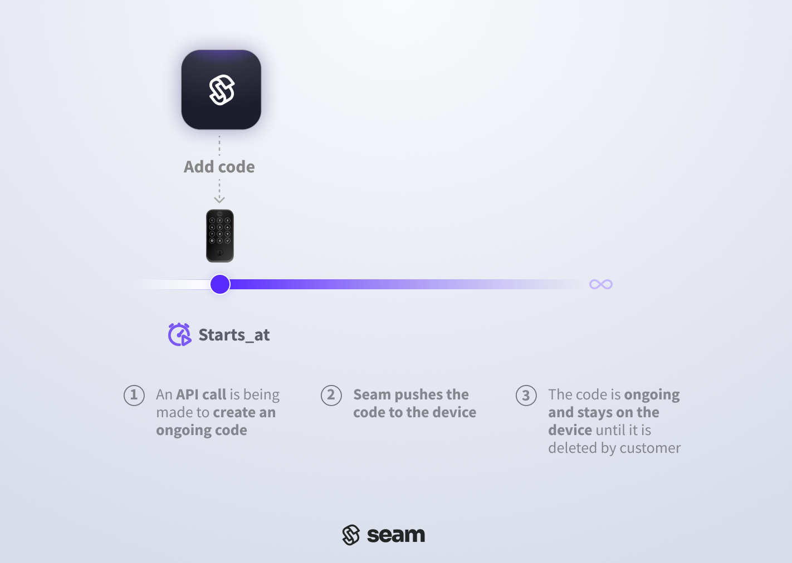
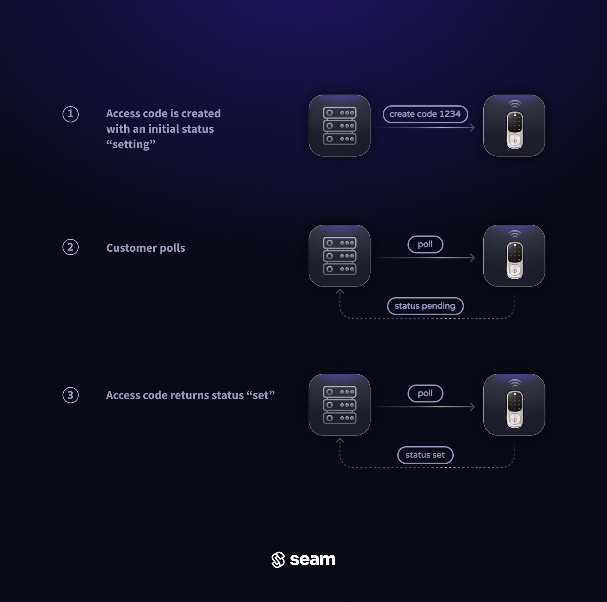
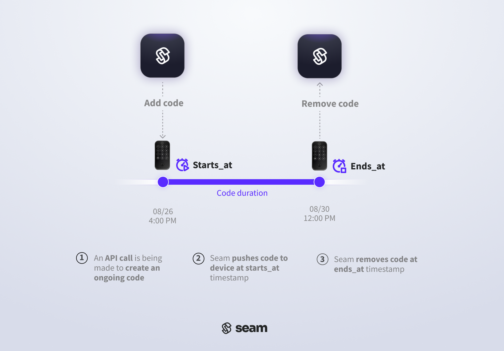
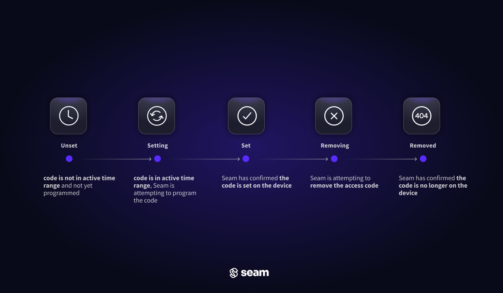
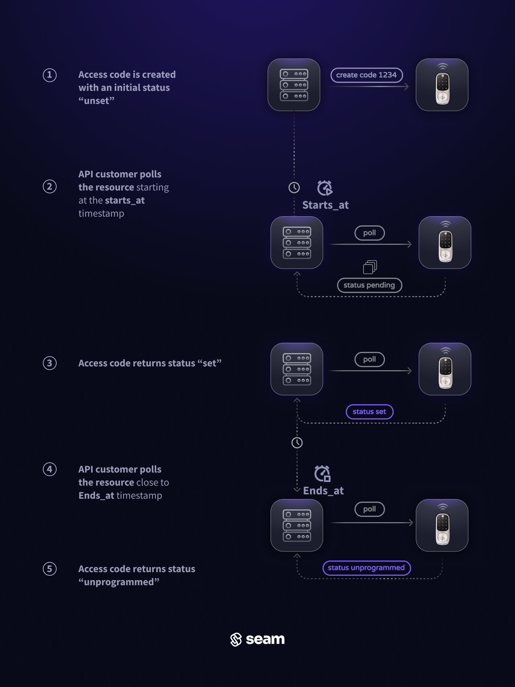

# Creating Access Codes

## Overview

This guide explains how to create online access codes on an online smart lock. With the [Access Codes](../../../api-clients/access-codes/) API, generate PIN codes on a door lock and share it with visitors, allowing them keyless access.

Seam supports programming two types of online access codes for online door locks:

1. **Ongoing**: Ideal for residents or long-term users. Ongoing codes remain active on a device until removed. Create one by leaving the `end_at` field empty. To remove the code, use the [Delete Access Code](../../../api-clients/access-codes/delete-an-access-code.md) endpoint.
2. **Time Bound**: Suitable for temporary access like guest visits or service appointments. These codes operate between a designated `starts_at` and `ends_at` time window, granting access only during that period.


For more information about creating offline access codes, see [Managing Offline Access Codes](offline-access-codes.md).


***

## Before You Begin: Confirm Capabilities

Before you attempt to create an [online](./#what-is-an-access-code) or [offline](./#offline-access-codes) access code, be sure to confirm that your device has the capability to perform these operations. You can inspect the capabilities of a device by checking the following [capability flags](../../../capability-guides/device-and-system-capabilities.md#capability-flags) for the device:

* `can_program_online_access_codes`
* `can_program_offline_access_codes`

Use [Get Device](../../../api-clients/devices/get-device.md) (or [Get Lock](../../../api-clients/locks/get-lock.md)) for a specific device to return these capability flags. Then, use an `if` statement or similar check to confirm that the relevant flag is both present and `true` before attempting to create an access code.

If either of these capability flags is `false` or not present, you can view the [properties](../../../api-clients/devices/#device-properties) of the device, [errors](../../../api-clients/devices/#device-error-types) or [warnings](../../../api-clients/devices/#device-warning-types) for the device, and [events](../../../api-clients/events/#event-types) related to the device to learn more about the cause of these issues. For example, you could examine the following device properties:

* `device.properties.model.has_built_in_keypad`
* `device.properties.model.can_connect_accessory_keypad`
* `device.properties.accessory_keypad.is_connected`
* `device.properties.accessory_keypad.battery.level`

In addition, you could look for a `device.accessory_keypad_disconnected` event.



**Request:**

```python
seam.locks.get(device="11111111-1111-1111-1111-444444444444")
```

**Response:**

```
Device(
  device_id='11111111-1111-1111-1111-444444444444',
  can_program_online_access_codes=True,  // You can create online access codes for this device.
  can_program_offline_access_codes=True, // You can create offline access codes for this device.
  ...
)
```



**Request:**

<pre class="language-bash"><code class="lang-bash"># Use GET or POST.
<strong>curl -X 'GET' \
</strong>  'https://connect.getseam.com/locks/get' \
  -H 'accept: application/json' \
  -H 'Authorization: Bearer ${API_KEY}' \
  -H 'Content-Type: application/json' \
  -d '{
  "device_id": "11111111-1111-1111-1111-444444444444"
}'
</code></pre>

**Response:**

```json
{
  "lock": {
    "device_id": "11111111-1111-1111-1111-444444444444",
    "can_program_online_access_codes": true,  // You can create online access codes for this device.
    "can_program_offline_access_codes": true, // You can create offline access codes for this device.
    ...
  },
  "ok": true
}
```



**Request:**

```javascript
await seam.locks.get("11111111-1111-1111-1111-444444444444")
```

**Response:**

```json
{
  device_id: '11111111-1111-1111-1111-444444444444',
  can_program_online_access_codes: true,  // You can create online access codes for this device.
  can_program_offline_access_codes: true, // You can create offline access codes for this device.
  ...
}
```



**Request:**

```ruby
client.locks.get("11111111-1111-1111-1111-444444444444")
```

**Response:**

```
<Seam::Device:0x00438
  device_id="11111111-1111-1111-1111-444444444444"
  can_program_online_access_codes=true  // You can create online access codes for this device.
  can_program_offline_access_codes=true // You can create offline access codes for this device.
  ...
>
```



**Request:**

```php
$seam->devices->get("11111111-1111-1111-1111-444444444444");
```

**Response:**

```json
{
  "device_id": "11111111-1111-1111-1111-444444444444",
  "can_program_online_access_codes": true,  // You can create online access codes for this device.
  "can_program_offline_access_codes": true, // You can create offline access codes for this device.
  ...
}
```



**Request:**

```csharp
seam.Devices.Get(deviceId: "11111111-1111-1111-1111-444444444444");
```

**Response:**

```
{
  "device_id": "11111111-1111-1111-1111-444444444444",
  "can_program_online_access_codes": true,  // You can create online access codes for this device.
  "can_program_offline_access_codes": true, // You can create offline access codes for this device.
  ...
}
```



**Request:**

```java
seam.locks()
  .get(LocksGetRequest.builder()
    .deviceId("11111111-1111-1111-1111-444444444444")
    .build());
```

**Response:**

```json
{
  "device_id": "11111111-1111-1111-1111-444444444444",
  "can_program_online_access_codes": true,  // You can create online access codes for this device.
  "can_program_offline_access_codes": true, // You can create offline access codes for this device.
  ...
}
```



**Request:**

```go
device, uErr := client.Devices.Get(
  context.Background(),
  &api.DevicesGetRequest{
    DeviceId: "11111111-1111-1111-1111-444444444444",
  })
```

**Response:**

```json
{
  "device_id": "11111111-1111-1111-1111-444444444444",
  "can_program_online_access_codes": true,  // You can create online access codes for this device.
  "can_program_offline_access_codes": true, // You can create offline access codes for this device.
  ...
}
```



***

## Programming an Ongoing Online Access Code

Ongoing online access codes are ideal for long-term users that wish to keep the same code. Ongoing codes remain active on a device until removed.

<figure><figcaption><p>Timeline of an ongoing access code. The code remains active, until you use the Seam API to remove it.</p></figcaption></figure>

### 1. Create an Ongoing Online Access Code

Set an ongoing online access code by providing the `device_id` of the smart lock on which you want to [create an access code](../../../api-clients/access-codes/create-an-access-code.md). Assign an optional `name` to the access code for easier identification within the [Seam Console](https://console.seam.co) and smart lock app.

To customize the PIN code, specify a desired PIN for the `code` property. See [Access Code Requirements for Door Locks](access-code-requirements-for-door-locks.md) to understand any requirements specific to the door lock.



**Request:**

<pre class="language-python"><code class="lang-python"># Get the device.
<strong>device = seam.locks.get(
</strong><strong>  device_id="11111111-1111-1111-1111-444444444444"
</strong><strong>)
</strong><strong>
</strong><strong># Confirm that the device supports online access codes.
</strong><strong>if device.can_program_online_access_codes:
</strong>  # Create the ongoing online access code.
  seam.access_codes.create(
    device_id = device.device_id,
    name = "my ongoing code",
    code = "1234"
  )
</code></pre>

**Response:**

```
AccessCode(
  access_code_id='11111111-1111-1111-1111-555555555555',
  device_id='11111111-1111-1111-1111-444444444444',
  type='ongoing',
  code='1234',
  name='my ongoing code',
  ...
)
```



**Request:**

```bash
# Get the device.
device=$(
  # Use GET or POST.
  curl -X 'GET' \
    'https://connect.getseam.com/devices/get' \
    -H 'accept: application/json' \
    -H "Authorization: Bearer ${API_KEY}" \
    -H 'Content-Type: application/json' \
    -d '{
      "device_id": "11111111-1111-1111-1111-444444444444"
  }')
  
# Confirm that the device supports online access codes.
if  $(jq -r '.device.can_program_online_access_codes' <<< ${device}); then \
  # Create the ongoing online access code.
  curl -X 'POST' \
    'https://connect.getseam.com/access_codes/create' \
    -H 'accept: application/json' \
    -H "Authorization: Bearer ${API_KEY}" \
    -H 'Content-Type: application/json' \
    -d "{
      \"device_id\": \"$(jq -r '.device.device_id' <<< ${device})\",
      \"name\": \"my ongoing code\",
      \"code\": \"1234\"
  }";
fi
```

**Response:**

```json
{
  "action_attempt":{
    "status":"pending",
    "action_type":"CREATE_ACCESS_CODE",
    "action_attempt_id":"11111111-2222-3333-4444-555555555555",
    "result":null,
    "error":null
  },
  "access_code":{
    "access_code_id":"11111111-1111-1111-1111-555555555555",
    "device_id":"11111111-1111-1111-1111-444444444444",
    "name":"my ongoing code",
    "code":"1234",
    "type":"ongoing",
    ...
  },
  "ok":true
}
```



**Request:**

```javascript
// Get the device.
const device = await seam.locks.get({
  device_id: "11111111-1111-1111-1111-444444444444"
});

// Confirm that the device supports online access codes.
if (device.can_program_online_access_codes) {
  // Create the ongoing online access code.
  await seam.accessCodes.create({
    device_id: device.device_id,
    name: "my ongoing code",
    code: "1234"
  })
};
```

**Response:**

```json
{
  access_code_id: '11111111-1111-1111-1111-555555555555',
  device_id: '11111111-1111-1111-1111-444444444444',
  name: 'my ongoing code',
  code: '1234',
  type: 'ongoing',
  ...
}
```



**Request:**

```ruby
# Get the device.
device = client.locks.get("11111111-1111-1111-1111-444444444444")

# Confirm that the device supports online access codes.
if (device.can_program_online_access_codes)
  # Create the ongoing online access code.
  client.access_codes.create(
    device_id: device.device_id,
    name: "my ongoing code",
    code: "1234"
  )
end
```

**Response:**

```
<Seam::AccessCode:0x00460
  access_code_id="11111111-1111-1111-1111-555555555555"
  device_id="11111111-1111-1111-1111-444444444444"
  name="my ongoing code"
  code="1234"
  type="ongoing"
  ...
>
```



**Request:**

```php
// Get the device.
$device = $seam->locks->get(device_id: "11111111-1111-1111-1111-444444444444");

// Confirm that the device supports online access codes.
if ($device->can_program_online_access_codes) {
  // Create the ongoing online access code.
  $seam->access_codes->create(
    device_id: $device->device_id,
    name: "my ongoing code",
    code: "1234"
  );
}
```

**Response:**

```json
{
  "access_code_id": "11111111-1111-1111-1111-555555555555",
  "device_id": "11111111-1111-1111-1111-444444444444",
  "name": "my ongoing code",
  "type": "ongoing",
  "code": "1234",
  ...
}
```



**Request:**

```csharp
// Get the device.
Device device = seam.Locks.Get(deviceId: "11111111-1111-1111-1111-444444444444");

// Confirm that the device supports online access codes.
if (device.CanProgramOnlineAccessCodes == true) {
  // Create the ongoing online access code.
  seam.AccessCodes.Create(
    deviceId: device.DeviceId,
    name: "my ongoing code",
    code: "1234"
  );
}
```

**Response:**

```json
{
  "type": "ongoing",
  "access_code_id": "11111111-1111-1111-1111-555555555555",
  "device_id": "11111111-1111-1111-1111-444444444444",
  "name": "my ongoing code",
  "code": "1234",
  ...
}
```



**Request:**

```java
// Get the device.
Device device = seam.devices()
  .get(DevicesGetRequest.builder()
    .deviceId("11111111-1111-1111-1111-444444444444")
    .build());

// Confirm that the device supports online access codes.
if (device.getCanProgramOnlineAccessCodes())
{
  // Create the ongoing online access code.
  seam.accessCodes()
    .create(AccessCodesCreateRequest.builder()
      .deviceId(device.getDeviceId())
      .name("my ongoing code")
      .code("1234")
      .build());
}
```

**Response:**

```json
{
  "access_code_id" : "11111111-1111-1111-1111-555555555555",
  "device_id" : "11111111-1111-1111-1111-444444444444",
  "name" : "my ongoing code",
  "code" : "1234",
  "type" : "ongoing",
  ...
}
```



**Request:**

```go
// Get the device.
device, uErr := client.Locks.Get(
  context.Background(),
  &api.LocksGetRequest{
    DeviceId: api.String("11111111-1111-1111-1111-444444444444"),
  })

// Confirm that the device supports online access codes.
if *device.CanProgramOnlineAccessCodes {
  // Create the ongoing online access code.
  client.AccessCodes.Create(
      context.Background(),
      &api.AccessCodesCreateRequest{
        DeviceId: device.DeviceId,
        Name: api.String("my ongoing code"),
        Code: api.String("1234"),
      },
    )
  }

if uErr != nil {
    return uErr
}

return nil
```

**Response:**

```json
{
  "access_code_id": "11111111-1111-1111-1111-555555555555",
  "device_id": "11111111-1111-1111-1111-444444444444",
  "name": "my ongoing code",
  "code": "1234",
  "type": "ongoing",
  ...
}
```



### 2. Verify Successful Ongoing Code Programming

Seam may encounter some problems when setting an access code onto the lock. This could be due to weak internet connectivity, a low battery in the door lock, or someone unplugging the bridge that links the lock to the internet. **Given these potential challenges, it's essential to verify that a code has been successfully programmed on to the lock** to prevent unexpected complications later.

There are two methods to verify that an ongoing access code has been set on the device:

* **Polling**: continuously query the access code until its `status` is updated
* **Webhook**: wait for updates to arrive via webhook requests from the Seam API

### **Polling Method**

Use the `access_code` reference returned by the create function to call the [Get Access Code](../../../api-clients/access-codes/get-an-access-code.md) function. A basic implementation would involve polling this endpoint until the `status` of the access code updates to `set`.

If the `status` remains `setting` for a very long time, or if the `access_code` object contains any `warnings` or `errors` properties, consult [the guide on "Troubleshooting Access Code Issues"](troubleshooting-access-code-issues.md) for further guidance.

<figure><figcaption><p>Illustration of the polling verification step for an ongoing access code</p></figcaption></figure>

### **Webhook Events Method**

To avoid polling, monitor for incoming Seam webhook events related to the code status:

* The `access_code.set_on_device` event indicates the successful setting of the access code on the device.
* The `access_code.failed_to_set_on_device` or `access_code.delay_in_setting_on_device` events indicate a delay or failure.

In the event of delay or failure, refer to [the "Troubleshooting access code issues" guide](troubleshooting-access-code-issues.md) for assistance and mitigation strategies.

<figure><figcaption><p>Illustration of the webhook verification method for an ongoing access code</p></figcaption></figure>

***

## Scheduling Time-Bound Online Access Codes

Time-bound online access codes are suitable for temporary access, like guest visits or service appointments. These codes operate between designated `starts_at` and `ends_at` timestamps, granting access only during that period. Seam automatically ensures that the code is programmed on the device at the `starts_at` time and unprogrammed at the `ends_at` time.

<figure><figcaption><p>Timeline of an time-bound access code. The code remains active until the ends_at timestamp that you configured using the Seam API.</p></figcaption></figure>

### 1. Create a Time-Bound Online Access Code

To set a time-bound online access code, provide the `device_id` of the smart lock on which you want to program a code, along with `starts_at` and `ends_at` [ISO 8601](https://www.iso.org/iso-8601-date-and-time-format.html) timestamps to define the active time window for the code. For more details, see the [Create Access Code](../../../api-clients/access-codes/create-an-access-code.md) endpoint.

As with ongoing codes, you can assign an optional `name` to the access code. A clear name helps users to identify the access code quickly within their smart lock app.

Similarly, to customize the PIN code, specify a desired PIN in the `code` property. See the [Access Code Requirements for Door Locks](access-code-requirements-for-door-locks.md) to understand any requirements specific to the door lock brand.



**Request:**

```python
# Get the device.
device = seam.locks.get(
  device_id="11111111-1111-1111-1111-444444444444"
)

# Confirm that the device supports online access codes.
if device.can_program_online_access_codes:
  # Create the time-bound online access code.
  seam.access_codes.create(
    device_id = device.device_id,
    name = "my time-bound code",
    starts_at = "2025-01-01T16:00:00Z",
    ends_at = "2025-01-22T12:00:00Z",
    code = "2345"
  )
```

**Response:**

```
AccessCode(
  access_code_id='11111111-1111-1111-1111-666666666666',
  device_id='11111111-1111-1111-1111-444444444444',
  type='time_bound',
  code='2345',
  starts_at='2025-01-01T16:00:00.000Z',
  ends_at='2025-01-22T12:00:00.000Z',
  name='my time-bound code',
  ...
)
```



### Request:

```sh
# Get the device.
device=$(
  # Use GET or POST.
  curl -X 'GET' \
    'https://connect.getseam.com/devices/get' \
    -H 'accept: application/json' \
    -H "Authorization: Bearer ${API_KEY}" \
    -H 'Content-Type: application/json' \
    -d '{
      "device_id": "11111111-1111-1111-1111-444444444444"
  }')

# Confirm that the device supports online access codes.
if  $(jq -r '.device.can_program_online_access_codes' <<< ${device}); then \
  # Create the time-bound online access code.
  curl -X 'POST' \
    'https://connect.getseam.com/access_codes/create' \
    -H 'accept: application/json' \
    -H "Authorization: Bearer ${API_KEY}" \
    -H 'Content-Type: application/json' \
    -d "{
      \"device_id\": \"$(jq -r '.device.device_id' <<< ${device})\",
      \"name\": \"my time-bound code\",
      \"starts_at\": \"2025-01-01T16:00:00Z\",
      \"ends_at\": \"2025-01-22T12:00:00Z\",
      \"code\": \"2345\"
  }";
fi
```

### Response:

```json
{
  "action_attempt": {
    "status": "pending",
    "action_type": "CREATE_ACCESS_CODE",
    "action_attempt_id": "11111111-2222-3333-4444-555555555555",
    "result": null,
    "error": null
  },
  "access_code": {
    "access_code_id": "11111111-1111-1111-1111-666666666666",
    "device_id": "11111111-1111-1111-1111-444444444444",
    "name": "my time-bound code",
    "code": "2345",
    "type": "time_bound",
    "starts_at": "2025-01-01T16:00:00.000Z",
    "ends_at": "2025-01-22T12:00:00.000Z",
    ...
  },
  "ok": true
}
```



**Request:**

```javascript
// Get the device.
const device = await seam.locks.get({
  device_id: "11111111-1111-1111-1111-444444444444"
});

// Confirm that the device supports online access codes.
if (device.can_program_online_access_codes) {
  // Create the time-bound online access code.
  await seam.accessCodes.create({
    device_id: device.device_id,
    name: "my time-bound code",
    starts_at: "2025-01-01T16:00:00Z",
    ends_at: "2025-01-22T12:00:00Z",
    code: "2345"
  })
};
```

**Response:**

```json
{
  access_code_id: '11111111-1111-1111-1111-666666666666',
  device_id: '11111111-1111-1111-1111-444444444444',
  name: 'my time-bound code',
  code: '2345',
  type: 'time_bound',
  starts_at: '2025-01-01T16:00:00.000Z',
  ends_at: '2025-01-22T12:00:00.000Z',
  ...
}
```



**Request:**

```ruby
# Get the device.
device = client.locks.get("11111111-1111-1111-1111-444444444444")

# Confirm that the device supports online access codes.
if (device.can_program_online_access_codes)
  # Create the time-bound online access code.
  client.access_codes.create(
    device_id: device.device_id,
    name: "my time-bound code",
    starts_at: "2025-01-01T16:00:00Z",
    ends_at: "2025-01-22T12:00:00Z",
    code: "2345"
  )
end
```

**Response:**

```
<Seam::AccessCode:0x00438
  access_code_id="11111111-1111-1111-1111-666666666666"
  device_id="11111111-1111-1111-1111-444444444444"
  name="my time-bound code"
  code="2345"
  type="time_bound"
  starts_at=2025-01-01 16:00:00 UTC
  ends_at=2025-01-22 12:00:00 UTC
  ...
>
```



**Request:**

```php
// Get the device.
$device = $seam->locks->get(device_id: "11111111-1111-1111-1111-444444444444");

// Confirm that the device supports online access codes.
if ($device->can_program_online_access_codes) {
  // Create the time-bound online access code.
  $seam->access_codes->create(
    device_id: $device->device_id,
    name: "my time-bound code",
    starts_at:  "2025-01-01T16:00:00Z",
    ends_at: "2025-01-22T12:00:00Z",
    code: "2345"
  );
}
```

**Response:**

```json
{
  "access_code_id": "11111111-1111-1111-1111-666666666666",
  "device_id": "11111111-1111-1111-1111-444444444444",
  "name": "my time-bound code",
  "type": "time_bound",
  "starts_at": "2025-01-01T16:00:00.000Z",
  "ends_at": "2025-01-22T12:00:00.000Z",
  "code": "2345",
}
```



**Request:**

```csharp
// Get the device.
Device device = seam.Locks.Get(deviceId: "11111111-1111-1111-1111-444444444444");

// Confirm that the device supports online access codes.
if (device.CanProgramOnlineAccessCodes == true) {
  // Create the time-bound online access code.
  seam.AccessCodes.Create(
    deviceId: device.DeviceId,
    name: "my time-bound code",
    startsAt: "2025-01-01T16:00:00Z",
    endsAt: "2025-01-22T12:00:00Z",
    code: "2345"
  );
}
```

**Response:**

```
{
  "type": "time_bound",
  "access_code_id": "11111111-1111-1111-1111-666666666666",
  "device_id": "11111111-1111-1111-1111-444444444444",
  "name": "my time-bound code",
  "starts_at": "2025-01-01T16:00:00Z",
  "ends_at": "2025-01-22T12:00:00Z",
  "code": "2345",
  ...
}
```



**Request:**

```java
// Get the device.
Device device = seam.devices()
  .get(DevicesGetRequest.builder()
    .deviceId("11111111-1111-1111-1111-444444444444")
    .build());

// Confirm that the device supports online access codes.
if (device.getCanProgramOnlineAccessCodes())
{
  // Create the time-bound online access code.
  seam.accessCodes()
    .create(AccessCodesCreateRequest.builder()
      .deviceId(device.getDeviceId())
      .name("my time-bound code")
      .startsAt("2025-01-01T16:00:00Z")
      .endsAt("2025-01-22T12:00:00Z")
      .code("2345")
      .build());
}
```

**Response:**

```json
{
  "access_code_id" : "11111111-1111-1111-1111-666666666666",
  "device_id" : "11111111-1111-1111-1111-444444444444",
  "name" : "my time-bound code",
  "code" : "2345",
  "type" : "time_bound",
  "starts_at" : "2025-01-01T16:00:00Z",
  "ends_at" : "2025-01-22T12:00:00Z",
  ...
}
```



**Request:**

```go
// Get the device.
device, uErr := client.Locks.Get(
  context.Background(),
  &api.LocksGetRequest{
    DeviceId: api.String("11111111-1111-1111-1111-444444444444"),
  })

// Confirm that the device supports online access codes.
if *device.CanProgramOnlineAccessCodes {
  // Create the time-bound online access code.
  client.AccessCodes.Create(
      context.Background(),
      &api.AccessCodesCreateRequest{
        DeviceId: device.DeviceId,
        Name: api.String("my time-bound code"),
        StartsAt: api.String("2025-01-01T16:00:00Z"),
        EndsAt: api.String("2025-01-22T12:00:00Z"),
        Code: api.String("2345"),
      },
    )
  }

if uErr != nil {
    return uErr
}

return nil
```

**Response:**

```json
{
  "access_code_id": "11111111-1111-1111-1111-666666666666",
  "device_id": "11111111-1111-1111-1111-444444444444",
  "name": "my time-bound code",
  "code": "2345",
  "type": "time_bound",
  "starts_at": "2025-01-01T16:00:00.000Z",
  "ends_at": "2025-01-22T12:00:00.000Z",
  ...
}
```



### 2. Verify Successful Time-Bound Code Programming

The [lifecycle of a time-bound access code](lifecycle-of-access-codes.md) is marked by distinct phases:

1. `Unset`: When initially created on Seam, the access code remains in an `unset` state, indicating it has not yet been programmed onto the door lock due to its future activation time.
2. `Setting`: As the scheduled `starts_at` time approaches, Seam initiates the process of programming the code onto the lock, transitioning the code's `status` to `setting`.
3. `Set`: Upon successful programming, the status updates to `set`, signaling that the code is loaded onto the lock, and may grant the designated user the ability to unlock the door.

<figure><figcaption><p>Life-cycle of a time-bound access code</p></figcaption></figure>

On door locks that support [natively scheduled](./#native-scheduling) access codes, Seam will preload the access code into the device's internal memory bank **72 hours ahead** of the `starts_at` time. Even if preloaded in memory, the access code will remain in an `unset` state ahead of the `starts_at` time and await the precise activation moment to toggle its status. When the `starts_at` time arrives, the access code becomes active and transition to a `set` status, granting the designated user the ability to utilize it for entry. If there's an issue programming the natively-scheduled code by its `starts_at` time, the code's status will display as `setting`. For more information on the lifecycle of access codes, [please refer to this guide](lifecycle-of-access-codes.md).

There are two methods to verify that an time-bound access code has been set on the device:

* **Polling**: continuously query the access code until its `status` is updated
* **Webhook**: wait for updates to arrive via webhook requests from the Seam API

### **Polling Method**

Use the `access_code` reference returned by the create function to call the [Get Access Code](../../../api-clients/access-codes/get-an-access-code.md) function. In a basic implementation, you would poll this endpoint at the `starts_at` time to check if the access code's status is updated to `set`.

If the `status` remains `setting`, or if the `access_code` object displays any `warnings` or `errors`, refer to [the "Troubleshooting Access Code Issues" guide](troubleshooting-access-code-issues.md) for assistance.

<figure><figcaption></figcaption></figure>

### **Webhook Events Method**

To avoid polling, monitor for incoming Seam webhook events related to the code status:

* The `access_code.set_on_device` event indicates the successful setting of the access code on the device.
* The `access_code.failed_to_set_on_device` or `access_code.delay_in_setting_on_device` events indicate a delay or failure.

In the event of delay or failure, refer to [the "Troubleshooting access code issues" guide](troubleshooting-access-code-issues.md) for assistance and mitigation strategies.

<figure><figcaption></figcaption></figure>
